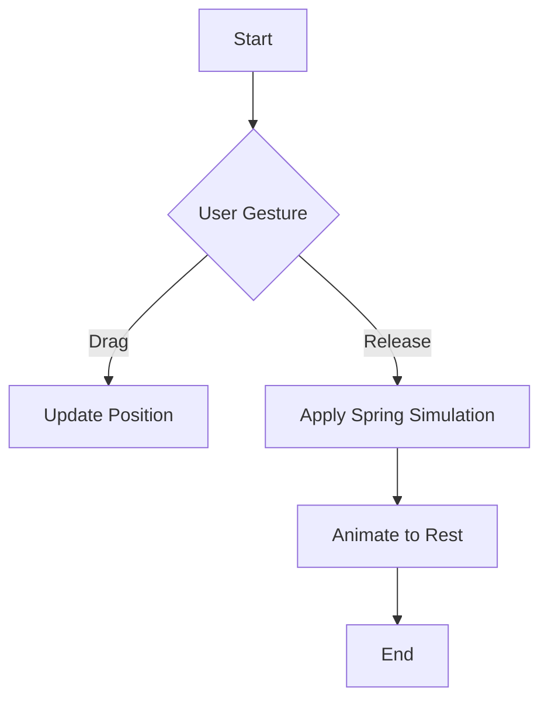

## 8.3.3 Physics-Based Animations

In the realm of mobile app development, creating engaging and intuitive user interfaces is paramount. Physics-based animations offer a way to simulate real-world interactions, bringing a sense of realism and dynamism to your applications. This section delves into the concept of physics-based animations in Flutter, exploring their types, implementation, and best practices.

### Definition and Purpose

Physics-based animations are animations that mimic the laws of physics, such as gravity, friction, and acceleration. These animations are designed to create more natural and dynamic interactions within apps, making them feel more intuitive and responsive to user input. By simulating real-world forces, physics-based animations can enhance the user experience, providing feedback that feels both engaging and satisfying.

**Purpose of Physics-Based Animations:**

- **Realism:** By simulating physical forces, animations can mimic real-world behaviors, making interactions feel more lifelike.
- **Engagement:** Dynamic animations capture user attention and make interactions more enjoyable.
- **Feedback:** Providing visual feedback through animations helps users understand the results of their actions, improving usability.

### Types of Physics-Based Animations

Flutter provides several types of physics-based animations, each simulating different physical properties:

#### Spring Animations

Spring animations simulate spring-like motions, which are useful for creating bouncing effects or overshooting targets. They provide a natural way to animate objects that need to return to a resting position after being moved.

- **Use Cases:** Bouncing buttons, overshooting transitions, and elastic effects.
- **Characteristics:** Oscillation, damping, and equilibrium.

#### Friction Animations

Friction animations simulate resistance, such as slowing down a scrolling list or deceleration after a swipe. They are ideal for creating smooth transitions that gradually come to a stop.

- **Use Cases:** Decelerating scrolling lists, swipe-to-dismiss actions.
- **Characteristics:** Gradual slowing, resistance, and smooth stopping.

#### Gravity Animations

Gravity animations simulate falling or dropping effects, useful for drag-and-drop interactions. They mimic the force of gravity, allowing objects to fall naturally.

- **Use Cases:** Drag-and-drop interfaces, falling objects.
- **Characteristics:** Acceleration, free-fall, and terminal velocity.

### Flutter's Physics Libraries

Flutter offers built-in classes and libraries to facilitate physics-based animations:

#### Curves and Physics Classes

Flutter provides several classes to define physics simulations:

- **`SpringDescription`:** Describes the properties of a spring, including mass, stiffness, and damping.
- **`FrictionSimulation`:** Simulates the effect of friction on a moving object.
- **`GravitySimulation`:** Simulates the effect of gravity on an object.

These classes can be used with `AnimationController` to create realistic animations.

#### Package Integration

For more advanced physics simulations, consider using additional packages such as `flutter_physics`. These packages offer extended capabilities for complex simulations and interactions.

### Implementing Physics-Based Animations

Implementing physics-based animations in Flutter involves integrating physics simulations with `AnimationController` and gesture detection.

#### Using AnimationControllers with Physics Simulations

To create realistic animations, you can combine `AnimationController` with physics simulations. This allows you to control the animation's progress based on physical forces.

```dart
import 'package:flutter/material.dart';
import 'package:flutter/physics.dart';

class SpringAnimationExample extends StatefulWidget {
  @override
  _SpringAnimationExampleState createState() => _SpringAnimationExampleState();
}

class _SpringAnimationExampleState extends State<SpringAnimationExample> with SingleTickerProviderStateMixin {
  AnimationController _controller;
  Animation<Offset> _animation;

  @override
  void initState() {
    super.initState();
    _controller = AnimationController(vsync: this);
    final spring = SpringDescription(mass: 1, stiffness: 100, damping: 5);
    final simulation = SpringSimulation(spring, 0, 1, 0);

    _animation = _controller.drive(Tween(begin: Offset.zero, end: Offset(0, 1)).chain(CurveTween(curve: Curves.bounceOut)));

    _controller.animateWith(simulation);
  }

  @override
  void dispose() {
    _controller.dispose();
    super.dispose();
  }

  @override
  Widget build(BuildContext context) {
    return Scaffold(
      appBar: AppBar(title: Text('Spring Animation')),
      body: Center(
        child: SlideTransition(
          position: _animation,
          child: Container(
            width: 100,
            height: 100,
            color: Colors.blue,
          ),
        ),
      ),
    );
  }
}
```

**Explanation:**

- **SpringDescription:** Defines the spring's physical properties.
- **SpringSimulation:** Simulates the spring's behavior.
- **AnimationController:** Controls the animation's progress.
- **SlideTransition:** Animates the widget's position based on the spring simulation.

#### Combining with Gesture Detection

Physics-based animations can enhance gesture-driven interactions, such as snapping a draggable widget into place. By detecting user gestures, you can apply physics simulations to create smooth and natural transitions.

```dart
import 'package:flutter/material.dart';
import 'package:flutter/physics.dart';

class DraggableSpringExample extends StatefulWidget {
  @override
  _DraggableSpringExampleState createState() => _DraggableSpringExampleState();
}

class _DraggableSpringExampleState extends State<DraggableSpringExample> with SingleTickerProviderStateMixin {
  AnimationController _controller;
  Animation<Offset> _animation;
  Offset _dragOffset = Offset.zero;

  @override
  void initState() {
    super.initState();
    _controller = AnimationController(vsync: this);
    final spring = SpringDescription(mass: 1, stiffness: 100, damping: 5);
    final simulation = SpringSimulation(spring, 0, 1, 0);

    _animation = _controller.drive(Tween(begin: Offset.zero, end: Offset(0, 1)).chain(CurveTween(curve: Curves.bounceOut)));

    _controller.animateWith(simulation);
  }

  @override
  void dispose() {
    _controller.dispose();
    super.dispose();
  }

  void _onPanUpdate(DragUpdateDetails details) {
    setState(() {
      _dragOffset += details.delta;
    });
  }

  void _onPanEnd(DragEndDetails details) {
    _controller.animateWith(SpringSimulation(
      SpringDescription(mass: 1, stiffness: 100, damping: 5),
      _dragOffset.dy,
      0,
      -details.velocity.pixelsPerSecond.dy,
    ));
  }

  @override
  Widget build(BuildContext context) {
    return Scaffold(
      appBar: AppBar(title: Text('Draggable Spring')),
      body: GestureDetector(
        onPanUpdate: _onPanUpdate,
        onPanEnd: _onPanEnd,
        child: Center(
          child: Transform.translate(
            offset: _dragOffset,
            child: Container(
              width: 100,
              height: 100,
              color: Colors.red,
            ),
          ),
        ),
      ),
    );
  }
}
```

**Explanation:**

- **GestureDetector:** Detects drag gestures and updates the widget's position.
- **SpringSimulation:** Applies a spring simulation when the drag ends, creating a bouncing effect.

### Best Practices

#### Realism Balance

Strive for a balance between realistic physics and a pleasant user experience. Overly realistic animations can feel slow or distracting, so adjust parameters to ensure animations are both natural and engaging.

#### Performance Optimization

Ensure that physics simulations run smoothly, especially on lower-end devices. Optimize animations by reducing complexity and using efficient rendering techniques.

### Common Pitfalls

#### Overcomplicating Animations

Avoid creating physics simulations that are too complex, as they can lead to confusing user experiences. Keep animations simple and intuitive.

#### Ignoring User Intent

Ensure that physics-based animations respond appropriately to user gestures and do not override user intent. Allow users to interrupt animations if necessary.

### Implementation Guidance

- **Predefined Simulations:** Use predefined physics simulations before creating custom ones. Flutter's built-in classes provide a solid foundation for most use cases.
- **Thorough Testing:** Test physics-based animations thoroughly to ensure they feel intuitive and natural within the app context.

### Mermaid.js Diagrams

To enhance understanding, consider creating diagrams that illustrate the forces and behaviors simulated by physics-based animations. For example, a diagram showing the oscillation of a spring or the deceleration of a friction animation can provide valuable insights.



**Diagram Explanation:**

- **Start:** The process begins with a user gesture.
- **User Gesture:** The user drags or releases a widget.
- **Update Position:** The widget's position is updated based on the drag.
- **Apply Spring Simulation:** A spring simulation is applied when the gesture ends.
- **Animate to Rest:** The widget animates back to its resting position.
- **End:** The animation completes.

### Conclusion

Physics-based animations in Flutter provide a powerful tool for creating natural and dynamic user interactions. By simulating real-world forces, these animations can enhance the user experience, making apps more engaging and intuitive. By following best practices and avoiding common pitfalls, you can implement physics-based animations that feel both realistic and responsive.

## Quiz Time!



### What are physics-based animations?

- [x] Animations that simulate real-world physics such as gravity, friction, and acceleration.
- [ ] Animations that use only linear interpolation.
- [ ] Animations that are purely decorative.
- [ ] Animations that do not involve user interaction.

> **Explanation:** Physics-based animations simulate real-world forces like gravity and friction to create natural interactions.

### Which of the following is a type of physics-based animation?

- [x] Spring Animation
- [ ] Linear Animation
- [x] Friction Animation
- [ ] Color Animation

> **Explanation:** Spring and friction animations are types of physics-based animations that simulate real-world forces.

### What class in Flutter is used to describe the properties of a spring?

- [x] SpringDescription
- [ ] AnimationController
- [ ] Tween
- [ ] Curve

> **Explanation:** `SpringDescription` is used to define the properties of a spring in Flutter.

### What is the purpose of a `FrictionSimulation` in Flutter?

- [x] To simulate the effect of friction on a moving object.
- [ ] To create color transitions.
- [ ] To handle user input.
- [ ] To manage network requests.

> **Explanation:** `FrictionSimulation` simulates resistance, such as slowing down a moving object.

### How can physics-based animations enhance gesture-driven interactions?

- [x] By snapping a draggable widget into place.
- [ ] By changing the widget's color.
- [x] By creating smooth transitions after a swipe.
- [ ] By modifying text content.

> **Explanation:** Physics-based animations can create natural transitions and snapping effects in response to gestures.

### What should be considered to ensure physics-based animations are not overly realistic?

- [x] Balance between realism and user experience.
- [ ] Use only linear animations.
- [ ] Avoid any user interaction.
- [ ] Always use default animation settings.

> **Explanation:** It's important to balance realism with a pleasant user experience to avoid slow or distracting animations.

### What is a common pitfall when implementing physics-based animations?

- [x] Overcomplicating animations.
- [ ] Using too many colors.
- [x] Ignoring user intent.
- [ ] Not using enough animations.

> **Explanation:** Overcomplicating animations and ignoring user intent can lead to confusing experiences.

### What is the role of `AnimationController` in physics-based animations?

- [x] To control the animation's progress based on physical forces.
- [ ] To handle network requests.
- [ ] To manage user authentication.
- [ ] To create static layouts.

> **Explanation:** `AnimationController` is used to manage the progress of animations, including those based on physics.

### Which package can be used for more advanced physics simulations in Flutter?

- [x] flutter_physics
- [ ] flutter_network
- [ ] flutter_ui
- [ ] flutter_audio

> **Explanation:** `flutter_physics` provides advanced capabilities for physics simulations in Flutter.

### True or False: Physics-based animations should always override user gestures.

- [ ] True
- [x] False

> **Explanation:** Physics-based animations should complement user gestures, not override them, ensuring intuitive interactions.


