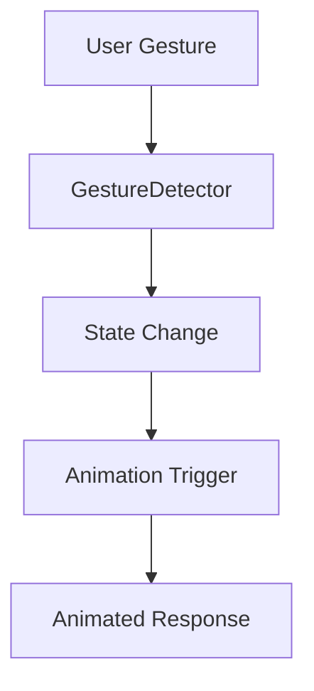

## 8.3.4 Interactive Widgets

In the world of mobile app development, user interaction is a cornerstone of engaging and intuitive user experiences. Interactive widgets in Flutter are UI components designed to respond to user gestures with animations and transitions, providing immediate and intuitive feedback. This section delves into the creation and implementation of interactive widgets, focusing on how they enhance user engagement and improve the overall usability of your app.

### Definition and Purpose

Interactive widgets are dynamic UI elements that respond to user interactions such as taps, swipes, and drags. These interactions are often accompanied by animations, which serve to:

- **Enhance User Engagement:** By providing visual feedback, interactive widgets make the user experience more engaging and enjoyable.
- **Provide Intuitive Feedback:** Animations help users understand the results of their actions, making the interface more intuitive.
- **Improve Usability:** Well-designed interactions can guide users through the app, highlighting important actions and making navigation more fluid.

### Creating Interactive Widgets

Interactive widgets can take many forms, from simple buttons to complex cards and panels. Here, we explore some common types of interactive widgets and how to implement them in Flutter.

#### Animated Buttons

Animated buttons provide visual feedback when users interact with them. This can include changing colors, sizes, or shapes. Here's how you can create an animated button in Flutter:

```dart
import 'package:flutter/material.dart';

class AnimatedButton extends StatefulWidget {
  @override
  _AnimatedButtonState createState() => _AnimatedButtonState();
}

class _AnimatedButtonState extends State<AnimatedButton> with SingleTickerProviderStateMixin {
  AnimationController _controller;
  Animation<double> _sizeAnimation;
  Animation<Color> _colorAnimation;

  @override
  void initState() {
    super.initState();
    _controller = AnimationController(
      duration: const Duration(milliseconds: 200),
      vsync: this,
    );

    _sizeAnimation = Tween<double>(begin: 1.0, end: 1.2).animate(_controller);
    _colorAnimation = ColorTween(begin: Colors.blue, end: Colors.red).animate(_controller);
  }

  @override
  void dispose() {
    _controller.dispose();
    super.dispose();
  }

  void _onTap() {
    if (_controller.status == AnimationStatus.completed) {
      _controller.reverse();
    } else {
      _controller.forward();
    }
  }

  @override
  Widget build(BuildContext context) {
    return GestureDetector(
      onTap: _onTap,
      child: AnimatedBuilder(
        animation: _controller,
        builder: (context, child) {
          return Transform.scale(
            scale: _sizeAnimation.value,
            child: Container(
              width: 100,
              height: 50,
              decoration: BoxDecoration(
                color: _colorAnimation.value,
                borderRadius: BorderRadius.circular(8.0),
              ),
              child: Center(
                child: Text(
                  'Tap Me',
                  style: TextStyle(color: Colors.white),
                ),
              ),
            ),
          );
        },
      ),
    );
  }
}
```

**Explanation:**
- **AnimationController:** Manages the animation's lifecycle.
- **Tween Animations:** Define the range of values for size and color changes.
- **GestureDetector:** Detects tap gestures to trigger animations.

#### Expandable Panels

Expandable panels are useful for displaying additional information without overwhelming the user. They expand or collapse with smooth animations in response to user interactions.

```dart
import 'package:flutter/material.dart';

class ExpandablePanel extends StatefulWidget {
  @override
  _ExpandablePanelState createState() => _ExpandablePanelState();
}

class _ExpandablePanelState extends State<ExpandablePanel> with SingleTickerProviderStateMixin {
  AnimationController _controller;
  Animation<double> _heightAnimation;
  Animation<double> _opacityAnimation;
  bool _isExpanded = false;

  @override
  void initState() {
    super.initState();
    _controller = AnimationController(
      duration: const Duration(milliseconds: 300),
      vsync: this,
    );

    _heightAnimation = Tween<double>(begin: 0.0, end: 200.0).animate(_controller);
    _opacityAnimation = Tween<double>(begin: 0.0, end: 1.0).animate(_controller);
  }

  @override
  void dispose() {
    _controller.dispose();
    super.dispose();
  }

  void _togglePanel() {
    setState(() {
      _isExpanded = !_isExpanded;
      _isExpanded ? _controller.forward() : _controller.reverse();
    });
  }

  @override
  Widget build(BuildContext context) {
    return Column(
      children: [
        GestureDetector(
          onTap: _togglePanel,
          child: Container(
            color: Colors.blue,
            padding: EdgeInsets.all(16.0),
            child: Text(
              'Tap to ${_isExpanded ? 'Collapse' : 'Expand'}',
              style: TextStyle(color: Colors.white),
            ),
          ),
        ),
        SizeTransition(
          sizeFactor: _heightAnimation,
          child: FadeTransition(
            opacity: _opacityAnimation,
            child: Container(
              height: 200,
              color: Colors.grey[200],
              child: Center(child: Text('Expanded Content')),
            ),
          ),
        ),
      ],
    );
  }
}
```

**Explanation:**
- **SizeTransition and FadeTransition:** Animate the panel's height and opacity.
- **GestureDetector:** Toggles the panel's state on tap.

#### Interactive Cards

Interactive cards can respond to various gestures, such as swipes or drags, to reveal additional actions or information.

```dart
import 'package:flutter/material.dart';

class InteractiveCard extends StatelessWidget {
  @override
  Widget build(BuildContext context) {
    return Dismissible(
      key: UniqueKey(),
      onDismissed: (direction) {
        // Handle the swipe action
      },
      background: Container(color: Colors.red),
      child: Card(
        child: ListTile(
          title: Text('Swipe Me'),
          subtitle: Text('Swipe left or right to dismiss'),
        ),
      ),
    );
  }
}
```

**Explanation:**
- **Dismissible Widget:** Provides swipe-to-dismiss functionality.
- **Gesture Handling:** Responds to swipe gestures with animations.

### Combining Gestures with Animations

Combining gestures with animations involves detecting user interactions and triggering corresponding animations. This requires:

- **Gesture Detectors:** Widgets like `GestureDetector` or `Dismissible` to capture user inputs.
- **Animation Controllers:** To manage the timing and progression of animations.
- **State Management:** To handle complex interactions and ensure consistent behavior.

### Mermaid.js Diagrams

To visualize the interaction flow between user gestures, state changes, and animated responses, consider using Mermaid.js diagrams. Here's an example of how you might represent this flow:



**Explanation:**
- **User Gesture:** Initiates the interaction.
- **GestureDetector:** Captures the gesture and updates the state.
- **State Change:** Triggers the animation.
- **Animated Response:** Provides visual feedback.

### Best Practices

- **Intuitive Interactions:** Ensure that interactions are intuitive and align with user expectations. For example, tapping a button should provide immediate feedback.
- **Feedback Mechanisms:** Use animations to provide clear feedback, such as highlighting a button when pressed.

### Common Pitfalls

- **Overwhelming Animations:** Avoid excessive animations that can distract users from the primary content.
- **Inconsistent Behavior:** Maintain consistency across similar widgets to provide a cohesive experience.

### Implementation Guidance

- **Reusability:** Create reusable components to simplify the implementation of interactive widgets across your app.
- **State Management:** Use state management solutions like Provider or Bloc to handle complex interaction states.

### Conclusion

Interactive widgets play a crucial role in enhancing user engagement and providing intuitive feedback in Flutter applications. By combining gestures with animations, you can create dynamic and responsive interfaces that improve usability and delight users. Remember to follow best practices and avoid common pitfalls to ensure a seamless user experience.

## Quiz Time!



### What is the primary purpose of interactive widgets in Flutter?

- [x] To enhance user engagement and provide intuitive feedback
- [ ] To increase the app's loading speed
- [ ] To reduce the app's memory usage
- [ ] To simplify the codebase

> **Explanation:** Interactive widgets enhance user engagement by providing visual feedback and intuitive responses to user actions.

### Which widget is used to detect gestures in Flutter?

- [ ] AnimatedBuilder
- [x] GestureDetector
- [ ] StreamBuilder
- [ ] FutureBuilder

> **Explanation:** GestureDetector is used to detect user gestures such as taps, swipes, and drags.

### What is the role of an AnimationController in Flutter?

- [x] To manage the timing and progression of animations
- [ ] To handle network requests
- [ ] To manage the app's state
- [ ] To render widgets on the screen

> **Explanation:** AnimationController manages the timing and progression of animations, allowing for precise control over animations.

### Which widget provides swipe-to-dismiss functionality in Flutter?

- [ ] GestureDetector
- [ ] AnimatedContainer
- [x] Dismissible
- [ ] ListView

> **Explanation:** Dismissible widget provides swipe-to-dismiss functionality, allowing users to swipe away items.

### What is a common pitfall when designing interactive widgets?

- [x] Overwhelming animations
- [ ] Using too few colors
- [ ] Not using enough text
- [ ] Ignoring network requests

> **Explanation:** Overwhelming animations can distract users from the primary content and reduce usability.

### How can you ensure consistent behavior across similar widgets?

- [x] By maintaining consistent interactive behaviors
- [ ] By using different animations for each widget
- [ ] By avoiding animations altogether
- [ ] By using random colors

> **Explanation:** Consistent interactive behaviors across similar widgets provide a cohesive user experience.

### What should you use to manage complex interaction states in interactive widgets?

- [ ] StatelessWidget
- [ ] FutureBuilder
- [x] State management solutions like Provider or Bloc
- [ ] HTTP requests

> **Explanation:** State management solutions like Provider or Bloc help manage complex interaction states effectively.

### What is the benefit of creating reusable components for interactive widgets?

- [x] Simplifies implementation across the app
- [ ] Increases the app's loading time
- [ ] Reduces the app's functionality
- [ ] Complicates the codebase

> **Explanation:** Reusable components simplify the implementation of interactive widgets across the app, promoting code reuse.

### Which of the following is NOT a benefit of interactive widgets?

- [ ] Enhancing user engagement
- [x] Reducing app size
- [ ] Providing intuitive feedback
- [ ] Improving usability

> **Explanation:** While interactive widgets enhance engagement and usability, they do not directly reduce app size.

### True or False: Interactive widgets should always have complex animations to engage users.

- [ ] True
- [x] False

> **Explanation:** Interactive widgets should have intuitive and simple animations to engage users without overwhelming them.


