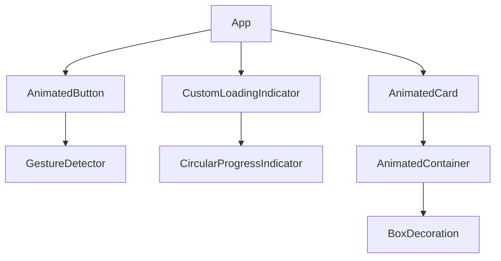

## 8.4.1 Building Reusable Animated Components

In the world of mobile app development, animations play a crucial role in enhancing user experience by making interactions more intuitive and engaging. However, implementing animations can sometimes lead to redundant code and increased complexity if not managed properly. This is where reusable animated components come into play. By creating components that encapsulate animation logic, developers can achieve greater efficiency, consistency, and maintainability in their codebase.

### Definition and Purpose

Reusable animated components are custom widgets that encapsulate animation logic, allowing them to be easily integrated across different parts of an application. This approach promotes:

- **Code Efficiency:** By reusing components, you reduce the need to write repetitive code, leading to a cleaner and more efficient codebase.
- **Consistency:** Reusable components ensure a consistent look and feel throughout the app, as the same animation logic is applied uniformly.
- **Maintainability:** Encapsulating animation logic within components makes it easier to manage and update animations without affecting other parts of the app.

### Designing Reusable Animations

When designing reusable animated components, consider the following principles:

#### Encapsulation

Encapsulating animation logic within custom widgets isolates complexity and makes the code more manageable. By doing so, you can focus on the animation's behavior without worrying about its integration with other parts of the UI.

#### Customization through Parameters

To make components adaptable, allow customization of animation properties such as duration, curve, and size through constructor parameters. This flexibility enables developers to tailor animations to specific use cases without modifying the component's internal logic.

#### Composition Over Inheritance

Favor composing simple animations into more complex ones rather than relying on widget inheritance. Composition allows for greater flexibility and reusability, as you can combine different components to create new animations without altering their core functionality.

### Examples of Reusable Animated Components

Let's explore some practical examples of reusable animated components that can be integrated into various parts of an app.

#### Animated Buttons

An animated button can provide visual feedback to users, enhancing the interactivity of your app. Here's how you can create a customizable animated button widget:

```dart
import 'package:flutter/material.dart';

class AnimatedButton extends StatefulWidget {
  final String label;
  final VoidCallback onPressed;
  final Duration duration;
  final Curve curve;

  const AnimatedButton({
    Key? key,
    required this.label,
    required this.onPressed,
    this.duration = const Duration(milliseconds: 300),
    this.curve = Curves.easeInOut,
  }) : super(key: key);

  @override
  _AnimatedButtonState createState() => _AnimatedButtonState();
}

class _AnimatedButtonState extends State<AnimatedButton> {
  bool _isPressed = false;

  void _toggleButton() {
    setState(() {
      _isPressed = !_isPressed;
    });
    widget.onPressed();
  }

  @override
  Widget build(BuildContext context) {
    return GestureDetector(
      onTap: _toggleButton,
      child: AnimatedContainer(
        duration: widget.duration,
        curve: widget.curve,
        padding: EdgeInsets.all(_isPressed ? 12.0 : 16.0),
        decoration: BoxDecoration(
          color: _isPressed ? Colors.blueAccent : Colors.blue,
          borderRadius: BorderRadius.circular(8.0),
        ),
        child: Text(
          widget.label,
          style: TextStyle(color: Colors.white),
        ),
      ),
    );
  }
}
```

**Customization:** You can customize the button's animation duration and curve through its constructor parameters. This allows for different styles and behaviors depending on the context in which the button is used.

#### Loading Indicators

Loading indicators are essential for providing feedback during asynchronous operations. Here's a reusable loading spinner with adjustable properties:

```dart
import 'package:flutter/material.dart';

class CustomLoadingIndicator extends StatelessWidget {
  final Color color;
  final double size;
  final Duration duration;

  const CustomLoadingIndicator({
    Key? key,
    this.color = Colors.blue,
    this.size = 50.0,
    this.duration = const Duration(seconds: 1),
  }) : super(key: key);

  @override
  Widget build(BuildContext context) {
    return Center(
      child: SizedBox(
        width: size,
        height: size,
        child: CircularProgressIndicator(
          valueColor: AlwaysStoppedAnimation<Color>(color),
          strokeWidth: 4.0,
        ),
      ),
    );
  }
}
```

**Customization:** The loading indicator can be customized in terms of color, size, and animation duration, making it versatile for different UI themes and requirements.

#### Animated Cards

Animated cards can be used to display content with interactive animations, enhancing user engagement. Here's an example of an animated card widget:

```dart
import 'package:flutter/material.dart';

class AnimatedCard extends StatelessWidget {
  final Widget child;
  final Duration duration;
  final Curve curve;

  const AnimatedCard({
    Key? key,
    required this.child,
    this.duration = const Duration(milliseconds: 500),
    this.curve = Curves.easeInOut,
  }) : super(key: key);

  @override
  Widget build(BuildContext context) {
    return AnimatedContainer(
      duration: duration,
      curve: curve,
      margin: const EdgeInsets.all(8.0),
      padding: const EdgeInsets.all(16.0),
      decoration: BoxDecoration(
        color: Colors.white,
        borderRadius: BorderRadius.circular(12.0),
        boxShadow: [
          BoxShadow(
            color: Colors.black12,
            blurRadius: 8.0,
            offset: Offset(0, 4),
          ),
        ],
      ),
      child: child,
    );
  }
}
```

**Customization:** This card widget allows for customization of the animation duration and curve, enabling developers to create dynamic and engaging card animations.

### Mermaid.js Diagrams

To better understand the composition and integration of these components within the widget tree, consider the following Mermaid.js diagram:



This diagram illustrates how each reusable component is integrated into the app's widget tree, highlighting their composition and relationships.

### Best Practices

- **Flexibility:** Design components to be flexible and adaptable to various use cases without requiring significant modifications.
- **Isolation of Concerns:** Keep animations focused on a single responsibility to enhance reusability and maintainability.

### Common Pitfalls

- **Overgeneralization:** Avoid making components too generic, which can lead to unwieldy and difficult-to-use widgets.
- **Lack of Documentation:** Ensure that components are well-documented to facilitate easy integration and usage by other developers.

### Implementation Guidance

- **Widget Composition:** Encourage the use of widget composition to build complex animations from simpler, reusable parts.
- **Testing:** Test components across different scenarios to ensure versatility and reliability.

By following these guidelines, you can create reusable animated components that enhance your app's user experience while maintaining a clean and efficient codebase.

## Quiz Time!



### What is the primary benefit of creating reusable animated components in Flutter?

- [x] Code efficiency and consistency
- [ ] Faster app performance
- [ ] Easier debugging
- [ ] Reduced app size

> **Explanation:** Reusable animated components promote code efficiency and consistency by reducing redundancy and ensuring a uniform look and feel across the app.

### Which principle is recommended when designing reusable animated components?

- [x] Composition over inheritance
- [ ] Inheritance over composition
- [ ] Hardcoding animation values
- [ ] Using global variables

> **Explanation:** Composition over inheritance is recommended as it allows for greater flexibility and reusability by combining simple components into more complex ones.

### How can you customize a reusable animated component in Flutter?

- [x] Through constructor parameters
- [ ] By modifying the component's internal logic
- [ ] By using global variables
- [ ] By hardcoding values

> **Explanation:** Customization through constructor parameters allows developers to tailor components to specific use cases without altering the internal logic.

### What is a common pitfall when creating reusable components?

- [x] Overgeneralization
- [ ] Under-documentation
- [ ] Over-documentation
- [ ] Lack of testing

> **Explanation:** Overgeneralization can lead to unwieldy and difficult-to-use widgets, making them less effective as reusable components.

### Which widget is used in the example to create an animated button?

- [x] AnimatedContainer
- [ ] AnimatedOpacity
- [ ] AnimatedBuilder
- [ ] AnimatedSwitcher

> **Explanation:** The `AnimatedContainer` widget is used to create the animated button, allowing for smooth transitions in padding and color.

### What should be avoided to ensure reusable components are easy to use?

- [x] Making them too generic
- [ ] Providing customization options
- [ ] Using encapsulation
- [ ] Documenting the code

> **Explanation:** Making components too generic can make them unwieldy and difficult to use, so it's important to strike a balance between flexibility and specificity.

### Which of the following is a best practice for reusable components?

- [x] Isolation of concerns
- [ ] Hardcoding values
- [ ] Using global state
- [ ] Avoiding encapsulation

> **Explanation:** Isolation of concerns ensures that components focus on a single responsibility, enhancing their reusability and maintainability.

### What is the purpose of using Mermaid.js diagrams in the context of reusable components?

- [x] To visualize component composition and integration
- [ ] To replace code comments
- [ ] To generate random animations
- [ ] To debug animations

> **Explanation:** Mermaid.js diagrams are used to visualize the composition and integration of components within the widget tree, aiding in understanding their relationships.

### How can you ensure the reliability of reusable components?

- [x] By testing them across different scenarios
- [ ] By avoiding customization options
- [ ] By using global variables
- [ ] By hardcoding animation values

> **Explanation:** Testing components across different scenarios ensures their versatility and reliability in various use cases.

### True or False: Reusable animated components should be designed to handle every possible use case.

- [ ] True
- [x] False

> **Explanation:** Reusable components should be flexible and adaptable but not overly generic, as this can lead to complexity and difficulty in use.


