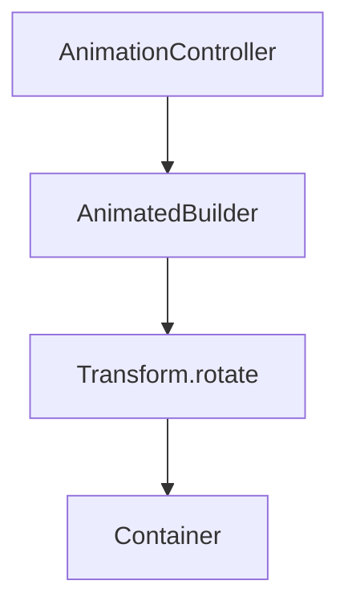

## 8.4.2 Using the AnimatedBuilder

In the world of Flutter, animations play a crucial role in enhancing user experience by providing visual feedback and guiding user interactions. Among the various tools Flutter offers for animations, `AnimatedBuilder` stands out as a powerful widget for creating custom animations. This section will delve into the intricacies of `AnimatedBuilder`, illustrating its benefits, implementation, and best practices for optimizing performance and maintaining clean code.

### Introduction to AnimatedBuilder

`AnimatedBuilder` is a versatile widget in Flutter that allows developers to rebuild a portion of the widget tree whenever an animation changes. This capability is particularly useful for separating animation logic from the UI, thereby promoting cleaner and more maintainable code.

#### What is AnimatedBuilder?

At its core, `AnimatedBuilder` is a widget that listens to an animation and triggers a rebuild of its child widget whenever the animation's value changes. This makes it an ideal choice for scenarios where you want to apply complex transformations or effects to a widget based on an animation.

- **Role in Custom Animations:** By using `AnimatedBuilder`, you can encapsulate the animation logic separately from the UI components, allowing for a clear separation of concerns. This separation not only enhances code readability but also facilitates the reuse of animation logic across different parts of your application.

### Benefits of AnimatedBuilder

Understanding the advantages of using `AnimatedBuilder` can help you make informed decisions about when and how to use it in your Flutter projects.

#### Performance Optimization

One of the primary benefits of `AnimatedBuilder` is its ability to optimize performance by minimizing the number of widgets that need to rebuild during an animation. By confining the rebuild to only the necessary parts of the widget tree, `AnimatedBuilder` ensures that your animations run smoothly without unnecessary overhead.

#### Code Reusability

`AnimatedBuilder` promotes code reusability by allowing you to define animation logic separately from the UI. This modular approach means that you can apply the same animation logic to different widgets without duplicating code, making your application more maintainable and scalable.

### Implementing AnimatedBuilder

To harness the power of `AnimatedBuilder`, it's essential to understand its basic structure and how it interacts with other animation components like `AnimationController`.

#### Basic Structure

The `AnimatedBuilder` widget requires two key parameters:

- **`animation`:** This parameter specifies the animation that the `AnimatedBuilder` should listen to. Typically, this is an instance of `AnimationController` or any other `Animation` object.
- **`builder`:** This is a callback function that returns the widget tree to be rebuilt whenever the animation changes. The builder function receives two parameters: the `BuildContext` and the `Widget` child, which can be used to construct the UI.

#### Connecting to AnimationController

An `AnimationController` is essential for controlling the flow of an animation. By linking an `AnimationController` to an `AnimatedBuilder`, you can manage the animation's lifecycle, including starting, stopping, and reversing the animation.

```dart
import 'package:flutter/material.dart';

class RotatingWidget extends StatefulWidget {
  @override
  _RotatingWidgetState createState() => _RotatingWidgetState();
}

class _RotatingWidgetState extends State<RotatingWidget> with SingleTickerProviderStateMixin {
  late AnimationController _controller;

  @override
  void initState() {
    super.initState();
    _controller = AnimationController(
      duration: const Duration(seconds: 2),
      vsync: this,
    )..repeat(); // Repeat the animation indefinitely
  }

  @override
  void dispose() {
    _controller.dispose();
    super.dispose();
  }

  @override
  Widget build(BuildContext context) {
    return AnimatedBuilder(
      animation: _controller,
      builder: (context, child) {
        return Transform.rotate(
          angle: _controller.value * 2.0 * 3.141592653589793, // Rotate the widget
          child: child,
        );
      },
      child: Container(
        width: 100.0,
        height: 100.0,
        color: Colors.blue,
      ),
    );
  }
}
```

**Explanation:**

- **AnimationController:** The `_controller` is an `AnimationController` that controls the animation's duration and repetition.
- **AnimatedBuilder:** The `AnimatedBuilder` listens to the `_controller` and rebuilds the `Transform.rotate` widget whenever the animation value changes.
- **Transform.rotate:** This widget applies a rotation transformation to its child based on the current animation value.

### Mermaid.js Diagrams

To better understand how `AnimatedBuilder` interacts with the `AnimationController` and the widget tree, consider the following flowchart:



This diagram illustrates the flow of data from the `AnimationController` to the `AnimatedBuilder`, which in turn rebuilds the `Transform.rotate` widget, ultimately affecting the `Container`.

### Advanced Usage

`AnimatedBuilder` can also be used for more complex scenarios, such as managing multiple animations or applying custom building logic.

#### Multiple Animations

You can manage multiple animations simultaneously by using multiple `AnimatedBuilder` widgets or by combining animations into a single `AnimatedBuilder`.

```dart
import 'package:flutter/material.dart';

class MultiAnimationWidget extends StatefulWidget {
  @override
  _MultiAnimationWidgetState createState() => _MultiAnimationWidgetState();
}

class _MultiAnimationWidgetState extends State<MultiAnimationWidget> with SingleTickerProviderStateMixin {
  late AnimationController _controller;
  late Animation<double> _scaleAnimation;
  late Animation<double> _opacityAnimation;

  @override
  void initState() {
    super.initState();
    _controller = AnimationController(
      duration: const Duration(seconds: 2),
      vsync: this,
    )..repeat(reverse: true);

    _scaleAnimation = Tween<double>(begin: 0.5, end: 1.5).animate(_controller);
    _opacityAnimation = Tween<double>(begin: 0.1, end: 1.0).animate(_controller);
  }

  @override
  void dispose() {
    _controller.dispose();
    super.dispose();
  }

  @override
  Widget build(BuildContext context) {
    return AnimatedBuilder(
      animation: _controller,
      builder: (context, child) {
        return Transform.scale(
          scale: _scaleAnimation.value,
          child: Opacity(
            opacity: _opacityAnimation.value,
            child: child,
          ),
        );
      },
      child: Container(
        width: 100.0,
        height: 100.0,
        color: Colors.red,
      ),
    );
  }
}
```

**Explanation:**

- **Multiple Animations:** The `_scaleAnimation` and `_opacityAnimation` are two separate animations managed by the same `AnimationController`.
- **Transform.scale and Opacity:** These widgets apply scaling and opacity transformations to the `Container` based on the current animation values.

#### Custom Building Logic

The `builder` method in `AnimatedBuilder` can be customized to apply various transformations or modifications during the animation.

### Best Practices

To make the most of `AnimatedBuilder`, consider the following best practices:

#### Minimize Rebuild Scope

Limit the scope of the `builder` method to only the widgets that need to rebuild. This optimization reduces the computational overhead and ensures smoother animations.

#### Decouple Animation Logic

Keep animation logic separate from business logic to maintain clarity and separation of concerns. This approach makes your code easier to read and maintain.

### Common Pitfalls

While `AnimatedBuilder` is a powerful tool, it's essential to be aware of common pitfalls:

#### Overusing AnimatedBuilder

Avoid nesting multiple `AnimatedBuilder` widgets, as this can lead to complex and hard-to-maintain code. Instead, try to consolidate animations where possible.

#### Inefficient Rebuilding

Ensure that only necessary parts of the widget tree are rebuilt during animations to prevent performance issues. Use the `child` parameter in `AnimatedBuilder` to pass static widgets that do not need to rebuild.

### Implementation Guidance

`AnimatedBuilder` is ideal for creating complex and custom animations that cannot be achieved with implicit animations. Organize animation controllers and builders neatly within the widget tree for better readability and maintainability.

By following these guidelines and leveraging the power of `AnimatedBuilder`, you can create sophisticated animations that enhance the user experience while maintaining optimal performance and code quality.

## Quiz Time!



### What is the primary role of AnimatedBuilder in Flutter?

- [x] To rebuild a portion of the widget tree when an animation changes
- [ ] To manage the lifecycle of animations
- [ ] To provide implicit animations
- [ ] To handle user interactions

> **Explanation:** AnimatedBuilder is used to rebuild a portion of the widget tree whenever an animation's value changes, allowing for custom animations.

### Which parameter in AnimatedBuilder specifies the animation to listen to?

- [ ] builder
- [x] animation
- [ ] child
- [ ] vsync

> **Explanation:** The `animation` parameter specifies the animation that the AnimatedBuilder should listen to.

### What is a key benefit of using AnimatedBuilder?

- [x] Performance optimization by reducing rebuilds
- [ ] Simplifying user interactions
- [ ] Providing default animations
- [ ] Handling network requests

> **Explanation:** AnimatedBuilder optimizes performance by minimizing the number of widgets that need to rebuild during an animation.

### How can you manage multiple animations with AnimatedBuilder?

- [x] By using multiple AnimatedBuilder widgets or combining animations
- [ ] By using a single AnimationController
- [ ] By nesting AnimatedBuilder widgets
- [ ] By using implicit animations

> **Explanation:** Multiple animations can be managed by using multiple AnimatedBuilder widgets or combining animations into one builder.

### What should you avoid when using AnimatedBuilder?

- [x] Nesting multiple AnimatedBuilder widgets
- [ ] Using the child parameter
- [ ] Using AnimationController
- [ ] Applying transformations

> **Explanation:** Nesting multiple AnimatedBuilder widgets can lead to complex and hard-to-maintain code.

### What is the purpose of the builder parameter in AnimatedBuilder?

- [x] To define the widget tree to be rebuilt during the animation
- [ ] To specify the animation to listen to
- [ ] To manage the animation's lifecycle
- [ ] To handle user interactions

> **Explanation:** The builder parameter is a callback function that returns the widget tree to be rebuilt whenever the animation changes.

### How can you optimize performance when using AnimatedBuilder?

- [x] By limiting the scope of the builder method
- [ ] By nesting AnimatedBuilder widgets
- [ ] By using implicit animations
- [ ] By avoiding the use of AnimationController

> **Explanation:** Limiting the scope of the builder method to only the widgets that need to rebuild optimizes performance.

### What is a common pitfall when using AnimatedBuilder?

- [x] Inefficient rebuilding of the widget tree
- [ ] Using AnimationController
- [ ] Applying transformations
- [ ] Handling user interactions

> **Explanation:** Inefficient rebuilding of the widget tree can lead to performance issues.

### How does AnimatedBuilder promote code reusability?

- [x] By separating animation logic from the UI
- [ ] By providing default animations
- [ ] By handling user interactions
- [ ] By managing the animation's lifecycle

> **Explanation:** AnimatedBuilder promotes code reusability by allowing animation logic to be defined separately from the UI.

### True or False: AnimatedBuilder can be used to manage implicit animations.

- [ ] True
- [x] False

> **Explanation:** AnimatedBuilder is used for custom animations, not implicit animations.


