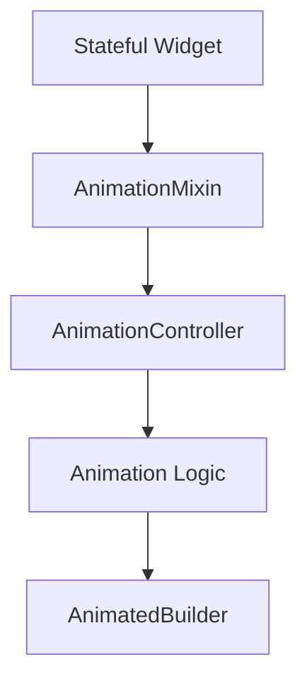
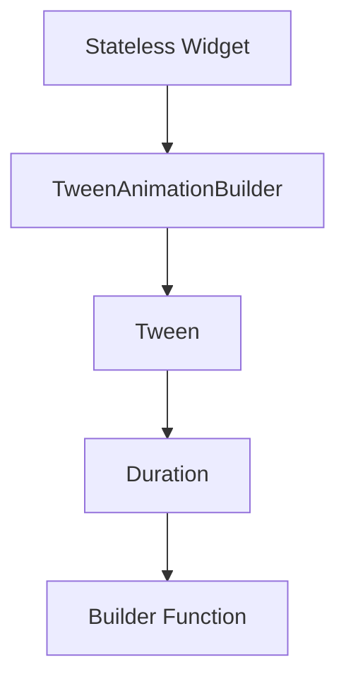

## 8.4.3 AnimationMixin and TweenAnimationBuilder

In the world of Flutter, animations play a crucial role in enhancing user experience by providing visual feedback and making interactions more intuitive. Two powerful tools in Flutter's animation arsenal are `AnimationMixin` and `TweenAnimationBuilder`. These tools simplify the creation and management of animations, each offering unique benefits and use cases. In this section, we'll dive deep into both, exploring their features, implementation, and best practices.

### Introduction to AnimationMixin

`AnimationMixin` is a mixin provided by the Flutter framework that simplifies the lifecycle management of `AnimationController`. By using `AnimationMixin`, developers can reduce boilerplate code associated with animations, making it easier to integrate and manage animations within stateful widgets.

#### Benefits of AnimationMixin

- **Streamlined Lifecycle Management:** `AnimationMixin` automatically manages the initialization and disposal of `AnimationController`, reducing the risk of memory leaks.
- **Reduced Boilerplate:** By handling common animation tasks, `AnimationMixin` allows developers to focus on the animation logic rather than the setup and teardown of controllers.
- **Enhanced Readability:** Code becomes more readable and maintainable, as the mixin abstracts away repetitive tasks.

### Implementing AnimationMixin

To use `AnimationMixin`, you need to integrate it within a stateful widget. Here's how you can set it up:

#### Setup

1. **Create a Stateful Widget:** Start by creating a stateful widget where you want to implement the animation.
2. **Add AnimationMixin:** Use `with AnimationMixin` in the state class to integrate the mixin.
3. **Initialize AnimationController:** Initialize the `AnimationController` in the `initState` method.
4. **Dispose AnimationController:** The mixin will automatically handle disposal, but ensure to call `super.dispose()`.

#### Code Example

Below is a Flutter code snippet demonstrating a widget that uses `AnimationMixin` to animate its size upon user interaction:

```dart
import 'package:flutter/material.dart';
import 'package:flutter/animation.dart';

class AnimatedSizeWidget extends StatefulWidget {
  @override
  _AnimatedSizeWidgetState createState() => _AnimatedSizeWidgetState();
}

class _AnimatedSizeWidgetState extends State<AnimatedSizeWidget>
    with SingleTickerProviderStateMixin, AnimationMixin {
  AnimationController _controller;
  Animation<double> _sizeAnimation;

  @override
  void initState() {
    super.initState();
    _controller = AnimationController(
      duration: const Duration(seconds: 2),
      vsync: this,
    );

    _sizeAnimation = Tween<double>(begin: 100.0, end: 200.0).animate(_controller);
  }

  @override
  Widget build(BuildContext context) {
    return GestureDetector(
      onTap: () {
        if (_controller.isCompleted) {
          _controller.reverse();
        } else {
          _controller.forward();
        }
      },
      child: AnimatedBuilder(
        animation: _sizeAnimation,
        builder: (context, child) {
          return Container(
            width: _sizeAnimation.value,
            height: _sizeAnimation.value,
            color: Colors.blue,
          );
        },
      ),
    );
  }
}
```

**Advantages:**

- **Automatic Lifecycle Management:** The mixin manages the controller's lifecycle, reducing the need for manual disposal.
- **Simplified Code:** The code is cleaner and more focused on the animation logic.

### Introduction to TweenAnimationBuilder

`TweenAnimationBuilder` is a widget that provides a declarative way to animate a property using a tween over a specified duration. It is particularly useful for creating concise animations without the need to manually manage animation controllers.

#### Benefits of TweenAnimationBuilder

- **Declarative Animations:** Allows for concise and readable animation definitions.
- **No Controller Management:** Eliminates the need for explicit animation controller management.
- **Versatile:** Can animate various properties such as color, size, and opacity.

### Implementing TweenAnimationBuilder

#### Basic Usage

To use `TweenAnimationBuilder`, you need to define the following core properties:

- **tween:** Defines the range of values for the animation.
- **duration:** Specifies the duration of the animation.
- **builder:** A function that builds the widget tree based on the animation's current value.

#### Animating Custom Properties

`TweenAnimationBuilder` can be used to animate a wide range of properties. Here's how you can animate the color transition of a container:

#### Code Example

```dart
import 'package:flutter/material.dart';

class ColorTransitionWidget extends StatelessWidget {
  @override
  Widget build(BuildContext context) {
    return Center(
      child: TweenAnimationBuilder<Color>(
        tween: ColorTween(begin: Colors.red, end: Colors.blue),
        duration: Duration(seconds: 2),
        builder: (BuildContext context, Color color, Widget child) {
          return Container(
            width: 100,
            height: 100,
            color: color,
          );
        },
      ),
    );
  }
}
```

**Comments:**

- **Tween Definition:** `ColorTween(begin: Colors.red, end: Colors.blue)` defines the color transition.
- **Duration:** The animation lasts for 2 seconds.
- **Builder Function:** The builder function updates the container's color based on the animation's progress.

### Mermaid.js Diagrams

To better understand the animation flows of `AnimationMixin` and `TweenAnimationBuilder`, let's visualize their integration points within the widget tree using Mermaid.js diagrams.

#### AnimationMixin Flow



#### TweenAnimationBuilder Flow



### Best Practices

- **Use Appropriately:** Choose between `AnimationMixin` and `TweenAnimationBuilder` based on the complexity and requirements of the animation.
- **Declarative Animations:** Favor declarative approaches like `TweenAnimationBuilder` for simpler animations to maintain code clarity.

### Common Pitfalls

- **Overcomplicating Animations:** Avoid creating overly complex animations when simpler widgets like `AnimatedContainer` or `TweenAnimationBuilder` can suffice.
- **Ignoring Performance:** Ensure that animations created with `TweenAnimationBuilder` are not too resource-intensive, especially when used in lists or scrollables.

### Implementation Guidance

- **Leverage AnimationMixin:** Use `AnimationMixin` for stateful animations requiring more control.
- **Experiment with Both:** Try both `AnimationMixin` and `TweenAnimationBuilder` to understand their strengths and appropriate use cases.

### Conclusion

Both `AnimationMixin` and `TweenAnimationBuilder` offer powerful ways to create animations in Flutter. By understanding their features and best practices, you can choose the right tool for your animation needs, ensuring efficient and responsive user interfaces.

## Quiz Time!



### What is the primary benefit of using `AnimationMixin` in Flutter?

- [x] It simplifies the lifecycle management of `AnimationController`.
- [ ] It provides built-in animations for common UI elements.
- [ ] It allows animations to run without any code.
- [ ] It automatically optimizes animations for performance.

> **Explanation:** `AnimationMixin` simplifies the lifecycle management of `AnimationController`, reducing boilerplate code and potential errors.

### How does `TweenAnimationBuilder` differ from `AnimationMixin`?

- [x] `TweenAnimationBuilder` does not require manual management of `AnimationController`.
- [ ] `TweenAnimationBuilder` is only used for color animations.
- [ ] `AnimationMixin` is used for stateless widgets.
- [ ] `TweenAnimationBuilder` cannot animate size changes.

> **Explanation:** `TweenAnimationBuilder` provides a declarative way to animate properties without needing to manage `AnimationController`.

### In the provided `AnimationMixin` example, what triggers the animation?

- [x] A user tap on the widget.
- [ ] The widget being displayed on the screen.
- [ ] A timer event.
- [ ] A change in device orientation.

> **Explanation:** The animation is triggered by a user tap, which starts or reverses the animation.

### What property of `TweenAnimationBuilder` defines the range of values for the animation?

- [x] `tween`
- [ ] `duration`
- [ ] `builder`
- [ ] `curve`

> **Explanation:** The `tween` property defines the range of values for the animation.

### Which of the following is a common pitfall when using `TweenAnimationBuilder`?

- [x] Creating animations that are too resource-intensive.
- [ ] Forgetting to dispose of the animation controller.
- [ ] Using it for animations longer than 5 seconds.
- [ ] Applying it to stateless widgets.

> **Explanation:** Animations that are too resource-intensive can affect performance, especially in lists or scrollables.

### What is a key advantage of using `TweenAnimationBuilder`?

- [x] It allows for declarative animations without managing controllers.
- [ ] It automatically creates animations for all widget properties.
- [ ] It is only used for color transitions.
- [ ] It requires less code than `AnimatedContainer`.

> **Explanation:** `TweenAnimationBuilder` allows for declarative animations without the need for explicit controller management.

### When should you prefer using `AnimationMixin` over `TweenAnimationBuilder`?

- [x] When you need more control over the animation lifecycle.
- [ ] When animating simple properties like color.
- [ ] When you want to avoid using stateful widgets.
- [ ] When you need to animate multiple properties simultaneously.

> **Explanation:** `AnimationMixin` is preferred when more control over the animation lifecycle is needed.

### What does the `builder` function in `TweenAnimationBuilder` do?

- [x] It builds the widget tree based on the animation's current value.
- [ ] It initializes the animation controller.
- [ ] It sets the duration of the animation.
- [ ] It disposes of the animation resources.

> **Explanation:** The `builder` function constructs the widget tree based on the current value of the animation.

### What is the purpose of using `SingleTickerProviderStateMixin` with `AnimationMixin`?

- [x] To provide a `Ticker` for the `AnimationController`.
- [ ] To automatically dispose of the widget.
- [ ] To enable animations on stateless widgets.
- [ ] To create animations without code.

> **Explanation:** `SingleTickerProviderStateMixin` provides a `Ticker` for the `AnimationController`, which is necessary for driving the animation.

### True or False: `TweenAnimationBuilder` can be used to animate both color and size properties.

- [x] True
- [ ] False

> **Explanation:** `TweenAnimationBuilder` can animate various properties, including color and size, by using appropriate tweens.


