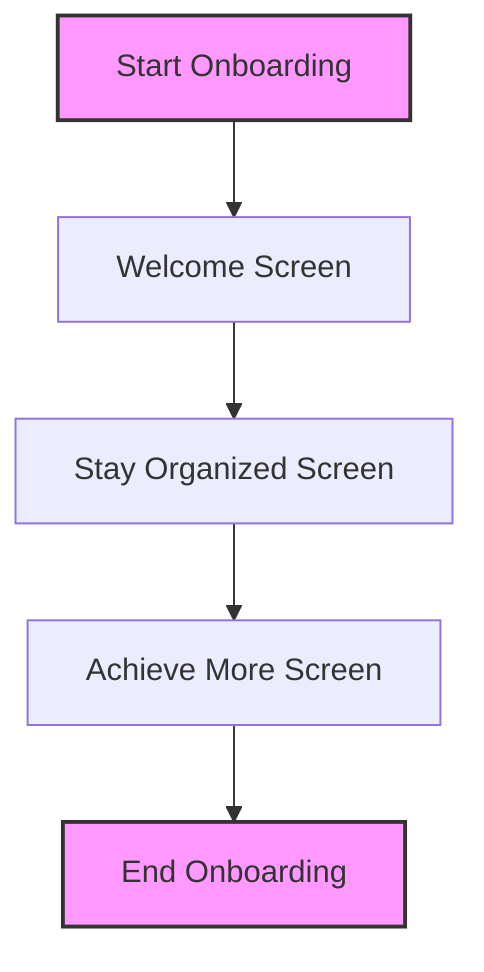
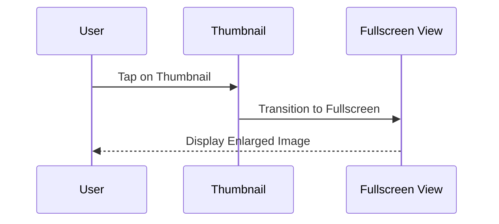
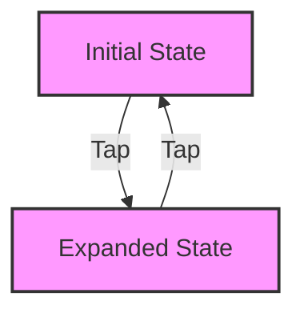

## 8.4.4 Case Studies

### Purpose of Case Studies

Case studies serve as a bridge between theoretical knowledge and practical application, offering readers a glimpse into how animation techniques can be effectively integrated into real-world applications. By examining these examples, developers can gain insights into the challenges and solutions associated with implementing animations in complex app scenarios. This section will explore three distinct case studies, each highlighting different aspects of animation in Flutter applications.

### Case Study 1: Animated Onboarding Screens

#### Scenario

Creating an engaging onboarding flow is crucial for guiding new users through the initial steps of using an app. This case study focuses on designing an onboarding process with multiple screens that transition smoothly using animations. The goal is to enhance user engagement and improve the completion rate of the onboarding process.

#### Implementation Details

To achieve smooth transitions between onboarding screens, we can utilize Flutter's `AnimatedSwitcher` and `Hero` animations. `AnimatedSwitcher` allows for seamless transitions between different widgets, while `Hero` animations provide a visually appealing effect when navigating between screens.

#### Code Example

Below is a simplified example of how to implement animated transitions between onboarding screens using `AnimatedSwitcher` and `Hero` animations:

```dart
import 'package:flutter/material.dart';

void main() => runApp(OnboardingApp());

class OnboardingApp extends StatelessWidget {
  @override
  Widget build(BuildContext context) {
    return MaterialApp(
      home: OnboardingScreen(),
    );
  }
}

class OnboardingScreen extends StatefulWidget {
  @override
  _OnboardingScreenState createState() => _OnboardingScreenState();
}

class _OnboardingScreenState extends State<OnboardingScreen> {
  int _currentIndex = 0;
  final List<Widget> _onboardingSteps = [
    OnboardingStep(
      key: ValueKey(1),
      title: 'Welcome',
      description: 'Discover the amazing features of our app.',
    ),
    OnboardingStep(
      key: ValueKey(2),
      title: 'Stay Organized',
      description: 'Keep track of your tasks and goals efficiently.',
    ),
    OnboardingStep(
      key: ValueKey(3),
      title: 'Achieve More',
      description: 'Reach your full potential with our tools.',
    ),
  ];

  void _nextStep() {
    setState(() {
      _currentIndex = (_currentIndex + 1) % _onboardingSteps.length;
    });
  }

  @override
  Widget build(BuildContext context) {
    return Scaffold(
      appBar: AppBar(title: Text('Onboarding')),
      body: Center(
        child: AnimatedSwitcher(
          duration: Duration(milliseconds: 500),
          child: _onboardingSteps[_currentIndex],
        ),
      ),
      floatingActionButton: FloatingActionButton(
        onPressed: _nextStep,
        child: Icon(Icons.arrow_forward),
      ),
    );
  }
}

class OnboardingStep extends StatelessWidget {
  final String title;
  final String description;

  const OnboardingStep({Key? key, required this.title, required this.description}) : super(key: key);

  @override
  Widget build(BuildContext context) {
    return Hero(
      tag: title,
      child: Material(
        child: Column(
          mainAxisAlignment: MainAxisAlignment.center,
          children: [
            Text(title, style: Theme.of(context).textTheme.headline4),
            SizedBox(height: 20),
            Text(description, textAlign: TextAlign.center),
          ],
        ),
      ),
    );
  }
}
```

#### Mermaid.js Diagrams

To visualize the flow of animations as users progress through the onboarding process, consider the following diagram:



#### Outcome

By incorporating animations into the onboarding process, users are more likely to engage with the content, leading to higher completion rates. The smooth transitions help maintain user interest and provide a polished, professional feel to the app.

### Case Study 2: Interactive Photo Gallery

#### Scenario

In this case study, we explore building an interactive photo gallery where users can tap on thumbnails to view enlarged images with smooth transitions. The focus is on creating a responsive and engaging user experience.

#### Implementation Details

To achieve this, we can use `Hero` animations for seamless transitions between thumbnail and full-screen views. Additionally, `GestureDetector` and `AnimatedBuilder` can be employed to handle user interactions and animate transitions.

#### Code Example

Here's a basic implementation of an interactive photo gallery using `Hero` animations:

```dart
import 'package:flutter/material.dart';

void main() => runApp(PhotoGalleryApp());

class PhotoGalleryApp extends StatelessWidget {
  @override
  Widget build(BuildContext context) {
    return MaterialApp(
      home: GalleryScreen(),
    );
  }
}

class GalleryScreen extends StatelessWidget {
  final List<String> images = [
    'assets/image1.jpg',
    'assets/image2.jpg',
    'assets/image3.jpg',
  ];

  @override
  Widget build(BuildContext context) {
    return Scaffold(
      appBar: AppBar(title: Text('Photo Gallery')),
      body: GridView.builder(
        gridDelegate: SliverGridDelegateWithFixedCrossAxisCount(crossAxisCount: 2),
        itemCount: images.length,
        itemBuilder: (context, index) {
          return GestureDetector(
            onTap: () {
              Navigator.push(context, MaterialPageRoute(builder: (_) {
                return DetailScreen(image: images[index]);
              }));
            },
            child: Hero(
              tag: images[index],
              child: Image.asset(images[index], fit: BoxFit.cover),
            ),
          );
        },
      ),
    );
  }
}

class DetailScreen extends StatelessWidget {
  final String image;

  const DetailScreen({Key? key, required this.image}) : super(key: key);

  @override
  Widget build(BuildContext context) {
    return Scaffold(
      appBar: AppBar(title: Text('Photo Detail')),
      body: Center(
        child: Hero(
          tag: image,
          child: Image.asset(image),
        ),
      ),
    );
  }
}
```

#### Mermaid.js Diagrams

The following diagram illustrates the animated flow from thumbnail to detailed photo view:



#### Outcome

The use of animations in the photo gallery enhances the user experience by providing a fluid and intuitive navigation flow. Users can easily explore images, making the app more engaging and visually appealing.

### Case Study 3: Dynamic Dashboard with Animated Widgets

#### Scenario

This case study focuses on developing a dynamic dashboard where widgets can be rearranged, resized, or updated with animated transitions based on user interactions. The aim is to create an intuitive and engaging interface.

#### Implementation Details

To manage dynamic widget layouts, we can integrate `AnimatedPositioned`, `AnimatedContainer`, and custom animations. These tools allow for smooth transitions as widgets are rearranged or resized.

#### Code Example

Below is an example of a dynamic dashboard using `AnimatedPositioned` and `AnimatedContainer`:

```dart
import 'package:flutter/material.dart';

void main() => runApp(DashboardApp());

class DashboardApp extends StatelessWidget {
  @override
  Widget build(BuildContext context) {
    return MaterialApp(
      home: DashboardScreen(),
    );
  }
}

class DashboardScreen extends StatefulWidget {
  @override
  _DashboardScreenState createState() => _DashboardScreenState();
}

class _DashboardScreenState extends State<DashboardScreen> {
  bool _isExpanded = false;

  void _toggleExpand() {
    setState(() {
      _isExpanded = !_isExpanded;
    });
  }

  @override
  Widget build(BuildContext context) {
    return Scaffold(
      appBar: AppBar(title: Text('Dynamic Dashboard')),
      body: Center(
        child: GestureDetector(
          onTap: _toggleExpand,
          child: AnimatedContainer(
            duration: Duration(milliseconds: 300),
            width: _isExpanded ? 300 : 150,
            height: _isExpanded ? 300 : 150,
            color: Colors.blue,
            child: Center(child: Text('Tap to Expand')),
          ),
        ),
      ),
    );
  }
}
```

#### Mermaid.js Diagrams

The following diagram maps out the animation flow as widgets are rearranged or resized:



#### Outcome

Animations in the dashboard contribute to a more intuitive and engaging user experience. Users can interact with the dashboard more naturally, leading to improved usability and satisfaction.

### Best Practices Highlighted Through Case Studies

- **Consistency:** Maintaining a consistent animation style throughout the application ensures a cohesive user experience. Consistent animations help users understand interactions and navigate the app more intuitively.
- **Performance Optimization:** Optimizing animations is crucial to prevent lag and ensure smooth interactions. This involves using efficient animation techniques and minimizing unnecessary rebuilds.
- **User-Centric Design:** Designing animations that enhance usability and guide users without causing distractions is key. Animations should serve a purpose, such as highlighting important actions or transitions.

### Implementation Guidance

- **Use Case Studies:** Demonstrating the application of multiple animation techniques in unison through case studies provides valuable insights. It helps readers understand how to combine different animation tools effectively.
- **Clear Explanations:** Providing clear explanations alongside code and diagrams ensures readers can replicate and adapt the examples to their own projects. This fosters a deeper understanding and encourages experimentation.

By exploring these case studies, developers can gain practical insights into the implementation of animations in Flutter applications. The examples provided demonstrate how animations can enhance user engagement, improve navigation fluidity, and contribute to a more intuitive and engaging app experience.

## Quiz Time!



### What is the primary purpose of using case studies in the context of animations in Flutter?

- [x] To illustrate the practical application of animation techniques in real-world scenarios
- [ ] To provide a theoretical overview of animation concepts
- [ ] To replace the need for understanding basic animation principles
- [ ] To demonstrate the limitations of animations in Flutter

> **Explanation:** Case studies provide practical examples that help illustrate how animation techniques can be applied in real-world scenarios, enhancing understanding and application.

### In the onboarding case study, which Flutter widget is used to transition smoothly between different onboarding steps?

- [x] AnimatedSwitcher
- [ ] AnimatedContainer
- [ ] GestureDetector
- [ ] AnimatedBuilder

> **Explanation:** `AnimatedSwitcher` is used to transition smoothly between different widgets, making it ideal for onboarding steps.

### Which animation technique is highlighted in the interactive photo gallery case study for transitioning from thumbnails to full-screen images?

- [x] Hero animations
- [ ] AnimatedOpacity
- [ ] AnimatedPositioned
- [ ] AnimatedList

> **Explanation:** Hero animations provide seamless transitions between thumbnail and full-screen views, enhancing the user experience.

### What is the main benefit of using animations in the dynamic dashboard case study?

- [x] Enhancing user interaction and engagement
- [ ] Reducing the complexity of the dashboard layout
- [ ] Increasing the number of widgets on the dashboard
- [ ] Simplifying the codebase

> **Explanation:** Animations enhance user interaction and engagement by providing intuitive and smooth transitions when rearranging or resizing widgets.

### Which of the following is a best practice highlighted through the case studies?

- [x] Maintaining a consistent animation style throughout the application
- [ ] Using as many animation techniques as possible
- [ ] Avoiding the use of animations in user interfaces
- [ ] Implementing animations only for aesthetic purposes

> **Explanation:** Consistency in animation style ensures a cohesive user experience and helps users navigate the app intuitively.

### What is a key consideration when optimizing animations for performance?

- [x] Minimizing unnecessary rebuilds
- [ ] Increasing the duration of all animations
- [ ] Using only implicit animations
- [ ] Avoiding the use of Hero animations

> **Explanation:** Minimizing unnecessary rebuilds helps optimize animations for performance, ensuring smooth interactions.

### How do animations contribute to user-centric design?

- [x] By enhancing usability and guiding users without causing distractions
- [ ] By making the app visually complex
- [ ] By replacing all static elements with animated ones
- [ ] By increasing the app's loading time

> **Explanation:** Animations enhance usability by guiding users through interactions and transitions, without causing distractions.

### Which widget is used in the dynamic dashboard case study to animate the resizing of widgets?

- [x] AnimatedContainer
- [ ] AnimatedSwitcher
- [ ] Hero
- [ ] AnimatedList

> **Explanation:** `AnimatedContainer` is used to animate changes in size, color, and other properties, making it suitable for resizing widgets.

### What is the outcome of using animations in the onboarding process?

- [x] Higher user engagement and completion rates
- [ ] Increased app complexity
- [ ] Reduced user interaction
- [ ] Slower app performance

> **Explanation:** Animations in the onboarding process lead to higher user engagement and completion rates by maintaining interest and providing a polished experience.

### True or False: The use of animations in Flutter apps should always prioritize aesthetics over functionality.

- [ ] True
- [x] False

> **Explanation:** Animations should enhance functionality and usability, not just serve aesthetic purposes. They should guide users and improve the overall experience.


