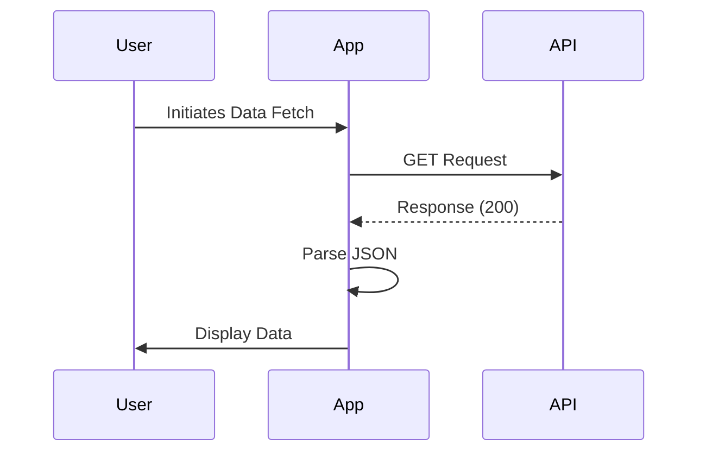

## 9.1.1 Using the `http` Package

In the world of mobile app development, interacting with external APIs is a fundamental aspect that enables applications to fetch and send data over the internet. This capability is crucial for building dynamic, data-driven applications that can provide users with real-time information and services. In this section, we will delve into how to use the `http` package in Flutter to make HTTP requests, focusing on its simplicity and effectiveness in handling various HTTP methods such as GET, POST, PUT, and DELETE.

### Introduction to HTTP Requests

HTTP (Hypertext Transfer Protocol) is the foundation of any data exchange on the Web, and it is a protocol used for fetching resources, such as HTML documents. It is the protocol used by the World Wide Web and is used to load web pages using hypertext links. In the context of mobile applications, HTTP requests allow apps to communicate with web services and APIs to retrieve or send data.

#### The Significance of APIs in Modern App Development

APIs (Application Programming Interfaces) are sets of rules and protocols for building and interacting with software applications. They allow different software systems to communicate with each other. RESTful APIs, which stand for Representational State Transfer, are a type of API that uses HTTP requests to GET, PUT, POST, and DELETE data. They are widely used in modern app development due to their simplicity and scalability.

### Overview of the `http` Package

The `http` package in Flutter is a powerful tool that simplifies the process of making HTTP requests. It provides a straightforward API for performing HTTP operations, making it an ideal choice for developers who need to interact with web services. The package supports all standard HTTP methods, including GET, POST, PUT, DELETE, and more, allowing developers to perform a wide range of operations with ease.

#### Key Features of the `http` Package

- **Simplicity:** The `http` package is designed to be easy to use, with a simple API that abstracts the complexities of HTTP communication.
- **Asynchronous Support:** It supports asynchronous programming, allowing developers to perform network operations without blocking the UI thread.
- **Comprehensive HTTP Methods:** It provides support for all standard HTTP methods, enabling developers to perform CRUD (Create, Read, Update, Delete) operations.
- **Error Handling:** The package includes mechanisms for handling HTTP errors, ensuring robust and reliable applications.

### Installation and Setup

To use the `http` package in your Flutter project, you need to add it to your project's dependencies. This is done by editing the `pubspec.yaml` file.

#### Adding the `http` Package

Open your `pubspec.yaml` file and add the `http` package under the dependencies section:

```yaml
dependencies:
  http: ^0.13.5
```

After adding the dependency, run `flutter pub get` in your terminal to install the package.

#### Importing the Package

Once the package is installed, you can import it into your Dart files where you intend to make HTTP requests:

```dart
import 'package:http/http.dart' as http;
```

The `as http` part allows you to use `http` as a prefix for all the functions and classes provided by the package, which helps avoid naming conflicts with other packages.

### Making a GET Request

One of the most common operations when working with APIs is fetching data using a GET request. Let's walk through an example of how to perform a GET request using the `http` package.

#### Code Example: Fetching Data with a GET Request

```dart
import 'dart:convert';
import 'package:flutter/material.dart';
import 'package:http/http.dart' as http;

class DataFetcher extends StatefulWidget {
  @override
  _DataFetcherState createState() => _DataFetcherState();
}

class _DataFetcherState extends State<DataFetcher> {
  String data = 'Loading...';

  @override
  void initState() {
    super.initState();
    fetchData();
  }

  Future<void> fetchData() async {
    final response = await http.get(Uri.parse('https://jsonplaceholder.typicode.com/posts/1'));

    if (response.statusCode == 200) {
      setState(() {
        data = json.decode(response.body)['title'];
      });
    } else {
      setState(() {
        data = 'Failed to load data';
      });
    }
  }

  @override
  Widget build(BuildContext context) {
    return Scaffold(
      appBar: AppBar(title: Text('Fetch Data Example')),
      body: Center(child: Text(data)),
    );
  }
}
```

#### Explanation of the Code

- **HTTP GET Request:** The `http.get` method is used to send a GET request to the specified URL. The URL is parsed using `Uri.parse` to ensure it is in the correct format.
- **Asynchronous Operation:** The `await` keyword is used to wait for the HTTP request to complete before proceeding. This ensures that the UI is not blocked while the request is being processed.
- **Response Handling:** The response from the server is checked for a status code of 200, which indicates a successful request. If successful, the JSON response is parsed using `json.decode`, and the data is extracted and displayed.
- **Error Handling:** If the response status code is not 200, an error message is displayed.

### Error Handling

Handling errors gracefully is crucial in network operations to ensure a smooth user experience. Network failures, unexpected responses, or server errors can occur, and your app should be prepared to handle these situations.

#### Code Example: Error Handling with Try-Catch

```dart
Future<void> fetchData() async {
  try {
    final response = await http.get(Uri.parse('https://jsonplaceholder.typicode.com/posts/1'));

    if (response.statusCode == 200) {
      setState(() {
        data = json.decode(response.body)['title'];
      });
    } else {
      setState(() {
        data = 'Failed to load data: ${response.statusCode}';
      });
    }
  } catch (e) {
    setState(() {
      data = 'An error occurred: $e';
    });
  }
}
```

#### Explanation of Error Handling

- **Try-Catch Block:** The `try-catch` block is used to handle exceptions that may occur during the HTTP request. This includes network errors or issues with parsing the response.
- **User Feedback:** In case of an error, the UI is updated to inform the user of the issue. This is done by setting the `data` variable to an error message.

### Sequence Diagram: HTTP GET Request Flow

To better understand the flow of making an HTTP GET request, let's visualize the process using a sequence diagram.



### Best Practices

When working with HTTP requests in Flutter, there are several best practices to consider to ensure efficient and maintainable code.

#### Asynchronous Programming

- **Use `async` and `await`:** Always use `async` and `await` to handle asynchronous operations. This ensures that your app remains responsive and does not block the UI thread.

#### Separation of Concerns

- **Service Classes:** Separate your API logic into dedicated service classes. This improves code organization and makes it easier to manage and test your API interactions.

#### Reusable API Clients

- **Create Reusable Methods:** Develop reusable methods or classes for API interactions. This promotes code reuse and consistency across your application.

### Common Pitfalls

While working with HTTP requests, developers may encounter several common pitfalls that can lead to issues in their applications.

#### Ignoring Error Handling

- **Always Handle Errors:** Failing to handle errors can result in unresponsive or crashing applications. Always implement error handling to manage network failures and unexpected responses.

#### Blocking the UI Thread

- **Avoid Synchronous Requests:** Performing synchronous HTTP requests can freeze the UI, leading to a poor user experience. Always use asynchronous methods to keep the UI responsive.

### Implementation Guidance

To gain a deeper understanding of HTTP requests in Flutter, consider experimenting with different HTTP methods and API endpoints. This hands-on practice will help solidify your understanding and improve your skills.

- **Experiment with HTTP Methods:** Try using POST, PUT, and DELETE requests to interact with APIs. This will give you a broader understanding of how to perform different operations.
- **Organize API Code:** As your application grows, organizing your API-related code becomes crucial for scalability and maintenance. Consider using service classes and reusable methods to keep your codebase clean and efficient.

### Conclusion

Mastering HTTP requests in Flutter using the `http` package is an essential skill for any developer looking to build dynamic, data-driven applications. By understanding how to perform HTTP operations, handle errors, and implement best practices, you can create robust and responsive applications that provide a seamless user experience.

## Quiz Time!



### What is the primary purpose of the `http` package in Flutter?

- [x] To perform HTTP requests such as GET, POST, PUT, and DELETE.
- [ ] To manage local storage in Flutter applications.
- [ ] To handle state management in Flutter.
- [ ] To create animations in Flutter apps.

> **Explanation:** The `http` package is used for making HTTP requests, allowing Flutter apps to interact with web services and APIs.

### Which keyword is used to handle asynchronous operations in Dart?

- [x] async
- [ ] sync
- [ ] wait
- [ ] defer

> **Explanation:** The `async` keyword is used in Dart to define asynchronous functions, allowing the use of `await` for non-blocking operations.

### How do you add the `http` package to a Flutter project?

- [x] By adding `http: ^0.13.5` to the `dependencies` section of `pubspec.yaml`.
- [ ] By importing it directly in the Dart file.
- [ ] By installing it from the Flutter marketplace.
- [ ] By adding it to the AndroidManifest.xml.

> **Explanation:** The `http` package is added to a Flutter project by specifying it in the `pubspec.yaml` file under dependencies.

### What is the role of the `try-catch` block in HTTP requests?

- [x] To handle exceptions and errors during HTTP requests.
- [ ] To initialize HTTP requests.
- [ ] To parse JSON responses.
- [ ] To update the UI with data.

> **Explanation:** The `try-catch` block is used to handle exceptions that may occur during HTTP requests, such as network errors.

### What does a status code of 200 indicate in an HTTP response?

- [x] A successful request.
- [ ] A client error.
- [ ] A server error.
- [ ] A redirection.

> **Explanation:** A status code of 200 indicates that the HTTP request was successful and the server returned the requested data.

### Why is it important to use `async` and `await` with HTTP requests?

- [x] To prevent blocking the UI thread and ensure responsiveness.
- [ ] To make the code run faster.
- [ ] To simplify error handling.
- [ ] To automatically parse JSON responses.

> **Explanation:** Using `async` and `await` ensures that HTTP requests do not block the UI thread, maintaining app responsiveness.

### What is a common pitfall when making HTTP requests in Flutter?

- [x] Ignoring error handling.
- [ ] Using too many async functions.
- [ ] Overusing the `http` package.
- [ ] Making requests too frequently.

> **Explanation:** Ignoring error handling is a common pitfall that can lead to unresponsive or crashing applications.

### How can you avoid blocking the UI thread during HTTP requests?

- [x] By using asynchronous methods with `await`.
- [ ] By using synchronous methods.
- [ ] By running requests in a separate isolate.
- [ ] By increasing the app's frame rate.

> **Explanation:** Using asynchronous methods with `await` prevents blocking the UI thread, keeping the app responsive.

### What is the benefit of separating API logic into service classes?

- [x] Improved code organization and maintainability.
- [ ] Faster HTTP request execution.
- [ ] Automatic error handling.
- [ ] Enhanced UI performance.

> **Explanation:** Separating API logic into service classes improves code organization, making it easier to manage and maintain.

### True or False: The `http` package can only be used for GET requests.

- [ ] True
- [x] False

> **Explanation:** The `http` package supports all standard HTTP methods, including GET, POST, PUT, DELETE, and more.


