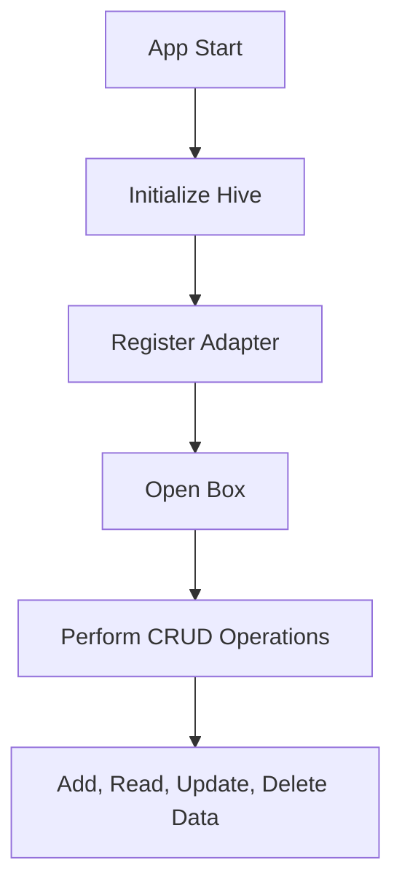

## 9.2.3 Hive and Object Storage

In the realm of Flutter development, managing local data efficiently and effectively is crucial for creating responsive and adaptive applications. Hive, a lightweight and fast key-value database written in pure Dart, emerges as a powerful solution for developers seeking to store structured and unstructured data seamlessly. This section delves into the intricacies of Hive, highlighting its advantages, setup process, and practical usage in Flutter applications.

### Introduction to Hive

Hive is a modern, lightweight database designed specifically for Flutter and Dart applications. It operates as a key-value store, allowing developers to manage data without the overhead of traditional databases. Hive's architecture is optimized for performance, making it an ideal choice for mobile applications where speed and efficiency are paramount.

- **Lightweight and Fast:** Hive's design prioritizes minimal resource usage and high-speed operations, ensuring low latency in data access.
- **Pure Dart Implementation:** Being written entirely in Dart, Hive eliminates the need for native dependencies, simplifying cross-platform development.
- **Structured and Unstructured Data:** Hive's flexibility allows it to handle both structured data (like objects) and unstructured data (like raw strings or numbers), making it versatile for various use cases.

### Advantages of Using Hive

#### Performance

Hive is renowned for its exceptional performance, often outperforming other local storage solutions in terms of speed and efficiency. Its architecture is optimized for quick read and write operations, which is crucial for applications that require real-time data access.

#### No Native Dependencies

One of Hive's standout features is its pure Dart implementation. This means developers can integrate Hive into their Flutter projects without worrying about platform-specific dependencies or configurations, streamlining the development process and reducing potential compatibility issues.

#### Strong Typing and Custom Objects

Hive supports strong typing and the storage of custom Dart objects through the use of type adapters. This feature allows developers to maintain type safety and leverage Dart's object-oriented capabilities, enhancing code maintainability and readability.

### Installation and Setup

To get started with Hive, you need to add the necessary packages to your Flutter project's `pubspec.yaml` file. This includes the core Hive package and the Hive Flutter package for Flutter-specific functionalities.

```yaml
dependencies:
  hive: ^2.2.3
  hive_flutter: ^1.1.0

dev_dependencies:
  hive_generator: ^1.1.3
  build_runner: ^2.3.3
```

After adding these dependencies, import the packages in your Dart files to access Hive's functionalities:

```dart
import 'package:hive/hive.dart';
import 'package:hive_flutter/hive_flutter.dart';
```

### Initializing Hive

Before using Hive, you need to initialize it and register any type adapters for custom objects. This setup is typically done in the `main` function of your Flutter application.

```dart
void main() async {
  await Hive.initFlutter();
  Hive.registerAdapter(PostAdapter());
  await Hive.openBox<Post>('posts');
  runApp(MyApp());
}
```

#### Explanation

- **Initialization:** `Hive.initFlutter()` initializes Hive for Flutter applications, setting up the necessary environment.
- **Registering Adapters:** `Hive.registerAdapter(PostAdapter())` registers a type adapter for the `Post` class, enabling Hive to store and retrieve custom objects.
- **Opening a Box:** `Hive.openBox<Post>('posts')` opens a Hive box named 'posts', which acts as a container for storing `Post` objects.

### Creating Type Adapters

To store custom objects in Hive, you need to define type adapters. These adapters serialize and deserialize objects, allowing Hive to manage them efficiently.

```dart
import 'package:hive/hive.dart';

part 'post.g.dart';

@HiveType(typeId: 0)
class Post extends HiveObject {
  @HiveField(0)
  final int userId;

  @HiveField(1)
  final int id;

  @HiveField(2)
  final String title;

  @HiveField(3)
  final String body;

  Post({required this.userId, required this.id, required this.title, required this.body});
}
```

#### Explanation

- **Annotations:** Hive uses annotations (`@HiveType` and `@HiveField`) to define fields within a Dart class. These annotations are processed by the Hive generator to create the necessary serialization code.
- **Build Runner:** Run the build runner to generate the adapter code:
  ```bash
  flutter packages pub run build_runner build
  ```

### Performing CRUD Operations

Hive provides a straightforward API for performing CRUD (Create, Read, Update, Delete) operations on data stored in boxes.

#### Create (Add Data)

```dart
Future<void> addPost(Post post) async {
  final box = Hive.box<Post>('posts');
  await box.add(post);
}
```

#### Read (Retrieve Data)

```dart
List<Post> getAllPosts() {
  final box = Hive.box<Post>('posts');
  return box.values.toList();
}
```

#### Update

```dart
Future<void> updatePost(int index, Post post) async {
  final box = Hive.box<Post>('posts');
  await box.putAt(index, post);
}
```

#### Delete

```dart
Future<void> deletePost(int index) async {
  final box = Hive.box<Post>('posts');
  await box.deleteAt(index);
}
```

#### Explanation

- **Add:** Use `box.add(post)` to insert a new `Post` object into the box.
- **Retrieve:** `box.values.toList()` retrieves all stored `Post` objects as a list.
- **Update:** `box.putAt(index, post)` updates the `Post` object at the specified index.
- **Delete:** `box.deleteAt(index)` removes the `Post` object at the specified index.

### Mermaid.js Diagrams

To visualize the data flow and operations within Hive, consider the following diagram:

```markdown

```

### Best Practices

- **Version Management:** Carefully manage and update type adapters to maintain data consistency as your data models evolve. This ensures backward compatibility and prevents data corruption.
- **Data Encryption:** Leverage Hive's built-in encryption features to secure sensitive data, protecting it from unauthorized access.
- **Efficient Data Access:** Open and close Hive boxes appropriately to manage resources effectively and avoid memory leaks.

### Common Pitfalls

- **Incorrect Type Adapters:** Ensure that type adapters are correctly defined and registered to prevent runtime errors and data inconsistencies.
- **Data Migration Issues:** Handle changes in data models gracefully to prevent data corruption during migrations. Consider using Hive's migration features to manage schema changes.

### Implementation Guidance

- **Code Organization:** Organize Hive-related code into dedicated services or repositories for better maintainability and separation of concerns.
- **Testing:** Thoroughly test data storage and retrieval operations to ensure data integrity and performance. This includes unit tests for CRUD operations and integration tests for end-to-end scenarios.

By understanding and implementing Hive effectively, you can enhance your Flutter applications with robust local data storage capabilities. Hive's speed, flexibility, and ease of use make it a valuable tool for managing data in a wide range of applications.

## Quiz Time!



### What is Hive in the context of Flutter development?

- [x] A lightweight and fast key-value database written in pure Dart.
- [ ] A cloud-based storage solution for Flutter applications.
- [ ] A UI framework for building responsive layouts.
- [ ] A package for managing network requests in Flutter.

> **Explanation:** Hive is a lightweight and fast key-value database written in pure Dart, designed for local data storage in Flutter applications.

### Which of the following is an advantage of using Hive?

- [x] No native dependencies.
- [ ] Requires complex setup.
- [ ] Limited to structured data only.
- [ ] High latency compared to other solutions.

> **Explanation:** Hive is written entirely in Dart, eliminating the need for native dependencies, which simplifies cross-platform development.

### How do you initialize Hive in a Flutter application?

- [x] By calling `Hive.initFlutter()` in the `main` function.
- [ ] By importing `hive_flutter` in the `pubspec.yaml`.
- [ ] By creating a new Hive database file manually.
- [ ] By setting up a server to host Hive data.

> **Explanation:** Hive is initialized in a Flutter application by calling `Hive.initFlutter()` in the `main` function, setting up the necessary environment.

### What is the purpose of a type adapter in Hive?

- [x] To serialize and deserialize custom Dart objects for storage.
- [ ] To manage network requests and responses.
- [ ] To create UI components for data display.
- [ ] To encrypt data stored in Hive.

> **Explanation:** Type adapters in Hive are used to serialize and deserialize custom Dart objects, allowing them to be stored and retrieved efficiently.

### Which command is used to generate adapter code for Hive?

- [x] `flutter packages pub run build_runner build`
- [ ] `flutter create adapter`
- [ ] `flutter build adapter`
- [ ] `flutter packages get`

> **Explanation:** The command `flutter packages pub run build_runner build` is used to generate adapter code for Hive, processing the annotations in Dart classes.

### How do you add a new object to a Hive box?

- [x] By using the `box.add()` method.
- [ ] By calling `box.insert()`.
- [ ] By using `box.put()`.
- [ ] By directly modifying the box file.

> **Explanation:** The `box.add()` method is used to insert a new object into a Hive box.

### What is a common pitfall when using Hive?

- [x] Incorrectly defined type adapters.
- [ ] Overloading the network with requests.
- [ ] Using too many UI components.
- [ ] Not using enough animations.

> **Explanation:** A common pitfall when using Hive is incorrectly defined type adapters, which can lead to runtime errors and data inconsistencies.

### How can you secure sensitive data in Hive?

- [x] By using Hive's built-in encryption features.
- [ ] By storing data in plain text.
- [ ] By using a third-party encryption library.
- [ ] By manually encrypting data before storage.

> **Explanation:** Hive provides built-in encryption features that can be used to secure sensitive data, protecting it from unauthorized access.

### What is the role of the `HiveObject` class?

- [x] It provides additional functionalities for objects stored in Hive, such as automatic key management.
- [ ] It is used to manage network connections in Hive.
- [ ] It is a UI component for displaying Hive data.
- [ ] It encrypts data stored in Hive.

> **Explanation:** The `HiveObject` class provides additional functionalities for objects stored in Hive, such as automatic key management and easy access to the box.

### True or False: Hive can only store primitive data types.

- [ ] True
- [x] False

> **Explanation:** False. Hive can store both primitive data types and custom Dart objects, thanks to its support for type adapters.


