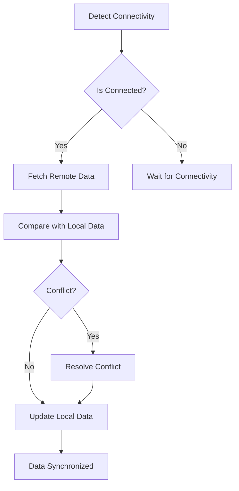

## 9.2.4 Data Synchronization

In the world of mobile app development, ensuring that data remains consistent across different devices and platforms is crucial. This is where data synchronization comes into play. In this section, we'll delve into the concept of data synchronization, explore various strategies for implementing it, and provide practical guidance for integrating these strategies into your Flutter applications.

### Introduction to Data Synchronization

Data synchronization is the process of ensuring that data across multiple locations or devices is consistent and up-to-date. This is particularly important in applications that require offline capabilities, real-time updates, or multi-device support. For instance, a note-taking app should allow users to access their notes offline, edit them, and then sync changes when they regain connectivity. Similarly, a messaging app needs to update messages in real-time across all devices.

**Importance of Data Synchronization:**
- **Offline Capabilities:** Allows applications to function without an internet connection, updating data once connectivity is restored.
- **Real-Time Updates:** Ensures that all users see the most current data, enhancing collaboration and user experience.
- **Multi-Device Support:** Provides a seamless experience across different devices, maintaining data consistency.

### Strategies for Data Synchronization

There are two primary strategies for data synchronization: manual synchronization and automated synchronization.

#### Manual Synchronization

Manual synchronization involves explicitly managing the synchronization logic within the application. This approach gives developers complete control over how data is synchronized, but it also requires handling various responsibilities, such as conflict resolution, data merging, and managing connectivity changes.

**Responsibilities in Manual Synchronization:**
- **Conflict Resolution:** Determine how to handle discrepancies between local and remote data.
- **Data Merging:** Combine changes from different sources while maintaining data integrity.
- **Connectivity Management:** Detect changes in network status and trigger synchronization processes accordingly.

#### Automated Synchronization

Automated synchronization leverages tools and services that handle synchronization for you, reducing the complexity for developers. Platforms like Firebase offer built-in synchronization features that automatically keep local and remote data in sync.

**Benefits of Automated Synchronization:**
- **Reduced Complexity:** Offloads synchronization logic to external services, simplifying development.
- **Scalability:** Easily handles large datasets and high-frequency updates.
- **Reliability:** Ensures data consistency with minimal developer intervention.

### Implementing Manual Synchronization

For developers who prefer more control over the synchronization process, manual synchronization offers flexibility and customization. Let's explore how to implement manual synchronization in a Flutter application.

#### Detecting Connectivity Changes

To synchronize data effectively, it's essential to monitor network connectivity. The `connectivity_plus` package provides a straightforward way to detect connectivity changes.

**Code Example:**

```dart
import 'package:connectivity_plus/connectivity_plus.dart';

void monitorConnectivity() {
  Connectivity().onConnectivityChanged.listen((ConnectivityResult result) {
    if (result != ConnectivityResult.none) {
      synchronizeData();
    }
  });
}
```

**Explanation:**
- This code listens for changes in network connectivity.
- When a connection is detected, it triggers the `synchronizeData` function to update local data with remote data.

#### Synchronizing Local and Remote Data

Once connectivity is established, the next step is to synchronize local data with remote data. Here's a basic example of how to achieve this:

**Code Example:**

```dart
Future<void> synchronizeData() async {
  final localPosts = getAllPosts();
  final remotePosts = await fetchRemotePosts();

  // Simple conflict resolution: overwrite local with remote data
  for (var remotePost in remotePosts) {
    await addPost(remotePost);
  }
}
```

**Explanation:**
- This function fetches data from a remote source and updates the local data store.
- In this simple example, remote data overwrites local data, but more sophisticated conflict resolution strategies can be implemented.

#### Handling Conflicts

Conflict resolution is a critical aspect of data synchronization. Here are some common strategies:

- **Last Write Wins:** The most recent update takes precedence.
- **Manual Resolution:** Prompt the user to resolve conflicts.
- **Custom Logic:** Implement application-specific conflict handling.

**Code Example:**

```dart
Future<void> synchronizeData() async {
  final localPosts = getAllPosts();
  final remotePosts = await fetchRemotePosts();

  for (var remotePost in remotePosts) {
    final index = localPosts.indexWhere((post) => post.id == remotePost.id);
    if (index != -1) {
      // Last Write Wins: Update local post with remote data
      await updatePost(index, remotePost);
    } else {
      // Add new post
      await addPost(remotePost);
    }
  }
}
```

**Explanation:**
- The code checks if a local post exists for each remote post.
- If a match is found, it updates the local post using the "Last Write Wins" strategy.
- If no match is found, it adds the remote post to the local data store.

#### Mermaid.js Diagrams

Visualizing the synchronization process can help clarify the workflow. Below is a diagram illustrating the steps involved in synchronizing local data with remote sources, including conflict detection and resolution.

```markdown

```

### Best Practices

Implementing data synchronization effectively requires adherence to best practices to ensure reliability and performance.

- **Reliable State Management:** Use robust state management solutions to manage data states effectively during synchronization.
- **Efficient Networking:** Optimize network requests to prevent excessive data usage and reduce latency.
- **User Feedback:** Inform users about the synchronization status through UI indicators, such as loading spinners or status messages.
- **Secure Data Transmission:** Ensure data is transmitted securely using HTTPS and proper authentication mechanisms.
- **Data Consistency:** Implement checks to maintain data consistency across local and remote sources.

### Common Pitfalls

Avoiding common pitfalls can prevent synchronization issues and improve application performance.

- **Ignoring Partial Failures:** Handle scenarios where only part of the synchronization process fails to prevent data inconsistencies.
- **Overcomplicating Logic:** Avoid overly complex synchronization mechanisms that can lead to maintenance challenges and bugs.
- **Data Loss:** Improper synchronization logic can lead to accidental data loss or overwriting.
- **Performance Issues:** Inefficient synchronization can degrade app performance, especially with large data sets or frequent updates.

### Implementation Guidance

To ensure a successful implementation of data synchronization, consider the following guidance:

- **Modularize Synchronization Logic:** Separate synchronization logic from UI components for better code organization.
- **Thorough Testing:** Test synchronization logic under various network conditions to ensure reliability.
- **Dedicated Synchronization Services:** Use dedicated services or repositories to manage data flows.
- **Logging Mechanisms:** Implement logging to track synchronization processes and identify issues.

### Conclusion

Data synchronization is a fundamental aspect of modern mobile applications, enabling seamless offline capabilities, real-time updates, and multi-device support. By understanding and implementing effective synchronization strategies, developers can ensure that their applications provide a consistent and reliable user experience.

## Quiz Time!



### What is data synchronization?

- [x] The process of keeping local and remote data sources consistent and up-to-date.
- [ ] A method for optimizing network requests.
- [ ] A technique for improving app performance.
- [ ] A strategy for managing user authentication.

> **Explanation:** Data synchronization involves ensuring that data across multiple locations or devices is consistent and up-to-date.

### Which of the following is a benefit of automated synchronization?

- [x] Reduced complexity for developers.
- [ ] Increased manual intervention.
- [ ] Decreased reliability.
- [ ] Slower data updates.

> **Explanation:** Automated synchronization reduces complexity by offloading synchronization logic to external services, simplifying development.

### What package can be used to detect connectivity changes in Flutter?

- [x] connectivity_plus
- [ ] http
- [ ] provider
- [ ] bloc

> **Explanation:** The `connectivity_plus` package is used to monitor network status and detect connectivity changes in Flutter.

### In the "Last Write Wins" conflict resolution strategy, which update takes precedence?

- [x] The most recent update.
- [ ] The oldest update.
- [ ] The largest update.
- [ ] The smallest update.

> **Explanation:** In the "Last Write Wins" strategy, the most recent update takes precedence over others.

### What is a common pitfall in data synchronization?

- [x] Ignoring partial failures.
- [ ] Using HTTPS for secure transmission.
- [ ] Providing user feedback.
- [ ] Modularizing synchronization logic.

> **Explanation:** Ignoring partial failures can lead to data inconsistencies, making it a common pitfall in data synchronization.

### Which of the following is a best practice for data synchronization?

- [x] Efficient networking.
- [ ] Overcomplicating logic.
- [ ] Ignoring user feedback.
- [ ] Avoiding state management.

> **Explanation:** Efficient networking is a best practice to optimize network requests and reduce latency during synchronization.

### What should be done to handle scenarios where only part of the synchronization process fails?

- [x] Implement error handling for partial failures.
- [ ] Ignore the failure and proceed.
- [ ] Restart the entire synchronization process.
- [ ] Use manual synchronization only.

> **Explanation:** Implementing error handling for partial failures prevents data inconsistencies and ensures reliable synchronization.

### What is the purpose of modularizing synchronization logic?

- [x] To separate it from UI components for better code organization.
- [ ] To increase the complexity of the codebase.
- [ ] To decrease the performance of the application.
- [ ] To make synchronization logic dependent on UI components.

> **Explanation:** Modularizing synchronization logic separates it from UI components, improving code organization and maintainability.

### Which strategy involves prompting the user to resolve conflicts?

- [x] Manual Resolution
- [ ] Last Write Wins
- [ ] Automated Synchronization
- [ ] Custom Logic

> **Explanation:** Manual Resolution involves prompting the user to resolve conflicts between local and remote data.

### True or False: Data synchronization is only necessary for applications with offline capabilities.

- [ ] True
- [x] False

> **Explanation:** Data synchronization is important for applications with offline capabilities, real-time updates, and multi-device support.


