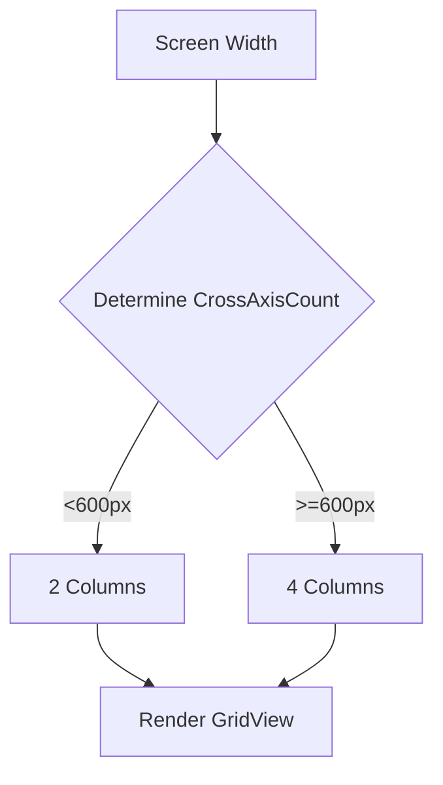

## 9.2.5 Handling Large Data Sets

In the world of mobile app development, efficiently managing large data sets is crucial for maintaining a smooth user experience and optimal app performance. As applications grow in complexity and data volume, developers face challenges such as UI lag, slow loading times, and increased memory usage. This section explores strategies and techniques to handle large data sets in Flutter, focusing on pagination, lazy loading, and data caching.

### Challenges with Large Data Sets

Handling large volumes of data can significantly impact app performance and user experience. Here are some common challenges:

- **UI Lag:** Rendering a large number of widgets simultaneously can cause the user interface to become unresponsive.
- **Memory Usage:** Loading extensive data sets into memory can lead to excessive consumption, potentially causing app crashes.
- **Slow Loading Times:** Fetching and processing large data sets can result in delays, frustrating users.
- **Increased Data Processing Requirements:** Managing and manipulating large data sets requires more computational resources.

### Techniques for Efficient Data Handling

To address these challenges, developers can employ several techniques:

#### Pagination

**Definition:** Pagination involves loading data in discrete chunks or pages rather than all at once, reducing the initial load time and memory usage.

**Implementation:**

- **Basic Pagination:** Manually fetch data in segments based on user interactions, such as clicking a "Load More" button.
- **Infinite Scrolling:** Automatically load more data as the user scrolls, providing a seamless experience.

**Code Example:**

```dart
import 'dart:convert';
import 'package:flutter/material.dart';
import 'package:http/http.dart' as http;

class PaginatedListView extends StatefulWidget {
  @override
  _PaginatedListViewState createState() => _PaginatedListViewState();
}

class _PaginatedListViewState extends State<PaginatedListView> {
  ScrollController _controller = ScrollController();
  List<Post> _posts = [];
  int _page = 1;
  bool _isLoading = false;
  bool _hasMore = true;

  @override
  void initState() {
    super.initState();
    fetchPosts();
    _controller.addListener(() {
      if (_controller.position.pixels == _controller.position.maxScrollExtent && !_isLoading && _hasMore) {
        fetchPosts();
      }
    });
  }

  Future<void> fetchPosts() async {
    setState(() {
      _isLoading = true;
    });
    final response = await http.get(Uri.parse('https://jsonplaceholder.typicode.com/posts?_limit=10&_page=$_page'));

    if (response.statusCode == 200) {
      List jsonResponse = json.decode(response.body);
      List<Post> fetchedPosts = jsonResponse.map((data) => Post.fromJson(data)).toList();
      setState(() {
        _page++;
        _isLoading = false;
        if (fetchedPosts.length < 10) {
          _hasMore = false;
        }
        _posts.addAll(fetchedPosts);
      });
    } else {
      setState(() {
        _isLoading = false;
        _hasMore = false;
      });
      throw Exception('Failed to load posts');
    }
  }

  @override
  void dispose() {
    _controller.dispose();
    super.dispose();
  }

  @override
  Widget build(BuildContext context) {
    return Scaffold(
      appBar: AppBar(title: Text('Paginated ListView')),
      body: ListView.builder(
        controller: _controller,
        itemCount: _posts.length + 1,
        itemBuilder: (context, index) {
          if (index < _posts.length) {
            return ListTile(
              title: Text(_posts[index].title),
              subtitle: Text(_posts[index].body),
            );
          } else {
            return _hasMore
                ? Padding(
                    padding: const EdgeInsets.all(8.0),
                    child: Center(child: CircularProgressIndicator()),
                  )
                : SizedBox();
          }
        },
      ),
    );
  }
}

class Post {
  final int userId;
  final int id;
  final String title;
  final String body;

  Post({required this.userId, required this.id, required this.title, required this.body});

  factory Post.fromJson(Map<String, dynamic> json) {
    return Post(
      userId: json['userId'],
      id: json['id'],
      title: json['title'],
      body: json['body'],
    );
  }
}
```

**Explanation:**

- **Infinite Scrolling:** The example demonstrates implementing infinite scrolling by fetching more data as the user reaches the end of the list.
- **Loading States:** Manage loading states to provide visual feedback to users and determine when no more data is available.

#### Lazy Loading

**Definition:** Lazy loading involves loading data on-demand as it is required, rather than loading all data upfront.

**Implementation:**

- Use widgets like `ListView.builder` and `GridView.builder` which build items on-demand, improving performance by only rendering visible items.

**Code Example:**

```dart
ListView.builder(
  itemCount: data.length,
  itemBuilder: (context, index) {
    return ListTile(
      title: Text(data[index].title),
      subtitle: Text(data[index].body),
    );
  },
);
```

#### Data Caching

**Definition:** Data caching involves temporarily storing data locally to reduce redundant network requests and improve data retrieval times.

**Implementation:**

- Combine local storage solutions like Hive or SQLite with caching strategies to store and retrieve data efficiently.

**Code Example:**

```dart
Future<Post> fetchAndCachePost(int id) async {
  final box = Hive.box<Post>('posts');
  if (box.containsKey(id)) {
    return box.get(id)!;
  } else {
    final response = await http.get(Uri.parse('https://jsonplaceholder.typicode.com/posts/$id'));
    if (response.statusCode == 200) {
      final post = Post.fromJson(json.decode(response.body));
      await box.put(id, post);
      return post;
    } else {
      throw Exception('Failed to load post');
    }
  }
}
```

**Explanation:**

- **Local Caching:** Check if the data exists in the local cache before making a network request.
- **Performance Optimization:** Store fetched data locally for future use to optimize performance.

### Mermaid.js Diagrams

#### Page Layout Diagram

This diagram illustrates how a grid adjusts the number of columns based on screen width and how data items are rendered within the grid.



### Best Practices

- **Efficient Data Structures:** Use appropriate data structures to store and manage large data sets effectively.
- **Smooth User Experience:** Ensure that data loading and presentation do not hinder the responsiveness of the app.
- **Error Handling:** Implement robust error handling to manage issues that arise from working with large data sets.

### Common Pitfalls

- **Memory Overconsumption:** Loading excessively large data sets into memory can lead to app crashes or slowdowns.
- **UI Lag:** Rendering too many widgets at once can cause significant UI lag and deteriorate the user experience.

### Implementation Guidance

- **Profiling:** Encourage developers to profile their applications to identify and address performance bottlenecks related to large data handling.
- **Efficient Management:** Recommend leveraging efficient data management and rendering techniques to maintain a smooth and responsive UI.

By implementing these strategies, developers can effectively manage large data sets in Flutter applications, ensuring a seamless and responsive user experience.

## Quiz Time!



### What is a common challenge when handling large data sets in mobile applications?

- [x] UI lag
- [ ] Increased battery life
- [ ] Reduced app size
- [ ] Faster loading times

> **Explanation:** UI lag is a common challenge when handling large data sets due to the increased processing and rendering requirements.

### Which technique involves loading data in discrete chunks or pages?

- [x] Pagination
- [ ] Lazy Loading
- [ ] Data Caching
- [ ] Data Streaming

> **Explanation:** Pagination involves loading data in discrete chunks or pages to reduce memory usage and improve performance.

### What is the primary benefit of lazy loading?

- [x] Loading data on-demand as it is required
- [ ] Loading all data upfront
- [ ] Reducing code complexity
- [ ] Improving network security

> **Explanation:** Lazy loading loads data on-demand as it is required, reducing initial load times and memory usage.

### Which widget is commonly used for lazy loading in Flutter?

- [x] ListView.builder
- [ ] ListView
- [ ] GridView
- [ ] Column

> **Explanation:** ListView.builder is commonly used for lazy loading as it builds items on-demand.

### How does data caching improve performance?

- [x] By reducing redundant network requests
- [ ] By increasing network requests
- [ ] By storing data in the cloud
- [ ] By encrypting data

> **Explanation:** Data caching improves performance by reducing redundant network requests and storing data locally for quicker access.

### What is a potential pitfall of handling large data sets?

- [x] Memory overconsumption
- [ ] Increased battery life
- [ ] Reduced app size
- [ ] Faster loading times

> **Explanation:** Memory overconsumption is a potential pitfall when handling large data sets, as it can lead to app crashes or slowdowns.

### What should developers do to identify performance bottlenecks?

- [x] Profile their applications
- [ ] Increase data set size
- [ ] Decrease app features
- [ ] Ignore performance issues

> **Explanation:** Developers should profile their applications to identify and address performance bottlenecks related to large data handling.

### What is an advantage of using Hive for data caching?

- [x] Efficient local storage
- [ ] Increased network usage
- [ ] Reduced data security
- [ ] Slower data retrieval

> **Explanation:** Hive provides efficient local storage, which is advantageous for data caching to improve performance.

### Which of the following is a best practice for handling large data sets?

- [x] Implement robust error handling
- [ ] Load all data upfront
- [ ] Ignore memory usage
- [ ] Use inefficient data structures

> **Explanation:** Implementing robust error handling is a best practice for managing issues that arise from working with large data sets.

### True or False: Pagination can help reduce initial load time and memory usage.

- [x] True
- [ ] False

> **Explanation:** True. Pagination helps reduce initial load time and memory usage by loading data in discrete chunks.


