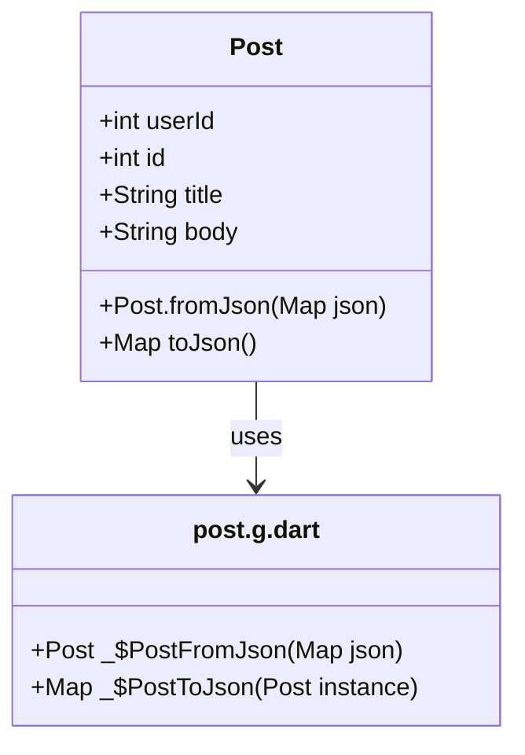

## 9.1.2 Parsing JSON Data

In the modern landscape of mobile app development, interacting with web services is a common requirement. JSON (JavaScript Object Notation) is a lightweight data-interchange format that is easy for humans to read and write, and easy for machines to parse and generate. In this section, we'll delve into the intricacies of parsing JSON data in Flutter, transforming it into Dart objects that your application can utilize effectively. We'll explore both manual parsing techniques and automated methods using code generation tools like `json_serializable`.

### Understanding JSON

JSON is a text-based data format that is widely used for transmitting data in web applications. It is language-independent, making it a popular choice for APIs. JSON represents data as key-value pairs and supports arrays and nested objects, which allows for complex data structures.

#### JSON Structure

- **Key-Value Pairs:** JSON data is organized in key-value pairs, where the key is a string and the value can be a string, number, boolean, array, or another JSON object.
- **Arrays:** JSON arrays are ordered lists of values, which can be of any type, including other arrays and objects.
- **Nested Objects:** JSON objects can contain other objects, allowing for hierarchical data structures.

Here is an example of a JSON object representing a blog post:

```json
{
  "userId": 1,
  "id": 1,
  "title": "Introduction to JSON",
  "body": "JSON is a lightweight data-interchange format."
}
```

### Converting JSON to Dart Objects

To work with JSON data in Flutter, you need to convert it into Dart objects. This can be done manually or through code generation.

#### Manual Parsing

Manual parsing involves using Dart's `dart:convert` library to decode JSON strings into Dart maps and then mapping these to Dart objects.

**Code Example:**

```dart
import 'dart:convert';

class Post {
  final int userId;
  final int id;
  final String title;
  final String body;

  Post({required this.userId, required this.id, required this.title, required this.body});

  factory Post.fromJson(Map<String, dynamic> json) {
    return Post(
      userId: json['userId'],
      id: json['id'],
      title: json['title'],
      body: json['body'],
    );
  }
}

// Usage
Future<void> fetchPost() async {
  final response = await http.get(Uri.parse('https://jsonplaceholder.typicode.com/posts/1'));

  if (response.statusCode == 200) {
    final post = Post.fromJson(json.decode(response.body));
    // Use post object
  }
}
```

**Explanation:**

- **Dart Class Definition:** Define a Dart class (`Post`) that mirrors the structure of the JSON data.
- **Factory Constructor:** Implement a `fromJson` factory constructor that takes a map and returns an instance of the class.
- **Decoding JSON:** Use `json.decode` to convert the JSON string into a map, which is then passed to the `fromJson` constructor.

#### Using Code Generation with `json_serializable`

Code generation tools like `json_serializable` automate the process of JSON parsing, reducing boilerplate code and minimizing errors.

##### Introduction

`json_serializable` is a package that generates code for converting JSON to Dart objects and vice versa. It simplifies the process and ensures consistency across your codebase.

##### Setup

To use `json_serializable`, you need to add it to your project dependencies.

**Add to `pubspec.yaml`:**

```yaml
dependencies:
  json_annotation: ^4.8.0

dev_dependencies:
  build_runner: ^2.3.3
  json_serializable: ^6.6.1
```

**Import Annotations:**

In your Dart files, import the necessary annotations and specify the generated part file.

```dart
import 'package:json_annotation/json_annotation.dart';

part 'post.g.dart'; // Generated file
```

##### Annotating Classes

Annotate your Dart classes with `@JsonSerializable()` to enable code generation.

**Code Example:**

```dart
import 'package:json_annotation/json_annotation.dart';

part 'post.g.dart';

@JsonSerializable()
class Post {
  final int userId;
  final int id;
  final String title;
  final String body;

  Post({required this.userId, required this.id, required this.title, required this.body});

  factory Post.fromJson(Map<String, dynamic> json) => _$PostFromJson(json);
  Map<String, dynamic> toJson() => _$PostToJson(this);
}
```

##### Generating Code

Run the build runner to generate the serialization code.

```bash
flutter pub run build_runner build
```

##### Usage

Use the generated methods to convert between JSON and Dart objects.

**Code Example:**

```dart
Future<void> fetchPost() async {
  final response = await http.get(Uri.parse('https://jsonplaceholder.typicode.com/posts/1'));

  if (response.statusCode == 200) {
    final post = Post.fromJson(json.decode(response.body));
    // Use post object
  }
}
```

##### Advantages of Code Generation

- **Less Boilerplate:** Reduces the amount of manual coding required for JSON parsing.
- **Maintainability:** Automatically updates serialization code when Dart classes change.
- **Error Reduction:** Minimizes the risk of human errors in parsing logic.

##### Mermaid.js Diagrams

To visualize the relationship between your Dart class and the generated code, consider the following class diagram:



##### Best Practices

- **Consistent Naming:** Ensure JSON keys match Dart class property names or use annotations to map them correctly.
- **Immutable Classes:** Favor immutable Dart classes to maintain data integrity.
- **Handle Nullable Fields:** Use nullable types (`int?`, `String?`) for JSON fields that may not always be present.

##### Common Pitfalls

- **Mismatched Keys:** Failing to map JSON keys correctly can lead to parsing errors.
- **Omitting Generated Files:** Forgetting to include the `part` directive or running the build runner can prevent code generation from working.

##### Implementation Guidance

- **Use `json_serializable` for Larger Projects:** Streamline JSON parsing in complex applications.
- **Organize Data Models:** Place data models in dedicated directories for better project structure.

### Conclusion

Parsing JSON data is a fundamental skill in Flutter development, enabling seamless interaction with web services. Whether you choose manual parsing or leverage code generation tools like `json_serializable`, understanding the underlying principles and best practices will enhance your ability to build robust, data-driven applications.

### Further Reading and Resources

- [Flutter JSON and Serialization Documentation](https://flutter.dev/docs/development/data-and-backend/json)
- [Dart `dart:convert` Library](https://api.dart.dev/stable/dart-convert/dart-convert-library.html)
- [json_serializable Package on Pub.dev](https://pub.dev/packages/json_serializable)

By mastering JSON parsing, you can unlock the full potential of your Flutter applications, creating dynamic and responsive user experiences.

## Quiz Time!



### What is JSON primarily used for in web applications?

- [x] Data interchange
- [ ] Styling web pages
- [ ] Database management
- [ ] Server configuration

> **Explanation:** JSON (JavaScript Object Notation) is primarily used for data interchange between a server and a client in web applications.

### Which Dart library is used for decoding JSON strings?

- [x] dart:convert
- [ ] dart:io
- [ ] dart:async
- [ ] dart:core

> **Explanation:** The `dart:convert` library is used in Dart for decoding JSON strings into Dart objects.

### What is the purpose of the `fromJson` factory constructor in a Dart class?

- [x] To create an instance of the class from a JSON map
- [ ] To convert a Dart object to a JSON string
- [ ] To initialize a class with default values
- [ ] To handle asynchronous operations

> **Explanation:** The `fromJson` factory constructor is used to create an instance of a Dart class from a JSON map.

### Which package is used for code generation of JSON serialization in Flutter?

- [x] json_serializable
- [ ] http
- [ ] provider
- [ ] rxdart

> **Explanation:** The `json_serializable` package is used for code generation of JSON serialization in Flutter.

### What command is used to generate serialization code with `json_serializable`?

- [x] flutter pub run build_runner build
- [ ] flutter build apk
- [ ] flutter pub get
- [ ] flutter run

> **Explanation:** The command `flutter pub run build_runner build` is used to generate serialization code with `json_serializable`.

### What is a key advantage of using `json_serializable`?

- [x] Reduces boilerplate code
- [ ] Increases manual coding
- [ ] Requires no setup
- [ ] Eliminates the need for Dart classes

> **Explanation:** A key advantage of using `json_serializable` is that it reduces boilerplate code by automating the generation of JSON serialization logic.

### What is a common pitfall when using `json_serializable`?

- [x] Forgetting to run the build runner
- [ ] Writing too much manual code
- [ ] Using too many dependencies
- [ ] Ignoring JSON structure

> **Explanation:** A common pitfall when using `json_serializable` is forgetting to run the build runner, which is necessary to generate the serialization code.

### Which of the following is a best practice when parsing JSON in Dart?

- [x] Use immutable classes
- [ ] Use mutable classes
- [ ] Avoid using factory constructors
- [ ] Ignore nullable fields

> **Explanation:** Using immutable classes is a best practice when parsing JSON in Dart to maintain data integrity.

### What does the `part` directive do in a Dart file using `json_serializable`?

- [x] Includes the generated serialization code
- [ ] Splits the file into multiple parts
- [ ] Imports external libraries
- [ ] Defines a new Dart class

> **Explanation:** The `part` directive in a Dart file using `json_serializable` includes the generated serialization code.

### True or False: JSON can only represent simple key-value pairs and cannot handle nested structures.

- [ ] True
- [x] False

> **Explanation:** False. JSON can represent complex data structures, including nested objects and arrays.


