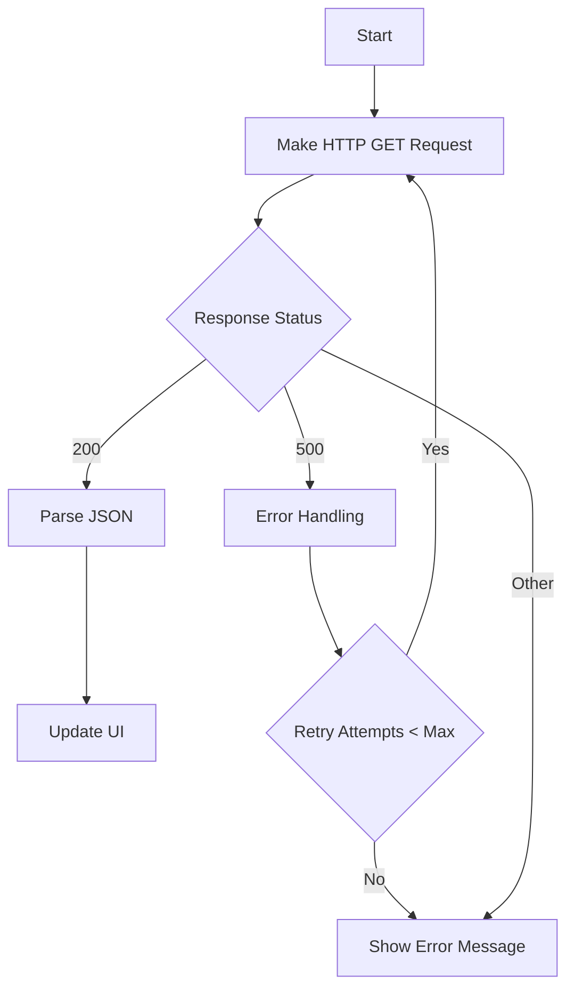

## 9.1.3 Error Handling and Retry Strategies in Flutter API Fetching

In the realm of mobile app development, fetching data from APIs is a fundamental operation. However, this process is fraught with potential errors, ranging from network connectivity issues to server-side failures. To ensure a seamless user experience, it is crucial to implement robust error handling and retry strategies. This section delves into these concepts, providing practical guidance and code examples to help you build resilient Flutter applications.

### Importance of Robust Error Handling

Error handling is not just about catching exceptions; it's about ensuring that your application remains stable and provides a graceful user experience even when things go wrong. Here are some key reasons why robust error handling is essential:

- **Application Stability:** Proper error handling prevents crashes and ensures that your app continues to function, even if some features are temporarily unavailable.
- **User Experience:** By gracefully handling errors, you can inform users about issues without overwhelming them with technical details, maintaining their trust in your application.
- **Debugging and Maintenance:** Well-implemented error handling makes it easier to diagnose and fix issues, as it provides clear insights into what went wrong.

#### Types of Errors in Data Fetching

When fetching data from APIs, you may encounter several types of errors:

- **Network Issues:** These include connectivity problems, timeouts, and DNS failures.
- **Server Errors:** These occur when the server returns an error status code (e.g., 500 Internal Server Error).
- **Parsing Failures:** These happen when the response data is malformed or unexpected, leading to JSON parsing errors.

### Implementing Try-Catch Blocks

The `try-catch` block is a fundamental construct in Dart for handling exceptions. It allows you to capture errors during asynchronous operations, such as HTTP requests, and handle them gracefully.

#### Code Example

```dart
import 'dart:convert';
import 'package:http/http.dart' as http;

Future<void> fetchPost() async {
  try {
    final response = await http.get(Uri.parse('https://jsonplaceholder.typicode.com/posts/1'));

    if (response.statusCode == 200) {
      final post = Post.fromJson(json.decode(response.body));
      // Use post object
    } else {
      // Handle non-200 status codes
      throw Exception('Failed to load post: ${response.statusCode}');
    }
  } catch (e) {
    // Handle errors like network issues or JSON parsing errors
    print('Error fetching post: $e');
    // Optionally, update UI to inform the user
  }
}
```

#### Explanation

- **Try Block:** The `try` block contains code that might throw an exception. In this case, it's the HTTP GET request.
- **Catch Block:** The `catch` block handles any exceptions thrown in the `try` block. Here, it logs the error and could update the UI to inform the user.
- **Status Code Check:** Before parsing the response, we check the status code to ensure it's 200 (OK). If not, we throw an exception with a descriptive message.

### Retry Mechanisms

Retry mechanisms are essential for handling transient errors, such as network timeouts or temporary server unavailability. By implementing retries, you can increase the likelihood of a successful request without user intervention.

#### Purpose of Retries

- **Transient Error Recovery:** Retries help recover from temporary issues that might resolve themselves, such as network fluctuations.
- **Improved User Experience:** By automatically retrying failed requests, you can reduce the number of error messages shown to users.

#### Strategies for Implementing Retries

- **Exponential Backoff:** Gradually increase the wait time between retries to avoid overwhelming the server and to give it time to recover.
- **Maximum Retry Attempts:** Limit the number of retries to prevent infinite loops and excessive resource consumption.

#### Code Example with Retry

```dart
import 'dart:convert';
import 'package:flutter/material.dart';
import 'package:http/http.dart' as http;

class DataFetcherWithRetry extends StatefulWidget {
  @override
  _DataFetcherWithRetryState createState() => _DataFetcherWithRetryState();
}

class _DataFetcherWithRetryState extends State<DataFetcherWithRetry> {
  String data = 'Loading...';
  int retryCount = 0;
  final int maxRetries = 3;

  @override
  void initState() {
    super.initState();
    fetchData();
  }

  Future<void> fetchData() async {
    while (retryCount < maxRetries) {
      try {
        final response = await http.get(Uri.parse('https://jsonplaceholder.typicode.com/posts/1'));

        if (response.statusCode == 200) {
          setState(() {
            data = json.decode(response.body)['title'];
          });
          break; // Exit loop on success
        } else {
          throw Exception('Failed to load data: ${response.statusCode}');
        }
      } catch (e) {
        retryCount++;
        if (retryCount >= maxRetries) {
          setState(() {
            data = 'Failed to load data after $maxRetries attempts.';
          });
        } else {
          // Wait before retrying (exponential backoff)
          await Future.delayed(Duration(seconds: 2 ^ retryCount));
        }
      }
    }
  }

  @override
  Widget build(BuildContext context) {
    return Scaffold(
      appBar: AppBar(title: Text('Fetch Data with Retry')),
      body: Center(child: Text(data)),
    );
  }
}
```

#### Explanation

- **Retry Loop:** The `while` loop continues until the maximum number of retries is reached or the request succeeds.
- **Exponential Backoff:** The delay between retries increases exponentially (`2 ^ retryCount`), reducing the load on the server.
- **UI Update:** The UI is updated to reflect the current state, whether it's loading, successful, or failed after maximum attempts.

### Using Packages for Advanced Error Handling

For more advanced error handling and retry logic, you can leverage third-party packages like `retry`. This package simplifies the implementation of retry strategies with customizable options.

#### `retry` Package

The `retry` package provides a flexible and easy-to-use API for implementing retry logic. It supports various retry strategies, including exponential backoff.

##### Installation

Add the `retry` package to your `pubspec.yaml`:

```yaml
dependencies:
  retry: ^3.0.1
```

##### Code Example

```dart
import 'dart:convert';
import 'package:flutter/material.dart';
import 'package:http/http.dart' as http;
import 'package:retry/retry.dart';

class DataFetcherWithRetryPackage extends StatefulWidget {
  @override
  _DataFetcherWithRetryPackageState createState() => _DataFetcherWithRetryPackageState();
}

class _DataFetcherWithRetryPackageState extends State<DataFetcherWithRetryPackage> {
  String data = 'Loading...';

  @override
  void initState() {
    super.initState();
    fetchData();
  }

  Future<void> fetchData() async {
    final r = RetryOptions(maxAttempts: 3);

    try {
      final response = await r.retry(
        () => http.get(Uri.parse('https://jsonplaceholder.typicode.com/posts/1')).timeout(Duration(seconds: 2)),
        retryIf: (e) => e is http.ClientException || e is TimeoutException,
      );

      if (response.statusCode == 200) {
        setState(() {
          data = json.decode(response.body)['title'];
        });
      } else {
        setState(() {
          data = 'Failed to load data: ${response.statusCode}';
        });
      }
    } catch (e) {
      setState(() {
        data = 'An error occurred: $e';
      });
    }
  }

  @override
  Widget build(BuildContext context) {
    return Scaffold(
      appBar: AppBar(title: Text('Fetch Data with Retry Package')),
      body: Center(child: Text(data)),
    );
  }
}
```

#### Explanation

- **RetryOptions:** Configures the retry behavior, including the maximum number of attempts.
- **Retry Logic:** The `retry` method automatically retries the request if the specified conditions are met (e.g., `http.ClientException` or `TimeoutException`).
- **Simplified Code:** The `retry` package abstracts the complexity of implementing retry logic, making the code cleaner and more maintainable.

### Mermaid.js Diagrams

To better understand the flow of error handling and retries, let's visualize the process using a Mermaid.js flowchart.

```markdown

```

#### Diagram Explanation

- **Start:** The process begins with making an HTTP GET request.
- **Response Status Check:** Depending on the response status, the flow branches into different paths.
- **Success Path:** If the status is 200, the JSON is parsed, and the UI is updated.
- **Error Handling:** For server errors (e.g., 500), error handling logic is executed.
- **Retry Logic:** If the retry attempts are less than the maximum, the request is retried.
- **Failure Path:** If the maximum retries are reached or an unhandled status is encountered, an error message is shown.

### Best Practices

Implementing error handling and retries effectively requires adhering to best practices:

- **Graceful Degradation:** Ensure the app remains functional even when data fetching fails by providing fallback content or offline modes.
- **User Feedback:** Inform users of loading states, errors, and retry attempts through UI indicators like progress bars and error messages.
- **Logging:** Implement logging for errors and failed requests to aid in debugging and monitoring application health.

### Common Pitfalls

Avoid these common pitfalls when implementing error handling and retries:

- **Ignoring Edge Cases:** Failing to handle all possible error scenarios can lead to unhandled exceptions and crashes.
- **Overcomplicating Retry Logic:** Implementing overly complex retry mechanisms can make the code hard to maintain and debug.

### Implementation Guidance

- **Critical Thinking:** Encourage readers to think critically about which errors are recoverable and which require user intervention.
- **Testing:** Recommend testing error handling and retry logic extensively to ensure reliability.

By following these guidelines and leveraging the provided code examples, you can implement robust error handling and retry strategies in your Flutter applications, enhancing their stability and user experience.

## Quiz Time!



### What is the primary purpose of error handling in Flutter applications?

- [x] To ensure application stability and provide a graceful user experience during failures.
- [ ] To increase the app's performance.
- [ ] To enhance the app's visual appearance.
- [ ] To reduce the app's size.

> **Explanation:** Error handling ensures that the application remains stable and provides a graceful user experience even when errors occur.

### Which type of error occurs when the server returns a non-200 status code?

- [ ] Network Issue
- [x] Server Error
- [ ] Parsing Failure
- [ ] Syntax Error

> **Explanation:** Server errors occur when the server returns a non-200 status code, indicating an issue on the server side.

### What is the purpose of using a try-catch block in Dart?

- [x] To capture and handle exceptions during asynchronous operations.
- [ ] To improve the app's performance.
- [ ] To enhance the app's UI design.
- [ ] To reduce the app's memory usage.

> **Explanation:** A try-catch block is used to capture and handle exceptions that occur during asynchronous operations, such as HTTP requests.

### What is exponential backoff in retry strategies?

- [x] Gradually increasing the wait time between retries to avoid overwhelming the server.
- [ ] Decreasing the wait time between retries to speed up the process.
- [ ] Keeping the wait time constant between retries.
- [ ] Randomizing the wait time between retries.

> **Explanation:** Exponential backoff involves gradually increasing the wait time between retries to prevent overwhelming the server and allow it time to recover.

### How does the `retry` package simplify retry logic?

- [x] By providing a flexible and easy-to-use API for implementing retry strategies.
- [ ] By reducing the app's memory usage.
- [ ] By enhancing the app's visual appearance.
- [ ] By increasing the app's performance.

> **Explanation:** The `retry` package provides a flexible and easy-to-use API for implementing retry strategies, simplifying the code and making it more maintainable.

### What should you do if the maximum number of retries is reached without success?

- [x] Show an error message to the user.
- [ ] Retry indefinitely.
- [ ] Ignore the error and continue.
- [ ] Restart the application.

> **Explanation:** If the maximum number of retries is reached without success, you should show an error message to the user to inform them of the issue.

### Why is logging important in error handling?

- [x] It aids in debugging and monitoring application health.
- [ ] It improves the app's performance.
- [ ] It enhances the app's visual appearance.
- [ ] It reduces the app's size.

> **Explanation:** Logging is important because it aids in debugging and monitoring application health by providing insights into what went wrong.

### What is a common pitfall when implementing retry logic?

- [x] Overcomplicating the retry mechanism, making the code hard to maintain and debug.
- [ ] Not using enough retries.
- [ ] Using too many retries.
- [ ] Ignoring successful requests.

> **Explanation:** A common pitfall is overcomplicating the retry mechanism, which can make the code hard to maintain and debug.

### How can you inform users of loading states and errors?

- [x] Through UI indicators like progress bars and error messages.
- [ ] By reducing the app's size.
- [ ] By enhancing the app's visual appearance.
- [ ] By increasing the app's performance.

> **Explanation:** Informing users of loading states and errors can be done through UI indicators like progress bars and error messages, improving the user experience.

### True or False: Exponential backoff decreases the wait time between retries.

- [ ] True
- [x] False

> **Explanation:** False. Exponential backoff increases the wait time between retries to prevent overwhelming the server and allow it time to recover.


