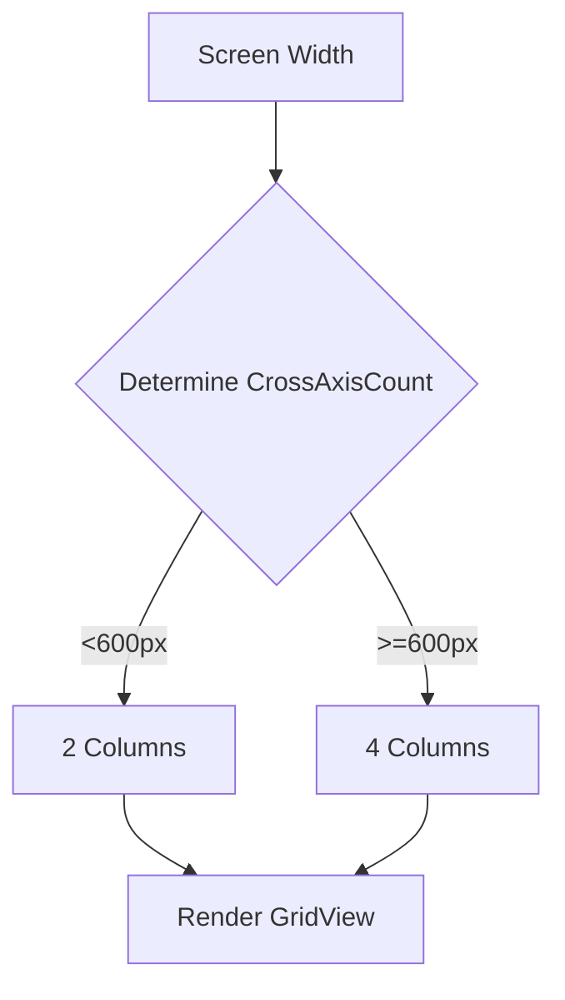

## 9.1.4 Displaying Data Responsively

In the world of mobile app development, presenting data in a way that is both clear and adaptable across various devices is crucial. As users interact with applications on different screen sizes, from compact smartphones to expansive tablets, ensuring that data remains readable and accessible becomes a key aspect of user experience design. In this section, we will delve into the importance of responsive data display, explore techniques for implementing it in Flutter, and provide practical guidance for optimizing data presentation.

### Importance of Responsive Data Display

Responsive data display is essential for maintaining clarity and usability across a wide range of devices. Here’s why it matters:

- **Clarity and Usability:** Responsive design ensures that data is presented in a clear and organized manner, regardless of the device being used. This enhances the user experience by making information easy to read and interact with.
- **Accessibility:** By adapting layouts to different screen sizes, responsive design helps maintain accessibility, ensuring that all users, including those with disabilities, can access and understand the data.
- **Consistency:** A responsive approach provides a consistent user experience across devices, which is crucial for brand integrity and user satisfaction.

### Techniques for Responsive Data Presentation

To effectively display data responsively in Flutter, consider the following techniques:

#### Dynamic Layouts

Dynamic layouts are essential for organizing data efficiently. Flutter provides several widgets that facilitate responsive design:

- **`ListView`:** Ideal for displaying a scrollable list of items. It can be customized with various properties to adapt to different screen sizes.
- **`GridView`:** Useful for displaying data in a grid format, which can be adjusted based on the screen width.
- **`Table`:** Suitable for tabular data, allowing for flexible column arrangements.

#### Adaptive Widgets

Adaptive widgets help tailor data displays to the specific characteristics of the device:

- **`ResponsiveGrid`:** A custom widget that adjusts the number of columns based on screen size.
- **Conditional Rendering:** Use `MediaQuery` to conditionally render different widgets or layouts based on the device's dimensions.

#### Pagination and Lazy Loading

Handling large data sets efficiently is crucial for performance and usability:

- **Pagination:** Break down data into manageable chunks, loading more data as the user scrolls.
- **Lazy Loading:** Load data incrementally, reducing initial load times and improving performance.

### Implementing Responsive Data Displays

Let's explore how to implement responsive data displays using practical examples.

#### Using `ListView.builder`

`ListView.builder` is a powerful tool for creating efficient, scrollable lists. It only builds the visible items, which is ideal for large data sets.

```dart
import 'package:flutter/material.dart';

class ResponsiveListView extends StatelessWidget {
  final List<String> items;

  ResponsiveListView({required this.items});

  @override
  Widget build(BuildContext context) {
    return ListView.builder(
      itemCount: items.length,
      itemBuilder: (context, index) {
        return ListTile(
          title: Text(items[index]),
        );
      },
    );
  }
}
```

#### Implementing `GridView.builder`

`GridView.builder` is perfect for displaying data in a grid format. It adapts the number of columns based on the screen width.

```dart
import 'dart:convert';
import 'package:flutter/material.dart';
import 'package:http/http.dart' as http;

class ResponsiveGridView extends StatefulWidget {
  @override
  _ResponsiveGridViewState createState() => _ResponsiveGridViewState();
}

class _ResponsiveGridViewState extends State<ResponsiveGridView> {
  List<Post> posts = [];

  @override
  void initState() {
    super.initState();
    fetchPosts();
  }

  Future<void> fetchPosts() async {
    final response = await http.get(Uri.parse('https://jsonplaceholder.typicode.com/posts'));

    if (response.statusCode == 200) {
      List jsonResponse = json.decode(response.body);
      setState(() {
        posts = jsonResponse.map((post) => Post.fromJson(post)).toList();
      });
    } else {
      throw Exception('Failed to load posts');
    }
  }

  @override
  Widget build(BuildContext context) {
    double screenWidth = MediaQuery.of(context).size.width;
    int crossAxisCount = screenWidth < 600 ? 2 : 4;

    return Scaffold(
      appBar: AppBar(title: Text('Responsive GridView')),
      body: GridView.builder(
        gridDelegate: SliverGridDelegateWithFixedCrossAxisCount(
          crossAxisCount: crossAxisCount,
          mainAxisSpacing: 10,
          crossAxisSpacing: 10,
          childAspectRatio: 3 / 2,
        ),
        itemCount: posts.length,
        itemBuilder: (context, index) {
          return Card(
            child: Padding(
              padding: EdgeInsets.all(8.0),
              child: Column(
                crossAxisAlignment: CrossAxisAlignment.start,
                children: [
                  Text(
                    posts[index].title,
                    style: TextStyle(fontWeight: FontWeight.bold),
                    maxLines: 2,
                    overflow: TextOverflow.ellipsis,
                  ),
                  SizedBox(height: 5),
                  Text(
                    posts[index].body,
                    maxLines: 3,
                    overflow: TextOverflow.ellipsis,
                  ),
                ],
              ),
            ),
          );
        },
      ),
    );
  }
}

class Post {
  final int userId;
  final int id;
  final String title;
  final String body;

  Post({required this.userId, required this.id, required this.title, required this.body});

  factory Post.fromJson(Map<String, dynamic> json) {
    return Post(
      userId: json['userId'],
      id: json['id'],
      title: json['title'],
      body: json['body'],
    );
  }
}
```

**Explanation:**

- **Dynamic Columns:** The number of columns in the `GridView` is determined by the screen width, using `MediaQuery` to adjust `crossAxisCount`.
- **Responsive Design:** This approach ensures that the grid adapts to different devices, providing a consistent user experience.

### Optimizing Data Display

To further enhance the performance and user experience of your data displays, consider these optimization techniques:

#### Lazy Loading

Lazy loading is a technique where data is loaded as needed, rather than all at once. This is particularly useful for large data sets.

```dart
ListView.builder(
  itemCount: items.length,
  itemBuilder: (context, index) {
    if (index >= items.length - 1) {
      // Trigger loading more data
      loadMoreData();
    }
    return ListTile(title: Text(items[index]));
  },
)
```

#### Caching Data

Caching reduces redundant network requests and speeds up data access by storing fetched data locally.

```dart
import 'package:shared_preferences/shared_preferences.dart';

Future<void> cacheData(String key, String data) async {
  SharedPreferences prefs = await SharedPreferences.getInstance();
  prefs.setString(key, data);
}

Future<String?> getCachedData(String key) async {
  SharedPreferences prefs = await SharedPreferences.getInstance();
  return prefs.getString(key);
}
```

#### Using Placeholders

Placeholders provide visual feedback while data is loading, enhancing perceived performance.

```dart
ListView.builder(
  itemCount: items.length,
  itemBuilder: (context, index) {
    return items[index] != null
        ? ListTile(title: Text(items[index]))
        : Shimmer.fromColors(
            baseColor: Colors.grey[300]!,
            highlightColor: Colors.grey[100]!,
            child: ListTile(title: Container(color: Colors.white, height: 20)),
          );
  },
)
```

### Mermaid.js Diagrams

To visualize the responsive layout process, consider the following Mermaid.js diagram:

```markdown

```

### Best Practices

- **Consistent Spacing:** Maintain uniform spacing between data items to ensure a clean and organized layout.
- **Readable Typography:** Use readable font sizes and styles to enhance data readability across different devices.
- **Optimized Images:** Ensure that images within data items are optimized for various screen sizes to prevent pixelation or excessive loading times.

### Common Pitfalls

- **Overcrowding:** Avoid displaying too many data items on smaller screens, which can lead to a cluttered and unreadable interface.
- **Ignoring Accessibility:** Ensure that data displays are accessible, with sufficient contrast and support for screen readers.

### Implementation Guidance

- **Responsive Design Principles:** Encourage the use of responsive design principles to adapt data presentation seamlessly across devices.
- **Testing:** Recommend testing data displays on multiple screen sizes and orientations to ensure consistency and usability.

By following these techniques and best practices, you can create responsive and adaptive data displays in Flutter that enhance the user experience across a wide range of devices.

## Quiz Time!



### What is the primary benefit of responsive data display in mobile applications?

- [x] Ensures clarity and usability across various devices
- [ ] Reduces the need for data fetching
- [ ] Increases the complexity of the code
- [ ] Limits the application to specific devices

> **Explanation:** Responsive data display ensures that the information is presented clearly and is usable across different devices, enhancing the overall user experience.

### Which Flutter widget is ideal for displaying a scrollable list of items?

- [x] ListView
- [ ] GridView
- [ ] Table
- [ ] Stack

> **Explanation:** `ListView` is designed for displaying a scrollable list of items, making it ideal for lists in Flutter applications.

### How can you adjust the number of columns in a `GridView` based on screen width?

- [x] Use `MediaQuery` to determine the screen width and set `crossAxisCount` accordingly
- [ ] Use a fixed number of columns
- [ ] Adjust columns based on user input
- [ ] Set columns using a random number generator

> **Explanation:** `MediaQuery` allows you to access the screen's dimensions, enabling dynamic adjustment of `crossAxisCount` in a `GridView`.

### What technique can be used to handle large data sets efficiently in a Flutter app?

- [x] Lazy Loading
- [ ] Hardcoding data
- [ ] Using a single large widget
- [ ] Ignoring performance considerations

> **Explanation:** Lazy loading loads data incrementally as needed, improving performance and user experience with large data sets.

### What is a common pitfall when displaying data on smaller screens?

- [x] Overcrowding the interface
- [ ] Using too few widgets
- [ ] Not using enough colors
- [ ] Overusing animations

> **Explanation:** Overcrowding the interface with too much data can lead to a cluttered and unreadable display on smaller screens.

### Which of the following is a benefit of using placeholders in data displays?

- [x] Enhances perceived performance by providing visual feedback
- [ ] Increases data fetching speed
- [ ] Reduces the need for caching
- [ ] Eliminates the need for responsive design

> **Explanation:** Placeholders provide visual feedback while data is loading, improving the perceived performance of the application.

### What is the purpose of caching data in a Flutter application?

- [x] To reduce redundant network requests and speed up data access
- [ ] To increase the size of the application
- [ ] To make the application dependent on the internet
- [ ] To slow down data retrieval

> **Explanation:** Caching stores data locally, reducing the need for repeated network requests and speeding up data access.

### How can you ensure that data displays are accessible?

- [x] Use sufficient contrast and support for screen readers
- [ ] Use as many colors as possible
- [ ] Avoid using text
- [ ] Limit the application to specific devices

> **Explanation:** Ensuring sufficient contrast and supporting screen readers helps make data displays accessible to all users.

### What is the role of `MediaQuery` in responsive design?

- [x] It provides information about the device's screen dimensions
- [ ] It fetches data from the internet
- [ ] It stores user preferences
- [ ] It manages application state

> **Explanation:** `MediaQuery` provides information about the device's screen dimensions, which is crucial for implementing responsive design.

### True or False: Responsive data display is only important for mobile applications.

- [ ] True
- [x] False

> **Explanation:** Responsive data display is important for all types of applications, including web and desktop, to ensure usability across different devices.


