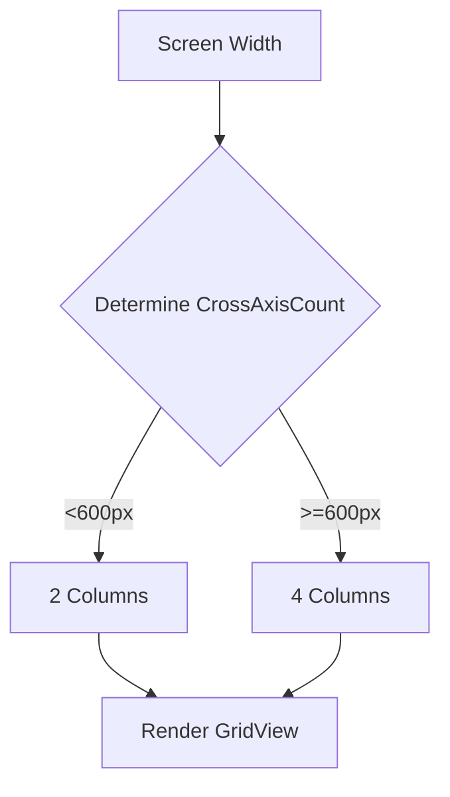

## 9.1.6 Displaying Data Responsively

In the realm of mobile and web development, the ability to present data in a manner that is both visually appealing and functionally adaptive across a myriad of devices is paramount. This section delves into the intricacies of displaying data responsively in Flutter applications, emphasizing techniques that ensure your data is accessible, readable, and engaging on any screen size or orientation.

### Importance of Responsive Data Display

Responsive data display is not merely a trend but a necessity in today's diverse device ecosystem. With users accessing applications on devices ranging from small smartphones to large desktop monitors, ensuring that your data presentation adapts seamlessly is crucial for maintaining a positive user experience.

- **Enhanced User Experience:** Responsive data displays ensure that content is not only accessible but also aesthetically pleasing, regardless of the device. This adaptability enhances user satisfaction and engagement.
- **Accessibility and Readability:** By optimizing data presentation for various screen sizes, you ensure that users can easily read and interact with your content, reducing frustration and improving usability.
- **Competitive Advantage:** Applications that offer a consistent and responsive experience across devices are more likely to retain users and stand out in a crowded marketplace.

### Techniques for Responsive Data Presentation

To achieve responsive data displays in Flutter, several techniques and widgets can be employed:

#### Dynamic Layouts

Dynamic layouts are essential for organizing data efficiently. Flutter provides several widgets that facilitate the creation of flexible and adaptive layouts:

- **ListView:** Ideal for displaying a scrollable list of items, `ListView` can be customized to fit the available space dynamically.
- **GridView:** Perfect for presenting data in a grid format, `GridView` allows you to adjust the number of columns based on the screen width, ensuring optimal use of space.
- **Table:** Useful for displaying tabular data, `Table` can be configured to adapt to different screen sizes by adjusting column widths and row heights.

#### Adaptive Widgets

Adaptive widgets adjust their appearance and behavior based on the device's characteristics:

- **ResponsiveGrid:** A custom widget that dynamically adjusts the grid layout based on screen size, providing a consistent experience across devices.
- **Conditional Rendering:** Use conditional logic to render different widgets or layouts based on the screen size or orientation, ensuring that your data is always presented in the most suitable format.

#### Pagination and Lazy Loading

Handling large data sets efficiently is crucial for maintaining performance and usability:

- **Pagination:** Divide data into pages and load them incrementally as the user navigates through the content, reducing initial load times and memory usage.
- **Lazy Loading:** Load data items as they become visible on the screen, minimizing resource consumption and improving performance.

### Implementing Responsive Data Displays

Let's explore how to implement responsive data displays using Flutter's powerful widget system.

#### Using `ListView.builder`

`ListView.builder` is an efficient way to build a scrollable list of data items. It constructs items on demand, which is ideal for large data sets.

```dart
import 'package:flutter/material.dart';

class ResponsiveListView extends StatelessWidget {
  final List<String> items;

  ResponsiveListView({required this.items});

  @override
  Widget build(BuildContext context) {
    return ListView.builder(
      itemCount: items.length,
      itemBuilder: (context, index) {
        return ListTile(
          title: Text(items[index]),
        );
      },
    );
  }
}
```

#### Implementing `GridView.builder`

`GridView.builder` is used to display data in a grid format. It allows you to adjust the number of columns based on the screen width, providing a responsive layout.

```dart
import 'dart:convert';
import 'package:flutter/material.dart';
import 'package:http/http.dart' as http;

class ResponsiveGridView extends StatefulWidget {
  @override
  _ResponsiveGridViewState createState() => _ResponsiveGridViewState();
}

class _ResponsiveGridViewState extends State<ResponsiveGridView> {
  List<Post> posts = [];

  @override
  void initState() {
    super.initState();
    fetchPosts();
  }

  Future<void> fetchPosts() async {
    final response = await http.get(Uri.parse('https://jsonplaceholder.typicode.com/posts'));

    if (response.statusCode == 200) {
      List jsonResponse = json.decode(response.body);
      setState(() {
        posts = jsonResponse.map((post) => Post.fromJson(post)).toList();
      });
    } else {
      throw Exception('Failed to load posts');
    }
  }

  @override
  Widget build(BuildContext context) {
    double screenWidth = MediaQuery.of(context).size.width;
    int crossAxisCount = screenWidth < 600 ? 2 : 4;

    return Scaffold(
      appBar: AppBar(title: Text('Responsive GridView')),
      body: GridView.builder(
        gridDelegate: SliverGridDelegateWithFixedCrossAxisCount(
          crossAxisCount: crossAxisCount,
          mainAxisSpacing: 10,
          crossAxisSpacing: 10,
          childAspectRatio: 3 / 2,
        ),
        itemCount: posts.length,
        itemBuilder: (context, index) {
          return Card(
            child: Padding(
              padding: EdgeInsets.all(8.0),
              child: Column(
                crossAxisAlignment: CrossAxisAlignment.start,
                children: [
                  Text(
                    posts[index].title,
                    style: TextStyle(fontWeight: FontWeight.bold),
                    maxLines: 2,
                    overflow: TextOverflow.ellipsis,
                  ),
                  SizedBox(height: 5),
                  Text(
                    posts[index].body,
                    maxLines: 3,
                    overflow: TextOverflow.ellipsis,
                  ),
                ],
              ),
            ),
          );
        },
      ),
    );
  }
}

class Post {
  final int userId;
  final int id;
  final String title;
  final String body;

  Post({required this.userId, required this.id, required this.title, required this.body});

  factory Post.fromJson(Map<String, dynamic> json) {
    return Post(
      userId: json['userId'],
      id: json['id'],
      title: json['title'],
      body: json['body'],
    );
  }
}
```

**Explanation:**

- **MediaQuery:** The `MediaQuery` widget is used to determine the screen width and adjust the number of columns in the grid accordingly.
- **Responsive GridView:** The `GridView.builder` dynamically adjusts the layout based on the screen size, ensuring that the data is displayed optimally on all devices.

### Optimizing Data Display

To further enhance the performance and user experience of your data displays, consider the following optimizations:

#### Lazy Loading

Lazy loading is a technique where data is loaded as needed, rather than all at once. This approach is particularly useful for large data sets, as it reduces initial load times and memory usage.

#### Caching Data

Caching mechanisms can be employed to store fetched data locally, reducing redundant network requests and speeding up data access. This is especially beneficial for applications that frequently access the same data.

#### Using Placeholders

Displaying placeholders while data is loading can enhance perceived performance and provide visual feedback to users. This technique keeps users engaged and informed about the loading process.

### Mermaid.js Diagrams

To visualize how the grid adjusts the number of columns based on screen width, consider the following Mermaid.js flowchart:

```markdown

```

### Best Practices

- **Consistent Spacing:** Maintain uniform spacing between data items to ensure a clean and organized layout.
- **Readable Typography:** Use readable font sizes and styles to enhance data readability across different devices.
- **Optimized Images:** Ensure that images within data items are optimized for various screen sizes to prevent pixelation or excessive loading times.

### Common Pitfalls

- **Overcrowding:** Avoid displaying too many data items on smaller screens, which can lead to a cluttered and unreadable interface.
- **Ignoring Accessibility:** Ensure that data displays are accessible, with sufficient contrast and support for screen readers.

### Implementation Guidance

- **Responsive Design Principles:** Encourage the use of responsive design principles to adapt data presentation seamlessly across devices.
- **Testing:** Recommend testing data displays on multiple screen sizes and orientations to ensure consistency and usability.

By implementing these techniques and best practices, you can create responsive data displays that enhance user experience and engagement across a wide range of devices.

## Quiz Time!



### What is the primary benefit of responsive data display in applications?

- [x] Enhances user experience by ensuring data is accessible and readable on all devices
- [ ] Increases application load time
- [ ] Reduces the need for data validation
- [ ] Simplifies the development process

> **Explanation:** Responsive data display enhances user experience by ensuring that data is accessible and readable on all devices, regardless of screen size or orientation.

### Which widget is ideal for displaying a scrollable list of items in Flutter?

- [ ] GridView
- [x] ListView
- [ ] Table
- [ ] Stack

> **Explanation:** `ListView` is ideal for displaying a scrollable list of items, allowing for efficient data presentation.

### What is the purpose of using `MediaQuery` in a responsive layout?

- [ ] To fetch data from an API
- [x] To determine screen dimensions and adjust layouts accordingly
- [ ] To handle user input events
- [ ] To manage application state

> **Explanation:** `MediaQuery` is used to determine screen dimensions and adjust layouts accordingly, enabling responsive design.

### How does lazy loading improve performance in data displays?

- [x] By loading data items only as they become visible, reducing initial load times
- [ ] By preloading all data items at once
- [ ] By caching data on the server
- [ ] By increasing the number of network requests

> **Explanation:** Lazy loading improves performance by loading data items only as they become visible, reducing initial load times and memory usage.

### What is a common pitfall when displaying data on smaller screens?

- [ ] Using too much whitespace
- [x] Overcrowding the screen with too many data items
- [ ] Using large font sizes
- [ ] Implementing lazy loading

> **Explanation:** Overcrowding the screen with too many data items can lead to a cluttered and unreadable interface on smaller screens.

### Which technique can be used to store fetched data locally and reduce redundant network requests?

- [ ] Lazy loading
- [ ] Pagination
- [x] Caching
- [ ] Conditional rendering

> **Explanation:** Caching can be used to store fetched data locally, reducing redundant network requests and speeding up data access.

### What is the role of placeholders in data displays?

- [ ] To increase network requests
- [x] To provide visual feedback while data is loading
- [ ] To reduce application performance
- [ ] To simplify data parsing

> **Explanation:** Placeholders provide visual feedback while data is loading, enhancing perceived performance and keeping users informed.

### What is a benefit of using `GridView.builder` for data presentation?

- [ ] It simplifies data validation
- [ ] It reduces the need for responsive design
- [x] It allows dynamic adjustment of the number of columns based on screen width
- [ ] It increases application load time

> **Explanation:** `GridView.builder` allows dynamic adjustment of the number of columns based on screen width, providing a responsive layout.

### How can you ensure that images within data items are optimized for various screen sizes?

- [ ] By using large image files
- [ ] By ignoring image resolution
- [x] By optimizing images to prevent pixelation or excessive loading times
- [ ] By using placeholder images

> **Explanation:** Optimizing images ensures they are suitable for various screen sizes, preventing pixelation or excessive loading times.

### True or False: Responsive data displays are only necessary for mobile applications.

- [ ] True
- [x] False

> **Explanation:** Responsive data displays are necessary for all types of applications, including web and desktop, to ensure a consistent user experience across different devices.


