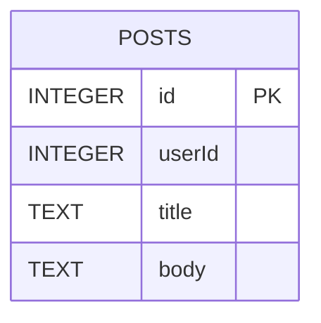
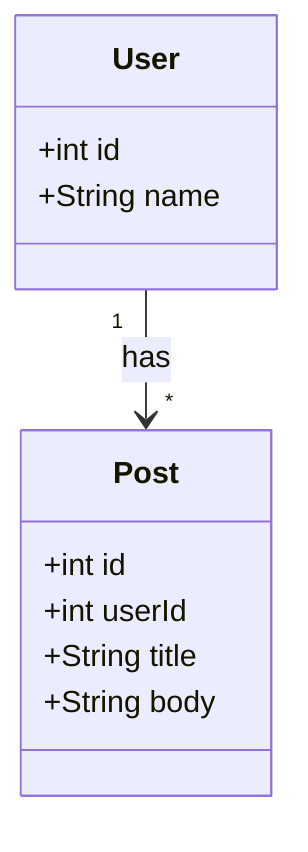

## 9.2.2 Using SQLite with `sqflite` Package

In modern mobile app development, managing local data efficiently is crucial for providing a seamless user experience. SQLite, a powerful, lightweight, and self-contained SQL database engine, is an excellent choice for mobile applications due to its ability to handle relational data management, complex queries, and transactional support. In this section, we will delve into using SQLite with the `sqflite` package in Flutter, covering everything from installation to advanced data relationships.

### Introduction to SQLite

SQLite is a C-language library that implements a small, fast, self-contained, high-reliability, full-featured, SQL database engine. It is the most widely deployed database engine in the world, used by several popular applications. Its advantages include:

- **Relational Data Management:** SQLite supports complex queries and relationships, making it suitable for structured data storage.
- **Transactional Support:** It ensures data integrity through ACID (Atomicity, Consistency, Isolation, Durability) transactions.
- **Lightweight and Self-Contained:** SQLite requires minimal setup and runs efficiently on mobile devices without a separate server process.

### Overview of the `sqflite` Package

The `sqflite` package is a Flutter plugin that provides an interface to interact with SQLite databases. It supports:

- **CRUD Operations:** Perform Create, Read, Update, and Delete operations on database records.
- **Transactions:** Execute multiple operations atomically.
- **Batch Processing:** Perform bulk operations efficiently.

### Installation and Setup

To get started with `sqflite`, you need to add it to your Flutter project. Additionally, the `path` package is used to construct paths for storing the database file.

#### Adding Dependencies

Add the following dependencies to your `pubspec.yaml` file:

```yaml
dependencies:
  sqflite: ^2.0.0+4
  path: ^1.8.2
```

#### Importing Packages

In your Dart files, import the necessary packages:

```dart
import 'package:sqflite/sqflite.dart';
import 'package:path/path.dart';
```

### Creating and Initializing the Database

To use SQLite in your Flutter app, you first need to create and initialize a database.

#### Code Example

```dart
Future<Database> initializeDB() async {
  String path = await getDatabasesPath();
  return openDatabase(
    join(path, 'app_database.db'),
    onCreate: (database, version) async {
      await database.execute(
        "CREATE TABLE posts(id INTEGER PRIMARY KEY AUTOINCREMENT, userId INTEGER, title TEXT, body TEXT)",
      );
    },
    version: 1,
  );
}
```

#### Explanation

- **Database Path:** The `getDatabasesPath()` function retrieves the default database location on the device.
- **Open Database:** The `openDatabase()` function opens the database at the specified path, creating it if it doesn't exist.
- **Table Schema:** The `onCreate` callback is used to define the database schema, such as creating tables.

### CRUD Operations

CRUD operations are fundamental for interacting with any database. Here's how you can perform these operations using `sqflite`.

#### Create (Insert)

##### Code Example

```dart
Future<int> insertPost(Post post) async {
  final Database db = await initializeDB();
  return await db.insert(
    'posts',
    post.toMap(),
    conflictAlgorithm: ConflictAlgorithm.replace,
  );
}
```

##### Explanation

- **Insert Data:** The `insert()` method adds a new record to the database. The `conflictAlgorithm` parameter handles conflicts, such as replacing existing records with the same primary key.

#### Read (Query)

##### Code Example

```dart
Future<List<Post>> retrievePosts() async {
  final Database db = await initializeDB();
  final List<Map<String, dynamic>> queryResult = await db.query('posts');
  return List.generate(queryResult.length, (i) {
    return Post.fromMap(queryResult[i]);
  });
}
```

##### Explanation

- **Query Data:** The `query()` method retrieves data from the database. The results are converted into Dart objects using a factory constructor.

#### Update

##### Code Example

```dart
Future<int> updatePost(Post post) async {
  final Database db = await initializeDB();
  return await db.update(
    'posts',
    post.toMap(),
    where: "id = ?",
    whereArgs: [post.id],
  );
}
```

##### Explanation

- **Update Data:** The `update()` method modifies existing records based on specified conditions, such as matching the `id`.

#### Delete

##### Code Example

```dart
Future<void> deletePost(int id) async {
  final db = await initializeDB();
  await db.delete(
    'posts',
    where: "id = ?",
    whereArgs: [id],
  );
}
```

##### Explanation

- **Delete Data:** The `delete()` method removes records from the database using conditions like the `id`.

### Entity-Relationship Diagram (ERD)

To visualize the database schema, we can use an Entity-Relationship Diagram (ERD).

```markdown

```

### Model Classes

Creating Dart classes that represent database tables is essential for managing data effectively.

#### Code Example

```dart
class Post {
  final int? id;
  final int userId;
  final String title;
  final String body;

  Post({this.id, required this.userId, required this.title, required this.body});

  Map<String, dynamic> toMap() {
    return {
      'id': id,
      'userId': userId,
      'title': title,
      'body': body,
    };
  }

  factory Post.fromMap(Map<String, dynamic> map) {
    return Post(
      id: map['id'],
      userId: map['userId'],
      title: map['title'],
      body: map['body'],
    );
  }
}
```

#### Explanation

- **Dart Class:** The `Post` class represents the `posts` table schema.
- **toMap() Method:** Converts a `Post` object into a map for database operations.
- **fromMap() Factory:** Creates a `Post` object from a map retrieved from the database.

### Handling Data Relationships

SQLite supports complex relationships, such as one-to-many and many-to-many, using foreign keys and join tables.

#### One-to-Many Relationship Example

```dart
// Example: User and Post with One-to-Many Relationship
class User {
  final int id;
  final String name;

  User({required this.id, required this.name});

  Map<String, dynamic> toMap() {
    return {
      'id': id,
      'name': name,
    };
  }

  factory User.fromMap(Map<String, dynamic> map) {
    return User(
      id: map['id'],
      name: map['name'],
    );
  }
}

class Post {
  final int id;
  final int userId;
  final String title;
  final String body;

  Post({required this.id, required this.userId, required this.title, required this.body});

  Map<String, dynamic> toMap() {
    return {
      'id': id,
      'userId': userId,
      'title': title,
      'body': body,
    };
  }

  factory Post.fromMap(Map<String, dynamic> map) {
    return Post(
      id: map['id'],
      userId: map['userId'],
      title: map['title'],
      body: map['body'],
    );
  }
}
```

#### Explanation

- **Foreign Keys:** Use foreign keys to establish relationships between tables, such as linking `posts` to `users`.
- **Join Operations:** Query related data using SQL JOIN operations to combine data from multiple tables.

### Class Diagram

To illustrate the relationships between Dart model classes and database tables, we can use a class diagram.

```markdown

```

### Best Practices

- **Data Normalization:** Normalize data to reduce redundancy and improve integrity.
- **Consistent Naming:** Use clear and consistent naming conventions for tables, columns, and classes.
- **Indexing:** Implement indexes on frequently queried columns to enhance performance.

### Common Pitfalls

- **Ignoring Data Integrity:** Ensure constraints like primary keys and foreign keys are enforced to maintain data consistency.
- **Complex Queries in UI Logic:** Avoid embedding complex SQL queries directly in UI code. Use repository or service layers for data access.

### Implementation Guidance

- **Organize Code:** Separate database-related code into services or repositories for better management.
- **Consider ORM Tools:** Use ORM (Object-Relational Mapping) tools or adapters if your project scales in complexity.

By following these guidelines and utilizing the `sqflite` package, you can efficiently manage local data in your Flutter applications, ensuring robust and responsive user experiences.

## Quiz Time!



### What is SQLite?

- [x] A lightweight, self-contained SQL database engine.
- [ ] A cloud-based database service.
- [ ] A NoSQL database.
- [ ] A programming language.

> **Explanation:** SQLite is a lightweight, self-contained SQL database engine suitable for mobile applications.

### What does the `sqflite` package provide?

- [x] An interface to interact with SQLite databases in Flutter.
- [ ] A cloud storage solution.
- [ ] A UI framework for Flutter.
- [ ] A tool for network requests.

> **Explanation:** The `sqflite` package provides an interface to interact with SQLite databases in Flutter, supporting CRUD operations and more.

### How do you add the `sqflite` package to a Flutter project?

- [x] By adding it to the `pubspec.yaml` file under dependencies.
- [ ] By installing it through the command line.
- [ ] By downloading it from a website.
- [ ] By including it in the AndroidManifest.xml.

> **Explanation:** You add the `sqflite` package to a Flutter project by specifying it in the `pubspec.yaml` file under dependencies.

### What is the purpose of the `getDatabasesPath()` function?

- [x] To retrieve the default database location on the device.
- [ ] To execute SQL queries.
- [ ] To create a new database.
- [ ] To close the database connection.

> **Explanation:** The `getDatabasesPath()` function retrieves the default location on the device where databases are stored.

### What is the role of the `conflictAlgorithm` parameter in the `insert()` method?

- [x] To handle conflicts, such as replacing existing records with the same primary key.
- [ ] To specify the database path.
- [ ] To define the table schema.
- [ ] To set the database version.

> **Explanation:** The `conflictAlgorithm` parameter in the `insert()` method handles conflicts, such as replacing existing records with the same primary key.

### How can you update existing records in a SQLite database using `sqflite`?

- [x] Using the `update()` method with conditions.
- [ ] Using the `insert()` method.
- [ ] Using the `query()` method.
- [ ] Using the `delete()` method.

> **Explanation:** You update existing records in a SQLite database using the `update()` method with conditions.

### What is the purpose of the `toMap()` method in a Dart model class?

- [x] To convert a Dart object into a map for database operations.
- [ ] To execute SQL queries.
- [ ] To retrieve data from the database.
- [ ] To close the database connection.

> **Explanation:** The `toMap()` method in a Dart model class converts a Dart object into a map for database operations.

### How do you establish a one-to-many relationship between tables in SQLite?

- [x] By using foreign keys.
- [ ] By using primary keys.
- [ ] By using indexes.
- [ ] By using triggers.

> **Explanation:** You establish a one-to-many relationship between tables in SQLite by using foreign keys.

### What is data normalization?

- [x] A process to reduce redundancy and improve data integrity.
- [ ] A method to increase data redundancy.
- [ ] A technique to encrypt data.
- [ ] A way to compress data.

> **Explanation:** Data normalization is a process to reduce redundancy and improve data integrity in a database.

### True or False: Complex SQL queries should be embedded directly in UI code.

- [ ] True
- [x] False

> **Explanation:** Complex SQL queries should not be embedded directly in UI code; instead, use repository or service layers to manage data access.


