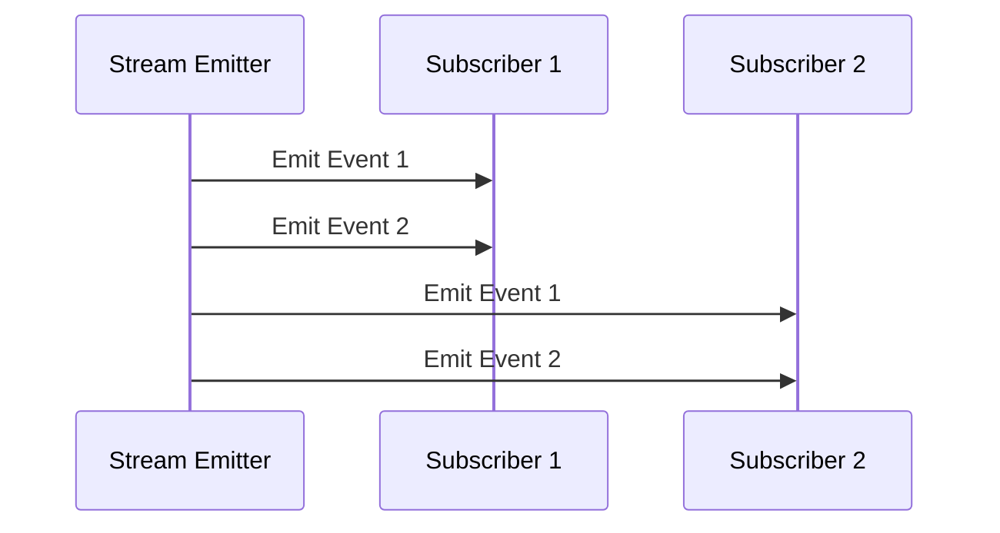

## 9.3.1 Introduction to Streams

In the world of modern app development, handling asynchronous data efficiently is crucial. Whether it's fetching data from a server, responding to user interactions, or updating the UI in real-time, streams play a pivotal role in managing these asynchronous operations. In this section, we'll delve into the concept of streams in Flutter, exploring their types, creation, and best practices for effective use.

### Understanding Streams

Streams in Dart are asynchronous sequences of data events delivered over time. They are akin to a pipeline through which data flows, allowing you to handle asynchronous data in a structured and manageable way. Streams are essential for:

- **Real-time Data Handling:** They enable applications to process data as it arrives, making them ideal for real-time applications like chat apps, live feeds, or stock tickers.
- **User Interactions:** Streams can manage events such as button clicks, form submissions, or gesture recognitions, ensuring your app responds promptly to user actions.
- **Asynchronous Operations:** They simplify the handling of operations that take time to complete, such as network requests or file reading.

### Push vs. Pull Model

Understanding the difference between push and pull models is fundamental to grasping how streams operate:

- **Push-Based Streams:** In this model, data is pushed to the listener as soon as it becomes available. Dart streams utilize this model, where the stream itself controls the flow of data to its subscribers.
- **Pull-Based Streams:** Here, the listener requests data when it is ready to process it. This model is less common in Dart but is prevalent in other programming paradigms.

### Stream Types

Dart provides two primary types of streams, each suited to different scenarios:

- **Single-Subscription Streams:** These streams allow only one listener at a time. They are ideal for one-time data events, such as reading a file or fetching data from an API. Once a listener is attached, no other listener can subscribe until the current one is canceled.
  
- **Broadcast Streams:** These streams support multiple listeners simultaneously, making them perfect for multicasting events to various parts of an application. They are commonly used for events that need to be observed by multiple components, such as user input or UI updates.

### Creating Streams

Creating streams in Dart is straightforward. Let's explore how to create both single-subscription and broadcast streams with practical examples.

#### Single-Subscription Stream Example

```dart
Stream<String> timedEvents() async* {
  for (int i = 0; i < 5; i++) {
    await Future.delayed(Duration(seconds: 1));
    yield 'Event $i';
  }
}
```

In this example, `timedEvents` is a single-subscription stream that emits a string event every second. The `async*` keyword is used to create an asynchronous generator function, which yields events over time.

#### Broadcast Stream Example

```dart
StreamController<int> controller = StreamController<int>.broadcast();

void emitNumbers() async {
  for (int i = 0; i < 10; i++) {
    await Future.delayed(Duration(milliseconds: 500));
    controller.add(i);
  }
  controller.close();
}
```

Here, a `StreamController` is used to create a broadcast stream. The `broadcast` method allows multiple listeners to subscribe to the stream. The `emitNumbers` function emits an integer event every 500 milliseconds.

### Explanation

- **Single-Subscription Streams:** Use these when you need to process a sequence of data events with a single listener. They are efficient for tasks like file reading or network requests where only one component needs the data.
  
- **Broadcast Streams:** Opt for these when multiple parts of your app need to react to the same data events. They are suitable for UI events or shared data updates.

### Mermaid.js Diagrams

To visualize the flow of data through streams, let's use a sequence diagram to illustrate how data events are emitted and listened to by subscribers.

```markdown

```

### Best Practices

- **Choosing the Right Stream Type:** Select single-subscription streams for one-time data events and broadcast streams for scenarios requiring multiple listeners.
- **Resource Management:** Always close streams and controllers when they are no longer needed to prevent memory leaks.
- **Error Handling:** Implement error handlers within streams to manage exceptions and unexpected data gracefully.

### Common Pitfalls

- **Unclosed Streams:** Forgetting to close stream controllers can lead to memory leaks and unexpected application behavior.
- **Overusing Broadcast Streams:** Using broadcast streams unnecessarily can complicate the flow of data and lead to unintended side effects.

### Implementation Guidance

- **Judicious Use:** Incorporate streams judiciously, assessing whether their use is necessary for the given data flow or interaction.
- **Helper Functions:** Use helper functions or classes to manage stream controllers and ensure they are properly disposed of.

### Conclusion

Streams are a powerful tool in Flutter for managing asynchronous data and events. By understanding their types and best practices, you can effectively integrate streams into your applications, enhancing their responsiveness and efficiency. As you continue to explore streams, consider how they can simplify your data handling processes and improve your app's performance.

## Quiz Time!



### What is a stream in Dart?

- [x] An asynchronous sequence of data events delivered over time.
- [ ] A synchronous sequence of data events delivered immediately.
- [ ] A static collection of data.
- [ ] A method for storing data persistently.

> **Explanation:** Streams in Dart are asynchronous sequences of data events delivered over time, allowing for real-time data handling and asynchronous operations.

### Which model do Dart streams use?

- [x] Push-based model
- [ ] Pull-based model
- [ ] Hybrid model
- [ ] None of the above

> **Explanation:** Dart streams utilize a push-based model, where data is pushed to the listener as soon as it becomes available.

### What is a single-subscription stream?

- [x] A stream that allows only one listener at a time.
- [ ] A stream that allows multiple listeners simultaneously.
- [ ] A stream that does not allow any listeners.
- [ ] A stream that can be paused and resumed.

> **Explanation:** Single-subscription streams in Dart allow only one listener at a time, making them suitable for one-time data events.

### What is a broadcast stream?

- [x] A stream that supports multiple listeners simultaneously.
- [ ] A stream that supports only one listener.
- [ ] A stream that cannot be listened to.
- [ ] A stream that automatically closes after emitting an event.

> **Explanation:** Broadcast streams in Dart support multiple listeners simultaneously, making them ideal for multicasting events.

### How do you create a broadcast stream in Dart?

- [x] Using a StreamController with the broadcast method.
- [ ] Using a StreamController with the single method.
- [ ] Using a StreamBuilder widget.
- [ ] Using a FutureBuilder widget.

> **Explanation:** A broadcast stream in Dart can be created using a StreamController with the broadcast method, allowing multiple listeners.

### What is a common pitfall when using streams?

- [x] Forgetting to close stream controllers.
- [ ] Using too many listeners.
- [ ] Not using enough listeners.
- [ ] Using streams for synchronous operations.

> **Explanation:** A common pitfall when using streams is forgetting to close stream controllers, which can lead to memory leaks.

### Why should you choose a single-subscription stream?

- [x] For one-time data events with a single listener.
- [ ] For events that need to be multicast.
- [ ] For handling synchronous data.
- [ ] For managing static data collections.

> **Explanation:** Single-subscription streams are chosen for one-time data events with a single listener, such as reading a file or fetching data from an API.

### What is a best practice for managing streams?

- [x] Always close streams and controllers when no longer needed.
- [ ] Never close streams.
- [ ] Use streams only for synchronous operations.
- [ ] Avoid using streams in mobile applications.

> **Explanation:** A best practice for managing streams is to always close streams and controllers when they are no longer needed to prevent memory leaks.

### What is the purpose of error handling in streams?

- [x] To manage exceptions and unexpected data gracefully.
- [ ] To stop the stream immediately.
- [ ] To ignore all errors.
- [ ] To increase the speed of data flow.

> **Explanation:** Error handling in streams is used to manage exceptions and unexpected data gracefully, ensuring robust application behavior.

### True or False: Broadcast streams should be used for all data events.

- [ ] True
- [x] False

> **Explanation:** False. Broadcast streams should be used judiciously, as overusing them can complicate data flow and lead to unintended side effects.


