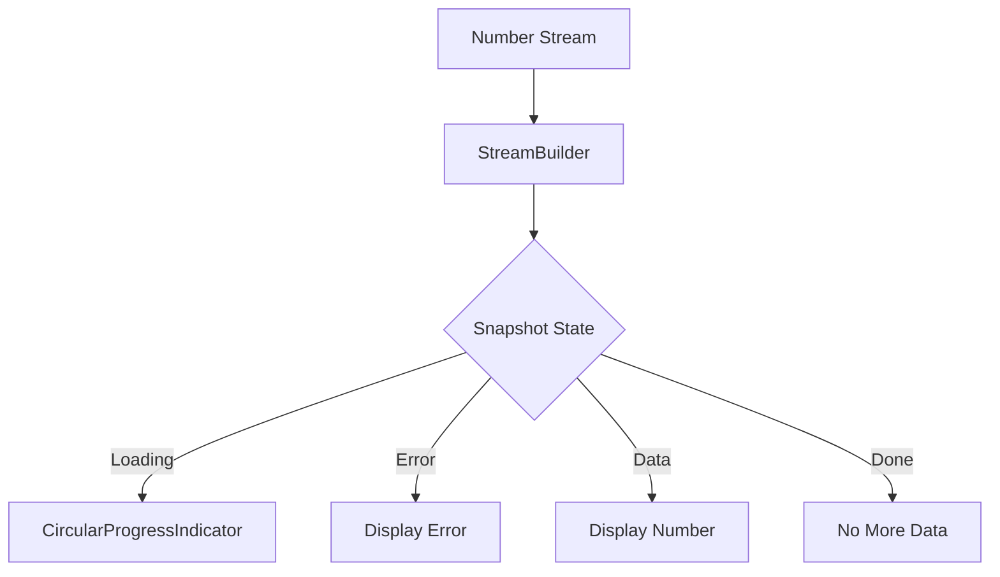

## 9.3.2 StreamBuilder Widget

In the world of modern mobile applications, real-time data updates are crucial for providing a dynamic user experience. Flutter, with its reactive framework, offers powerful tools to handle such data streams efficiently. One of the key widgets in this arsenal is the `StreamBuilder`. This widget allows developers to build UIs that automatically update in response to data changes from a stream, making it an essential component for any Flutter developer working with asynchronous data.

### Introduction to StreamBuilder

The `StreamBuilder` widget in Flutter is a versatile tool designed to build and rebuild parts of the UI in response to updates from a stream. Streams in Dart are sequences of asynchronous events, and `StreamBuilder` listens to these events, updating the UI based on the latest data snapshot. This capability is particularly useful for applications that need to display real-time data, such as live scores, chat messages, or stock prices.

#### Role in Synchronizing UI Components

`StreamBuilder` acts as a bridge between the data layer and the UI layer. It listens to a stream of data and rebuilds the widget tree whenever a new event is emitted. This synchronization ensures that the UI is always up-to-date with the latest data, providing a seamless experience for the user. By leveraging the power of streams, `StreamBuilder` enables developers to create responsive and adaptive UIs that react to data changes in real-time.

### Core Components of StreamBuilder

To effectively use `StreamBuilder`, it's important to understand its core components: the stream and the builder function.

#### Stream

The stream is the source of data events that `StreamBuilder` listens to. It can be any Dart stream, such as a stream of integers, strings, or custom objects. The stream continuously emits data events, which `StreamBuilder` uses to update the UI.

#### Builder Function

The builder function is a callback that defines how the widget should build itself based on the latest snapshot of the stream. This function receives two parameters: the `BuildContext` and an `AsyncSnapshot` object. The `AsyncSnapshot` contains the current state of the stream, including the data, error (if any), and connection state.

### Implementing StreamBuilder

Let's dive into a practical example to see how `StreamBuilder` can be implemented in a Flutter application.

#### Code Example

```dart
import 'package:flutter/material.dart';
import 'dart:async';

class StreamBuilderExample extends StatefulWidget {
  @override
  _StreamBuilderExampleState createState() => _StreamBuilderExampleState();
}

class _StreamBuilderExampleState extends State<StreamBuilderExample> {
  Stream<int> numberStream() async* {
    for (int i = 1; i <= 10; i++) {
      await Future.delayed(Duration(seconds: 1));
      yield i;
    }
  }

  @override
  Widget build(BuildContext context) {
    return Scaffold(
      appBar: AppBar(title: Text('StreamBuilder Example')),
      body: Center(
        child: StreamBuilder<int>(
          stream: numberStream(),
          builder: (context, snapshot) {
            if (snapshot.connectionState == ConnectionState.waiting) {
              return CircularProgressIndicator();
            } else if (snapshot.hasError) {
              return Text('Error: ${snapshot.error}');
            } else if (snapshot.hasData) {
              return Text('Number: ${snapshot.data}');
            } else {
              return Text('No data available');
            }
          },
        ),
      ),
    );
  }
}
```

#### Explanation

In this example, we define a simple stream of integers that emits numbers from 1 to 10, with a one-second delay between each emission. The `StreamBuilder` listens to this stream and updates the UI with each new number. The builder function checks the `connectionState` of the snapshot to determine the appropriate UI to display:

- **Loading State:** When the stream is waiting for data, a `CircularProgressIndicator` is shown.
- **Error State:** If an error occurs, it is displayed in a `Text` widget.
- **Data State:** When data is available, it is displayed in a `Text` widget.
- **Done State:** If the stream completes without data, a message indicating no data is shown.

### Visualizing StreamBuilder with Mermaid.js

To better understand how `StreamBuilder` operates, let's visualize the process using a flowchart.

```markdown

```

This flowchart illustrates the flow of data from the number stream to the `StreamBuilder`, which then updates the UI based on the snapshot state.

### Best Practices for Using StreamBuilder

While `StreamBuilder` is a powerful tool, there are best practices to follow to ensure efficient and effective use:

- **Efficient Rebuilding:** Minimize the parts of the UI that are rebuilt by `StreamBuilder`. Only the widgets that depend on the stream data should be rebuilt to optimize performance.
- **Handling Reconnection:** Implement logic to handle scenarios where the stream might disconnect and reconnect, ensuring the UI remains consistent.
- **Avoiding Nested StreamBuilders:** Excessive nesting of `StreamBuilder` widgets can complicate the widget tree and degrade performance. Consider refactoring your code to reduce nesting.

### Common Pitfalls

Developers often encounter common pitfalls when working with `StreamBuilder`. Here are some to watch out for:

- **Not Handling All Snapshot States:** Ensure that all possible states of the snapshot (loading, error, data, done) are handled to prevent incomplete or inconsistent UI updates.
- **Ignoring Stream Closure:** Always close streams when they are no longer needed to prevent memory leaks and orphaned listeners.

### Implementation Guidance

When implementing `StreamBuilder` in your projects, consider the following guidance:

- **Generous Comments and Documentation:** Clearly document the data flow and UI update logic within your `StreamBuilder` implementations to make the code easier to understand and maintain.
- **Testing Under Various Conditions:** Test your `StreamBuilder` widgets under different stream conditions to ensure robustness and reliability.

### Conclusion

The `StreamBuilder` widget is an essential tool for building responsive and adaptive UIs in Flutter. By synchronizing the UI with data streams, it enables real-time updates and enhances the user experience. By following best practices and avoiding common pitfalls, you can leverage `StreamBuilder` to create efficient and dynamic applications.

## Quiz Time!



### What is the primary purpose of the StreamBuilder widget in Flutter?

- [x] To synchronize UI components with incoming data from streams.
- [ ] To manage state across multiple widgets.
- [ ] To handle HTTP requests and responses.
- [ ] To manage navigation between screens.

> **Explanation:** The StreamBuilder widget is designed to build and rebuild parts of the UI in response to updates from a stream, synchronizing UI components with incoming data.

### Which of the following is a core component of the StreamBuilder widget?

- [x] Stream
- [x] Builder Function
- [ ] State Management
- [ ] Navigation Controller

> **Explanation:** The core components of the StreamBuilder widget are the stream, which provides the data events, and the builder function, which defines how the widget should build itself based on the latest snapshot.

### In the provided code example, what does the StreamBuilder widget listen to?

- [x] A stream of integers
- [ ] A stream of strings
- [ ] A stream of HTTP responses
- [ ] A stream of user interactions

> **Explanation:** The StreamBuilder widget in the example listens to a stream of integers, which emits numbers from 1 to 10.

### What does the builder function in StreamBuilder receive as parameters?

- [x] BuildContext and AsyncSnapshot
- [ ] BuildContext and Stream
- [ ] AsyncSnapshot and Stream
- [ ] BuildContext and ConnectionState

> **Explanation:** The builder function receives two parameters: the BuildContext and an AsyncSnapshot object, which contains the current state of the stream.

### Which snapshot state indicates that the StreamBuilder is waiting for data?

- [x] ConnectionState.waiting
- [ ] ConnectionState.active
- [ ] ConnectionState.done
- [ ] ConnectionState.error

> **Explanation:** ConnectionState.waiting indicates that the StreamBuilder is waiting for data from the stream.

### What is a common pitfall when using StreamBuilder?

- [x] Not handling all snapshot states
- [ ] Using too many streams
- [ ] Overusing setState
- [ ] Ignoring widget lifecycle

> **Explanation:** A common pitfall is not handling all snapshot states, which can lead to incomplete or inconsistent UI updates.

### Why should streams be properly closed?

- [x] To prevent memory leaks and orphaned listeners
- [ ] To improve network performance
- [ ] To enhance UI responsiveness
- [ ] To reduce CPU usage

> **Explanation:** Streams should be properly closed to prevent memory leaks and orphaned listeners, ensuring efficient resource management.

### What is a best practice when using StreamBuilder?

- [x] Avoiding nested StreamBuilders
- [ ] Using multiple streams for a single widget
- [ ] Rebuilding the entire UI on each data update
- [ ] Ignoring error states

> **Explanation:** Avoiding nested StreamBuilders is a best practice to prevent complicating the widget tree and degrading performance.

### What should be included in StreamBuilder implementations to clarify the data flow?

- [x] Generous comments and documentation
- [ ] Multiple builder functions
- [ ] Complex state management
- [ ] Extensive use of global variables

> **Explanation:** Generous comments and documentation should be included to clarify the data flow and UI update logic, making the code easier to understand and maintain.

### True or False: StreamBuilder can only be used with streams of integers.

- [ ] True
- [x] False

> **Explanation:** False. StreamBuilder can be used with any Dart stream, such as streams of integers, strings, or custom objects.


