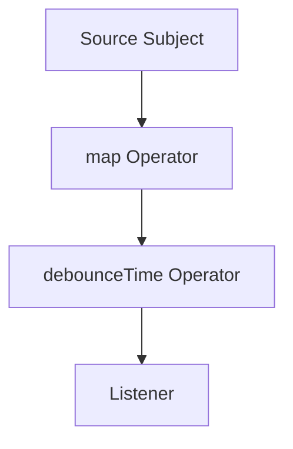

## 9.3.3 Using RxDart for Advanced Stream Handling

In the realm of modern app development, managing asynchronous data flows efficiently is crucial. Flutter's native streams provide a robust foundation, but when it comes to handling complex data transformations and asynchronous operations, RxDart emerges as a powerful ally. In this section, we'll delve into RxDart, a reactive extensions library for Dart, and explore how it enhances stream handling capabilities in Flutter applications.

### Introduction to RxDart

RxDart is a reactive extensions library that builds upon Dart's native stream API, offering a plethora of additional functionalities. It introduces a wide array of operators, subjects, and schedulers that empower developers to manipulate streams more effectively. Whether you're dealing with real-time data updates, complex transformations, or error handling, RxDart provides the tools to streamline these processes.

#### Key Features of RxDart

- **Advanced Stream Operators:** RxDart offers operators like `map`, `filter`, `debounce`, `merge`, and `zip`, which facilitate complex stream transformations and combinations.
- **Subjects:** These are both streams and sinks, allowing for multicasting events to multiple listeners.
- **Schedulers:** Schedulers in RxDart help control the timing and concurrency of stream events, providing fine-grained control over asynchronous operations.

### Advantages of Using RxDart

#### Enhanced Stream Manipulation

RxDart extends the capabilities of Dart's standard streams by introducing advanced operators. These operators enable developers to perform complex transformations and combinations that would otherwise require cumbersome manual implementations. For instance, you can easily merge multiple streams, debounce rapid data emissions, or zip streams together to synchronize their outputs.

#### Asynchronous Data Handling

Managing asynchronous data flows can be challenging, especially when dealing with multiple sources of data or complex transformations. RxDart simplifies these scenarios by providing a declarative approach to handling asynchronous operations. With RxDart, you can compose streams, apply transformations, and handle data emissions in a clean and concise manner.

#### Robust Error Handling

Error handling is a critical aspect of any application, and RxDart excels in this area. It offers operators like `onErrorResumeNext`, `retry`, and `catchError`, which allow developers to gracefully manage errors within streams. This ensures that your application remains resilient and responsive, even in the face of unexpected failures.

### Installation and Setup

To start using RxDart in your Flutter project, you'll need to add the `rxdart` package to your `pubspec.yaml` file:

```yaml
dependencies:
  rxdart: ^0.27.6
```

Once added, you can import the package in your Dart files:

```dart
import 'package:rxdart/rxdart.dart';
```

### Core Concepts

#### Subjects

Subjects in RxDart are a unique type of stream that act as both a stream and a sink. This means they can emit new events and also listen to them, making them ideal for multicasting events to multiple listeners. There are several types of subjects, including `PublishSubject`, `BehaviorSubject`, and `ReplaySubject`, each with its own characteristics.

#### Operators

Operators are the heart of RxDart, enabling advanced stream transformations. Some commonly used operators include:

- **map:** Transforms each item emitted by a stream.
- **filter:** Emits only those items from a stream that pass a predicate test.
- **debounce:** Emits an item from a stream only after a specified duration has passed without another emission.
- **merge:** Combines multiple streams into one.
- **zip:** Combines the emissions of multiple streams into a single stream of tuples.

#### Schedulers

Schedulers in RxDart control the timing and concurrency of stream events. They allow you to specify when and how stream operations should be executed, providing a high level of control over asynchronous operations.

### Implementing RxDart

Let's explore a practical example of using RxDart in a Flutter application. We'll create a simple app that demonstrates the use of a `BehaviorSubject` and several operators to transform and display data.

```dart
import 'package:flutter/material.dart';
import 'package:rxdart/rxdart.dart';

class RxDartExample extends StatefulWidget {
  @override
  _RxDartExampleState createState() => _RxDartExampleState();
}

class _RxDartExampleState extends State<RxDartExample> {
  final BehaviorSubject<int> _subject = BehaviorSubject<int>();

  @override
  void initState() {
    super.initState();
    _subject
        .map((value) => 'Number: $value')
        .debounceTime(Duration(milliseconds: 300))
        .listen((data) {
      // Update UI or perform actions based on transformed data
      print(data);
    });

    // Simulate adding data to the stream
    for (int i = 1; i <= 5; i++) {
      Future.delayed(Duration(seconds: i), () => _subject.add(i));
    }
  }

  @override
  void dispose() {
    _subject.close();
    super.dispose();
  }

  @override
  Widget build(BuildContext context) {
    return Scaffold(
      appBar: AppBar(title: Text('RxDart Example')),
      body: Center(
        child: StreamBuilder<int>(
          stream: _subject.stream,
          builder: (context, snapshot) {
            if (snapshot.hasData) {
              return Text('Current Number: ${snapshot.data}');
            } else {
              return Text('No data');
            }
          },
        ),
      ),
    );
  }
}
```

#### Explanation

- **BehaviorSubject:** We create a `BehaviorSubject` to hold and emit integer values. This subject acts as both a stream and a sink, allowing us to add new values and listen to them.
- **Operators:** We apply the `map` operator to transform each emitted integer into a string and the `debounceTime` operator to delay emissions by 300 milliseconds. This demonstrates how operators can be chained to perform complex transformations.
- **Listening to Data:** We listen to the transformed data and print it to the console. In a real application, you might update the UI or trigger other actions based on this data.
- **StreamBuilder:** We use a `StreamBuilder` widget to display the current value of the stream in the UI. This widget rebuilds itself whenever new data is emitted.

### Mermaid.js Diagrams

To better understand the flow of data through RxDart operators, let's visualize it using a Mermaid.js flowchart:



This diagram illustrates how data flows from the source subject through the `map` and `debounceTime` operators before reaching the listener.

### Best Practices

- **Dispose Streams Properly:** Always close subjects and dispose of stream subscriptions to prevent memory leaks. This is crucial for maintaining application performance and stability.
- **Operator Order:** Be mindful of the order in which operators are applied, as it affects the stream's behavior and output. Experiment with different combinations to achieve the desired results.
- **Error Handling:** Utilize RxDart’s error handling operators like `onErrorResumeNext` to manage errors gracefully within streams. This ensures that your application remains robust and responsive.

### Common Pitfalls

- **Forgetting to Close Subjects:** Neglecting to close subjects can lead to memory leaks and unintended behavior. Always ensure that subjects are properly disposed of when no longer needed.
- **Complex Operator Chains:** Overcomplicating stream transformations can make the code hard to read and maintain. Strive for simplicity and clarity in your stream logic.

### Implementation Guidance

RxDart is a powerful tool for managing complex stream manipulations in Flutter applications. It shines in scenarios where standard Dart streams fall short, providing advanced operators and error handling capabilities. When using RxDart, consider documenting the purpose and behavior of each operator applied within the stream for better code clarity.

By embracing RxDart, you can build responsive and adaptive UIs that efficiently handle asynchronous data flows, providing a seamless user experience. As you explore RxDart further, you'll discover its potential to simplify and enhance your Flutter applications.

## Quiz Time!



### What is RxDart?

- [x] A reactive extensions library for Dart that enhances stream handling.
- [ ] A database management tool for Flutter.
- [ ] A UI framework for building responsive designs.
- [ ] A package for handling HTTP requests in Dart.

> **Explanation:** RxDart is a reactive extensions library for Dart that provides advanced stream handling capabilities.

### Which of the following is a feature of RxDart?

- [x] Advanced stream operators like `map`, `filter`, and `debounce`.
- [ ] Built-in database storage.
- [ ] UI components for Flutter.
- [ ] HTTP request handling.

> **Explanation:** RxDart offers advanced stream operators that facilitate complex stream transformations.

### What is a Subject in RxDart?

- [x] A type of stream that acts as both a stream and a sink.
- [ ] A UI component in Flutter.
- [ ] A database entity in Dart.
- [ ] A type of HTTP request in RxDart.

> **Explanation:** Subjects in RxDart are streams that can emit new events and listen to them, acting as both streams and sinks.

### How do you add the RxDart package to a Flutter project?

- [x] By adding `rxdart: ^0.27.6` to the `pubspec.yaml` file.
- [ ] By importing it directly in the Dart file without adding to `pubspec.yaml`.
- [ ] By installing it from the Flutter marketplace.
- [ ] By writing custom code to integrate it.

> **Explanation:** To use RxDart, you need to add it as a dependency in the `pubspec.yaml` file.

### Which operator in RxDart is used to delay emissions?

- [x] debounceTime
- [ ] map
- [ ] filter
- [ ] merge

> **Explanation:** The `debounceTime` operator delays emissions by a specified duration.

### What is the purpose of schedulers in RxDart?

- [x] To control the timing and concurrency of stream events.
- [ ] To manage database transactions.
- [ ] To handle UI rendering.
- [ ] To perform HTTP requests.

> **Explanation:** Schedulers in RxDart provide control over the timing and concurrency of stream events.

### Which operator would you use to combine multiple streams into one?

- [x] merge
- [ ] map
- [ ] filter
- [ ] debounce

> **Explanation:** The `merge` operator combines multiple streams into a single stream.

### What should you always do with subjects to prevent memory leaks?

- [x] Close them when no longer needed.
- [ ] Keep them open indefinitely.
- [ ] Use them only in stateless widgets.
- [ ] Avoid using them in production code.

> **Explanation:** To prevent memory leaks, always close subjects when they are no longer needed.

### What is a common pitfall when using RxDart?

- [x] Forgetting to close subjects, leading to memory leaks.
- [ ] Using too few operators in streams.
- [ ] Not using enough UI components.
- [ ] Overusing HTTP requests.

> **Explanation:** A common pitfall is forgetting to close subjects, which can lead to memory leaks.

### True or False: RxDart is only useful for handling HTTP requests in Flutter.

- [ ] True
- [x] False

> **Explanation:** RxDart is not limited to handling HTTP requests; it is a versatile library for managing complex stream manipulations and asynchronous data flows.


