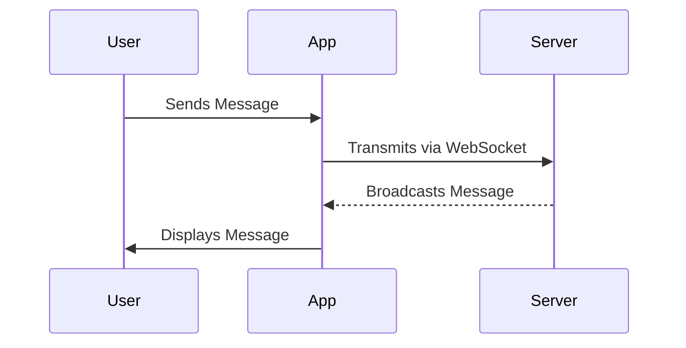

## 9.3.4 Real-Time Data Applications

In the ever-evolving landscape of mobile applications, real-time data handling has become a cornerstone for delivering dynamic and engaging user experiences. This section delves into the intricacies of building real-time data applications using Flutter, focusing on WebSockets and Firebase Realtime Database. We'll explore how to implement these technologies, discuss best practices, and highlight potential pitfalls to avoid.

### Introduction to Real-Time Data

Real-time data applications are designed to display information instantaneously as it becomes available, eliminating the need for manual refreshes. This capability is crucial for applications where timely data is paramount, such as:

- **Chat Applications:** Instant messaging platforms where users expect immediate delivery and receipt of messages.
- **Live Dashboards:** Interfaces that display continuously updated metrics, such as server performance or IoT device data.
- **Stock Market Trackers:** Applications that provide real-time updates on stock prices and market trends.

The essence of real-time applications lies in their ability to maintain a persistent connection with the server, allowing for seamless data flow between clients and servers.

### Techniques for Implementing Real-Time Features

#### WebSockets

WebSockets provide a protocol for establishing persistent, bidirectional communication channels between the client and server. Unlike traditional HTTP requests, WebSockets allow for continuous data exchange, making them ideal for real-time applications.

**Flutter and WebSockets:**

In Flutter, the `web_socket_channel` package is commonly used to interact with WebSockets. This package provides a simple API for connecting to WebSocket servers, sending messages, and listening for incoming data.

**Code Example:**

```dart
import 'package:flutter/material.dart';
import 'package:web_socket_channel/io.dart';
import 'package:web_socket_channel/web_socket_channel.dart';

class WebSocketExample extends StatefulWidget {
  @override
  _WebSocketExampleState createState() => _WebSocketExampleState();
}

class _WebSocketExampleState extends State<WebSocketExample> {
  final WebSocketChannel channel = IOWebSocketChannel.connect('wss://echo.websocket.org');

  @override
  void dispose() {
    channel.sink.close();
    super.dispose();
  }

  @override
  Widget build(BuildContext context) {
    return Scaffold(
      appBar: AppBar(title: Text('WebSocket Example')),
      body: Padding(
        padding: const EdgeInsets.all(20.0),
        child: Column(
          children: [
            Form(
              child: Row(
                children: [
                  Expanded(
                    child: TextField(
                      decoration: InputDecoration(labelText: 'Send a message'),
                      onSubmitted: (text) {
                        channel.sink.add(text);
                      },
                    ),
                  ),
                  IconButton(
                    icon: Icon(Icons.send),
                    onPressed: () {},
                  ),
                ],
              ),
            ),
            SizedBox(height: 20),
            Expanded(
              child: StreamBuilder(
                stream: channel.stream,
                builder: (context, snapshot) {
                  if (snapshot.hasData) {
                    return Text(snapshot.data);
                  } else {
                    return Text('No data');
                  }
                },
              ),
            ),
          ],
        ),
      ),
    );
  }
}
```

**Explanation:**

- **Establishing a Connection:** The `IOWebSocketChannel.connect` method is used to establish a WebSocket connection to the specified URL.
- **Sending Messages:** The `sink.add` method sends messages to the server.
- **Listening for Data:** The `StreamBuilder` widget listens for incoming data from the WebSocket stream and updates the UI accordingly.

#### Firebase Realtime Database

Firebase Realtime Database is a cloud-hosted NoSQL database that allows data to be stored and synchronized in real-time across all connected clients. This makes it an excellent choice for applications requiring real-time data synchronization.

**Flutter and Firebase Realtime Database:**

The `firebase_database` package provides seamless integration with Firebase Realtime Database, enabling real-time data operations in Flutter applications.

**Code Example:**

```dart
import 'package:flutter/material.dart';
import 'package:firebase_core/firebase_core.dart';
import 'package:firebase_database/firebase_database.dart';

class FirebaseRealtimeExample extends StatefulWidget {
  @override
  _FirebaseRealtimeExampleState createState() => _FirebaseRealtimeExampleState();
}

class _FirebaseRealtimeExampleState extends State<FirebaseRealtimeExample> {
  final DatabaseReference _databaseReference = FirebaseDatabase.instance.reference().child('messages');
  List<String> messages = [];

  @override
  void initState() {
    super.initState();
    _databaseReference.onChildAdded.listen((event) {
      setState(() {
        messages.add(event.snapshot.value.toString());
      });
    });
  }

  Future<void> sendMessage(String message) async {
    await _databaseReference.push().set({'message': message});
  }

  @override
  Widget build(BuildContext context) {
    return Scaffold(
      appBar: AppBar(title: Text('Firebase Realtime Database')),
      body: Column(
        children: [
          Expanded(
            child: ListView.builder(
              itemCount: messages.length,
              itemBuilder: (context, index) {
                return ListTile(title: Text(messages[index]));
              },
            ),
          ),
          Padding(
            padding: const EdgeInsets.all(8.0),
            child: Row(
              children: [
                Expanded(
                  child: TextField(
                    decoration: InputDecoration(labelText: 'Send a message'),
                    onSubmitted: (text) {
                      sendMessage(text);
                    },
                  ),
                ),
                IconButton(
                  icon: Icon(Icons.send),
                  onPressed: () {},
                ),
              ],
            ),
          ),
        ],
      ),
    );
  }
}
```

**Explanation:**

- **Listening for Updates:** The `onChildAdded` listener is used to listen for new data added to the database, updating the local state and UI accordingly.
- **Sending Data:** The `push().set()` method sends new data to the database, which is instantly reflected across all connected clients.

### Mermaid.js Diagrams

To better understand the flow of data in real-time applications, we can use sequence diagrams to illustrate how data is sent, received, and displayed in the UI.

**Sequence Diagram Example:**

```markdown

```

This diagram illustrates the typical flow of data in a real-time application using WebSockets. The user sends a message, which the app transmits to the server via WebSocket. The server then broadcasts the message back to the app, which displays it to the user.

### Best Practices

Implementing real-time data features requires careful consideration of several best practices to ensure optimal performance and security:

- **Efficient Data Handling:** Optimize data operations to handle frequent updates without degrading performance. Use efficient data structures and algorithms to process incoming data quickly.
- **Security Measures:** Implement robust authentication and authorization mechanisms to protect real-time data interactions. Ensure that only authorized users can access sensitive data.
- **User Feedback:** Provide real-time indicators for data loading, sending, and synchronization statuses. This enhances the user experience by keeping users informed about the state of their data.

### Common Pitfalls

Developers often encounter several challenges when working with real-time data applications. Here are some common pitfalls to avoid:

- **Overloading Streams:** Managing too many real-time data streams can lead to performance issues and complex state management. Limit the number of active streams and use efficient state management solutions.
- **Ignoring Offline Scenarios:** Failing to handle cases where the user is offline can lead to data inconsistencies and user frustration. Implement offline support and data synchronization strategies to ensure a seamless user experience.

### Implementation Guidance

To successfully implement real-time data features in your Flutter applications, consider the following guidance:

- **State Management:** Use robust state management solutions like Provider, Bloc, or Riverpod to handle real-time data seamlessly. These solutions help manage complex state changes and ensure a responsive UI.
- **Reconnection Strategies:** Implement reconnection strategies and data buffering to manage intermittent connectivity. This ensures that your application remains functional even when the network connection is unstable.

### Conclusion

Real-time data applications are essential for delivering dynamic and engaging user experiences. By leveraging technologies like WebSockets and Firebase Realtime Database, you can build applications that provide instantaneous data updates and seamless user interactions. Remember to follow best practices, avoid common pitfalls, and implement robust state management solutions to ensure the success of your real-time data applications.

## Quiz Time!



### What is a key characteristic of real-time data applications?

- [x] Display data instantaneously as it becomes available
- [ ] Require manual refreshes to update data
- [ ] Use only HTTP requests for data communication
- [ ] Are limited to chat applications only

> **Explanation:** Real-time data applications are designed to display data instantaneously as it becomes available, without requiring manual refreshes.

### Which protocol is commonly used for real-time, bidirectional communication in Flutter applications?

- [x] WebSockets
- [ ] HTTP
- [ ] FTP
- [ ] SMTP

> **Explanation:** WebSockets provide a protocol for establishing persistent, bidirectional communication channels between the client and server, making them ideal for real-time applications.

### What package is used in Flutter to interact with WebSockets?

- [x] `web_socket_channel`
- [ ] `http`
- [ ] `firebase_database`
- [ ] `sqflite`

> **Explanation:** The `web_socket_channel` package is commonly used in Flutter to interact with WebSockets.

### How does Firebase Realtime Database synchronize data across clients?

- [x] In real-time, instantly reflecting changes across all connected clients
- [ ] By sending periodic updates every hour
- [ ] Only when the user manually refreshes the application
- [ ] Through daily batch processing

> **Explanation:** Firebase Realtime Database synchronizes data in real-time, instantly reflecting changes across all connected clients.

### What is a common pitfall when managing real-time data streams?

- [x] Overloading streams leading to performance issues
- [ ] Using too few streams
- [ ] Implementing too many security measures
- [ ] Providing too much user feedback

> **Explanation:** Managing too many real-time data streams can lead to performance issues and complex state management, which is a common pitfall.

### Which best practice is important for handling real-time data efficiently?

- [x] Optimize data operations to handle frequent updates
- [ ] Ignore security measures
- [ ] Limit user feedback
- [ ] Use only one data stream

> **Explanation:** Optimizing data operations to handle frequent updates without degrading performance is crucial for handling real-time data efficiently.

### What should be implemented to manage intermittent connectivity in real-time applications?

- [x] Reconnection strategies and data buffering
- [ ] Only offline support
- [ ] Manual refresh buttons
- [ ] Limiting data updates

> **Explanation:** Implementing reconnection strategies and data buffering helps manage intermittent connectivity, ensuring the application remains functional even when the network connection is unstable.

### What is a benefit of using Firebase Realtime Database in Flutter applications?

- [x] Seamless real-time data synchronization
- [ ] Limited data storage
- [ ] Complex integration process
- [ ] Requires manual data updates

> **Explanation:** Firebase Realtime Database provides seamless real-time data synchronization, making it an excellent choice for applications requiring real-time data updates.

### Which state management solution is recommended for handling real-time data in Flutter?

- [x] Provider, Bloc, or Riverpod
- [ ] Only setState
- [ ] Redux
- [ ] MobX

> **Explanation:** Robust state management solutions like Provider, Bloc, or Riverpod are recommended for handling real-time data seamlessly in Flutter applications.

### True or False: Real-time data applications require manual refreshes to update data.

- [ ] True
- [x] False

> **Explanation:** False. Real-time data applications are designed to display data instantaneously as it becomes available, without requiring manual refreshes.


