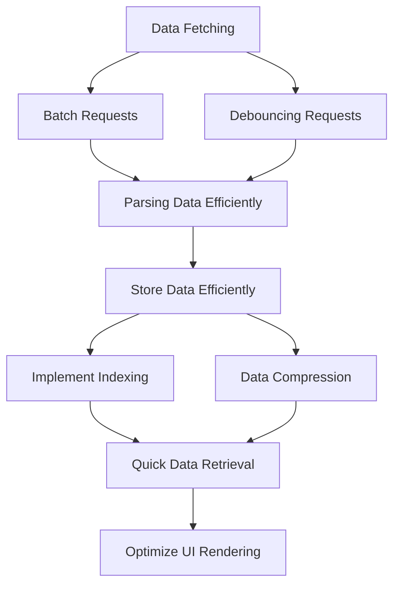

## 9.3.6 Performance Optimization for Data Operations

In the realm of mobile application development, performance is a critical aspect that can significantly influence user experience. Flutter, with its reactive framework, offers numerous ways to optimize data operations, which are often the backbone of any app. This section delves into the importance of optimizing data operations and explores various techniques to enhance the performance of Flutter applications.

### Importance of Optimizing Data Operations

Optimizing data operations in Flutter is essential for several reasons:

- **Enhanced User Experience:** Faster data operations lead to quicker load times and smoother interactions, which are crucial for retaining users.
- **Resource Efficiency:** Efficient data handling reduces CPU and memory usage, prolonging battery life and improving app responsiveness.
- **Scalability:** Optimized data operations allow your app to handle larger datasets and more users without degrading performance.

However, it's important to strike a balance between performance and resource usage. Over-optimization can lead to complex code that's difficult to maintain, while under-optimization can result in sluggish performance.

### Techniques for Optimizing Data Fetching

Data fetching is often the first step in data operations, and optimizing this process can significantly impact overall performance.

#### Batch Requests

Batching multiple API requests into a single call can reduce network overhead and improve performance. This technique is particularly useful when fetching related data that can be retrieved together.

```dart
Future<void> fetchBatchData() async {
  final responses = await Future.wait([
    http.get(Uri.parse('https://api.example.com/data1')),
    http.get(Uri.parse('https://api.example.com/data2')),
  ]);
  // Process responses
}
```

#### Debouncing Requests

Debouncing is a technique used to limit the frequency of rapid consecutive requests, such as those triggered by user input in search functionalities. This helps prevent unnecessary network calls and reduces server load.

```dart
void onSearchChanged(String query) {
  if (_debounce?.isActive ?? false) _debounce!.cancel();
  _debounce = Timer(const Duration(milliseconds: 500), () {
    // Perform search operation
  });
}
```

#### Using Pagination

Pagination is a well-known technique for handling large datasets efficiently. By fetching data in chunks, you can reduce initial load times and memory usage.

```dart
Future<List<Item>> fetchPaginatedData(int page) async {
  final response = await http.get(Uri.parse('https://api.example.com/items?page=$page'));
  // Parse and return items
}
```

### Optimizing Data Parsing

Efficient data parsing is crucial for converting raw data into usable formats without blocking the UI thread.

#### Efficient Parsing Libraries

Using libraries like `json_serializable` or `built_value` can streamline JSON parsing by generating code that handles serialization and deserialization efficiently.

```dart
@JsonSerializable()
class Post {
  final int id;
  final String title;
  final String content;

  Post({required this.id, required this.title, required this.content});

  factory Post.fromJson(Map<String, dynamic> json) => _$PostFromJson(json);
  Map<String, dynamic> toJson() => _$PostToJson(this);
}
```

#### Asynchronous Parsing

Parsing data asynchronously ensures that the UI remains responsive while data is being processed.

```dart
Future<void> parseData(String jsonData) async {
  final decodedData = json.decode(jsonData);
  final post = Post.fromJson(decodedData);
  // Use post object
}
```

### Optimizing Data Storage

Data storage optimization involves designing efficient database schemas and implementing strategies to accelerate data retrieval.

#### Efficient Database Queries

Designing database schemas optimized for read and write operations can improve query performance. Use normalized tables and avoid unnecessary joins.

#### Indexing

Implementing indexing on frequently queried fields can significantly accelerate data retrieval, especially in large datasets.

```sql
CREATE INDEX idx_name ON table_name (column_name);
```

#### Data Compression

Compressing data before storing it locally can save space and reduce memory usage, especially for large datasets.

### Memory Management

Effective memory management is crucial for maintaining app performance, particularly on devices with limited resources.

#### Dispose of Unused Resources

Ensure that data streams, controllers, and other resources are disposed of when no longer needed to free up memory.

```dart
@override
void dispose() {
  _controller.dispose();
  super.dispose();
}
```

#### Lazy Loading

Lazy loading involves loading data only when required, minimizing initial memory consumption and improving load times.

```dart
Image.network(
  'https://example.com/image.png',
  loadingBuilder: (BuildContext context, Widget child, ImageChunkEvent? loadingProgress) {
    if (loadingProgress == null) return child;
    return Center(
      child: CircularProgressIndicator(
        value: loadingProgress.expectedTotalBytes != null
            ? loadingProgress.cumulativeBytesLoaded / loadingProgress.expectedTotalBytes!
            : null,
      ),
    );
  },
)
```

### Mermaid.js Diagram: Optimization Workflow

To visualize the optimization workflow, consider the following diagram:



### Best Practices

- **Profiling and Monitoring:** Regularly profile the application using tools like Flutter DevTools to identify and address performance bottlenecks.
- **Asynchronous Operations:** Ensure that all data operations that can block the UI are performed asynchronously.
- **Caching Strategies:** Implement intelligent caching strategies to balance data freshness with performance needs.

### Common Pitfalls

- **Premature Optimization:** Avoid optimizing data operations before identifying actual performance issues through profiling.
- **Neglecting Error Handling:** Ensure that optimized data operations still include robust error handling mechanisms to manage failures gracefully.

### Implementation Guidance

- **Use Profiling Tools:** Gain insights into data operation performance using Flutter DevTools and other profiling tools.
- **Conduct Performance Testing:** Test under various scenarios to ensure that optimizations are effective and do not introduce new issues.

By implementing these techniques and best practices, you can significantly enhance the performance of your Flutter applications, providing a smoother and more responsive user experience.

## Quiz Time!



### What is the primary benefit of using batch requests in data fetching?

- [x] Reducing network overhead
- [ ] Increasing data accuracy
- [ ] Simplifying code structure
- [ ] Enhancing data security

> **Explanation:** Batch requests reduce network overhead by combining multiple API requests into a single call, which minimizes the number of network transactions.

### How does debouncing improve performance in search functionalities?

- [x] Limits the frequency of rapid consecutive requests
- [ ] Increases the accuracy of search results
- [ ] Simplifies the search algorithm
- [ ] Enhances data security

> **Explanation:** Debouncing limits the frequency of rapid consecutive requests, preventing unnecessary network calls and reducing server load.

### Which library is recommended for efficient JSON parsing in Flutter?

- [x] json_serializable
- [ ] http
- [ ] provider
- [ ] sqflite

> **Explanation:** The `json_serializable` library is recommended for efficient JSON parsing as it generates code for serialization and deserialization.

### What is the purpose of indexing in database optimization?

- [x] Accelerating data retrieval
- [ ] Reducing data redundancy
- [ ] Simplifying database schema
- [ ] Enhancing data security

> **Explanation:** Indexing accelerates data retrieval by allowing the database to find data more quickly, especially in large datasets.

### What is the advantage of asynchronous parsing?

- [x] Prevents blocking the UI thread
- [ ] Increases parsing accuracy
- [ ] Simplifies code structure
- [ ] Enhances data security

> **Explanation:** Asynchronous parsing prevents blocking the UI thread, ensuring that the app remains responsive while data is being processed.

### How does lazy loading benefit app performance?

- [x] Minimizes initial memory consumption
- [ ] Increases data accuracy
- [ ] Simplifies code structure
- [ ] Enhances data security

> **Explanation:** Lazy loading minimizes initial memory consumption by loading data only when required, improving load times and reducing resource usage.

### What is a common pitfall to avoid in performance optimization?

- [x] Premature optimization
- [ ] Using efficient parsing libraries
- [ ] Implementing caching strategies
- [ ] Profiling the application

> **Explanation:** Premature optimization should be avoided as it can lead to complex code without addressing actual performance issues.

### Why is it important to dispose of unused resources?

- [x] To free up memory
- [ ] To increase data accuracy
- [ ] To simplify code structure
- [ ] To enhance data security

> **Explanation:** Disposing of unused resources frees up memory, which is crucial for maintaining app performance, especially on devices with limited resources.

### What is the role of profiling tools in performance optimization?

- [x] Identifying performance bottlenecks
- [ ] Increasing data accuracy
- [ ] Simplifying code structure
- [ ] Enhancing data security

> **Explanation:** Profiling tools help identify performance bottlenecks, allowing developers to focus on areas that need optimization.

### True or False: Data compression before storage can reduce memory usage.

- [x] True
- [ ] False

> **Explanation:** True. Data compression before storage can save space and reduce memory usage, especially for large datasets.


