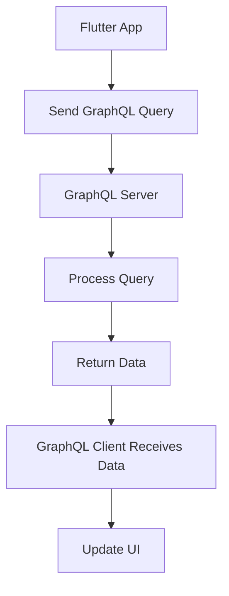

## 9.4.1 Fetching Data with GraphQL

In the ever-evolving landscape of mobile application development, efficiently fetching and managing data is crucial. GraphQL, a powerful query language for APIs, offers a flexible and efficient approach to data fetching, enabling developers to request precisely the data they need. In this section, we'll explore how to integrate GraphQL into your Flutter applications, covering everything from setting up a GraphQL client to performing queries and handling variables.

### Introduction to GraphQL

GraphQL is a query language for APIs and a runtime for executing those queries by using a type system you define for your data. Unlike REST, where you might need multiple endpoints to fetch related data, GraphQL allows you to request exactly the data you need in a single query. This flexibility and efficiency make it an excellent choice for handling complex data-fetching scenarios.

#### Key Benefits of GraphQL

- **Flexibility:** Clients can specify exactly what data they need, reducing over-fetching and under-fetching.
- **Efficiency:** Fetch multiple resources in a single request, minimizing the number of network calls.
- **Strong Typing:** GraphQL's type system ensures that queries are validated against the schema, reducing runtime errors.

### Setting Up GraphQL Client

To start using GraphQL in your Flutter application, you'll need to set up a GraphQL client. The `graphql_flutter` package provides a robust client that integrates seamlessly with Flutter.

#### Code Example: Setting Up the Client

```dart
import 'package:flutter/material.dart';
import 'package:graphql_flutter/graphql_flutter.dart';

void main() async {
  await initHiveForFlutter();

  final HttpLink httpLink = HttpLink('https://graphqlzero.almansi.me/api');

  ValueNotifier<GraphQLClient> client = ValueNotifier(
    GraphQLClient(
      cache: GraphQLCache(store: HiveStore()),
      link: httpLink,
    ),
  );

  runApp(GraphQLProvider(
    client: client,
    child: MyApp(),
  ));
}
```

#### Explanation

- **HttpLink:** This establishes a connection to the GraphQL server using the provided URL.
- **GraphQLClient:** This is the core client that manages queries and mutations. It requires a cache and a link.
- **GraphQLCache:** Utilizes a caching strategy to store query results, improving performance by reducing redundant network requests.
- **HiveStore:** A persistent storage option for caching, which is part of the `graphql_flutter` package.

### Performing Queries

Once the client is set up, you can perform queries to fetch data from your GraphQL server. The `Query` widget from `graphql_flutter` makes this process straightforward.

#### Code Example: Performing a Query

```dart
import 'package:flutter/material.dart';
import 'package:graphql_flutter/graphql_flutter.dart';

class GraphQLQueryExample extends StatelessWidget {
  final String readUser = """
    query ReadUser(\$id: ID!) {
      user(id: \$id) {
        id
        name
        email
      }
    }
  """;

  @override
  Widget build(BuildContext context) {
    return Scaffold(
      appBar: AppBar(title: Text('GraphQL Query Example')),
      body: Query(
        options: QueryOptions(
          document: gql(readUser),
          variables: <String, dynamic>{
            'id': '1',
          },
        ),
        builder: (QueryResult result, {fetchMore, refetch}) {
          if (result.hasException) {
            return Text(result.exception.toString());
          }

          if (result.isLoading) {
            return Center(child: CircularProgressIndicator());
          }

          final user = result.data!['user'];
          return Center(
            child: Column(
              mainAxisAlignment: MainAxisAlignment.center,
              children: [
                Text('ID: ${user['id']}'),
                Text('Name: ${user['name']}'),
                Text('Email: ${user['email']}'),
              ],
            ),
          );
        },
      ),
    );
  }
}
```

#### Explanation

- **Query Widget:** This widget executes the GraphQL query and rebuilds its child based on the query's result.
- **QueryOptions:** Defines the query document and any variables needed.
- **Handling States:** The builder function handles different states such as loading, error, and data received, ensuring a smooth user experience.

### Using Variables in Queries

Variables make your GraphQL queries dynamic and reusable. They allow you to pass parameters to your queries, making them adaptable to different scenarios.

#### Code Example: Using Variables

```dart
final String readUser = """
  query ReadUser(\$id: ID!) {
    user(id: \$id) {
      id
      name
      email
    }
  }
""";

// Usage within Query widget
QueryOptions(
  document: gql(readUser),
  variables: <String, dynamic>{
    'id': '1',
  },
)
```

### Data Flow Diagram

Understanding the flow of data in a GraphQL-based application is crucial. The following diagram illustrates the process from sending a query to updating the UI.

```markdown

```

### Best Practices

- **Efficient Queries:** Design queries to fetch only the necessary fields, reducing payload sizes and improving performance.
- **Caching Strategies:** Utilize the GraphQL client's cache to optimize data retrieval and minimize network calls.
- **Error Handling:** Implement comprehensive error handling to manage API failures gracefully.

### Common Pitfalls

- **Overfetching:** Requesting more data than needed can lead to increased load times and bandwidth usage.
- **Ignoring Network States:** Not handling cases where the network is unavailable or unreliable can lead to poor user experiences.

### Implementation Guidance

- **Query Builders:** Use query builders or code generation tools to streamline the creation and management of GraphQL queries.
- **Testing Queries:** Test queries with various parameters and scenarios to ensure data integrity and performance.

### Conclusion

Integrating GraphQL into your Flutter applications can significantly enhance your data-fetching capabilities, providing flexibility and efficiency. By following the best practices outlined in this guide, you can build robust applications that deliver a seamless user experience.

## Quiz Time!



### What is a key benefit of using GraphQL over REST?

- [x] Clients can specify exactly what data they need.
- [ ] GraphQL requires fewer server resources.
- [ ] GraphQL is easier to implement than REST.
- [ ] GraphQL automatically caches all responses.

> **Explanation:** GraphQL allows clients to request exactly the data they need, reducing over-fetching and under-fetching.

### What package is used to set up a GraphQL client in Flutter?

- [x] graphql_flutter
- [ ] flutter_graphql
- [ ] graphql_client
- [ ] flutter_api

> **Explanation:** The `graphql_flutter` package provides a robust client for integrating GraphQL with Flutter applications.

### How do you pass variables to a GraphQL query in Flutter?

- [x] Using the `variables` parameter in `QueryOptions`.
- [ ] By embedding them directly in the query string.
- [ ] Through a separate configuration file.
- [ ] By using environment variables.

> **Explanation:** Variables are passed to a GraphQL query using the `variables` parameter in `QueryOptions`.

### What is the purpose of the `HttpLink` in the GraphQL client setup?

- [x] It establishes a connection to the GraphQL server.
- [ ] It caches query results.
- [ ] It handles authentication.
- [ ] It formats the query response.

> **Explanation:** `HttpLink` is used to establish a connection to the GraphQL server using the provided URL.

### Which widget is used to perform GraphQL queries in Flutter?

- [x] Query
- [ ] GraphQLQuery
- [ ] DataFetcher
- [ ] ApiRequest

> **Explanation:** The `Query` widget from `graphql_flutter` is used to perform GraphQL queries in Flutter.

### What should you do to handle network errors gracefully in GraphQL queries?

- [x] Implement comprehensive error handling within queries and mutations.
- [ ] Ignore errors and retry automatically.
- [ ] Use a separate error-handling library.
- [ ] Log errors to the console only.

> **Explanation:** Implementing comprehensive error handling within queries and mutations helps manage API failures gracefully.

### What is a common pitfall when using GraphQL?

- [x] Overfetching data.
- [ ] Underfetching data.
- [ ] Using too many variables.
- [ ] Not using caching.

> **Explanation:** Overfetching data can lead to increased load times and bandwidth usage, which is a common pitfall when using GraphQL.

### How can you optimize data retrieval in GraphQL?

- [x] Utilize caching strategies.
- [ ] Increase the number of queries.
- [ ] Use larger payloads.
- [ ] Avoid using variables.

> **Explanation:** Utilizing caching strategies helps optimize data retrieval and minimize network calls.

### What is the role of `GraphQLCache` in the client setup?

- [x] It stores query results to improve performance.
- [ ] It manages authentication tokens.
- [ ] It formats query responses.
- [ ] It handles server-side processing.

> **Explanation:** `GraphQLCache` is used to store query results, improving performance by reducing redundant network requests.

### True or False: GraphQL allows fetching multiple resources in a single request.

- [x] True
- [ ] False

> **Explanation:** GraphQL allows fetching multiple resources in a single request, minimizing the number of network calls.


