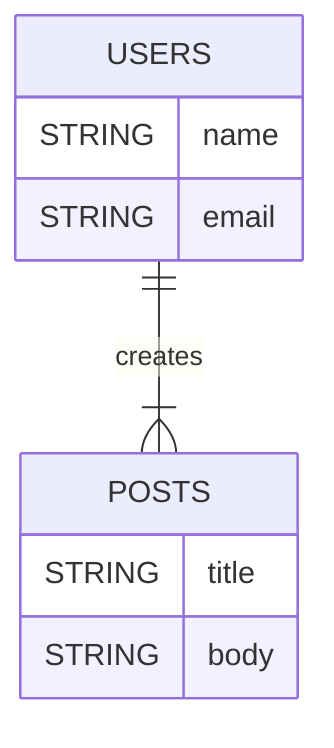
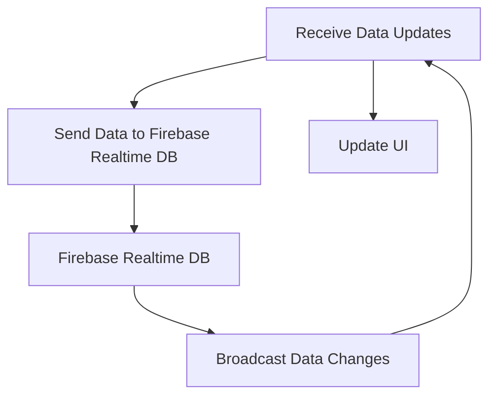

## 9.4.2 Firebase Realtime Database and Firestore

In the realm of mobile app development, the ability to handle data efficiently and in real-time is crucial. Firebase offers two powerful NoSQL databases: Firebase Realtime Database and Firestore. Both are cloud-hosted and designed to store and synchronize data across all connected clients in real-time. This section will delve into the capabilities of these databases, their advantages, and how to integrate them into your Flutter applications.

### Introduction to Firebase Realtime Database and Firestore

#### Firebase Realtime Database

Firebase Realtime Database is a cloud-hosted NoSQL database that allows developers to store and synchronize data in real-time across all connected clients. It is particularly useful for applications that require real-time data updates, such as chat applications, collaborative tools, and live data feeds.

- **Real-Time Synchronization:** Changes to the database are instantly reflected across all connected devices, ensuring that users always have the most up-to-date information.
- **Offline Capabilities:** The database supports offline data persistence, allowing applications to function even when there is no internet connection. Once the connection is restored, any changes made offline are synchronized with the server.

#### Firestore

Firestore, also known as Cloud Firestore, is Firebase's newer, more scalable NoSQL cloud database. It offers advanced querying capabilities and improved offline support compared to the Realtime Database. Firestore is designed to handle large-scale applications with ease, making it a preferred choice for many developers.

- **Advanced Querying:** Firestore supports complex queries, including compound queries, array-contains queries, and more.
- **Hierarchical Data Structure:** Data is organized into collections and documents, allowing for flexible data modeling.
- **Offline Support:** Like the Realtime Database, Firestore provides offline capabilities, enabling applications to remain functional without an internet connection.

### Advantages of Using Firebase Databases

- **Real-Time Synchronization:** Both Firebase Realtime Database and Firestore offer real-time data synchronization, ensuring that all connected clients have access to the latest data.
- **Offline Support:** Firebase databases provide robust offline capabilities, allowing applications to continue functioning without an internet connection. This is especially important for mobile apps where connectivity can be intermittent.
- **Scalability:** Designed to handle large-scale applications, Firebase databases can easily accommodate growing data needs and user bases.

### Installation and Setup

#### Adding Firebase to Flutter

To integrate Firebase into your Flutter application, you'll need to set up Firebase in the Firebase Console and add the necessary configuration files to your project.

1. **Set Up Firebase Project:**
   - Go to the [Firebase Console](https://console.firebase.google.com/).
   - Create a new project or select an existing one.
   - Add an Android and/or iOS app to your Firebase project.

2. **Add Configuration Files:**
   - For Android, download the `google-services.json` file and place it in the `android/app` directory of your Flutter project.
   - For iOS, download the `GoogleService-Info.plist` file and add it to the `ios/Runner` directory.

#### Adding Firebase Packages

To use Firebase Realtime Database and Firestore in your Flutter application, you'll need to add the appropriate packages to your `pubspec.yaml` file.

- **Firestore:**
  ```yaml
  dependencies:
    cloud_firestore: ^3.4.6
    firebase_core: ^2.10.0
  ```

- **Firebase Realtime Database:**
  ```yaml
  dependencies:
    firebase_database: ^10.3.6
    firebase_core: ^2.10.0
  ```

- **Importing Packages:**
  ```dart
  import 'package:firebase_core/firebase_core.dart';
  import 'package:cloud_firestore/cloud_firestore.dart';
  import 'package:firebase_database/firebase_database.dart';
  ```

### Initializing Firebase

Before using Firebase services, you must initialize Firebase in your Flutter application. This is typically done in the `main` function.

```dart
import 'package:flutter/material.dart';
import 'package:firebase_core/firebase_core.dart';
import 'firebase_options.dart'; // Generated file

void main() async {
  WidgetsFlutterBinding.ensureInitialized();
  await Firebase.initializeApp(
    options: DefaultFirebaseOptions.currentPlatform,
  );
  runApp(MyApp());
}
```

**Explanation:**
- **WidgetsFlutterBinding.ensureInitialized():** Ensures that Flutter is fully initialized before any asynchronous operations are performed.
- **Firebase.initializeApp():** Initializes Firebase with the configuration options specific to the current platform.

### Using Firestore

Firestore provides a flexible, scalable database for storing and syncing data in real-time. Let's explore how to perform CRUD operations and listen to real-time updates.

#### CRUD Operations

- **Create:**
  ```dart
  Future<void> addUser(String name, String email) {
    CollectionReference users = FirebaseFirestore.instance.collection('users');
    return users
        .add({
          'name': name,
          'email': email,
        })
        .then((value) => print("User Added"))
        .catchError((error) => print("Failed to add user: $error"));
  }
  ```

- **Read:**
  ```dart
  Stream<QuerySnapshot> getUsers() {
    CollectionReference users = FirebaseFirestore.instance.collection('users');
    return users.snapshots();
  }
  ```

- **Update:**
  ```dart
  Future<void> updateUser(String docId, String name) {
    CollectionReference users = FirebaseFirestore.instance.collection('users');
    return users
        .doc(docId)
        .update({'name': name})
        .then((value) => print("User Updated"))
        .catchError((error) => print("Failed to update user: $error"));
  }
  ```

- **Delete:**
  ```dart
  Future<void> deleteUser(String docId) {
    CollectionReference users = FirebaseFirestore.instance.collection('users');
    return users
        .doc(docId)
        .delete()
        .then((value) => print("User Deleted"))
        .catchError((error) => print("Failed to delete user: $error"));
  }
  ```

**Explanation:**
- **CollectionReference:** Represents a collection of documents in Firestore. Operations are performed on collections and documents.
- **add():** Adds a new document to the collection with the specified data.
- **snapshots():** Returns a stream of snapshots, allowing you to listen to real-time updates.
- **update():** Updates the specified fields of a document.
- **delete():** Deletes a document from the collection.

#### Listening to Real-Time Updates

Firestore allows you to listen to real-time updates using streams. This is particularly useful for applications that require live data updates.

```dart
StreamBuilder<QuerySnapshot>(
  stream: getUsers(),
  builder: (BuildContext context, AsyncSnapshot<QuerySnapshot> snapshot) {
    if (snapshot.hasError) {
      return Text('Something went wrong');
    }

    if (snapshot.connectionState == ConnectionState.waiting) {
      return Text("Loading");
    }

    return ListView(
      children: snapshot.data!.docs.map((DocumentSnapshot document) {
        Map<String, dynamic> data = document.data()! as Map<String, dynamic>;
        return ListTile(
          title: Text(data['name']),
          subtitle: Text(data['email']),
        );
      }).toList(),
    );
  },
)
```

**Explanation:**
- **StreamBuilder:** A widget that builds itself based on the latest snapshot of interaction with a stream.
- **AsyncSnapshot:** Contains information about the interaction with the asynchronous computation.
- **ListView:** Displays a scrollable list of widgets.

#### Mermaid.js Diagrams

To better understand the structure of Firestore collections and documents, let's use a Mermaid.js Entity-Relationship Diagram (ERD).



### Using Firebase Realtime Database

Firebase Realtime Database provides a simple and effective way to store and sync data in real-time. Let's explore how to perform CRUD operations and listen to real-time updates.

#### CRUD Operations

- **Create:**
  ```dart
  final DatabaseReference _dbRef = FirebaseDatabase.instance.ref().child('users');

  Future<void> addUser(String name, String email) async {
    await _dbRef.push().set({
      'name': name,
      'email': email,
    });
  }
  ```

- **Read:**
  ```dart
  Stream<DatabaseEvent> getUsers() {
    return _dbRef.onValue;
  }
  ```

- **Update:**
  ```dart
  Future<void> updateUser(String key, String name) async {
    await _dbRef.child(key).update({
      'name': name,
    });
  }
  ```

- **Delete:**
  ```dart
  Future<void> deleteUser(String key) async {
    await _dbRef.child(key).remove();
  }
  ```

**Explanation:**
- **DatabaseReference:** Represents a specific location in your database and can be used for reading or writing data.
- **push():** Generates a unique key for each new child.
- **set():** Writes data to the database.
- **update():** Updates specific fields of a child.
- **remove():** Deletes a child from the database.

#### Listening to Real-Time Updates

Firebase Realtime Database allows you to listen to real-time updates using streams.

```dart
StreamBuilder<DatabaseEvent>(
  stream: getUsers(),
  builder: (context, snapshot) {
    if (snapshot.hasError) {
      return Text('Something went wrong');
    }

    if (snapshot.connectionState == ConnectionState.waiting) {
      return Text("Loading");
    }

    Map<dynamic, dynamic> usersMap = snapshot.data!.snapshot.value as Map<dynamic, dynamic>;
    List<dynamic> usersList = usersMap.values.toList();

    return ListView.builder(
      itemCount: usersList.length,
      itemBuilder: (context, index) {
        return ListTile(
          title: Text(usersList[index]['name']),
          subtitle: Text(usersList[index]['email']),
        );
      },
    );
  },
)
```

**Explanation:**
- **StreamBuilder:** Used to build a widget tree based on the latest snapshot of interaction with a stream.
- **DatabaseEvent:** Represents a change in the database.

#### Mermaid.js Diagrams

To visualize how data flows in Firebase Realtime Database, let's use a Mermaid.js Data Flow Diagram.



### Best Practices

- **Security Rules:** Implement Firebase security rules to protect data from unauthorized access and manipulation. This ensures that only authenticated users can read or write data.
- **Efficient Data Structuring:** Organize data hierarchically in Firebase Realtime Database to optimize read and write operations. This can help reduce bandwidth usage and improve performance.
- **Offline Persistence:** Leverage Firebase’s offline capabilities to ensure the app remains functional without an internet connection. This is crucial for providing a seamless user experience.

### Common Pitfalls

- **Overfetching Data:** Retrieving more data than necessary can lead to increased bandwidth usage and slower app performance. Use queries to limit the data retrieved.
- **Ignoring Security:** Not setting up proper security rules can expose sensitive data and make the app vulnerable to attacks. Always define and enforce security rules.

### Implementation Guidance

- **Monitoring and Optimization:** Use Firebase’s built-in tools for monitoring and optimizing database performance. This can help identify and resolve performance bottlenecks.
- **Scalable Data Structure:** Structure Firebase data with scalability in mind, anticipating future app growth and data complexity. This can help ensure that the app remains performant as it scales.

By integrating Firebase Realtime Database and Firestore into your Flutter applications, you can harness the power of real-time data synchronization, offline support, and scalable cloud databases. These tools provide a robust foundation for building responsive and adaptive UIs that deliver a seamless user experience.

## Quiz Time!



### Which Firebase database provides advanced querying capabilities and improved offline support?

- [ ] Firebase Realtime Database
- [x] Firestore
- [ ] SQLite
- [ ] MongoDB

> **Explanation:** Firestore offers advanced querying capabilities and improved offline support compared to Firebase Realtime Database.

### What is the primary advantage of using Firebase Realtime Database?

- [x] Real-time data synchronization
- [ ] Advanced querying
- [ ] Complex data modeling
- [ ] High latency

> **Explanation:** Firebase Realtime Database is known for its real-time data synchronization capabilities, making it ideal for applications that require live data updates.

### How do you initialize Firebase in a Flutter application?

- [x] Using Firebase.initializeApp() in the main function
- [ ] By importing firebase_core.dart
- [ ] Through the Firebase Console
- [ ] By adding a configuration file

> **Explanation:** Firebase is initialized in a Flutter application using Firebase.initializeApp() in the main function.

### Which package is used for integrating Firestore in a Flutter application?

- [ ] firebase_database
- [x] cloud_firestore
- [ ] firebase_auth
- [ ] sqflite

> **Explanation:** The cloud_firestore package is used for integrating Firestore in a Flutter application.

### What is the purpose of the StreamBuilder widget in Flutter?

- [x] To build a widget tree based on the latest snapshot of interaction with a stream
- [ ] To manage state in a Flutter application
- [ ] To handle navigation between screens
- [ ] To display static content

> **Explanation:** StreamBuilder is used to build a widget tree based on the latest snapshot of interaction with a stream, making it ideal for displaying real-time data.

### What is a common pitfall when using Firebase databases?

- [x] Overfetching data
- [ ] Using security rules
- [ ] Implementing offline support
- [ ] Structuring data hierarchically

> **Explanation:** Overfetching data can lead to increased bandwidth usage and slower app performance, making it a common pitfall when using Firebase databases.

### What is the function of the push() method in Firebase Realtime Database?

- [x] To generate a unique key for each new child
- [ ] To update a specific field
- [ ] To delete a document
- [ ] To read data from the database

> **Explanation:** The push() method generates a unique key for each new child in Firebase Realtime Database.

### How can you protect data in Firebase databases from unauthorized access?

- [x] By implementing Firebase security rules
- [ ] By using complex queries
- [ ] By enabling offline support
- [ ] By using the StreamBuilder widget

> **Explanation:** Implementing Firebase security rules is essential for protecting data from unauthorized access and manipulation.

### Which method is used to delete a document in Firestore?

- [ ] set()
- [ ] add()
- [ ] update()
- [x] delete()

> **Explanation:** The delete() method is used to remove a document from Firestore.

### True or False: Firestore and Firebase Realtime Database both provide offline capabilities.

- [x] True
- [ ] False

> **Explanation:** Both Firestore and Firebase Realtime Database provide offline capabilities, allowing applications to function without an internet connection.


