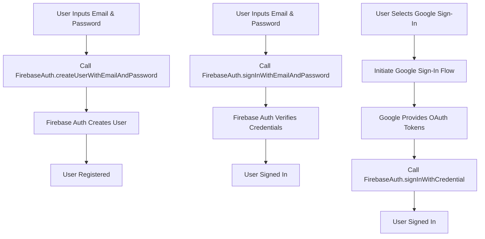

## 9.4.3 Authentication and Security

In the ever-evolving landscape of mobile applications, ensuring secure access to user data is paramount. Authentication not only verifies user identities but also plays a critical role in personalizing user experiences and safeguarding sensitive information. This section delves into implementing authentication in Flutter applications using Firebase, a comprehensive platform that simplifies the process of user verification and security management.

### Introduction to Authentication

Authentication is the process of verifying the identity of users who access an application. It serves as the first line of defense in securing user data and ensuring that only authorized individuals can access certain features or information. In addition to security, authentication allows for personalized user experiences, such as saving user preferences and providing tailored content.

### Implementing Firebase Authentication

Firebase Authentication offers a robust solution for managing user authentication across various platforms. It supports multiple authentication methods, including email/password, social logins (such as Google and Facebook), and even anonymous sign-ins for users who prefer not to create an account immediately.

#### Overview

Firebase Authentication provides a seamless way to integrate authentication into your Flutter applications. It abstracts the complexities of managing user sessions, token refreshes, and secure storage, allowing developers to focus on building great user experiences.

#### Installation and Setup

To get started with Firebase Authentication in your Flutter project, you'll need to add the `firebase_auth` package to your `pubspec.yaml` file:

```yaml
dependencies:
  firebase_auth: ^4.4.0
```

After adding the dependency, import the package in your Dart files to access Firebase Authentication functionalities:

```dart
import 'package:firebase_auth/firebase_auth.dart';
```

#### Email/Password Authentication

Email/password authentication is a common method for user sign-up and sign-in. Here's how you can implement it in your Flutter app.

##### Sign-Up Example

To create a new user account with an email and password, use the following function:

```dart
Future<User?> signUp(String email, String password) async {
  try {
    UserCredential userCredential = await FirebaseAuth.instance.createUserWithEmailAndPassword(
      email: email,
      password: password,
    );
    return userCredential.user;
  } on FirebaseAuthException catch (e) {
    print('Sign Up Error: $e');
    return null;
  }
}
```

##### Sign-In Example

To sign in an existing user, use this function:

```dart
Future<User?> signIn(String email, String password) async {
  try {
    UserCredential userCredential = await FirebaseAuth.instance.signInWithEmailAndPassword(
      email: email,
      password: password,
    );
    return userCredential.user;
  } on FirebaseAuthException catch (e) {
    print('Sign In Error: $e');
    return null;
  }
}
```

##### Explanation

These examples demonstrate how to create new users and sign in existing users using email and password. The `FirebaseAuth` instance handles the authentication process, and any errors are caught and printed for debugging purposes.

#### Social Authentication

Social authentication allows users to sign in using their existing social media accounts, such as Google or Facebook. This method simplifies the sign-in process and can increase user engagement by reducing friction.

##### Example with Google Sign-In

Here's how you can integrate Google Sign-In with Firebase Authentication:

```dart
import 'package:firebase_auth/firebase_auth.dart';
import 'package:google_sign_in/google_sign_in.dart';

Future<User?> signInWithGoogle() async {
  try {
    final GoogleSignInAccount? googleUser = await GoogleSignIn().signIn();
    if (googleUser == null) return null; // User canceled the sign-in

    final GoogleSignInAuthentication googleAuth = await googleUser.authentication;

    final credential = GoogleAuthProvider.credential(
      accessToken: googleAuth.accessToken,
      idToken: googleAuth.idToken,
    );

    UserCredential userCredential = await FirebaseAuth.instance.signInWithCredential(credential);
    return userCredential.user;
  } catch (e) {
    print('Google Sign-In Error: $e');
    return null;
  }
}
```

##### Explanation

This example demonstrates how to integrate Google Sign-In with Firebase Authentication. The process involves initiating the Google Sign-In flow, obtaining OAuth tokens, and using these tokens to authenticate with Firebase. This method leverages OAuth, a secure protocol for authorization, ensuring that user credentials are not exposed.

#### Mermaid.js Diagrams

To better understand the authentication flow, let's visualize the process using a Mermaid.js diagram.

```markdown

```

This diagram illustrates the flow of user registration and login processes, including interactions with Firebase Authentication.

### Security Considerations

When implementing authentication, it's crucial to consider security best practices to protect user data and maintain trust.

#### Secure Storage of Credentials

Ensure that sensitive information, such as passwords, is never stored insecurely on the device. Use secure storage solutions provided by the platform, such as Keychain on iOS and Keystore on Android, to store tokens and other sensitive data.

#### Backend Security Rules

Configure Firebase security rules to restrict data access based on user authentication status. This ensures that only authenticated users can access certain data, minimizing the risk of unauthorized access.

### Best Practices

Implementing best practices in authentication can enhance security and improve user experience.

#### Email Verification

Implement email verification to confirm user email addresses and enhance account security. This step ensures that users have access to the email address they provide, reducing the risk of account fraud.

#### Password Reset

Provide mechanisms for users to reset forgotten passwords securely. This feature is essential for maintaining user access and preventing account lockouts.

#### Session Management

Manage user sessions effectively, ensuring tokens are refreshed and expired appropriately. This practice helps maintain a secure and seamless user experience.

### Common Pitfalls

Avoid these common pitfalls when implementing authentication:

#### Inadequate Error Handling

Failing to handle authentication errors can lead to a poor user experience and potential security vulnerabilities. Ensure that all possible error scenarios are accounted for and provide meaningful feedback to users.

#### Overcomplicating Authentication Logic

Keep authentication flows simple and intuitive to avoid confusing users. A straightforward process increases user satisfaction and reduces the likelihood of errors.

### Implementation Guidance

To streamline authentication processes, consider using Flutter’s built-in widgets and FirebaseUI. These tools provide pre-built components for common authentication tasks, reducing development time and effort.

#### Testing Authentication Flows

Thoroughly test authentication flows to ensure all scenarios (success, failure, cancellation) are handled gracefully. Testing helps identify potential issues and ensures a smooth user experience.

### Conclusion

Authentication is a critical component of any mobile application, providing secure access to user data and enhancing personalization. By leveraging Firebase Authentication, developers can implement robust authentication solutions with minimal effort, ensuring both security and user satisfaction.

### Additional Resources

For further exploration, consider the following resources:

- [Firebase Authentication Documentation](https://firebase.google.com/docs/auth)
- [FlutterFire GitHub Repository](https://github.com/FirebaseExtended/flutterfire)
- [OAuth 2.0 Overview](https://oauth.net/2/)
- [Secure Storage in Flutter](https://pub.dev/packages/flutter_secure_storage)

## Quiz Time!



### What is the primary purpose of authentication in mobile applications?

- [x] To verify the identity of users accessing the application
- [ ] To increase the application's performance
- [ ] To enhance the application's visual design
- [ ] To reduce the application's size

> **Explanation:** Authentication is primarily used to verify the identity of users accessing the application, ensuring secure access to data and personalized experiences.

### Which package is used for implementing Firebase Authentication in Flutter?

- [x] firebase_auth
- [ ] firebase_core
- [ ] firebase_database
- [ ] firebase_storage

> **Explanation:** The `firebase_auth` package is specifically used for implementing Firebase Authentication in Flutter applications.

### What is the correct method to sign up a user with email and password using Firebase Authentication?

- [x] createUserWithEmailAndPassword
- [ ] signInWithEmailAndPassword
- [ ] signInWithCredential
- [ ] signOut

> **Explanation:** The `createUserWithEmailAndPassword` method is used to sign up a user with an email and password in Firebase Authentication.

### What is the purpose of OAuth tokens in social authentication?

- [x] To securely authenticate users without exposing their credentials
- [ ] To store user preferences
- [ ] To enhance the application's performance
- [ ] To reduce the application's size

> **Explanation:** OAuth tokens are used in social authentication to securely authenticate users without exposing their credentials, ensuring a secure login process.

### Which of the following is a best practice for enhancing account security?

- [x] Implementing email verification
- [ ] Storing passwords in plain text
- [ ] Disabling password reset functionality
- [ ] Allowing unlimited login attempts

> **Explanation:** Implementing email verification is a best practice for enhancing account security, ensuring that users have access to the email address they provide.

### What is a common pitfall in authentication implementation?

- [x] Inadequate error handling
- [ ] Using secure storage for credentials
- [ ] Implementing email verification
- [ ] Providing password reset functionality

> **Explanation:** Inadequate error handling is a common pitfall in authentication implementation, leading to a poor user experience and potential security vulnerabilities.

### How can you manage user sessions effectively?

- [x] By ensuring tokens are refreshed and expired appropriately
- [ ] By storing tokens in plain text
- [ ] By disabling session management
- [ ] By allowing unlimited session duration

> **Explanation:** Managing user sessions effectively involves ensuring tokens are refreshed and expired appropriately, maintaining a secure and seamless user experience.

### What should be done to protect sensitive information like passwords?

- [x] Use secure storage solutions provided by the platform
- [ ] Store them in plain text
- [ ] Share them with third-party services
- [ ] Ignore security measures

> **Explanation:** Sensitive information like passwords should be protected using secure storage solutions provided by the platform, such as Keychain on iOS and Keystore on Android.

### Which diagram type is used to illustrate the authentication flow in this section?

- [x] Flowchart
- [ ] Sequence Diagram
- [ ] Class Diagram
- [ ] Entity-Relationship Diagram

> **Explanation:** A flowchart is used to illustrate the authentication flow, showing the process of user registration and login.

### True or False: Firebase Authentication can only be used for email/password authentication.

- [ ] True
- [x] False

> **Explanation:** False. Firebase Authentication supports multiple authentication methods, including email/password, social logins, and anonymous sign-ins.


