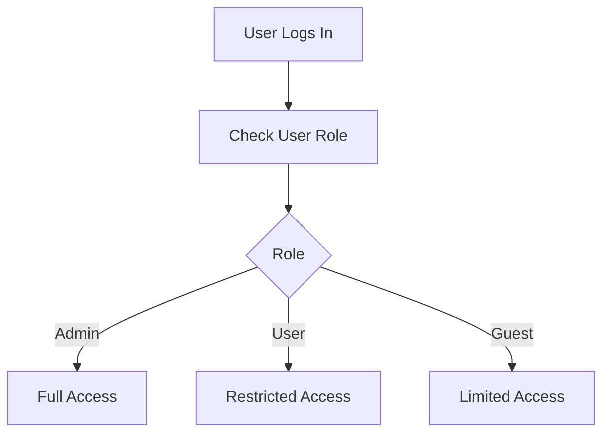
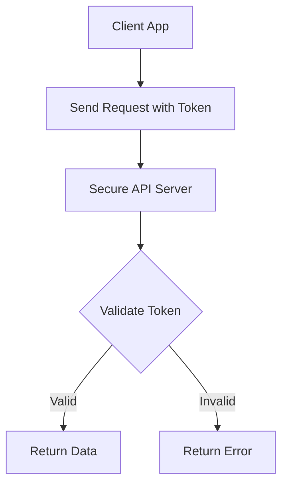
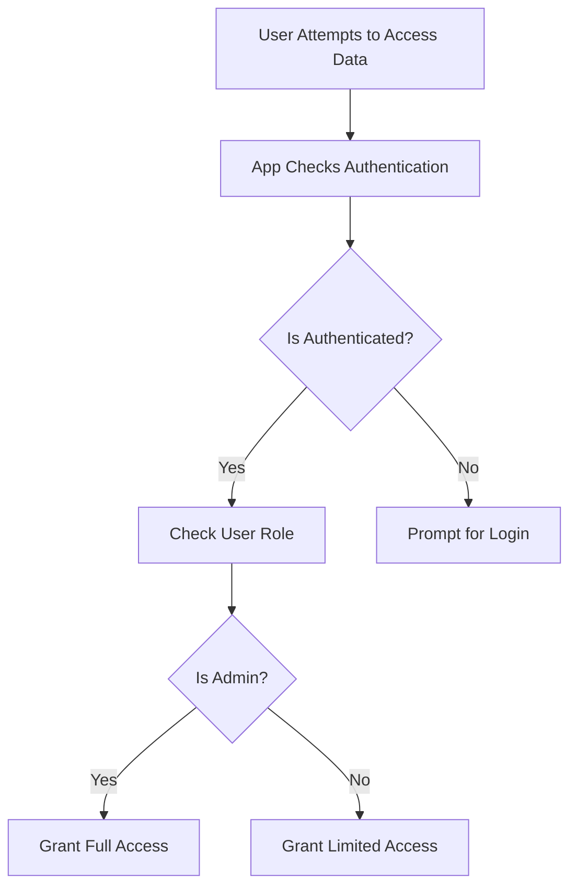

## 9.4.4 Authentication and Security

In the realm of mobile application development, authentication and security are paramount. They serve as the foundation for verifying user identities and safeguarding application data from unauthorized access. This section delves into the intricacies of implementing robust authentication mechanisms and security practices in Flutter applications, with a focus on role-based access control (RBAC) using Firebase Firestore and secure API communication.

### Importance of Authentication and Security

Authentication is the process of verifying the identity of a user or system. It ensures that only authorized users can access certain resources or perform specific actions within an application. Security, on the other hand, encompasses a broader scope, including data protection, secure APIs, and adherence to best practices to prevent unauthorized access and data breaches.

- **User Verification:** Authentication is crucial for confirming user identities, ensuring that only legitimate users gain access to sensitive data and functionalities.
- **Data Protection:** Security measures protect the integrity and confidentiality of data, preventing unauthorized access and ensuring compliance with data protection regulations.
- **Secure APIs:** Implementing secure APIs is essential for protecting data exchanges between the client and server, safeguarding against common vulnerabilities such as man-in-the-middle attacks.

### Implementing Role-Based Access Control (RBAC)

Role-Based Access Control (RBAC) is a method of restricting system access based on user roles and permissions. It is particularly useful in managing complex applications with varying user privileges, ensuring that users have access only to the resources necessary for their roles.

#### Definition

RBAC involves defining roles within an application, assigning permissions to these roles, and then associating users with specific roles. This approach simplifies the management of user permissions and enhances security by adhering to the principle of least privilege.

#### Implementing RBAC with Firebase Firestore

Firebase Firestore provides a flexible and scalable solution for implementing RBAC in Flutter applications. The following steps outline the process of setting up RBAC using Firestore:

##### Step-by-Step Guide

1. **Define Roles:** Determine the different roles within your application, such as Admin, User, and Guest, and outline their respective permissions.

2. **Assign Roles to Users:** Store user roles in Firestore within the user's document. This allows you to easily manage and update user roles as needed.

3. **Restrict Data Access:** Use Firestore security rules to restrict data access based on user roles. This ensures that users can only access data that aligns with their assigned roles.

##### Code Example

Assigning a role to a user in Firestore can be done with the following Dart code:

```dart
// Assigning Role
Future<void> assignRole(String uid, String role) async {
  await FirebaseFirestore.instance.collection('users').doc(uid).update({
    'role': role,
  });
}
```

**Explanation:** This function updates a user's document in Firestore to assign a specific role. The `uid` parameter represents the user's unique identifier, and the `role` parameter specifies the role to be assigned.

##### Firestore Security Rules Example

Firestore security rules are used to enforce access restrictions based on user roles:

```javascript
rules_version = '2';
service cloud.firestore {
  match /databases/{database}/documents {
    match /users/{userId} {
      allow read: if isAuthenticated();
      allow write: if isAdmin();
    }

    match /adminData/{document} {
      allow read, write: if isAdmin();
    }
  }

  function isAuthenticated() {
    return request.auth != null;
  }

  function isAdmin() {
    return isAuthenticated() && get(/databases/$(database)/documents/users/$(request.auth.uid)).data.role == 'admin';
  }
}
```

**Explanation:** These rules allow only authenticated users to read their own data and only admins to write to admin-specific collections. The `isAuthenticated` function checks if the user is authenticated, while the `isAdmin` function verifies if the user has an admin role.

##### Mermaid.js Diagrams

To illustrate how user roles determine access permissions within the application, consider the following access control flowchart:



### Implementing Secure APIs

Secure APIs are essential for protecting data exchanges between the client and server. This section explores techniques such as certificate pinning and API authentication to enhance API security.

#### Certificate Pinning

Certificate pinning is a method used to prevent man-in-the-middle attacks by ensuring that the app only accepts specific server certificates. This technique involves embedding a copy of the server's certificate in the app and comparing it against the certificate presented by the server during SSL/TLS handshake.

##### Implementation Guidance

- Use Flutter plugins like `flutter_ssl_pinning` to implement certificate pinning.
- Regularly update pinned certificates to prevent service disruptions when certificates expire or are reissued.

#### API Authentication

API authentication involves securing APIs using keys, tokens, or OAuth mechanisms to ensure that only authorized clients can access the API.

##### Use of API Keys and Tokens

- **API Keys:** Simple strings that identify the calling project and grant access to the API. They are often used for public APIs.
- **Tokens:** Secure credentials used in OAuth 2.0 to authorize access to resources. Tokens are typically short-lived and can be refreshed.

##### Code Example

The following Dart code demonstrates how to include authentication tokens in HTTP request headers to access secure APIs:

```dart
Future<void> fetchSecureData() async {
  final response = await http.get(
    Uri.parse('https://secureapi.example.com/data'),
    headers: {
      'Authorization': 'Bearer YOUR_ACCESS_TOKEN',
    },
  );

  if (response.statusCode == 200) {
    // Handle data
  } else {
    // Handle error
  }
}
```

**Explanation:** This function sends an HTTP GET request to a secure API, including an authorization token in the request headers. The server validates the token before granting access to the requested data.

##### Mermaid.js Diagrams

The following API authentication flowchart illustrates the process of authenticating API requests using tokens or keys:



### Best Practices

Implementing robust authentication and security measures requires adherence to best practices:

- **Secure Data Transmission:** Always use HTTPS to encrypt data transmitted between the client and server, protecting against eavesdropping and tampering.
- **Least Privilege Principle:** Grant users the minimum level of access required to perform their tasks, reducing the risk of unauthorized access.
- **Regular Security Audits:** Conduct periodic security audits and vulnerability assessments to identify and address potential threats.

### Common Pitfalls

Avoid these common pitfalls to enhance the security of your Flutter applications:

- **Exposing Sensitive Data:** Be cautious not to log or display sensitive information, as this can compromise user privacy and security.
- **Weak Authentication Mechanisms:** Avoid implementing weak or easily guessable authentication methods, which can make the app vulnerable to unauthorized access.

### Implementation Guidance

- **Use Established Security Frameworks:** Leverage established security frameworks and libraries to handle authentication and authorization securely.
- **Keep Security Dependencies Up-to-Date:** Regularly update security dependencies to protect against known vulnerabilities.

### Mermaid.js Diagrams

The following security flowchart illustrates the flow of user authentication, role verification, and secure data access within the application:



By implementing these strategies and adhering to best practices, you can enhance the security of your Flutter applications, ensuring robust user verification and data protection.

## Quiz Time!



### What is the primary purpose of authentication in mobile applications?

- [x] To verify user identities and ensure only authorized access
- [ ] To enhance the application's visual design
- [ ] To improve application performance
- [ ] To increase the app's download speed

> **Explanation:** Authentication is crucial for verifying user identities and ensuring that only authorized users can access certain resources or perform specific actions within an application.

### What does RBAC stand for in the context of application security?

- [x] Role-Based Access Control
- [ ] Resource-Based Access Control
- [ ] Role-Based Authentication Control
- [ ] Resource-Based Authentication Control

> **Explanation:** RBAC stands for Role-Based Access Control, a method of restricting system access based on user roles and permissions.

### In Firebase Firestore, how can you assign a role to a user?

- [x] By updating the user's document with a 'role' field
- [ ] By creating a new collection for each role
- [ ] By using Firebase Authentication directly
- [ ] By modifying the Firestore security rules only

> **Explanation:** Assigning a role to a user in Firestore involves updating the user's document with a 'role' field that specifies their assigned role.

### What is the purpose of Firestore security rules?

- [x] To restrict data access based on user roles and authentication status
- [ ] To enhance the visual layout of the Firestore database
- [ ] To increase the speed of data retrieval
- [ ] To automatically backup Firestore data

> **Explanation:** Firestore security rules are used to enforce access restrictions based on user roles and authentication status, ensuring that users can only access data that aligns with their assigned roles.

### What is certificate pinning used for?

- [x] To prevent man-in-the-middle attacks by ensuring the app only accepts specific server certificates
- [ ] To enhance the app's user interface
- [ ] To increase the app's download speed
- [ ] To reduce the app's memory usage

> **Explanation:** Certificate pinning is a method used to prevent man-in-the-middle attacks by ensuring that the app only accepts specific server certificates during SSL/TLS handshake.

### What is the difference between API keys and tokens?

- [x] API keys are simple strings for identifying projects, while tokens are secure credentials used in OAuth 2.0
- [ ] API keys are used for authentication, while tokens are used for data encryption
- [ ] API keys are more secure than tokens
- [ ] Tokens are used for identifying projects, while API keys are used for authorization

> **Explanation:** API keys are simple strings used for identifying projects and granting access to public APIs, while tokens are secure credentials used in OAuth 2.0 to authorize access to resources.

### Which of the following is a best practice for secure data transmission?

- [x] Always use HTTPS to encrypt data transmitted between the client and server
- [ ] Use HTTP for faster data transmission
- [ ] Encrypt data only when sensitive information is involved
- [ ] Use plain text for all data transmissions

> **Explanation:** Always using HTTPS to encrypt data transmitted between the client and server is a best practice for secure data transmission, protecting against eavesdropping and tampering.

### What is the principle of least privilege?

- [x] Granting users the minimum level of access required to perform their tasks
- [ ] Granting all users full access to all resources
- [ ] Limiting access to only administrators
- [ ] Allowing users to choose their access level

> **Explanation:** The principle of least privilege involves granting users the minimum level of access required to perform their tasks, reducing the risk of unauthorized access.

### Why is it important to keep security dependencies up-to-date?

- [x] To protect against known vulnerabilities and enhance security
- [ ] To improve the application's visual design
- [ ] To increase the app's download speed
- [ ] To reduce the app's memory usage

> **Explanation:** Keeping security dependencies up-to-date is important to protect against known vulnerabilities and enhance the overall security of the application.

### True or False: Exposing sensitive data in logs can compromise user privacy and security.

- [x] True
- [ ] False

> **Explanation:** Exposing sensitive data in logs can indeed compromise user privacy and security, as it may lead to unauthorized access and data breaches.


