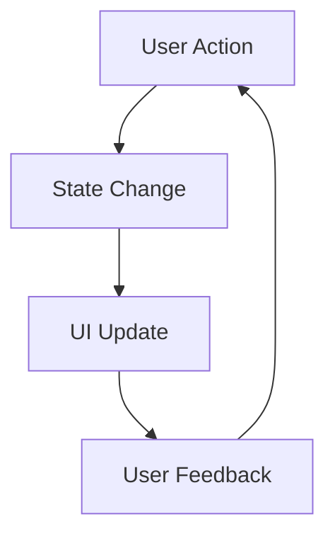

---

linkTitle: "1.1.2 The Importance of State Management"
title: "State Management in Flutter: Importance and Impact on App Performance"
description: "Explore the critical role of state management in Flutter applications, its impact on user experience, and strategies for effective implementation."
categories:
- Flutter Development
- Mobile App Development
- State Management
tags:
- Flutter
- State Management
- User Experience
- App Performance
- Code Optimization
date: 2024-10-25
type: docs
nav_weight: 112000
---

## 1.1.2 The Importance of State Management

State management is a cornerstone of modern application development, especially in frameworks like Flutter, where the user interface is dynamically responsive to changes in data. Understanding the importance of state management is crucial for building efficient, maintainable, and scalable applications. This section delves into why state management matters, its impact on user experience, and how it addresses the complexity of applications.

### Why State Management Matters

State management is the backbone of any interactive application. It refers to the way an application handles data that can change over time, such as user inputs, responses from a server, or changes in the application environment. Proper state management ensures that these changes are reflected in the user interface efficiently and accurately.

- **Efficiency and Performance:** Proper state management minimizes unnecessary re-renders and updates, leading to better performance. When state changes are managed efficiently, the application can update only the parts of the UI that need to change, rather than redrawing the entire screen. This selective updating reduces CPU and memory usage, resulting in a smoother user experience.

- **Maintainability:** A well-managed state leads to cleaner, more organized code. By separating state management from UI logic, developers can more easily understand and modify the application. This separation also facilitates debugging and testing, as the state logic can be tested independently of the UI.

- **Scalability:** As applications grow in complexity, managing state becomes increasingly challenging. Proper state management techniques allow developers to scale applications without a corresponding increase in code complexity. This scalability is achieved by using patterns and libraries that provide a structured way to handle state changes.

#### Consequences of Poor State Management

Failing to manage state effectively can lead to a host of issues:

- **Bugs and Inconsistencies:** Poor state management can result in bugs that are difficult to track down. Inconsistent state can lead to unexpected behavior, such as UI elements not updating correctly or data being lost.

- **Performance Issues:** Without proper state management, applications may suffer from performance bottlenecks. Unnecessary re-renders and excessive computations can slow down the application, leading to a poor user experience.

- **Increased Code Complexity:** As applications grow, managing state without a clear strategy can lead to tangled code that is difficult to maintain and extend. This complexity can slow down development and increase the likelihood of introducing bugs.

### User Experience

State management plays a pivotal role in shaping the user experience. It enables applications to be dynamic and responsive, providing users with real-time feedback and interactions.

- **Dynamic UIs:** State management allows applications to respond to user actions immediately. For example, when a user submits a form, the application can update the UI to show a loading indicator or display a success message once the operation is complete.

- **Interactive Features:** Features such as animations, transitions, and real-time updates rely heavily on state management. By managing state effectively, developers can create seamless and engaging user experiences.

- **Consistency Across Devices:** Proper state management ensures that the application behaves consistently across different devices and platforms. This consistency is crucial for maintaining a unified user experience, regardless of where the application is accessed.

### Complexity in Applications

As applications become more complex, the need for sophisticated state management solutions becomes apparent. Simple state handling techniques, such as using `setState` in Flutter, may suffice for small applications but quickly become inadequate as the application grows.

#### Real-World Scenarios

Consider a real-world scenario where an application needs to manage user authentication, data fetching, and UI updates. Using only `setState` would require manually tracking and updating each piece of state, leading to a tangled web of dependencies and potential bugs.

In contrast, using a state management solution like Provider or Bloc can simplify this process. These solutions provide a structured way to manage state changes, making it easier to handle complex interactions and data flows.

### Code Examples

Let's compare poorly managed state versus well-managed state in code.

#### Poorly Managed State

```dart
class CounterApp extends StatefulWidget {
  @override
  _CounterAppState createState() => _CounterAppState();
}

class _CounterAppState extends State<CounterApp> {
  int _counter = 0;

  void _incrementCounter() {
    setState(() {
      _counter++;
    });
  }

  @override
  Widget build(BuildContext context) {
    return Scaffold(
      appBar: AppBar(
        title: Text('Counter App'),
      ),
      body: Center(
        child: Column(
          mainAxisAlignment: MainAxisAlignment.center,
          children: <Widget>[
            Text(
              'You have pushed the button this many times:',
            ),
            Text(
              '$_counter',
              style: Theme.of(context).textTheme.headline4,
            ),
          ],
        ),
      ),
      floatingActionButton: FloatingActionButton(
        onPressed: _incrementCounter,
        tooltip: 'Increment',
        child: Icon(Icons.add),
      ),
    );
  }
}
```

In this example, the state is managed directly within the widget, which can become cumbersome as the application grows.

#### Well-Managed State with Provider

```dart
import 'package:flutter/material.dart';
import 'package:provider/provider.dart';

void main() {
  runApp(
    ChangeNotifierProvider(
      create: (context) => CounterModel(),
      child: MyApp(),
    ),
  );
}

class MyApp extends StatelessWidget {
  @override
  Widget build(BuildContext context) {
    return MaterialApp(
      home: CounterApp(),
    );
  }
}

class CounterModel extends ChangeNotifier {
  int _counter = 0;

  int get counter => _counter;

  void increment() {
    _counter++;
    notifyListeners();
  }
}

class CounterApp extends StatelessWidget {
  @override
  Widget build(BuildContext context) {
    final counterModel = Provider.of<CounterModel>(context);

    return Scaffold(
      appBar: AppBar(
        title: Text('Counter App with Provider'),
      ),
      body: Center(
        child: Column(
          mainAxisAlignment: MainAxisAlignment.center,
          children: <Widget>[
            Text(
              'You have pushed the button this many times:',
            ),
            Text(
              '${counterModel.counter}',
              style: Theme.of(context).textTheme.headline4,
            ),
          ],
        ),
      ),
      floatingActionButton: FloatingActionButton(
        onPressed: counterModel.increment,
        tooltip: 'Increment',
        child: Icon(Icons.add),
      ),
    );
  }
}
```

In this improved example, the state is managed using a `ChangeNotifier` and `Provider`, which separates the state logic from the UI, making the code more maintainable and scalable.

### Visual Aids

To better understand the impact of state management, consider the following diagram illustrating the flow of state changes in an application:



This diagram shows how user actions lead to state changes, which in turn update the UI and provide feedback to the user. Proper state management ensures that this flow is smooth and efficient.

### Setting the Stage

As we delve deeper into state management in Flutter, it's important to recognize its foundational role. Effective state management is not just about choosing the right library or pattern; it's about understanding how state flows through your application and how to manage it efficiently. This understanding will prepare you for the advanced topics to come, where we will explore various state management solutions and their applications in real-world scenarios.

### Conclusion

State management is a critical aspect of Flutter development that directly impacts application performance, maintainability, and user experience. By adopting effective state management practices, developers can create applications that are not only efficient and scalable but also provide a seamless and engaging user experience. As we continue our journey through state management in Flutter, keep these principles in mind and be prepared to explore the various tools and techniques that can help you manage state effectively.

## Quiz Time!



### Why is state management important in application development?

- [x] It ensures efficient and scalable applications.
- [ ] It makes applications more colorful.
- [ ] It increases the number of lines of code.
- [ ] It prevents the use of widgets.

> **Explanation:** State management is crucial for creating efficient, maintainable, and scalable applications by handling data changes effectively.

### What is a consequence of poor state management?

- [x] Bugs and performance issues.
- [ ] Increased application speed.
- [ ] Simplified code structure.
- [ ] Enhanced user interface design.

> **Explanation:** Poor state management can lead to bugs, performance issues, and increased code complexity.

### How does state management affect user experience?

- [x] It enables dynamic and interactive UIs.
- [ ] It makes the UI static and unresponsive.
- [ ] It removes animations from the UI.
- [ ] It increases the number of buttons in the UI.

> **Explanation:** Proper state management allows for dynamic and interactive user interfaces by efficiently handling state changes.

### What happens when an application grows in complexity?

- [x] More sophisticated state management solutions are needed.
- [ ] The application becomes easier to manage.
- [ ] State management becomes unnecessary.
- [ ] The application automatically optimizes itself.

> **Explanation:** As applications grow in complexity, more sophisticated state management solutions are required to handle the increased demands.

### Which of the following is a benefit of using Provider for state management?

- [x] Separation of state logic from UI.
- [ ] Increased code complexity.
- [x] Improved code maintainability.
- [ ] Reduced application performance.

> **Explanation:** Provider helps separate state logic from UI, improving code maintainability and scalability.

### What does the diagram illustrate in the context of state management?

- [x] The flow of state changes in an application.
- [ ] The structure of a database.
- [ ] The layout of a user interface.
- [ ] The hierarchy of classes in a project.

> **Explanation:** The diagram illustrates how state changes flow through an application, impacting user interactions and UI updates.

### What is a key challenge of managing state in complex applications?

- [x] Increased code complexity and potential for bugs.
- [ ] Decreased need for testing.
- [x] Difficulty in maintaining a clean architecture.
- [ ] Automatic error resolution.

> **Explanation:** Managing state in complex applications can lead to increased code complexity and potential bugs, making it challenging to maintain a clean architecture.

### What is the role of state management in handling user actions?

- [x] It updates the UI based on state changes.
- [ ] It prevents user actions from affecting the UI.
- [ ] It hides user actions from the application.
- [ ] It duplicates user actions in the database.

> **Explanation:** State management updates the UI based on state changes triggered by user actions, ensuring a responsive experience.

### What is a benefit of separating state management from UI logic?

- [x] Easier debugging and testing.
- [ ] Increased dependency on UI components.
- [ ] Reduced application performance.
- [ ] More complex code structure.

> **Explanation:** Separating state management from UI logic makes debugging and testing easier by isolating state logic.

### True or False: Proper state management is only necessary for large applications.

- [ ] True
- [x] False

> **Explanation:** Proper state management is important for applications of all sizes to ensure efficiency, maintainability, and scalability.


