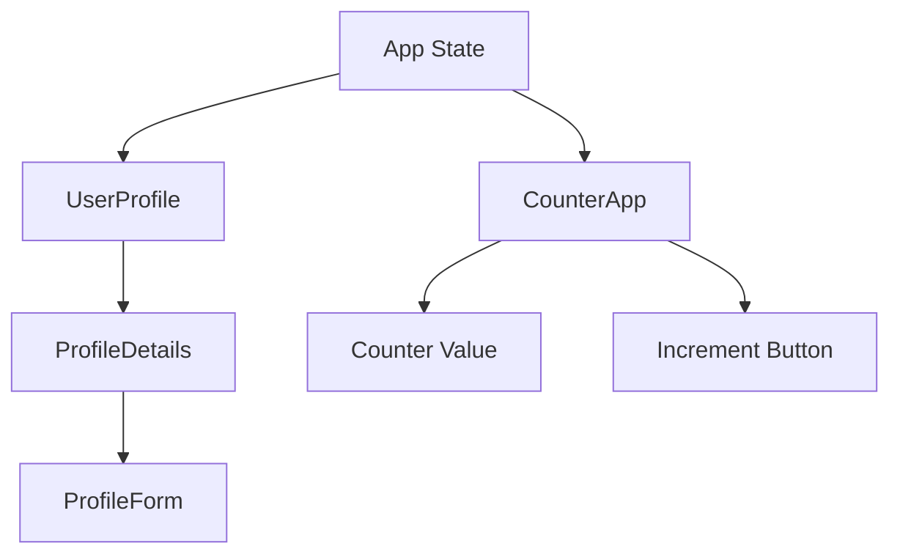

## 1.1.3 Common State Management Challenges

State management is a crucial aspect of building responsive and interactive applications in Flutter. However, it comes with its own set of challenges that developers need to navigate. In this section, we will delve into some of the most common challenges encountered in state management, such as state synchrony across widgets, state persistence, prop drilling, shared state mutations, performance issues, and debugging difficulties. Understanding these challenges is the first step towards mastering state management in Flutter.

### Identifying Challenges

Before diving into specific challenges, let's outline the common hurdles developers face when managing state in Flutter applications:

- **State Synchrony Across Widgets:** Ensuring that multiple widgets reflect the same state changes simultaneously.
- **State Persistence:** Maintaining state across app sessions or when the app is closed and reopened.
- **Prop Drilling:** Passing state through multiple widget layers, leading to complex and hard-to-maintain code.
- **Shared State Mutations:** Unintended changes to shared state can lead to unpredictable behavior.
- **Performance Issues:** Inefficient state management can cause excessive widget rebuilds, degrading app performance.
- **Debugging Difficulties:** Poorly managed state can make debugging and testing more challenging.

Let's explore each of these challenges in detail.

### Prop Drilling

Prop drilling occurs when you pass data through multiple layers of widgets to reach a deeply nested child widget. This can lead to cumbersome and error-prone code, as each intermediary widget must explicitly pass the data along, even if it does not use it.

#### Example of Prop Drilling

Consider a simple app where a user can update their profile information. The profile data needs to be passed from a top-level widget to a deeply nested form widget.

```dart
class UserProfile extends StatelessWidget {
  final User user;

  UserProfile({required this.user});

  @override
  Widget build(BuildContext context) {
    return Scaffold(
      appBar: AppBar(title: Text('User Profile')),
      body: ProfileDetails(user: user),
    );
  }
}

class ProfileDetails extends StatelessWidget {
  final User user;

  ProfileDetails({required this.user});

  @override
  Widget build(BuildContext context) {
    return Column(
      children: [
        Text('Name: ${user.name}'),
        ProfileForm(user: user),
      ],
    );
  }
}

class ProfileForm extends StatelessWidget {
  final User user;

  ProfileForm({required this.user});

  @override
  Widget build(BuildContext context) {
    return TextFormField(
      initialValue: user.name,
      onChanged: (value) {
        // Update user name
      },
    );
  }
}
```

In this example, the `User` object is passed through `UserProfile` to `ProfileDetails` and finally to `ProfileForm`. This can become unwieldy as the widget tree grows.

#### Challenges with Prop Drilling

- **Maintenance Difficulty:** As the widget tree grows, maintaining the code becomes more challenging.
- **Increased Complexity:** Each widget in the hierarchy must handle data it does not directly use.
- **Error-Prone:** Increases the risk of bugs due to the manual passing of data.

### State Mutations

State mutations refer to changes in the state that are not intended or are handled improperly, leading to unpredictable UI behavior. This often occurs when state is mutable and shared across different parts of the application.

#### Problems with Unintended State Mutations

- **Unpredictable UI Behavior:** The UI may not reflect the current state accurately, leading to inconsistencies.
- **Difficult Debugging:** Tracking down the source of unintended mutations can be challenging.
- **Race Conditions:** Concurrent updates to shared state can lead to race conditions, especially in asynchronous operations.

#### Example of State Mutation Issue

```dart
class Counter {
  int value = 0;

  void increment() {
    value++;
  }
}

void main() {
  Counter counter = Counter();
  counter.increment();
  print(counter.value); // Output: 1
  // Unintended mutation
  counter.value = 10;
  print(counter.value); // Output: 10
}
```

In this example, the `Counter` class allows direct mutation of its `value` property, which can lead to unintended changes.

#### Best Practices to Avoid State Mutations

- **Immutability:** Use immutable data structures to prevent unintended changes.
- **Encapsulation:** Encapsulate state changes within well-defined methods or functions.

### Performance Issues

Inefficient state management can lead to unnecessary widget rebuilds, which degrade app performance. Flutter's reactive framework rebuilds widgets in response to state changes, so it's crucial to manage these changes efficiently.

#### Causes of Performance Issues

- **Excessive Rebuilds:** Triggering rebuilds for widgets that do not need to change.
- **Inefficient State Updates:** Updating state in a way that causes more rebuilds than necessary.

#### Example of Inefficient State Management

```dart
class CounterApp extends StatefulWidget {
  @override
  _CounterAppState createState() => _CounterAppState();
}

class _CounterAppState extends State<CounterApp> {
  int counter = 0;

  void incrementCounter() {
    setState(() {
      counter++;
    });
  }

  @override
  Widget build(BuildContext context) {
    return Column(
      children: [
        Text('Counter: $counter'),
        ElevatedButton(
          onPressed: incrementCounter,
          child: Text('Increment'),
        ),
      ],
    );
  }
}
```

In this example, every call to `setState` rebuilds the entire widget tree, even if only the `Text` widget needs to change.

#### Strategies for Performance Optimization

- **Selective Rebuilds:** Use techniques like `ValueListenableBuilder` or `Selector` to rebuild only the widgets that need to change.
- **Efficient State Management Libraries:** Consider using libraries that optimize state updates, such as `Provider` or `Riverpod`.

### Debugging Difficulties

Improper state management can make debugging and testing more challenging. When state changes are not well-defined or predictable, it becomes difficult to trace the source of bugs or ensure the application behaves as expected.

#### Challenges in Debugging State Management

- **Complex State Transitions:** Difficulty in tracking state changes across multiple components.
- **Lack of Traceability:** Hard to determine the origin of state changes.
- **Testing Complexity:** Difficult to write tests for components with poorly managed state.

#### Tools and Techniques for Easier Debugging

- **State Management Libraries:** Use libraries that provide better state traceability and debugging tools.
- **Logging and Monitoring:** Implement logging to track state changes and identify issues.
- **Testing Frameworks:** Use testing frameworks to write unit and integration tests for state logic.

### Visualizing State Challenges with Mermaid.js

To better understand the flow of state and where challenges arise, let's visualize a simple widget tree with state management issues using Mermaid.js.



In this diagram, we see the flow of state through the widget tree. Challenges such as prop drilling and excessive rebuilds can be identified at various points.

### Foreshadowing Solutions

While these challenges can seem daunting, the upcoming chapters will equip you with tools and techniques to overcome them. We will explore various state management solutions, such as `Provider`, `Riverpod`, `Bloc`, and more, each offering unique approaches to managing state efficiently and effectively.

Stay tuned as we delve deeper into these solutions, providing practical examples and strategies to tackle the common challenges of state management in Flutter.

## Quiz Time!



### What is prop drilling in Flutter?

- [x] Passing state through multiple widget layers
- [ ] Using a global state management solution
- [ ] Directly mutating state objects
- [ ] Implementing state persistence

> **Explanation:** Prop drilling refers to the process of passing state down through multiple layers of widgets, which can lead to cumbersome and hard-to-maintain code.

### What problem can arise from unintended state mutations?

- [x] Unpredictable UI behavior
- [ ] Improved performance
- [ ] Simplified debugging
- [ ] Enhanced state persistence

> **Explanation:** Unintended state mutations can lead to unpredictable UI behavior because the UI may not accurately reflect the current state.

### How can excessive widget rebuilds affect app performance?

- [x] They can degrade app performance
- [ ] They can improve app performance
- [ ] They have no impact on app performance
- [ ] They enhance state persistence

> **Explanation:** Excessive widget rebuilds can degrade app performance by causing unnecessary processing and rendering.

### Which practice can help avoid unintended state mutations?

- [x] Using immutable data structures
- [ ] Directly mutating state objects
- [ ] Avoiding encapsulation
- [ ] Using global variables

> **Explanation:** Using immutable data structures helps prevent unintended changes to state, leading to more predictable behavior.

### What is a common challenge in debugging state management?

- [x] Complex state transitions
- [ ] Simplified state updates
- [ ] Enhanced traceability
- [ ] Reduced testing complexity

> **Explanation:** Complex state transitions can make it difficult to trace state changes and identify the source of bugs.

### What is a benefit of using state management libraries?

- [x] Better state traceability
- [ ] Increased prop drilling
- [ ] More complex code
- [ ] Reduced performance

> **Explanation:** State management libraries often provide better state traceability and debugging tools, making it easier to manage state.

### How can you optimize performance in state management?

- [x] Use selective rebuilds
- [ ] Trigger rebuilds for all widgets
- [ ] Avoid using state management libraries
- [ ] Use global variables for state

> **Explanation:** Using selective rebuilds ensures that only the widgets that need to change are rebuilt, optimizing performance.

### What is a common issue with prop drilling?

- [x] Increased maintenance difficulty
- [ ] Simplified code structure
- [ ] Enhanced performance
- [ ] Improved state persistence

> **Explanation:** Prop drilling increases maintenance difficulty because each widget in the hierarchy must handle data it does not directly use.

### Which tool can help with state debugging?

- [x] Logging and monitoring
- [ ] Avoiding state management libraries
- [ ] Using global variables
- [ ] Directly mutating state objects

> **Explanation:** Implementing logging and monitoring helps track state changes and identify issues, aiding in debugging.

### True or False: State management challenges are unique to Flutter.

- [ ] True
- [x] False

> **Explanation:** State management challenges are not unique to Flutter; they are common in many frameworks and platforms.


