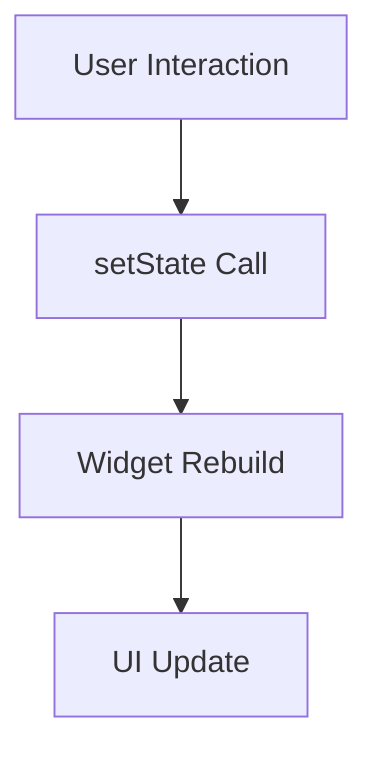
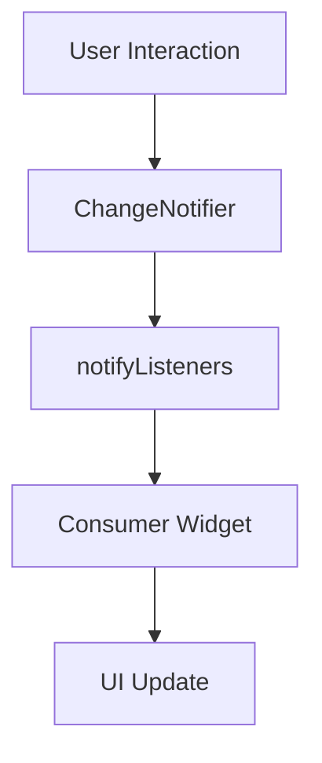
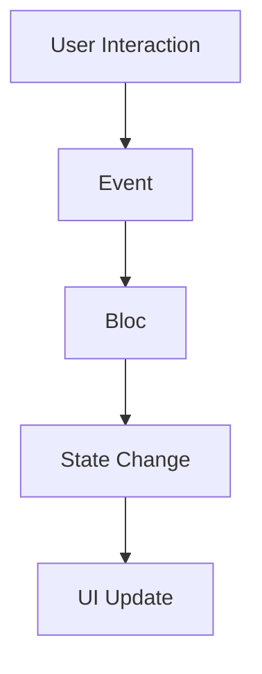

## 1.1.4 Overview of State Management Solutions

In the world of Flutter development, managing state effectively is crucial for building responsive and scalable applications. This section provides a comprehensive overview of the state management solutions available in Flutter, ranging from basic to advanced techniques. We'll explore the unique features, use cases, and advantages of each approach, helping you make informed decisions for your projects.

### State Management Spectrum

Flutter offers a diverse range of state management solutions, each suited to different levels of complexity and project requirements. Understanding this spectrum is vital for selecting the right tool for your application. Let's delve into the various options available:

- **Basic Solutions:** Ideal for simple applications or components with minimal state management needs.
- **Intermediate Solutions:** Suitable for applications with moderate complexity, requiring more structured state handling.
- **Advanced Solutions:** Designed for complex, large-scale applications that demand robust state management and scalability.

### Quick Introductions

#### setState

`setState` is the most basic form of state management in Flutter. It is built into the framework and is used to update the state of a widget, causing it to rebuild.

- **Primary Use Cases:** Simple applications or individual widgets with local state changes.
- **Advantages:** Easy to use and understand, minimal setup required.

```dart
class CounterWidget extends StatefulWidget {
  @override
  _CounterWidgetState createState() => _CounterWidgetState();
}

class _CounterWidgetState extends State<CounterWidget> {
  int _counter = 0;

  void _incrementCounter() {
    setState(() {
      _counter++;
    });
  }

  @override
  Widget build(BuildContext context) {
    return Column(
      children: <Widget>[
        Text('Counter: $_counter'),
        ElevatedButton(
          onPressed: _incrementCounter,
          child: Text('Increment'),
        ),
      ],
    );
  }
}
```

#### InheritedWidget

`InheritedWidget` provides a way to pass data down the widget tree without needing to pass it through constructors.

- **Primary Use Cases:** Sharing state across multiple widgets in a subtree.
- **Advantages:** Efficient for propagating changes to descendant widgets.

```dart
class MyInheritedWidget extends InheritedWidget {
  final int data;

  MyInheritedWidget({Key? key, required this.data, required Widget child})
      : super(key: key, child: child);

  @override
  bool updateShouldNotify(MyInheritedWidget oldWidget) {
    return oldWidget.data != data;
  }

  static MyInheritedWidget? of(BuildContext context) {
    return context.dependOnInheritedWidgetOfExactType<MyInheritedWidget>();
  }
}
```

#### Provider

`Provider` is a popular state management library that simplifies the process of managing state in Flutter applications.

- **Primary Use Cases:** Applications requiring dependency injection and reactive state management.
- **Advantages:** Easy to integrate, good community support, and works well with ChangeNotifier.

```dart
class Counter with ChangeNotifier {
  int _count = 0;

  int get count => _count;

  void increment() {
    _count++;
    notifyListeners();
  }
}

// Usage in a widget
Provider<Counter>(
  create: (_) => Counter(),
  child: Consumer<Counter>(
    builder: (context, counter, child) => Text('Count: ${counter.count}'),
  ),
)
```

#### Riverpod

`Riverpod` is an improvement over Provider, offering a more robust and flexible approach to state management.

- **Primary Use Cases:** Applications needing a more scalable and testable state management solution.
- **Advantages:** Eliminates the need for context, supports asynchronous programming, and is highly testable.

```dart
final counterProvider = StateProvider<int>((ref) => 0);

// Usage in a widget
Consumer(
  builder: (context, watch, child) {
    final count = watch(counterProvider).state;
    return Text('Count: $count');
  },
)
```

#### Bloc

`Bloc` (Business Logic Component) is a pattern that separates business logic from UI, using streams to manage state.

- **Primary Use Cases:** Large applications with complex state management needs.
- **Advantages:** Promotes a clean architecture, highly testable, and supports reactive programming.

```dart
class CounterCubit extends Cubit<int> {
  CounterCubit() : super(0);

  void increment() => emit(state + 1);
}

// Usage in a widget
BlocBuilder<CounterCubit, int>(
  builder: (context, count) {
    return Text('Count: $count');
  },
)
```

#### Redux

`Redux` is a predictable state container for managing application state, inspired by the Redux pattern in JavaScript.

- **Primary Use Cases:** Applications requiring a single source of truth for state management.
- **Advantages:** Predictable state changes, great for debugging, and supports middleware.

```dart
final store = Store<int>(counterReducer, initialState: 0);

int counterReducer(int state, dynamic action) {
  if (action == 'INCREMENT') {
    return state + 1;
  }
  return state;
}

// Usage in a widget
StoreConnector<int, String>(
  converter: (store) => store.state.toString(),
  builder: (context, count) {
    return Text('Count: $count');
  },
)
```

#### MobX

`MobX` is a library that brings reactive programming to Flutter, allowing for automatic updates to the UI when state changes.

- **Primary Use Cases:** Applications needing reactive state management with minimal boilerplate.
- **Advantages:** Simple to use, automatic state updates, and supports computed values.

```dart
class Counter {
  final _count = Observable(0);

  int get count => _count.value;

  Action increment;

  Counter() {
    increment = Action(() => _count.value++);
  }
}

// Usage in a widget
Observer(
  builder: (_) => Text('Count: ${counter.count}'),
)
```

### Comparison Table

Below is a comparison table of the state management solutions based on various factors:

| Solution      | Complexity | Scalability | Community Support | Learning Curve |
|---------------|------------|-------------|-------------------|----------------|
| setState      | Low        | Low         | High              | Easy           |
| InheritedWidget | Medium   | Medium      | Medium            | Moderate       |
| Provider      | Medium     | High        | High              | Moderate       |
| Riverpod      | Medium     | High        | Growing           | Moderate       |
| Bloc          | High       | High        | High              | Steep          |
| Redux         | High       | High        | High              | Steep          |
| MobX          | Medium     | High        | Medium            | Moderate       |

### When to Use What

Choosing the right state management solution depends on several factors, including the size of your project, team expertise, and specific requirements. Here are some guidelines:

- **Small Projects or Prototypes:** Use `setState` or `InheritedWidget` for simplicity and ease of use.
- **Medium-Sized Applications:** Consider `Provider` or `Riverpod` for better scalability and reactive programming.
- **Large-Scale Applications:** Opt for `Bloc` or `Redux` to manage complex state transitions and ensure a clean architecture.
- **Reactive Programming Needs:** Use `MobX` for applications that benefit from automatic state updates and minimal boilerplate.

### Evolution of State Management

Flutter's state management approaches have evolved significantly over time. Initially, `setState` and `InheritedWidget` were the primary tools available. As the community grew, more sophisticated solutions like `Provider`, `Bloc`, and `Redux` emerged, offering better scalability and maintainability. Recently, `Riverpod` has gained popularity for its simplicity and flexibility, while `MobX` provides a reactive approach with minimal boilerplate.

### Visual Diagrams

To better understand how data flows in different state management approaches, let's look at some visual diagrams:

#### setState Data Flow



#### Provider Data Flow



#### Bloc Data Flow



### Preparing the Reader

As you explore these state management solutions, consider your specific needs and be open to learning multiple approaches. Each solution has its strengths and weaknesses, and understanding them will help you choose the best fit for your project. Experiment with different techniques, and don't hesitate to mix and match solutions to achieve optimal results.

## Quiz Time!



### Which state management solution is best suited for simple applications with minimal state changes?

- [x] setState
- [ ] Bloc
- [ ] Redux
- [ ] MobX

> **Explanation:** `setState` is ideal for simple applications or individual widgets with minimal state changes.

### What is the primary advantage of using Provider in Flutter applications?

- [ ] It is the most complex solution.
- [x] It simplifies dependency injection and reactive state management.
- [ ] It uses streams for state management.
- [ ] It is the only solution for large-scale applications.

> **Explanation:** Provider simplifies dependency injection and reactive state management, making it popular for medium-sized applications.

### Which solution is known for promoting a clean architecture by separating business logic from UI?

- [ ] setState
- [ ] InheritedWidget
- [x] Bloc
- [ ] MobX

> **Explanation:** Bloc promotes a clean architecture by separating business logic from UI, using streams for state management.

### When should you consider using Redux for state management in Flutter?

- [ ] For small projects with minimal state.
- [x] For applications requiring a single source of truth for state management.
- [ ] When you need automatic state updates.
- [ ] For applications with no state management needs.

> **Explanation:** Redux is suitable for applications requiring a single source of truth for state management, offering predictability and scalability.

### Which state management solution offers automatic updates to the UI when state changes?

- [ ] setState
- [ ] Redux
- [ ] Bloc
- [x] MobX

> **Explanation:** MobX provides automatic updates to the UI when state changes, thanks to its reactive programming approach.

### What is a key benefit of using Riverpod over Provider?

- [ ] It is more complex.
- [x] It eliminates the need for context and supports asynchronous programming.
- [ ] It is less flexible.
- [ ] It has less community support.

> **Explanation:** Riverpod eliminates the need for context, supports asynchronous programming, and is highly testable.

### Which solution is recommended for large-scale applications with complex state transitions?

- [ ] setState
- [ ] InheritedWidget
- [x] Bloc
- [ ] MobX

> **Explanation:** Bloc is recommended for large-scale applications with complex state transitions due to its clean architecture and scalability.

### How has Flutter's state management evolved over time?

- [x] From basic solutions like setState to more robust solutions like Provider and Bloc.
- [ ] From complex solutions to simpler ones.
- [ ] It has remained the same since its inception.
- [ ] It has become less flexible over time.

> **Explanation:** Flutter's state management has evolved from basic solutions like setState to more robust solutions like Provider and Bloc, offering better scalability and maintainability.

### Which solution is known for its minimal boilerplate and reactive programming approach?

- [ ] Redux
- [ ] Bloc
- [ ] setState
- [x] MobX

> **Explanation:** MobX is known for its minimal boilerplate and reactive programming approach, providing automatic state updates.

### True or False: InheritedWidget is suitable for sharing state across multiple widgets in a subtree.

- [x] True
- [ ] False

> **Explanation:** True. InheritedWidget is suitable for sharing state across multiple widgets in a subtree, making it efficient for propagating changes.


