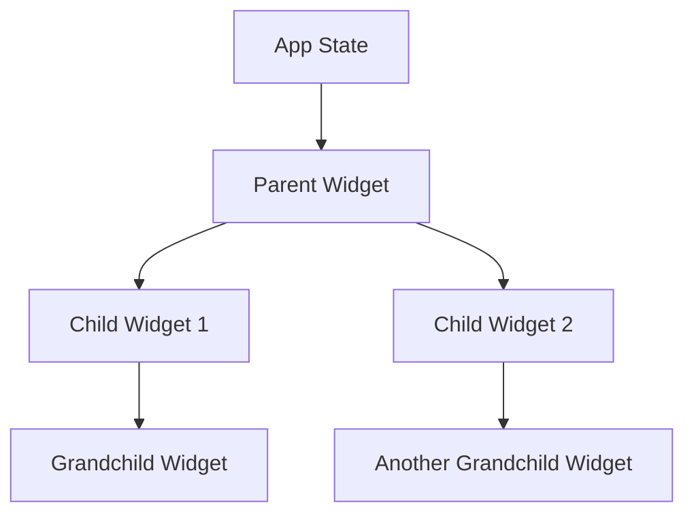

## 1.2.1 Flutter's Reactive Paradigm

Flutter's reactive paradigm is a cornerstone of its architecture, enabling developers to build highly interactive and responsive applications. This section delves into the principles of reactive programming, the observer pattern, and how Flutter employs these concepts to manage state changes and update the UI efficiently.

### Reactive Programming Basics

Reactive programming is a declarative programming paradigm concerned with data streams and the propagation of change. It allows developers to express dynamic behavior through the use of data flows and the automatic propagation of changes. In Flutter, reactive programming is implemented through its widget system, where widgets react to changes in state.

#### Principles of Reactive Programming

- **Data Streams:** Reactive programming revolves around the concept of data streams, which are sequences of ongoing events ordered in time. These streams can be listened to and reacted upon, making it easier to manage asynchronous data.
  
- **Propagation of Change:** When a change occurs in the data stream, it automatically propagates through the system, updating all dependent components. This is achieved through the observer pattern, where observers (widgets) react to changes in the observed state.

- **Declarative UI:** In a reactive system, the UI is described declaratively. Instead of describing how to change the UI, you describe what the UI should look like for a given state. Flutter's widget tree is a perfect example of this approach, where the UI is rebuilt in response to state changes.

#### The Observer Pattern in Flutter

The observer pattern is a software design pattern in which an object, known as the subject, maintains a list of its dependents, called observers, and notifies them of any state changes. In Flutter, widgets act as observers that listen for changes in state and rebuild themselves accordingly.

- **Widgets as Observers:** Each widget in Flutter can be thought of as an observer that listens for changes in the state. When the state changes, the widget rebuilds itself to reflect the new state.

- **State Management:** Flutter provides various mechanisms for managing state, such as `setState`, `InheritedWidget`, and third-party libraries like Provider and Riverpod, all of which utilize the observer pattern to some extent.

### State Changes Trigger UI Updates

In Flutter, state changes trigger automatic UI updates, ensuring that the UI always reflects the current state of the application. This is achieved through the `setState` method, which marks a widget as needing to be rebuilt.

#### Using `setState` in Flutter

The `setState` method is a fundamental part of Flutter's state management. It is used to notify the framework that the internal state of a widget has changed and that the widget should be rebuilt.

```dart
import 'package:flutter/material.dart';

void main() => runApp(MyApp());

class MyApp extends StatelessWidget {
  @override
  Widget build(BuildContext context) {
    return MaterialApp(
      home: CounterScreen(),
    );
  }
}

class CounterScreen extends StatefulWidget {
  @override
  _CounterScreenState createState() => _CounterScreenState();
}

class _CounterScreenState extends State<CounterScreen> {
  int _counter = 0;

  void _incrementCounter() {
    setState(() {
      _counter++;
    });
  }

  @override
  Widget build(BuildContext context) {
    return Scaffold(
      appBar: AppBar(
        title: Text('Counter App'),
      ),
      body: Center(
        child: Column(
          mainAxisAlignment: MainAxisAlignment.center,
          children: <Widget>[
            Text(
              'You have pushed the button this many times:',
            ),
            Text(
              '$_counter',
              style: Theme.of(context).textTheme.headline4,
            ),
          ],
        ),
      ),
      floatingActionButton: FloatingActionButton(
        onPressed: _incrementCounter,
        tooltip: 'Increment',
        child: Icon(Icons.add),
      ),
    );
  }
}
```

In this example, the `setState` method is used to update the `_counter` variable. When `_incrementCounter` is called, `setState` triggers a rebuild of the `CounterScreen` widget, updating the displayed counter value.

### Data Flow in Flutter

Flutter employs a unidirectional data flow, which is crucial for maintaining predictable state changes and ensuring that the UI accurately reflects the current state.

#### Unidirectional Data Flow

Unidirectional data flow means that data flows in a single direction, from parent to child. This approach simplifies state management by making it easier to track how data changes over time.

- **Data Flow Direction:** In Flutter, data typically flows from the top of the widget tree to the bottom. Parent widgets pass data down to child widgets, which can then render the data or pass it further down the tree.

- **State Lifting:** When a child widget needs to modify data, it must notify its parent, which can then update the state and pass the new data back down the tree. This process is known as "lifting state up."



This diagram illustrates the unidirectional data flow in a Flutter application, where the app state is managed at the top level and passed down through the widget tree.

### Advantages of Reactivity

The reactive paradigm offers several advantages that make it an ideal choice for building modern applications.

- **Declarative UI:** By describing the UI declaratively, developers can focus on what the UI should look like rather than how to achieve it, leading to more concise and readable code.

- **Easier State Tracking:** With reactive programming, state changes are automatically propagated throughout the application, making it easier to track and manage state.

- **Improved Performance:** Flutter's efficient widget rebuilding mechanism ensures that only the parts of the UI that need to change are rebuilt, leading to better performance.

### Potential Pitfalls

While the reactive paradigm offers many benefits, it also presents certain challenges that developers must be aware of.

- **Over-Rebuilding Widgets:** One common pitfall is over-rebuilding widgets, which can lead to performance issues. Developers should ensure that only the necessary widgets are rebuilt in response to state changes.

- **Complex State Management:** As applications grow in complexity, managing state can become challenging. It's important to choose the right state management solution and architecture to avoid these issues.

### Conclusion

Understanding Flutter's reactive paradigm is essential for building efficient and responsive applications. By leveraging reactive programming principles, developers can create applications that are both performant and easy to maintain. As you continue to explore Flutter, consider experimenting with different state management solutions to find the one that best fits your needs.

## Quiz Time!



### What is a key principle of reactive programming in Flutter?

- [x] Data streams and automatic propagation of changes
- [ ] Imperative UI updates
- [ ] Bidirectional data flow
- [ ] Manual state management

> **Explanation:** Reactive programming in Flutter revolves around data streams and the automatic propagation of changes, allowing for a declarative UI approach.

### How does the observer pattern relate to Flutter's widgets?

- [x] Widgets act as observers that listen for state changes
- [ ] Widgets directly modify the state
- [ ] Widgets ignore state changes
- [ ] Widgets are not related to the observer pattern

> **Explanation:** In Flutter, widgets act as observers that listen for changes in state and rebuild themselves accordingly.

### What does the `setState` method do in Flutter?

- [x] Marks a widget as needing to be rebuilt
- [ ] Deletes the current state
- [ ] Creates a new widget
- [ ] Initializes the app

> **Explanation:** The `setState` method is used to notify the framework that the internal state of a widget has changed, prompting a rebuild.

### What is unidirectional data flow?

- [x] Data flows in a single direction from parent to child
- [ ] Data flows in both directions between widgets
- [ ] Data is static and does not flow
- [ ] Data flows randomly in the widget tree

> **Explanation:** Unidirectional data flow means that data flows in a single direction, from parent to child, simplifying state management.

### What is a potential pitfall of Flutter's reactive paradigm?

- [x] Over-rebuilding widgets
- [ ] Lack of UI updates
- [ ] Bidirectional data flow
- [ ] Manual state tracking

> **Explanation:** Over-rebuilding widgets can lead to performance issues, making it important to manage widget rebuilds efficiently.

### What is the benefit of a declarative UI in Flutter?

- [x] More concise and readable code
- [ ] More complex code
- [ ] Manual UI updates
- [ ] Static UI design

> **Explanation:** A declarative UI allows developers to describe what the UI should look like, leading to more concise and readable code.

### How can developers avoid over-rebuilding widgets?

- [x] Ensure only necessary widgets are rebuilt
- [ ] Rebuild all widgets on every state change
- [ ] Avoid using `setState`
- [ ] Use bidirectional data flow

> **Explanation:** Developers should ensure that only the necessary widgets are rebuilt in response to state changes to avoid performance issues.

### What is the role of state lifting in unidirectional data flow?

- [x] Allows child widgets to notify parents to update state
- [ ] Allows parents to ignore child widgets
- [ ] Prevents state changes
- [ ] Directly modifies child widget state

> **Explanation:** State lifting involves child widgets notifying their parents to update state, which is then passed back down the widget tree.

### What is the main advantage of using reactive programming in Flutter?

- [x] Easier state tracking and management
- [ ] Manual UI updates
- [ ] Static data flow
- [ ] Complex state management

> **Explanation:** Reactive programming allows for easier state tracking and management through automatic propagation of changes.

### True or False: In Flutter, widgets can directly modify the state.

- [ ] True
- [x] False

> **Explanation:** In Flutter, widgets act as observers and do not directly modify the state. They listen for state changes and rebuild themselves accordingly.


