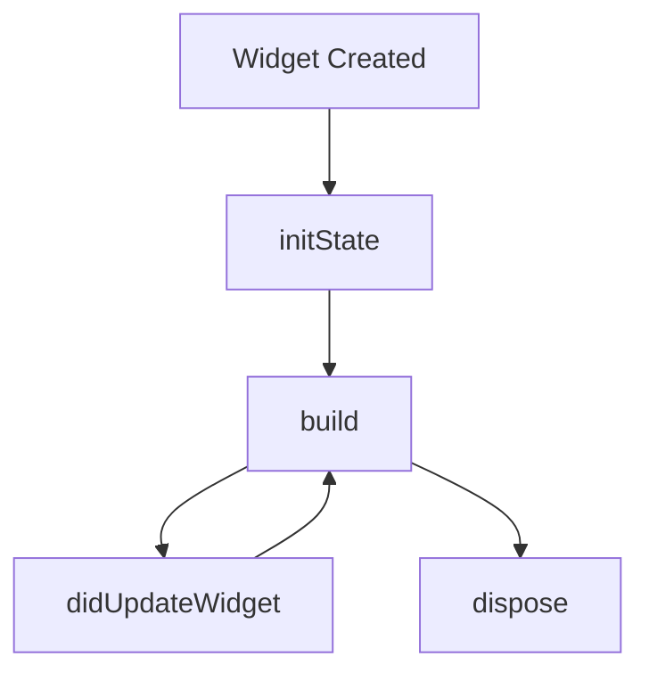

## 1.2.2 Stateless vs. Stateful Widgets

In Flutter, understanding the distinction between `StatelessWidget` and `StatefulWidget` is crucial for effective app development. These two types of widgets form the backbone of Flutter's reactive framework, each serving distinct purposes and offering unique capabilities. This section delves into their definitions, lifecycle methods, state management capabilities, performance considerations, and best practices for choosing between them.

### Definition and Differences

#### StatelessWidget

A `StatelessWidget` is a widget that does not require mutable state. It is immutable, meaning that once it is built, it cannot change. Stateless widgets are ideal for UI components that do not change dynamically over time, such as static text, icons, or images.

**Key Characteristics:**
- **Immutable:** Once created, the widget's properties cannot change.
- **Lightweight:** Since they do not manage state, they are generally more efficient.
- **Use Cases:** Ideal for static UI elements or components that depend on external state management solutions.

**Example:**
```dart
import 'package:flutter/material.dart';

class MyStatelessWidget extends StatelessWidget {
  final String title;

  MyStatelessWidget({required this.title});

  @override
  Widget build(BuildContext context) {
    return Text(title);
  }
}
```

#### StatefulWidget

A `StatefulWidget`, on the other hand, can change its state over time. It is used for components that need to rebuild dynamically in response to user interactions or other events.

**Key Characteristics:**
- **Mutable:** Can change state and trigger UI updates.
- **Lifecycle Management:** Requires careful handling of lifecycle methods.
- **Use Cases:** Suitable for interactive components like forms, animations, or any UI that changes based on user input.

**Example:**
```dart
import 'package:flutter/material.dart';

class MyStatefulWidget extends StatefulWidget {
  @override
  _MyStatefulWidgetState createState() => _MyStatefulWidgetState();
}

class _MyStatefulWidgetState extends State<MyStatefulWidget> {
  int _counter = 0;

  void _incrementCounter() {
    setState(() {
      _counter++;
    });
  }

  @override
  Widget build(BuildContext context) {
    return Column(
      children: [
        Text('Counter: $_counter'),
        ElevatedButton(
          onPressed: _incrementCounter,
          child: Text('Increment'),
        ),
      ],
    );
  }
}
```

### Lifecycle Methods

Understanding the lifecycle of a `StatefulWidget` is essential for managing state effectively and ensuring optimal performance.

#### initState

The `initState` method is called once when the `State` object is created. It is used for initializing data or subscribing to services.

```dart
@override
void initState() {
  super.initState();
  // Initialization code here
}
```

#### build

The `build` method is called whenever the widget needs to be rendered. It should be pure, meaning it should not have side effects.

```dart
@override
Widget build(BuildContext context) {
  return Container(); // Return the widget tree
}
```

#### didUpdateWidget

The `didUpdateWidget` method is called whenever the widget configuration changes. It is useful for updating the state when the parent widget changes.

```dart
@override
void didUpdateWidget(MyStatefulWidget oldWidget) {
  super.didUpdateWidget(oldWidget);
  // Update state if needed
}
```

#### dispose

The `dispose` method is called when the `State` object is removed permanently. It is used for cleanup, such as unsubscribing from services.

```dart
@override
void dispose() {
  // Cleanup code here
  super.dispose();
}
```

### State Management within Widgets

In a `StatefulWidget`, state is stored in a separate `State` object. This allows the widget to rebuild when the state changes.

**Managing State:**
- **setState:** The `setState` method is used to update the state and trigger a rebuild.
- **Limitations:** State confined to a single widget can lead to challenges in managing complex state across multiple widgets.

**Example:**
```dart
void _updateState() {
  setState(() {
    // Update state variables
  });
}
```

### Performance Considerations

Improper use of `StatefulWidget` can lead to performance issues, such as unnecessary rebuilds or memory leaks.

**Tips for Optimal Performance:**
- **Minimize Rebuilds:** Use `setState` judiciously to avoid excessive widget rebuilds.
- **Dispose Resources:** Always dispose of resources in the `dispose` method to prevent memory leaks.
- **Use Keys:** Use keys to preserve the state of widgets when their position in the widget tree changes.

### Best Practices

Choosing between `StatelessWidget` and `StatefulWidget` depends on the specific requirements of your application.

**Guidelines:**
- **Use StatelessWidget:** When the widget does not need to manage state internally.
- **Use StatefulWidget:** When the widget needs to manage its own state or respond to user interactions.
- **Consider Performance:** Opt for `StatelessWidget` where possible to take advantage of its lightweight nature.

### Visual Aids

Below is a diagram illustrating the lifecycle of a `StatefulWidget`:



This diagram shows the flow from widget creation to disposal, highlighting the key lifecycle methods.

### Conclusion

Understanding the differences between `StatelessWidget` and `StatefulWidget` is fundamental for building efficient and responsive Flutter applications. By leveraging the appropriate widget type and adhering to best practices, developers can create robust applications that provide a seamless user experience.

### Further Reading

For more information on Flutter widgets and state management, consider exploring the following resources:
- [Flutter Documentation](https://flutter.dev/docs)
- [State Management in Flutter](https://flutter.dev/docs/development/data-and-backend/state-mgmt/intro)
- [Effective Dart](https://dart.dev/guides/language/effective-dart)

## Quiz Time!



### What is a key characteristic of a StatelessWidget?

- [x] Immutable
- [ ] Mutable
- [ ] Requires lifecycle management
- [ ] Manages its own state

> **Explanation:** A StatelessWidget is immutable, meaning its properties cannot change once it is built.

### When should you use a StatefulWidget?

- [x] When the widget needs to manage its own state
- [ ] For static UI components
- [ ] When performance is a primary concern
- [ ] When the widget does not change over time

> **Explanation:** A StatefulWidget is used when a widget needs to manage its own state or respond to user interactions.

### Which lifecycle method is called when a StatefulWidget is first created?

- [x] initState
- [ ] build
- [ ] didUpdateWidget
- [ ] dispose

> **Explanation:** The initState method is called once when the State object is created.

### What is the purpose of the dispose method in a StatefulWidget?

- [x] To clean up resources when the widget is removed
- [ ] To initialize state variables
- [ ] To rebuild the widget
- [ ] To update the widget configuration

> **Explanation:** The dispose method is used for cleanup, such as unsubscribing from services, when the State object is removed permanently.

### How can you minimize unnecessary rebuilds in a StatefulWidget?

- [x] Use setState judiciously
- [ ] Avoid using keys
- [ ] Call dispose frequently
- [ ] Use StatelessWidget instead

> **Explanation:** Using setState judiciously helps minimize unnecessary rebuilds, improving performance.

### Which method is used to update the state in a StatefulWidget?

- [x] setState
- [ ] initState
- [ ] build
- [ ] dispose

> **Explanation:** The setState method is used to update the state and trigger a rebuild of the widget.

### What should you do in the didUpdateWidget method?

- [x] Update the state if the widget configuration changes
- [ ] Initialize state variables
- [ ] Clean up resources
- [ ] Trigger a rebuild

> **Explanation:** The didUpdateWidget method is called when the widget configuration changes, allowing you to update the state accordingly.

### What is a common limitation of state confined to a single widget?

- [x] Difficulty managing complex state across multiple widgets
- [ ] Increased performance
- [ ] Simplified state management
- [ ] Reduced memory usage

> **Explanation:** State confined to a single widget can make it challenging to manage complex state across multiple widgets.

### Why is it important to dispose of resources in the dispose method?

- [x] To prevent memory leaks
- [ ] To initialize state variables
- [ ] To trigger a rebuild
- [ ] To update the widget configuration

> **Explanation:** Disposing of resources in the dispose method helps prevent memory leaks by cleaning up when the State object is removed.

### True or False: A StatelessWidget can change its properties after it is built.

- [ ] True
- [x] False

> **Explanation:** A StatelessWidget is immutable, meaning its properties cannot change once it is built.


