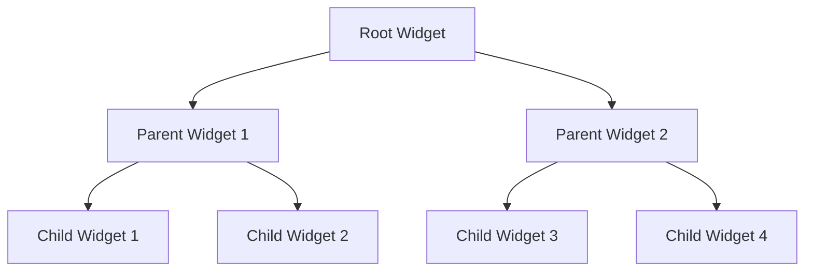

## 1.2.3 Understanding Flutter's Widget Tree and Context

In the world of Flutter development, the widget tree and the concept of context are foundational elements that dictate how applications are structured and how they behave. This section delves into the intricacies of the widget tree, the pivotal role of `BuildContext`, and how these elements interplay to create dynamic, responsive applications.

### Understanding the Widget Tree

Flutter applications are built using a tree of widgets. This hierarchical structure is central to how Flutter renders and updates the UI. Each widget in Flutter is a part of this tree, and they are organized in a parent-child relationship, where the parent widget can have one or more child widgets.

#### Hierarchical Organization

- **Root Widget:** At the top of the widget tree is the root widget, typically the `MaterialApp` or `CupertinoApp`, which sets the theme and routing for the application.
- **Parent-Child Relationships:** Each widget can have child widgets, forming a tree structure. For example, a `Column` widget can contain multiple `Text` widgets as its children.

```dart
import 'package:flutter/material.dart';

void main() {
  runApp(MyApp());
}

class MyApp extends StatelessWidget {
  @override
  Widget build(BuildContext context) {
    return MaterialApp(
      home: Scaffold(
        appBar: AppBar(title: Text('Widget Tree Example')),
        body: Column(
          children: <Widget>[
            Text('Child 1'),
            Text('Child 2'),
            Text('Child 3'),
          ],
        ),
      ),
    );
  }
}
```

In the above example, the `Column` widget is the parent of three `Text` widgets, illustrating a simple widget tree.

#### Parent-Child Dynamics

- **Parent Widgets:** These are responsible for managing the layout and behavior of their children. They dictate how child widgets are displayed on the screen.
- **Child Widgets:** These widgets are nested within parent widgets and inherit certain properties, such as alignment and padding, from their parents.

### BuildContext

`BuildContext` is a fundamental concept in Flutter that provides a reference to the location of a widget within the widget tree. It is an immutable object that is passed to the `build` method of every widget.

#### Role of BuildContext

- **Accessing Ancestors:** `BuildContext` allows widgets to access their parent widgets and other ancestors in the widget tree.
- **Locating Theme and Media Queries:** Widgets use `BuildContext` to retrieve theme data, media queries, and other inherited properties.

```dart
class MyWidget extends StatelessWidget {
  @override
  Widget build(BuildContext context) {
    final theme = Theme.of(context);
    final mediaQuery = MediaQuery.of(context);

    return Container(
      color: theme.primaryColor,
      height: mediaQuery.size.height * 0.5,
      child: Center(child: Text('Hello, Flutter!')),
    );
  }
}
```

In this example, `BuildContext` is used to access the theme and media query data, demonstrating its utility in adapting to different environments and user settings.

### Inherited Widgets

Inherited widgets are a powerful feature in Flutter that allow data to be passed down the widget tree without explicitly passing it through the constructor of each widget.

#### Concept of Inherited Widgets

- **Data Propagation:** Inherited widgets enable data to be efficiently shared across the widget tree, making it accessible to any descendant widget.
- **Use Cases:** Commonly used for themes, localization, and other global data that needs to be accessed by multiple widgets.

```dart
class MyInheritedWidget extends InheritedWidget {
  final int data;

  MyInheritedWidget({Key? key, required this.data, required Widget child})
      : super(key: key, child: child);

  @override
  bool updateShouldNotify(MyInheritedWidget oldWidget) {
    return oldWidget.data != data;
  }

  static MyInheritedWidget? of(BuildContext context) {
    return context.dependOnInheritedWidgetOfExactType<MyInheritedWidget>();
  }
}
```

In this code snippet, `MyInheritedWidget` is an example of an inherited widget that provides an integer value to its descendants.

### Scope and Accessibility

The scope of a widget's context determines what data and methods are accessible. Understanding this scope is crucial for effective state management and UI updates.

#### Contextual Scope

- **Local vs. Global Context:** The context is local to the widget it is associated with, meaning it can only access data and methods from its ancestors up to the root widget.
- **Scoped Access:** Widgets can only access inherited data that is within their scope, which is determined by their position in the widget tree.

### Common Mistakes

Despite its power, misusing `BuildContext` can lead to errors and unexpected behavior. Here are some common pitfalls:

#### Errors with Asynchronous Operations

- **Using the Wrong Context:** A common mistake is using a `BuildContext` that is no longer valid, such as after an asynchronous operation has completed. This can lead to exceptions or incorrect UI updates.

```dart
void fetchData(BuildContext context) async {
  final data = await fetchDataFromApi();
  if (!context.mounted) return; // Check if the context is still valid
  Navigator.push(context, MaterialPageRoute(builder: (context) => NewScreen(data: data)));
}
```

In this example, checking if the context is still mounted prevents errors when navigating after an asynchronous operation.

### Diagrams

To better understand the widget tree and context, consider the following diagram:



This diagram illustrates a simple widget tree structure, showing how widgets are organized hierarchically.

### Conclusion

Understanding the widget tree and `BuildContext` is essential for mastering Flutter development. These concepts form the backbone of how Flutter applications are structured and how they function. By leveraging the power of inherited widgets and being mindful of context scope, developers can create efficient, responsive applications that are easy to maintain and extend.

### Further Reading and Resources

- [Flutter Official Documentation](https://flutter.dev/docs)
- [Inherited Widgets in Flutter](https://flutter.dev/docs/development/ui/advanced/inherited-widgets)
- [Understanding BuildContext](https://medium.com/flutter-community/understanding-buildcontext-in-flutter-3a6c738ac5ed)

By exploring these resources, you can deepen your understanding of Flutter's widget tree and context, enhancing your ability to build robust applications.

## Quiz Time!



### What is the role of the root widget in a Flutter application?

- [x] It serves as the top-level entry point for the widget tree.
- [ ] It manages the state of all child widgets.
- [ ] It is responsible for rendering all UI components.
- [ ] It handles all asynchronous operations.

> **Explanation:** The root widget is the top-level entry point that initializes the widget tree, typically represented by `MaterialApp` or `CupertinoApp`.

### How does `BuildContext` help in Flutter development?

- [x] It provides access to the location of a widget in the widget tree.
- [ ] It manages the lifecycle of a widget.
- [ ] It is responsible for handling user interactions.
- [ ] It stores the state of a widget.

> **Explanation:** `BuildContext` is used to access the location of a widget in the widget tree, enabling access to its ancestors and inherited data.

### What is a common use case for inherited widgets?

- [x] Passing theme data down the widget tree.
- [ ] Managing network requests.
- [ ] Handling user inputs.
- [ ] Rendering complex animations.

> **Explanation:** Inherited widgets are commonly used to pass data like themes and localization down the widget tree.

### What mistake can occur when using `BuildContext` with asynchronous operations?

- [x] Using a context that is no longer valid.
- [ ] Forgetting to initialize the context.
- [ ] Using context in a stateless widget.
- [ ] Accessing context outside the build method.

> **Explanation:** Using a context that is no longer valid after an asynchronous operation can lead to errors.

### What does the `updateShouldNotify` method in an inherited widget do?

- [x] It determines if the widget should notify its dependents of a change.
- [ ] It updates the state of the widget.
- [ ] It manages the lifecycle of the widget.
- [ ] It handles user interactions.

> **Explanation:** `updateShouldNotify` is used to determine if the widget should notify its dependents when the data changes.

### Which of the following best describes the parent-child relationship in the widget tree?

- [x] Parent widgets manage the layout and behavior of their child widgets.
- [ ] Child widgets dictate the behavior of their parent widgets.
- [ ] Parent widgets are always stateful, while child widgets are stateless.
- [ ] Child widgets can exist independently of parent widgets.

> **Explanation:** Parent widgets manage the layout and behavior of their children, dictating how they are displayed.

### How can you prevent errors when using `BuildContext` in asynchronous operations?

- [x] Check if the context is still mounted before using it.
- [ ] Always use a global context.
- [ ] Avoid using context in async functions.
- [ ] Use context only in stateful widgets.

> **Explanation:** Checking if the context is still mounted ensures it is valid before using it in async operations.

### What is the primary function of `BuildContext` in accessing theme data?

- [x] It allows widgets to retrieve theme data from their ancestors.
- [ ] It stores the theme data for the entire application.
- [ ] It manages theme changes across the app.
- [ ] It initializes the theme data during app startup.

> **Explanation:** `BuildContext` allows widgets to access theme data by retrieving it from their ancestors in the widget tree.

### Which diagram best represents the hierarchical structure of the widget tree?

- [x] A tree diagram with nodes representing widgets.
- [ ] A flowchart showing data flow between widgets.
- [ ] A sequence diagram depicting widget interactions.
- [ ] A pie chart illustrating widget distribution.

> **Explanation:** A tree diagram effectively represents the hierarchical structure of the widget tree, showing parent-child relationships.

### True or False: Inherited widgets can only be used for passing data down the widget tree.

- [x] True
- [ ] False

> **Explanation:** Inherited widgets are specifically designed to pass data down the widget tree, making it accessible to descendant widgets.


