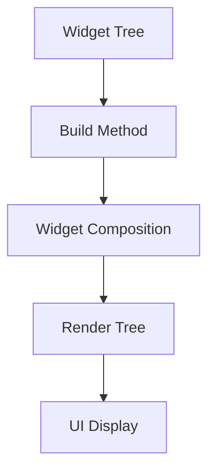

---

linkTitle: "1.2.4 The Role of Build Methods"
title: "Build Methods in Flutter: Optimizing Widget Rendering"
description: "Explore the critical role of build methods in Flutter, how they contribute to widget rendering, and best practices for optimization."
categories:
- Flutter Development
- State Management
- Mobile App Development
tags:
- Flutter
- Build Method
- Widget Tree
- Optimization
- Best Practices
date: 2024-10-25
type: docs
nav_weight: 1240

canonical: "https://fluttermasterylibrary.com/7/1/2/4"
license: "© 2023 Tokenizer Inc. CC BY-NC-SA 4.0"
---

## 1.2.4 The Role of Build Methods

In the Flutter framework, the `build` method plays a pivotal role in defining how widgets are displayed. Understanding its function and optimizing its usage is crucial for creating efficient and responsive applications. This section delves into the intricacies of the `build` method, offering insights into its operation, optimization strategies, and best practices.

### Function of the Build Method

The `build` method is a fundamental component of Flutter's widget system. It is responsible for describing how a widget should be displayed in terms of other, lower-level widgets. Essentially, the `build` method constructs a widget tree, which Flutter uses to render the UI.

- **Widget Composition:** The `build` method allows developers to compose complex UIs by nesting widgets. Each widget's `build` method returns a subtree of widgets, which can include layout widgets (like `Column` or `Row`), UI elements (like `Text` or `Image`), and even other custom widgets.

- **Declarative Nature:** Flutter's UI is built declaratively. This means that the `build` method does not directly manipulate the UI; instead, it returns a description of the UI, which Flutter then renders. This approach simplifies UI updates and makes the code more predictable.

- **Example: Basic Build Method**

```dart
class MyWidget extends StatelessWidget {
  @override
  Widget build(BuildContext context) {
    return Center(
      child: Text(
        'Hello, Flutter!',
        style: TextStyle(fontSize: 24),
      ),
    );
  }
}
```

In this example, the `build` method returns a `Center` widget containing a `Text` widget. This simple structure demonstrates how the `build` method assembles widgets to form a UI.

### Rebuilding Widgets

The `build` method is called whenever the widget needs to be rebuilt. This can happen for several reasons:

- **State Changes:** When the state of a `StatefulWidget` changes, the `setState` method triggers a rebuild. This ensures that the UI reflects the current state.

- **Parent Widget Changes:** If a parent widget changes and needs to rebuild its subtree, the `build` method of child widgets will also be called.

- **Dependencies Update:** Widgets can depend on inherited widgets higher up in the widget tree. If these dependencies change, the `build` method is called to update the widget.

- **Example: Rebuilding on State Change**

```dart
class Counter extends StatefulWidget {
  @override
  _CounterState createState() => _CounterState();
}

class _CounterState extends State<Counter> {
  int _count = 0;

  void _increment() {
    setState(() {
      _count++;
    });
  }

  @override
  Widget build(BuildContext context) {
    return Column(
      children: [
        Text('Count: $_count'),
        ElevatedButton(
          onPressed: _increment,
          child: Text('Increment'),
        ),
      ],
    );
  }
}
```

In this example, the `build` method is called every time `_increment` is invoked, updating the displayed count.

### Optimizing Build Methods

Efficient `build` methods are crucial for maintaining app performance. Here are some strategies to optimize them:

- **Avoid Long Methods:** Keep `build` methods concise. Long methods can be difficult to read and maintain. Break down complex UIs into smaller, reusable widgets.

- **Minimize Computations:** Avoid performing heavy computations within the `build` method. Instead, compute values outside the method and pass them as parameters.

- **Use `const` Widgets:** Whenever possible, use `const` constructors for widgets. This allows Flutter to optimize the widget tree by reusing instances.

- **Example: Optimized Build Method**

```dart
class OptimizedWidget extends StatelessWidget {
  final String title;
  final int value;

  OptimizedWidget({required this.title, required this.value});

  @override
  Widget build(BuildContext context) {
    return Column(
      children: [
        Text(title),
        Text('Value: $value'),
      ],
    );
  }
}
```

Here, `OptimizedWidget` takes parameters, reducing the need for computations within the `build` method.

### Best Practices

Adhering to best practices can significantly enhance the readability and performance of your Flutter applications:

- **Break Down Complex UIs:** Divide complex UIs into smaller widgets. This not only improves readability but also allows for better reuse and testing.

- **Leverage Stateless Widgets:** Use `StatelessWidget` when the widget does not need to manage state. This can reduce unnecessary rebuilds.

- **Avoid Unnecessary Rebuilds:** Use `ValueKey`, `ObjectKey`, or `UniqueKey` to prevent unnecessary rebuilds of widgets that do not change.

### Visualizations

To better understand how the `build` method fits into the widget rendering process, consider the following diagram:



- **Widget Tree:** The hierarchical structure of widgets.
- **Build Method:** Constructs the widget tree.
- **Widget Composition:** Assembles the UI using nested widgets.
- **Render Tree:** Flutter's internal representation for rendering.
- **UI Display:** The final output displayed on the screen.

This diagram illustrates the flow from defining widgets in the `build` method to rendering them on the screen.

### Conclusion

The `build` method is a cornerstone of Flutter's declarative UI framework. By understanding its role and optimizing its usage, developers can create efficient, maintainable, and responsive applications. Remember to keep `build` methods concise, leverage `const` widgets, and break down complex UIs into smaller components. These practices will not only enhance performance but also improve code readability and maintainability.

### Further Reading

- [Flutter Documentation on Build Methods](https://flutter.dev/docs/development/ui/widgets-intro)
- [Effective Dart: Performance](https://dart.dev/guides/language/effective-dart/performance)
- [Flutter Widget of the Week](https://www.youtube.com/playlist?list=PLjxrf2q8roU3ahJVrSgAnPjzkpGmL9Czl)

## Quiz Time!



### What is the primary function of the `build` method in Flutter?

- [x] To describe how a widget should be displayed using other widgets.
- [ ] To directly manipulate the UI elements.
- [ ] To handle user input events.
- [ ] To manage application state.

> **Explanation:** The `build` method describes the UI in terms of other widgets, which Flutter then renders.

### When is the `build` method called?

- [x] When the state of a `StatefulWidget` changes.
- [x] When a parent widget changes.
- [x] When dependencies update.
- [ ] When the app is first launched.

> **Explanation:** The `build` method is called in response to state changes, parent widget changes, and dependency updates.

### Which of the following is a best practice for optimizing `build` methods?

- [x] Break down complex UIs into smaller widgets.
- [ ] Perform heavy computations within the `build` method.
- [ ] Use long, detailed `build` methods.
- [ ] Avoid using `const` constructors.

> **Explanation:** Breaking down complex UIs into smaller widgets improves readability and performance.

### What is the benefit of using `const` widgets?

- [x] They allow Flutter to optimize the widget tree by reusing instances.
- [ ] They automatically manage state changes.
- [ ] They make the UI more colorful.
- [ ] They prevent user input.

> **Explanation:** `const` widgets enable Flutter to reuse instances, optimizing the widget tree.

### How can you prevent unnecessary rebuilds of widgets?

- [x] Use `ValueKey`, `ObjectKey`, or `UniqueKey`.
- [ ] Avoid using keys altogether.
- [ ] Use `StatelessWidget` for all widgets.
- [ ] Perform all logic within the `build` method.

> **Explanation:** Keys help Flutter identify widgets and prevent unnecessary rebuilds.

### What is a common pitfall when writing `build` methods?

- [x] Including heavy computations within the method.
- [ ] Using `const` constructors.
- [ ] Breaking down UIs into smaller widgets.
- [ ] Leveraging `StatelessWidget`.

> **Explanation:** Heavy computations in the `build` method can degrade performance.

### What is the purpose of the `setState` method in a `StatefulWidget`?

- [x] To trigger a rebuild of the widget.
- [ ] To directly update the UI elements.
- [ ] To handle user input.
- [ ] To manage application routing.

> **Explanation:** `setState` triggers a rebuild of the widget to update the UI.

### Which widget type should be used when a widget does not need to manage state?

- [x] `StatelessWidget`
- [ ] `StatefulWidget`
- [ ] `InheritedWidget`
- [ ] `Provider`

> **Explanation:** `StatelessWidget` is used when a widget does not manage state.

### What is the role of the render tree in Flutter?

- [x] It is Flutter's internal representation for rendering the UI.
- [ ] It manages application state.
- [ ] It handles user input events.
- [ ] It describes the UI using widgets.

> **Explanation:** The render tree is used by Flutter to render the UI.

### True or False: The `build` method directly manipulates UI elements.

- [ ] True
- [x] False

> **Explanation:** The `build` method describes the UI declaratively, rather than directly manipulating it.


