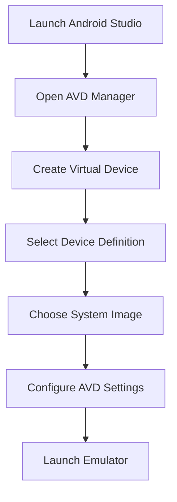
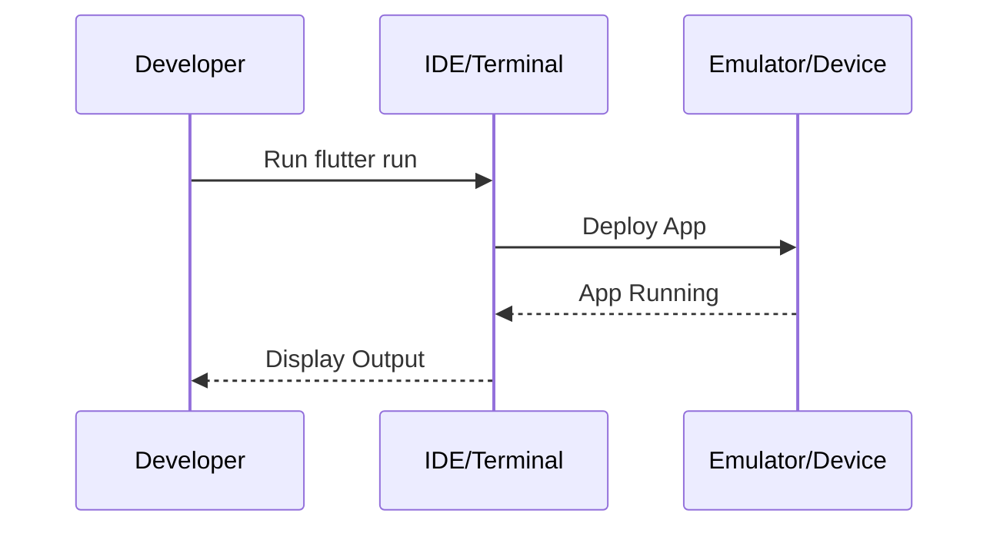

## 1.3.3 Configuring Emulators and Devices

Setting up emulators and devices is a crucial step in Flutter development, enabling developers to test and debug their applications across different platforms. This guide provides detailed instructions on configuring Android emulators, iOS simulators, and physical devices, ensuring you can efficiently deploy and test your Flutter applications.

### Android Emulators

Android emulators, also known as Android Virtual Devices (AVDs), allow you to simulate Android devices on your computer. This is particularly useful for testing apps across various device configurations without needing physical hardware.

#### Setting Up Android Virtual Devices (AVDs)

1. **Install Android Studio:** Ensure you have Android Studio installed, as it includes the necessary tools for creating and managing AVDs.

2. **Open AVD Manager:**
   - Launch Android Studio.
   - Navigate to `Tools` > `AVD Manager`.

3. **Create a New Virtual Device:**
   - Click on `Create Virtual Device`.
   - Choose a device definition that matches the screen size and resolution you want to test.

4. **Select a System Image:**
   - Choose a system image that matches the Android version you wish to test. It's recommended to select an image with Google APIs for better compatibility.

5. **Configure AVD Settings:**
   - Allocate sufficient RAM and CPU resources for optimal performance. A minimum of 2GB RAM is recommended.
   - Enable hardware acceleration if supported by your system for improved performance.

6. **Launch the Emulator:**
   - Once configured, click `Finish` and launch the emulator from the AVD Manager.

#### Optimizing Emulator Performance

- **Enable Hardware Acceleration:** Use Intel HAXM or AMD Hypervisor for hardware acceleration.
- **Adjust Emulator Settings:** Increase RAM and VM heap size for better performance.
- **Use a Fast Emulator Image:** Opt for x86 images over ARM for faster execution.

### iOS Simulators

iOS simulators are available only on macOS and are accessed through Xcode. They provide a way to test iOS applications without needing an iPhone or iPad.

#### Using Xcode to Access iOS Simulators

1. **Install Xcode:** Ensure Xcode is installed on your macOS system. You can download it from the Mac App Store.

2. **Open Xcode:**
   - Navigate to `Xcode` > `Open Developer Tool` > `Simulator`.

3. **Select a Simulator:**
   - Choose the device and iOS version you wish to simulate from the `Hardware` > `Device` menu.

4. **Run Your Flutter App:**
   - Use the `flutter run` command in your terminal to deploy your Flutter app to the selected simulator.

### Physical Devices

Testing on physical devices is essential to understand how your app performs in real-world scenarios. This section covers setting up Android and iOS devices for development.

#### Enabling Developer Options and USB Debugging on Android

1. **Enable Developer Options:**
   - Go to `Settings` > `About Phone`.
   - Tap `Build Number` seven times to unlock Developer Options.

2. **Enable USB Debugging:**
   - Navigate to `Settings` > `Developer Options`.
   - Toggle `USB Debugging` to `On`.

3. **Connect Your Device:**
   - Use a USB cable to connect your Android device to your computer.
   - Run `flutter devices` to ensure your device is recognized.

#### Deploying Flutter Apps to Physical iOS Devices

1. **Provisioning Your Device:**
   - Connect your iOS device to your macOS system.
   - Open Xcode and navigate to `Preferences` > `Accounts` to add your Apple ID.

2. **Create a Development Certificate:**
   - In Xcode, go to `Preferences` > `Accounts` > `Manage Certificates`.
   - Click the `+` button to create a new iOS Development certificate.

3. **Trust Your Computer:**
   - On your iOS device, trust the connected computer when prompted.

4. **Run Your Flutter App:**
   - Use `flutter run` to deploy your app to the connected iOS device.

### Connecting Devices

Efficiently managing connected devices is crucial for seamless development and testing.

#### Listing Available Devices

- Use the `flutter devices` command to list all connected devices and emulators.
- This command provides details about each device, such as the device ID and platform.

#### Troubleshooting Common Connection Issues

- **Device Not Recognized:** Ensure USB debugging is enabled and drivers are installed (for Android).
- **Xcode Errors:** Check for provisioning profile issues or outdated Xcode versions.
- **Network Issues:** Ensure both your computer and device are on the same network for wireless debugging.

### Hot Reload and Hot Restart

Flutter's hot reload and hot restart features significantly enhance the development workflow by allowing you to see code changes in real-time without losing the app's current state.

#### Using Hot Reload

- **Hot Reload:** Use `r` in the terminal to apply code changes without restarting the app. This is ideal for UI changes and minor logic updates.

#### Using Hot Restart

- **Hot Restart:** Use `R` in the terminal to restart the app, which is useful for state changes or when hot reload doesn't apply changes as expected.

### Visual Aids

Visual aids can help you understand the setup process better. Below are some key screens and diagrams to assist you.

#### Emulator Setup Screens

#### Running Apps on Devices

### Best Practices and Common Pitfalls

- **Best Practices:**
  - Regularly update your emulators and devices to the latest OS versions.
  - Use physical devices for final testing to ensure real-world performance.

- **Common Pitfalls:**
  - Neglecting to enable USB debugging can prevent device recognition.
  - Insufficient emulator resources can lead to poor performance.

### Additional Resources

- [Flutter Official Documentation](https://flutter.dev/docs)
- [Android Developer Guide](https://developer.android.com/studio/run/emulator)
- [Apple Developer Documentation](https://developer.apple.com/documentation/xcode/running_your_app_in_the_simulator_or_on_a_device)

By following these guidelines, you can effectively configure emulators and devices for Flutter development, ensuring a smooth and efficient testing process.

## Quiz Time!



### What is the primary tool used to manage Android Virtual Devices (AVDs)?

- [x] AVD Manager
- [ ] Xcode
- [ ] Android Debug Bridge (ADB)
- [ ] Flutter CLI

> **Explanation:** The AVD Manager, part of Android Studio, is used to create and manage Android Virtual Devices.

### Which command lists all connected devices and emulators in Flutter?

- [ ] flutter run
- [x] flutter devices
- [ ] flutter list
- [ ] flutter connect

> **Explanation:** The `flutter devices` command lists all available devices and emulators connected to your development environment.

### How do you enable USB debugging on an Android device?

- [x] Enable Developer Options and toggle USB Debugging
- [ ] Install Android Studio
- [ ] Connect the device to a computer
- [ ] Use the AVD Manager

> **Explanation:** USB debugging is enabled by first unlocking Developer Options and then toggling the USB Debugging option within those settings.

### What is the purpose of hot reload in Flutter?

- [ ] To restart the app completely
- [x] To apply code changes without losing the app's state
- [ ] To update the Flutter SDK
- [ ] To deploy the app to a device

> **Explanation:** Hot reload allows developers to see code changes instantly without restarting the app, preserving the current state.

### Which tool is required to access iOS simulators?

- [ ] Android Studio
- [x] Xcode
- [ ] Visual Studio Code
- [ ] Flutter CLI

> **Explanation:** Xcode is required to access and run iOS simulators on macOS.

### What should you do if your Android device is not recognized by your computer?

- [ ] Restart the device
- [x] Ensure USB debugging is enabled and drivers are installed
- [ ] Reinstall Flutter
- [ ] Update the Android OS

> **Explanation:** Ensuring USB debugging is enabled and that the necessary drivers are installed can resolve recognition issues.

### What is the benefit of using hardware acceleration in Android emulators?

- [ ] It increases the screen size
- [ ] It allows for more storage
- [x] It improves performance
- [ ] It enables USB debugging

> **Explanation:** Hardware acceleration significantly improves the performance of Android emulators, making them faster and more responsive.

### How can you deploy a Flutter app to a physical iOS device?

- [ ] Use Android Studio
- [x] Use Xcode and trust the computer on the device
- [ ] Enable Developer Options
- [ ] Use the AVD Manager

> **Explanation:** Deploying to a physical iOS device requires using Xcode and trusting the connected computer on the device.

### What is a common issue when connecting devices for Flutter development?

- [ ] Incorrect Flutter version
- [ ] Insufficient RAM
- [x] USB debugging not enabled
- [ ] Outdated IDE

> **Explanation:** A common issue is not having USB debugging enabled, which prevents the device from being recognized by the development environment.

### True or False: Hot restart in Flutter preserves the app's current state.

- [ ] True
- [x] False

> **Explanation:** Hot restart restarts the app, which does not preserve the current state, unlike hot reload.


