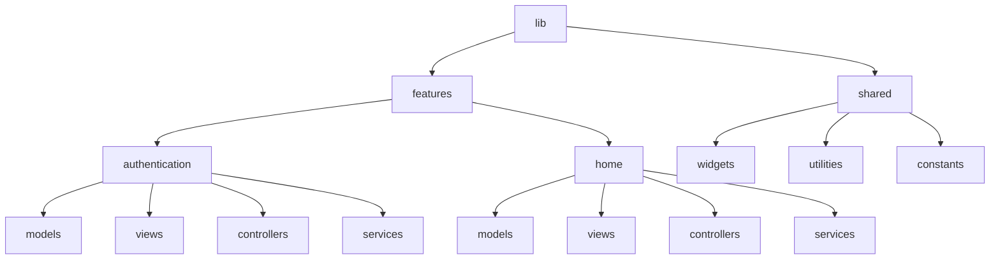

## 1.3.4 Project Structure Best Practices

In the realm of Flutter development, the way you structure your project can significantly impact its scalability, maintainability, and overall efficiency. A well-organized project structure not only facilitates easier navigation and understanding of the codebase but also supports effective state management, which is crucial for building responsive and robust applications. This section delves into best practices for structuring Flutter projects, focusing on enhancing state management capabilities.

### Default Project Layout

When you create a new Flutter project, it comes with a default directory structure. Understanding the purpose of each directory and file is the first step towards organizing your project effectively.

- **`lib/`:** The main directory where all the Dart code resides. This is where you'll spend most of your time.
  - **`main.dart`:** The entry point of the application. It typically contains the `main()` function and the root widget of your app.
- **`test/`:** Contains test files for your application. It's crucial for maintaining code quality through unit and widget tests.
- **`android/` and `ios/`:** Platform-specific directories for Android and iOS configurations.
- **`web/`:** Contains files necessary for running your Flutter app on the web.
- **`pubspec.yaml`:** The configuration file for your Flutter project, where you define dependencies, assets, and other settings.

### Organizing Code

As your application grows, a flat structure can become cumbersome. Organizing your code into logical groupings can make it easier to manage and scale. Here are some common structures:

#### Feature-Based Structure

This approach organizes the codebase by features or modules, making it easier to manage and scale as new features are added.

```
lib/
  ├── features/
  │   ├── authentication/
  │   │   ├── models/
  │   │   ├── views/
  │   │   ├── controllers/
  │   │   └── services/
  │   ├── home/
  │   │   ├── models/
  │   │   ├── views/
  │   │   ├── controllers/
  │   │   └── services/
  ├── shared/
  │   ├── widgets/
  │   ├── utilities/
  │   └── constants/
```

#### Layer-Based Structure

This structure separates the codebase into layers, such as presentation, business logic, and data, promoting a clean architecture.

```
lib/
  ├── presentation/
  │   ├── widgets/
  │   ├── screens/
  │   └── routes/
  ├── domain/
  │   ├── models/
  │   ├── repositories/
  │   └── usecases/
  ├── data/
  │   ├── datasources/
  │   ├── models/
  │   └── repositories/
  ├── core/
  │   ├── utilities/
  │   ├── constants/
  │   └── services/
```

### Scalability

A well-structured project is crucial for scalability. As your application grows, the complexity increases, and maintaining a clear organization helps manage this complexity. It allows multiple developers to work on the project simultaneously without stepping on each other's toes and makes onboarding new team members easier.

### Naming Conventions

Consistent naming conventions improve readability and maintainability. Here are some recommendations:

- **Files:** Use lowercase_with_underscores for file names. For example, `user_profile.dart`.
- **Classes:** Use PascalCase for class names. For example, `UserProfile`.
- **Variables and Functions:** Use camelCase for variables and function names. For example, `fetchUserData`.

### Code Examples

Here's an example of a well-organized project directory using a feature-based structure:

```plaintext
lib/
  ├── features/
  │   ├── authentication/
  │   │   ├── models/
  │   │   │   └── user.dart
  │   │   ├── views/
  │   │   │   └── login_screen.dart
  │   │   ├── controllers/
  │   │   │   └── login_controller.dart
  │   │   └── services/
  │   │       └── auth_service.dart
  ├── shared/
  │   ├── widgets/
  │   │   └── custom_button.dart
  │   ├── utilities/
  │   │   └── validators.dart
  │   └── constants/
  │       └── app_colors.dart
```

### Tools and Packages

Several packages can assist in organizing your Flutter project:

- **`flutter_modular`:** Helps in structuring your project into modules, promoting a clean and scalable architecture.
- **`get_it`:** A simple service locator for dependency injection, which can help manage dependencies and improve code organization.

### Diagrams

Visualizing your project structure can help in understanding and planning. Below is a Mermaid.js diagram representing a feature-based project structure:



### Conclusion

A well-organized project structure is the backbone of a scalable and maintainable Flutter application. By adopting best practices in project organization, naming conventions, and utilizing helpful tools and packages, you can significantly enhance your development workflow and state management capabilities. Remember, the goal is to create a structure that not only suits your current needs but also accommodates future growth and complexity.

### References

- [Flutter Documentation](https://flutter.dev/docs)
- [Effective Dart](https://dart.dev/guides/language/effective-dart)
- [Flutter Modular](https://pub.dev/packages/flutter_modular)
- [Get It](https://pub.dev/packages/get_it)

## Quiz Time!



### What is the primary purpose of the `lib/` directory in a Flutter project?

- [x] To contain all the Dart code for the application.
- [ ] To store platform-specific configurations.
- [ ] To manage test files for the application.
- [ ] To hold the application's assets and resources.

> **Explanation:** The `lib/` directory is where all the Dart code resides, including the main application logic and UI components.

### Which project structure is most suitable for organizing code by features or modules?

- [x] Feature-Based Structure
- [ ] Layer-Based Structure
- [ ] Flat Structure
- [ ] Monolithic Structure

> **Explanation:** A feature-based structure organizes code by features or modules, making it easier to manage and scale as new features are added.

### What is a key benefit of using a well-organized project structure in Flutter?

- [x] It aids in scaling the application as it grows.
- [ ] It reduces the need for testing.
- [ ] It eliminates the need for documentation.
- [ ] It simplifies the Flutter installation process.

> **Explanation:** A well-organized project structure helps manage complexity and supports scalability as the application grows.

### Which naming convention is recommended for class names in Flutter?

- [x] PascalCase
- [ ] camelCase
- [ ] snake_case
- [ ] kebab-case

> **Explanation:** PascalCase is recommended for class names, ensuring consistency and readability in the codebase.

### What is the role of the `flutter_modular` package in project organization?

- [x] It helps in structuring the project into modules.
- [ ] It manages state across the application.
- [ ] It provides UI components for Flutter apps.
- [ ] It handles network requests and responses.

> **Explanation:** `flutter_modular` assists in organizing the project into modules, promoting a clean and scalable architecture.

### Which file in a Flutter project typically contains the `main()` function?

- [x] `main.dart`
- [ ] `pubspec.yaml`
- [ ] `index.html`
- [ ] `styles.css`

> **Explanation:** The `main.dart` file is the entry point of the application, containing the `main()` function and the root widget.

### What is the recommended file naming convention in Flutter?

- [x] lowercase_with_underscores
- [ ] PascalCase
- [ ] camelCase
- [ ] UPPERCASE

> **Explanation:** The lowercase_with_underscores convention is recommended for file names, ensuring consistency and readability.

### How does the `get_it` package aid in project organization?

- [x] It provides a service locator for dependency injection.
- [ ] It offers state management solutions.
- [ ] It simplifies UI component creation.
- [ ] It handles asynchronous operations.

> **Explanation:** `get_it` is a simple service locator for dependency injection, helping manage dependencies and improve code organization.

### What is a key advantage of using a layer-based project structure?

- [x] It promotes a clean separation of concerns.
- [ ] It reduces the number of files in the project.
- [ ] It eliminates the need for state management.
- [ ] It simplifies the build process.

> **Explanation:** A layer-based structure promotes a clean separation of concerns, organizing code into presentation, business logic, and data layers.

### True or False: A flat project structure is ideal for large-scale Flutter applications.

- [ ] True
- [x] False

> **Explanation:** A flat project structure can become cumbersome as the application grows, making it less ideal for large-scale applications.


