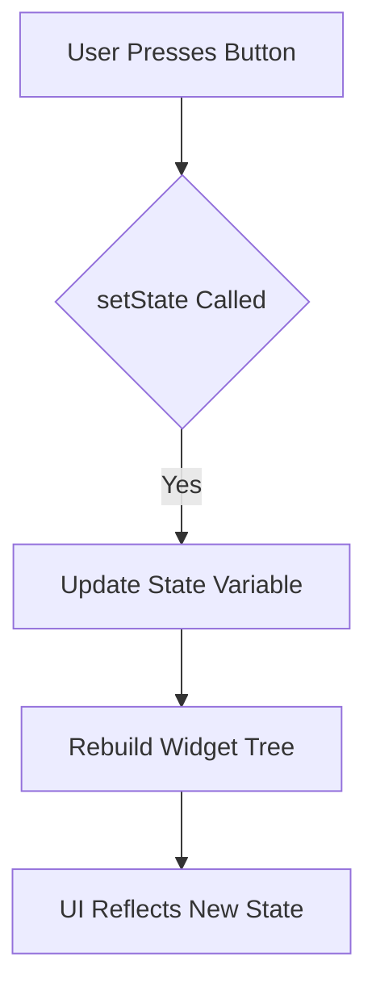

## 1.4.1 Building a Flutter Counter App with setState

In this section, we will embark on a journey to build a simple yet fundamental Flutter application: a counter app. This app will serve as an introduction to state management using Flutter's built-in `setState` method. By the end of this tutorial, you will have a solid understanding of how to manage state in a Flutter application using `setState`, and you'll be equipped with the knowledge to extend this to more complex applications.

### Project Setup

Before we dive into the code, let's set up our Flutter project. Follow these steps to create a new Flutter project named `counter_app`:

1. **Open your terminal or command prompt.**
2. **Navigate to your desired directory** where you want to create the project.
3. **Run the following command** to create a new Flutter project:

   ```bash
   flutter create counter_app
   ```

4. **Navigate into the project directory:**

   ```bash
   cd counter_app
   ```

5. **Open the project in your preferred IDE** (such as Visual Studio Code or Android Studio).

### UI Design

Our counter app will have a simple user interface consisting of:

- A text display to show the current count.
- Two buttons: one to increment the count and another to decrement it.

Let's start by designing the UI in `main.dart`.

```dart
import 'package:flutter/material.dart';

void main() {
  runApp(CounterApp());
}

class CounterApp extends StatelessWidget {
  @override
  Widget build(BuildContext context) {
    return MaterialApp(
      title: 'Counter App',
      theme: ThemeData(
        primarySwatch: Colors.blue,
      ),
      home: CounterHomePage(),
    );
  }
}

class CounterHomePage extends StatefulWidget {
  @override
  _CounterHomePageState createState() => _CounterHomePageState();
}

class _CounterHomePageState extends State<CounterHomePage> {
  int _counter = 0;

  void _incrementCounter() {
    setState(() {
      _counter++;
    });
  }

  void _decrementCounter() {
    setState(() {
      _counter--;
    });
  }

  @override
  Widget build(BuildContext context) {
    return Scaffold(
      appBar: AppBar(
        title: Text('Counter App'),
      ),
      body: Center(
        child: Column(
          mainAxisAlignment: MainAxisAlignment.center,
          children: <Widget>[
            Text(
              'You have pushed the button this many times:',
            ),
            Text(
              '$_counter',
              style: Theme.of(context).textTheme.headline4,
            ),
            Row(
              mainAxisAlignment: MainAxisAlignment.center,
              children: <Widget>[
                ElevatedButton(
                  onPressed: _incrementCounter,
                  child: Text('Increment'),
                ),
                SizedBox(width: 20),
                ElevatedButton(
                  onPressed: _decrementCounter,
                  child: Text('Decrement'),
                ),
              ],
            ),
          ],
        ),
      ),
    );
  }
}
```

### Implementing setState

In the code above, we have implemented a `StatefulWidget` called `CounterHomePage`. This widget maintains the state of the counter. Let's break down the key components:

- **State Variables:** We declare an integer `_counter` initialized to 0. This variable holds the current count.

- **setState Method:** The `setState` method is used to update the state of the widget. When the increment or decrement button is pressed, the `_incrementCounter` or `_decrementCounter` method is called, respectively. Inside these methods, `setState` is invoked to update the `_counter` variable and trigger a rebuild of the widget tree.

### Code Walkthrough

Let's walk through the code to understand each part:

- **Main Function:** The `main` function is the entry point of the app. It calls `runApp` with `CounterApp`, which is a `StatelessWidget`.

- **CounterApp Widget:** This is a `StatelessWidget` that sets up the `MaterialApp` with a home page of `CounterHomePage`.

- **CounterHomePage Widget:** This is a `StatefulWidget` that manages the state of the counter. It overrides `createState` to return an instance of `_CounterHomePageState`.

- **_CounterHomePageState Class:** This class extends `State<CounterHomePage>` and contains the state logic. It includes:
  - `_counter` variable to hold the count.
  - `_incrementCounter` and `_decrementCounter` methods to modify the count.
  - `build` method to construct the UI, including a `Scaffold` with an `AppBar` and a `Column` containing the text and buttons.

### Running the App

To run the app and see it in action:

1. **Ensure your emulator or physical device is connected.**
2. **Run the following command in your terminal:**

   ```bash
   flutter run
   ```

3. **Interact with the app** by pressing the increment and decrement buttons to see the counter update.

### Visual Aids

Below is a visual representation of how `setState` triggers widget rebuilds:



This diagram illustrates the flow of operations when a button is pressed, leading to a call to `setState`, which updates the state variable and rebuilds the widget tree to reflect the new state.

### Screenshots

Here are some screenshots of the app in action:

- **Initial State:**

  

- **After Increment:**

  

- **After Decrement:**

  

### Conclusion

Building a counter app using `setState` is a fundamental exercise in understanding state management in Flutter. This simple example lays the groundwork for more complex applications by demonstrating how to manage and update state within a `StatefulWidget`. As you continue your journey in Flutter development, consider how `setState` can be used in conjunction with other state management solutions to build robust and scalable applications.

For further exploration, consider experimenting with additional features such as resetting the counter, limiting the counter range, or persisting the counter value across app sessions.

## Quiz Time!



### What is the primary purpose of the `setState` method in Flutter?

- [x] To update the state of a `StatefulWidget` and trigger a rebuild of the widget tree.
- [ ] To initialize state variables in a `StatefulWidget`.
- [ ] To define the UI layout of a `StatelessWidget`.
- [ ] To manage asynchronous operations in Flutter.

> **Explanation:** The `setState` method is used to update the state of a `StatefulWidget` and trigger a rebuild of the widget tree, ensuring the UI reflects the updated state.

### Which widget type is necessary for using `setState`?

- [x] StatefulWidget
- [ ] StatelessWidget
- [ ] InheritedWidget
- [ ] Provider

> **Explanation:** `setState` is used within a `StatefulWidget` to manage and update its state.

### What happens when `setState` is called in a `StatefulWidget`?

- [x] The widget tree is rebuilt, and the UI updates to reflect the new state.
- [ ] The app restarts.
- [ ] The state variables are reset to their initial values.
- [ ] The app enters a paused state.

> **Explanation:** When `setState` is called, the widget tree is rebuilt, and the UI updates to reflect the new state.

### In the counter app example, what is the role of the `_counter` variable?

- [x] It holds the current count value displayed in the UI.
- [ ] It stores the theme data for the app.
- [ ] It manages the routing logic of the app.
- [ ] It is used for network requests.

> **Explanation:** The `_counter` variable holds the current count value, which is displayed in the UI and updated when the increment or decrement buttons are pressed.

### How does the `build` method contribute to the `StatefulWidget`?

- [x] It constructs the UI based on the current state.
- [ ] It initializes state variables.
- [ ] It handles user input events.
- [ ] It manages network requests.

> **Explanation:** The `build` method constructs the UI based on the current state, and it is called whenever `setState` triggers a rebuild.

### What is the result of calling `setState` without updating any state variables?

- [x] The widget tree is rebuilt, but the UI remains unchanged.
- [ ] The app crashes.
- [ ] The state variables are reset.
- [ ] The app enters a loading state.

> **Explanation:** Calling `setState` without updating any state variables will still rebuild the widget tree, but the UI will remain unchanged since the state hasn't changed.

### Why is it important to use `setState` sparingly in performance-sensitive applications?

- [x] Frequent calls to `setState` can lead to unnecessary widget rebuilds, affecting performance.
- [ ] `setState` can cause memory leaks.
- [ ] `setState` is deprecated in the latest Flutter versions.
- [ ] `setState` only works on Android devices.

> **Explanation:** Frequent calls to `setState` can lead to unnecessary widget rebuilds, which can affect the performance of the application, especially in performance-sensitive scenarios.

### What is the purpose of the `createState` method in a `StatefulWidget`?

- [x] To create an instance of the `State` class that holds the widget's state.
- [ ] To define the UI layout of the widget.
- [ ] To handle user input events.
- [ ] To manage network requests.

> **Explanation:** The `createState` method is used to create an instance of the `State` class, which holds the widget's state and contains the logic for updating the UI.

### How can you reset the counter value to zero in the counter app?

- [x] Add a new button that calls `setState` and sets `_counter` to 0.
- [ ] Modify the `build` method to always display 0.
- [ ] Remove the `_incrementCounter` and `_decrementCounter` methods.
- [ ] Use a `StatelessWidget` instead of a `StatefulWidget`.

> **Explanation:** To reset the counter value to zero, you can add a new button that calls `setState` and sets `_counter` to 0 when pressed.

### True or False: `setState` can be used in both `StatefulWidget` and `StatelessWidget`.

- [ ] True
- [x] False

> **Explanation:** `setState` is only applicable to `StatefulWidget`, as `StatelessWidget` does not maintain any state that can be updated.


