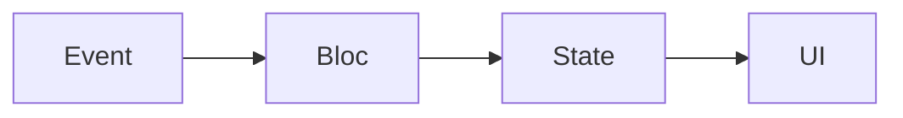

## 10.1.1 Feature Comparison Matrix

In the world of Flutter development, choosing the right state management solution is crucial for building efficient, scalable, and maintainable applications. This section provides a detailed comparison of the most popular state management solutions: `setState`, Provider, Riverpod, Bloc, Redux, and MobX. By examining key features such as learning curve, boilerplate code, scalability, performance, and more, this feature comparison matrix aims to guide developers in selecting the best tool for their specific needs.

### Objective of the Feature Comparison Matrix

The primary goal of this matrix is to offer a side-by-side comparison of the state management solutions discussed in this book. By highlighting the strengths and weaknesses of each solution, developers can quickly identify which approach aligns best with their project requirements and personal preferences.

### Key Features to Compare

The following features are critical in evaluating each state management solution:

- **Learning Curve:** Ease of understanding and adopting the solution.
- **Boilerplate Code:** Amount of additional code required to implement the solution.
- **Scalability:** Ability to handle increasing complexity and application size.
- **Performance:** Efficiency in terms of memory usage and execution speed.
- **Community Support:** Availability of resources, documentation, and community engagement.
- **Testing Support:** Ease of testing components using the solution.
- **Async Operations Handling:** Support for asynchronous programming patterns.
- **Type Safety:** Level of type checking and safety provided.
- **Tooling and Debugging:** Availability of tools and support for debugging.
- **Architecture Complexity:** Complexity of the architectural pattern required by the solution.

### Creating the Matrix

Below is a comprehensive table that compares these features across the different state management solutions:

| Feature                     | `setState` | Provider | Riverpod | Bloc    | Redux   | MobX    |
|-----------------------------|------------|----------|----------|---------|---------|---------|
| Learning Curve              | Easy       | Easy     | Moderate | Moderate| Hard    | Moderate|
| Boilerplate Code            | Low        | Low      | Moderate | High    | High    | Moderate|
| Scalability                 | Low        | Moderate | High     | High    | High    | Moderate|
| Performance                 | Good       | Good     | Good     | Excellent| Excellent| Good  |
| Community Support           | N/A        | High     | Growing  | High    | Moderate| Moderate|
| Testing Support             | Basic      | Good     | Excellent| Excellent| Good   | Good    |
| Async Operations Handling   | Basic      | Good     | Excellent| Excellent| Good   | Good    |
| Type Safety                 | Basic      | Good     | Excellent| Excellent| Good   | Moderate|
| Tooling and Debugging       | Basic      | Good     | Good     | Excellent| Excellent| Good |
| Architecture Complexity     | Simple     | Simple   | Moderate | Complex | Complex | Moderate|

### Explanation of Ratings

#### Learning Curve

- **`setState`:** Rated "Easy" because it is the most basic and built-in method for state management in Flutter. It requires minimal setup and is straightforward to use for simple state updates.
- **Provider:** Also "Easy" due to its simplicity and integration with Flutter's widget tree, making it a popular choice for beginners.
- **Riverpod:** "Moderate" as it introduces new concepts like providers and consumers, which may take some time to grasp.
- **Bloc:** "Moderate" because it requires understanding streams and the separation of events and states, which can be challenging for newcomers.
- **Redux:** "Hard" due to its steep learning curve involving actions, reducers, and middleware, which can be overwhelming for those new to state management.
- **MobX:** "Moderate" as it involves understanding observables and reactions, which are different from Flutter's typical state management patterns.

#### Boilerplate Code

- **`setState`:** "Low" because it involves minimal code changes for state updates.
- **Provider:** "Low" as it requires little setup and integrates seamlessly with Flutter's widget tree.
- **Riverpod:** "Moderate" due to the need to define providers and manage dependencies.
- **Bloc:** "High" because it involves defining events, states, and blocs, as well as managing streams.
- **Redux:** "High" due to the need for actions, reducers, and middleware, resulting in significant boilerplate.
- **MobX:** "Moderate" as it requires setting up stores and actions, but code generation tools can help reduce boilerplate.

#### Scalability

- **`setState`:** "Low" as it is not suitable for managing complex or large-scale applications.
- **Provider:** "Moderate" due to its ability to handle moderate complexity but may struggle with very large applications.
- **Riverpod:** "High" because it supports scalable architectures with its robust dependency management.
- **Bloc:** "High" as it promotes a clear separation of concerns, making it suitable for large applications.
- **Redux:** "High" due to its predictable state container, which scales well with application complexity.
- **MobX:** "Moderate" as it can handle moderate complexity but may require careful management in very large applications.

#### Performance

- **`setState`:** "Good" for simple applications but may lead to performance issues in complex apps due to frequent rebuilds.
- **Provider:** "Good" as it efficiently rebuilds only the necessary parts of the widget tree.
- **Riverpod:** "Good" with efficient state updates and dependency management.
- **Bloc:** "Excellent" due to its use of streams, which can optimize performance by controlling data flow.
- **Redux:** "Excellent" because of its centralized state management and efficient updates.
- **MobX:** "Good" as it provides efficient state updates through observables and reactions.

#### Community Support

- **`setState`:** "N/A" as it is a built-in feature with limited community engagement.
- **Provider:** "High" with extensive documentation and a large user base.
- **Riverpod:** "Growing" as it is relatively new but gaining popularity and community support.
- **Bloc:** "High" with a strong community and comprehensive documentation.
- **Redux:** "Moderate" with a dedicated community, though not as large as some other solutions.
- **MobX:** "Moderate" with an active community but not as extensive as Provider or Bloc.

#### Testing Support

- **`setState`:** "Basic" as it offers limited support for testing complex state logic.
- **Provider:** "Good" with straightforward testing of state changes.
- **Riverpod:** "Excellent" due to its testability and support for mocking dependencies.
- **Bloc:** "Excellent" with strong support for testing events and states.
- **Redux:** "Good" with clear patterns for testing reducers and actions.
- **MobX:** "Good" with support for testing observables and reactions.

#### Async Operations Handling

- **`setState`:** "Basic" as it requires manual handling of asynchronous operations.
- **Provider:** "Good" with support for async operations through FutureProvider and StreamProvider.
- **Riverpod:** "Excellent" with built-in support for async operations using FutureProvider and StreamProvider.
- **Bloc:** "Excellent" as it naturally integrates with Dart streams for handling async data.
- **Redux:** "Good" with support for async operations through middleware like Redux Thunk.
- **MobX:** "Good" with support for async actions and reactions.

#### Type Safety

- **`setState`:** "Basic" with limited type safety.
- **Provider:** "Good" with strong type safety through Dart's type system.
- **Riverpod:** "Excellent" with robust type safety and compile-time checks.
- **Bloc:** "Excellent" with strong type safety enforced by Dart's type system.
- **Redux:** "Good" with type safety through Dart's type system.
- **MobX:** "Moderate" with some type safety, but less than Riverpod or Bloc.

#### Tooling and Debugging

- **`setState`:** "Basic" with limited tooling support.
- **Provider:** "Good" with tools like Flutter DevTools for debugging.
- **Riverpod:** "Good" with support for debugging through Flutter DevTools.
- **Bloc:** "Excellent" with extensive tooling and debugging support.
- **Redux:** "Excellent" with tools like Redux DevTools for state inspection.
- **MobX:** "Good" with support for debugging through Flutter DevTools.

#### Architecture Complexity

- **`setState`:** "Simple" as it involves minimal architectural changes.
- **Provider:** "Simple" with straightforward integration into the widget tree.
- **Riverpod:** "Moderate" due to its dependency management and provider architecture.
- **Bloc:** "Complex" because of its separation of events, states, and logic.
- **Redux:** "Complex" due to its centralized state management and middleware.
- **MobX:** "Moderate" with a focus on observables and reactions.

### Visual Aids

To further illustrate the complexity of data flow in different solutions, consider the following Mermaid.js diagram for the Bloc pattern:

This diagram represents the flow in Bloc, showing the stages from event to state to UI. It highlights the separation of concerns that makes Bloc suitable for complex applications.

### Key Takeaways

- **No One-Size-Fits-All:** Each state management solution has its strengths and weaknesses. The choice depends on the specific needs of your project, such as complexity, scalability, and team expertise.
- **Consider Project Needs:** Evaluate which features align most closely with your project requirements. For instance, if you need high scalability and robust async handling, Riverpod or Bloc might be suitable choices.
- **Community and Support:** Consider the level of community support and documentation available, as this can significantly impact your development experience.
- **Experiment and Learn:** Don't hesitate to experiment with different solutions to find the one that best fits your workflow and project goals.

By understanding these comparisons, developers can make informed decisions about which state management solution to adopt, ensuring their Flutter applications are efficient, maintainable, and scalable.

## Quiz Time!



### Which state management solution is rated as having a "Simple" architecture complexity?

- [x] `setState`
- [ ] Bloc
- [ ] Redux
- [ ] Riverpod

> **Explanation:** `setState` is rated as having a "Simple" architecture complexity because it involves minimal architectural changes and is the most basic built-in method for state management in Flutter.

### Which solution is noted for having "Excellent" performance due to its use of streams?

- [ ] `setState`
- [ ] Provider
- [x] Bloc
- [ ] MobX

> **Explanation:** Bloc is noted for having "Excellent" performance due to its use of streams, which optimize performance by controlling data flow efficiently.

### What is the learning curve rating for Redux?

- [ ] Easy
- [ ] Moderate
- [x] Hard
- [ ] Very Hard

> **Explanation:** Redux has a "Hard" learning curve due to its steep learning requirements involving actions, reducers, and middleware, which can be overwhelming for newcomers.

### Which solution offers "Excellent" testing support due to its testability and support for mocking dependencies?

- [ ] `setState`
- [ ] Provider
- [x] Riverpod
- [ ] MobX

> **Explanation:** Riverpod offers "Excellent" testing support due to its testability and support for mocking dependencies, making it easier to write unit tests.

### Which state management solution is described as having "Growing" community support?

- [ ] `setState`
- [ ] Provider
- [x] Riverpod
- [ ] Bloc

> **Explanation:** Riverpod is described as having "Growing" community support as it is relatively new but gaining popularity and community engagement.

### Which feature is rated as "Basic" for `setState` due to its limited support for testing complex state logic?

- [x] Testing Support
- [ ] Performance
- [ ] Scalability
- [ ] Community Support

> **Explanation:** `setState` is rated as "Basic" for testing support due to its limited capabilities in testing complex state logic compared to other solutions.

### Which solution is noted for having "High" scalability due to its predictable state container?

- [ ] `setState`
- [ ] Provider
- [ ] MobX
- [x] Redux

> **Explanation:** Redux is noted for having "High" scalability due to its predictable state container, which scales well with application complexity.

### Which solution is rated as having "Moderate" boilerplate code due to the need to define providers and manage dependencies?

- [ ] `setState`
- [x] Riverpod
- [ ] Bloc
- [ ] Redux

> **Explanation:** Riverpod is rated as having "Moderate" boilerplate code due to the need to define providers and manage dependencies.

### Which state management solution has "Excellent" tooling and debugging support with tools like Redux DevTools?

- [ ] `setState`
- [ ] Provider
- [ ] Riverpod
- [x] Redux

> **Explanation:** Redux has "Excellent" tooling and debugging support with tools like Redux DevTools, which allow for state inspection and debugging.

### True or False: MobX is rated as having "Excellent" type safety.

- [ ] True
- [x] False

> **Explanation:** False. MobX is rated as having "Moderate" type safety, which is less than Riverpod or Bloc, which are rated as "Excellent" for type safety.


