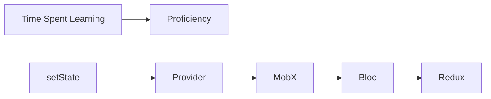

## 10.1.3 Learning Curve

State management is a crucial aspect of Flutter development, and choosing the right solution can significantly impact your project's success. Understanding the learning curve associated with each state management option is vital for making an informed decision. This section delves into the complexity of various state management solutions, evaluates their learning curves, and provides strategies and resources to help you master them.

### Assessing Difficulty

The complexity of a state management solution directly affects the time and effort required to learn it. Several factors influence the learning curve, including:

- **Prior Experience:** Developers with experience in programming patterns like reactive programming or functional programming may find certain solutions easier to grasp.
- **Conceptual Complexity:** Solutions that introduce new concepts or require a deep understanding of existing ones can be more challenging.
- **Tooling and Ecosystem:** The availability of tools, libraries, and community support can ease the learning process.

### Evaluation of Each Solution

#### setState

- **Complexity:** Very basic and fundamental, making it suitable for simple applications or beginners.
- **Scalability:** Limited scalability as it doesn't support complex state management needs.
- **Learning Curve:** Quick to learn, with proficiency achievable in a few hours.
- **Resources:** Abundant tutorials and examples in Flutter's official documentation.

#### Provider

- **Complexity:** Simple to understand, especially for those familiar with InheritedWidgets.
- **Scalability:** Suitable for medium-sized applications.
- **Learning Curve:** Moderate, with comfort achievable in a couple of days.
- **Resources:** Extensive tutorials, community support, and official documentation.

#### Riverpod

- **Complexity:** More advanced than Provider; requires understanding of immutability and dependency injection.
- **Scalability:** Highly scalable for complex applications.
- **Learning Curve:** Steeper, but manageable with detailed documentation available.
- **Resources:** Comprehensive guides, official documentation, and community discussions.

#### Bloc

- **Complexity:** Moderate to steep learning curve due to the complexity of the pattern and the use of streams.
- **Scalability:** Excellent for large applications requiring clear separation of business logic.
- **Learning Curve:** Several days to weeks, depending on prior experience with reactive programming.
- **Resources:** Official documentation, tutorials, and community forums.

#### Redux

- **Complexity:** Steep learning curve due to its functional programming principles and boilerplate.
- **Scalability:** Ideal for large-scale applications with complex state management needs.
- **Learning Curve:** Weeks; may require revisiting fundamental concepts like pure functions and reducers.
- **Resources:** Official guides, community tutorials, and extensive documentation.

#### MobX

- **Complexity:** Moderate learning curve; requires understanding of observables and reactivity.
- **Scalability:** Suitable for applications of varying sizes.
- **Learning Curve:** A few days to a week, depending on familiarity with code generation.
- **Resources:** Official documentation, community tutorials, and examples.

### Learning Resources

For each solution, a wealth of resources is available to aid your learning journey:

- **Official Documentation:** The primary source for understanding the core concepts and APIs.
- **Tutorials and Courses:** Online platforms like Udemy, Coursera, and YouTube offer structured learning paths.
- **Community Forums and Discussions:** Engage with other developers on platforms like Stack Overflow, Reddit, and Flutter's official forums.

### Learning Strategies

To effectively learn each solution, consider the following step-by-step approaches:

- **setState:** Start with basic Flutter tutorials to understand the widget lifecycle and state updates.
- **Provider:** Begin with simple examples and gradually explore more complex use cases involving ChangeNotifier and Consumer widgets.
- **Riverpod:** Focus on understanding providers, consumers, and dependency injection. Build small projects to solidify concepts.
- **Bloc:** Start by grasping the fundamentals of streams and reactive programming. Implement small applications to practice state transitions.
- **Redux:** Familiarize yourself with functional programming principles. Build simple applications to understand actions, reducers, and the store.
- **MobX:** Learn about observables, actions, and reactions. Practice with code generation tools like build_runner.

### Time Estimates

Here's a rough estimate of the time required to become proficient with each solution:

- **setState:** A few hours.
- **Provider:** A couple of days.
- **Riverpod:** Several days to a week.
- **Bloc:** Several days to weeks.
- **Redux:** Weeks.
- **MobX:** A few days to a week.

### Visualizing Learning Curves

To better understand the learning curves of these solutions, consider the following diagram:

This graph illustrates how proficiency increases with time spent learning each solution, with setState being the quickest to master and Redux requiring the most time.

### Key Takeaways

- **Background and Project Timelines:** Consider your own experience and project requirements when choosing a solution.
- **Long-Term Benefits:** Investing time in learning a more complex solution can pay off in long-term project success.
- **Continuous Learning:** Stay updated with the latest developments in state management and Flutter.

By understanding the learning curves of different state management solutions, you can make informed decisions that align with your skills and project needs. Embrace the learning journey, and remember that mastering these tools will enhance your ability to build robust and scalable Flutter applications.

## Quiz Time!



### Which state management solution is considered the most basic and fundamental in Flutter?

- [x] setState
- [ ] Provider
- [ ] Bloc
- [ ] Redux

> **Explanation:** setState is the most basic and fundamental state management solution in Flutter, suitable for simple applications or beginners.

### What is a key factor that influences the learning curve of a state management solution?

- [x] Prior experience with programming patterns
- [ ] The number of lines of code
- [ ] The color scheme of the IDE
- [ ] The size of the development team

> **Explanation:** Prior experience with programming patterns like reactive programming can significantly influence the learning curve of a state management solution.

### Which state management solution requires understanding of streams and reactive programming?

- [ ] setState
- [ ] Provider
- [x] Bloc
- [ ] MobX

> **Explanation:** Bloc requires understanding of streams and reactive programming, contributing to its moderate to steep learning curve.

### How long does it typically take to become proficient with Redux in Flutter?

- [ ] A few hours
- [ ] A couple of days
- [ ] Several days
- [x] Weeks

> **Explanation:** Redux has a steep learning curve due to its functional programming principles and boilerplate, typically taking weeks to master.

### Which solution is more advanced than Provider and requires understanding of immutability and dependency injection?

- [ ] setState
- [x] Riverpod
- [ ] Bloc
- [ ] MobX

> **Explanation:** Riverpod is more advanced than Provider and requires understanding of immutability and dependency injection.

### What is a recommended strategy for learning complex state management solutions like Bloc or Redux?

- [x] Start with understanding the core concepts and build small sample applications
- [ ] Jump directly into large projects
- [ ] Avoid using any documentation
- [ ] Focus only on UI design

> **Explanation:** For complex solutions like Bloc or Redux, it's recommended to start with understanding the core concepts and build small sample applications before integrating into larger projects.

### Which state management solution involves code generation, requiring understanding of tools like build_runner?

- [ ] setState
- [ ] Provider
- [ ] Bloc
- [x] MobX

> **Explanation:** MobX involves code generation, requiring understanding of tools like build_runner.

### What is a common resource available for learning state management solutions in Flutter?

- [x] Official documentation
- [ ] Cooking recipes
- [ ] Travel guides
- [ ] Fashion magazines

> **Explanation:** Official documentation is a common and essential resource available for learning state management solutions in Flutter.

### Which solution is ideal for large-scale applications with complex state management needs?

- [ ] setState
- [ ] Provider
- [ ] MobX
- [x] Redux

> **Explanation:** Redux is ideal for large-scale applications with complex state management needs due to its scalability and functional programming principles.

### True or False: Investing time in learning a more complex state management solution can pay off in long-term project success.

- [x] True
- [ ] False

> **Explanation:** True. Investing time in learning a more complex state management solution can lead to long-term project success by providing robust and scalable state management capabilities.


