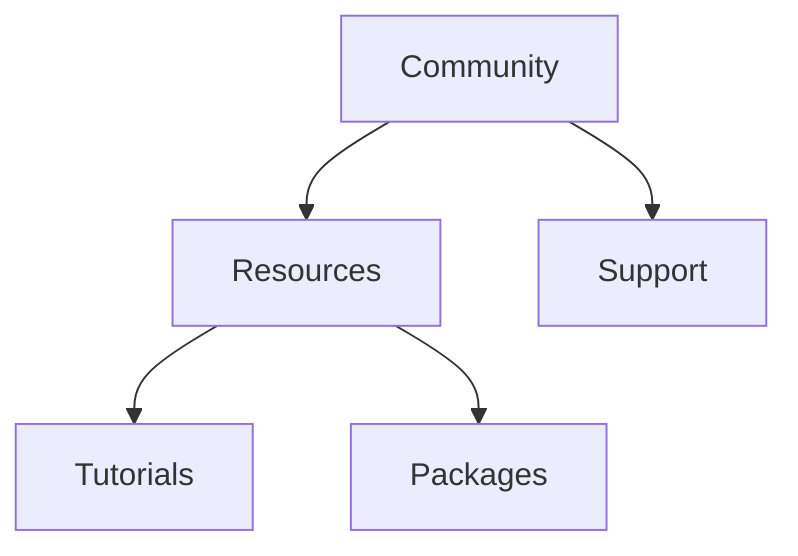

## 10.1.4 Community Support and Resources

In the world of software development, community support plays a pivotal role in the adoption and success of any technology or framework. This is especially true for state management solutions in Flutter, where the community can significantly influence your learning curve, troubleshooting capabilities, and ability to stay updated with the latest advancements. In this section, we will explore the community support and resources available for various state management solutions in Flutter, including Provider, Riverpod, Bloc, Redux, and MobX. We will also discuss the importance of community engagement, official support, and the wealth of resources that can aid developers in their journey.

### Role of Community Support

A strong community can be a developer's best ally. It provides a platform for sharing knowledge, solving problems, and collaborating on projects. Community-contributed packages and extensions can enhance the functionality of state management solutions, offering new features and improvements that might not be available in the core library. Here's how community support can aid developers:

- **Learning and Troubleshooting:** Community forums, discussion boards, and Q&A platforms like Stack Overflow are invaluable for learning new concepts and troubleshooting issues. They provide a space where developers can ask questions, share experiences, and offer solutions.

- **Staying Updated:** The community often serves as a conduit for the latest news and updates. Active communities frequently share information about new releases, bug fixes, and best practices, helping developers stay informed.

- **Enhancing Functionality:** Community-contributed packages and extensions can add new capabilities to state management solutions, making them more versatile and powerful. These contributions can range from simple utility functions to complex integrations with other libraries.

### Analyzing Community Engagement

To understand the level of community engagement for each state management solution, we can look at various metrics such as GitHub repository stars and forks, the number of contributors, frequency of commits and releases, and activity on platforms like Stack Overflow, Reddit, and the Flutter Community.

#### Provider

- **GitHub Stars and Forks:** Provider is one of the most popular state management solutions in Flutter, with thousands of stars and forks on GitHub, indicating widespread use and interest.
- **Contributors:** The repository has numerous contributors, reflecting a healthy level of community involvement.
- **Commits and Releases:** Regular commits and releases show that the library is actively maintained.
- **Community Activity:** Provider is frequently discussed on platforms like Stack Overflow and Reddit, with many tutorials and examples available online.

#### Riverpod

- **GitHub Stars and Forks:** Riverpod is gaining popularity, with a growing number of stars and forks on GitHub.
- **Contributors:** The library is primarily maintained by its author, but contributions from the community are increasing.
- **Commits and Releases:** Riverpod sees frequent updates, with comprehensive documentation maintained by the author.
- **Community Activity:** Discussions around Riverpod are becoming more common, with a dedicated community forming around it.

#### Bloc

- **GitHub Stars and Forks:** Bloc has a strong presence on GitHub, with a significant number of stars and forks.
- **Contributors:** Supported by the BlocLibrary team, it has a robust contributor base.
- **Commits and Releases:** The library is actively developed, with regular updates and a dedicated website.
- **Community Activity:** Bloc is well-represented in community discussions, with extensive tutorials and resources available.

#### Redux

- **GitHub Stars and Forks:** Redux has fewer stars and forks in the Flutter community compared to its JavaScript counterpart.
- **Contributors:** The contributor base is smaller, but the library is still actively maintained.
- **Commits and Releases:** Updates are less frequent, reflecting its smaller community in Flutter.
- **Community Activity:** Resources are available but often require adaptation from JavaScript materials.

#### MobX

- **GitHub Stars and Forks:** MobX has a moderate number of stars and forks, indicating a dedicated user base.
- **Contributors:** The library benefits from an active community with multiple contributors.
- **Commits and Releases:** Regular updates and a dedicated website provide ample resources for developers.
- **Community Activity:** MobX is actively discussed in forums and has a wealth of examples available.

### Official Support

Official support from the Flutter team can significantly influence the adoption of a state management solution. For instance, Provider is recommended in Flutter's official documentation, which has contributed to its widespread use. While not all solutions receive official endorsement, many are recognized and supported by the broader Flutter community.

### Available Resources

Each state management solution comes with its own set of resources that can aid developers in their learning and implementation journey. Here's a breakdown of the resources available for each solution:

#### Provider

- **Community Backing:** Provider has a strong community backing, with numerous tutorials and examples available online.
- **Official Documentation:** Comprehensive documentation is available, making it easy for developers to get started.

#### Riverpod

- **Growing Community:** Riverpod's community is growing, with increasing contributions from developers.
- **Comprehensive Documentation:** Maintained by the author, the documentation is thorough and well-organized.

#### Bloc

- **Supported by BlocLibrary Team:** The BlocLibrary team provides extensive support, including detailed documentation and tutorials.
- **Dedicated Website:** A dedicated website offers a wealth of resources for developers.

#### Redux

- **Smaller Community:** While the community is smaller in Flutter, resources are available, often adapted from JavaScript materials.
- **Documentation:** Official documentation provides guidance on implementation.

#### MobX

- **Active Community:** MobX benefits from an active community, with a dedicated website and numerous examples.
- **Resources:** A wealth of resources is available, including tutorials and documentation.

### Community Contributions

Community contributions play a crucial role in the evolution of state management solutions. Third-party packages, plugins, and tools can complement each solution, adding new features and capabilities. Notable community projects can serve as examples or starting points for developers looking to implement similar functionality.

### Training and Events

Workshops, webinars, and conferences focusing on state management solutions provide valuable learning opportunities. Participating in community events can help developers network, share knowledge, and learn from experts in the field. These events often cover best practices, advanced techniques, and the latest developments in state management.

### Mermaid.js Diagrams

Visual representations can enhance understanding of the ecosystem of resources available for each state management solution. Below is an example diagram illustrating the relationship between community support and resources:

### Key Takeaways

- **Importance of Community:** A strong community is essential for long-term project support, offering resources, troubleshooting assistance, and updates.
- **Contributing Back:** Developers are encouraged to contribute back to the community, whether through code contributions, documentation, or sharing knowledge.

By leveraging community support and resources, developers can enhance their understanding and implementation of state management solutions in Flutter. Engaging with the community not only aids personal growth but also contributes to the collective advancement of the technology.

## Quiz Time!



### How can a strong community support aid developers?

- [x] By providing a platform for sharing knowledge and solving problems.
- [ ] By making development more expensive.
- [ ] By reducing the number of available resources.
- [ ] By limiting the functionality of state management solutions.

> **Explanation:** A strong community provides a platform for sharing knowledge, solving problems, and collaborating on projects, which aids developers in their work.

### Which state management solution is officially recommended in Flutter's documentation?

- [x] Provider
- [ ] Riverpod
- [ ] Bloc
- [ ] Redux

> **Explanation:** Provider is officially recommended in Flutter's documentation, which has contributed to its widespread use.

### What is a key benefit of community-contributed packages?

- [x] They enhance the functionality of state management solutions.
- [ ] They decrease the number of available features.
- [ ] They make solutions harder to use.
- [ ] They limit the scope of applications.

> **Explanation:** Community-contributed packages can enhance the functionality of state management solutions by adding new features and improvements.

### Which state management solution is supported by the BlocLibrary team?

- [x] Bloc
- [ ] Provider
- [ ] Riverpod
- [ ] MobX

> **Explanation:** Bloc is supported by the BlocLibrary team, which provides extensive support, including detailed documentation and tutorials.

### What is a common activity found in strong community support?

- [x] Frequent discussions on platforms like Stack Overflow and Reddit.
- [ ] Limiting access to resources.
- [ ] Reducing the number of tutorials available.
- [ ] Discouraging collaboration among developers.

> **Explanation:** Frequent discussions on platforms like Stack Overflow and Reddit are common in strong community support, providing a space for developers to share knowledge and solve problems.

### Which state management solution has a growing community with comprehensive documentation maintained by the author?

- [x] Riverpod
- [ ] Provider
- [ ] Bloc
- [ ] Redux

> **Explanation:** Riverpod has a growing community with comprehensive documentation maintained by the author, making it a popular choice among developers.

### What is a key takeaway regarding community support?

- [x] A strong community is essential for long-term project support.
- [ ] Community support is not important for project success.
- [ ] A strong community limits the number of available resources.
- [ ] Community support decreases the functionality of solutions.

> **Explanation:** A strong community is essential for long-term project support, offering resources, troubleshooting assistance, and updates.

### What role do third-party packages play in state management solutions?

- [x] They complement each solution by adding new features and capabilities.
- [ ] They limit the functionality of state management solutions.
- [ ] They decrease the number of available features.
- [ ] They make solutions harder to use.

> **Explanation:** Third-party packages complement each solution by adding new features and capabilities, enhancing the overall functionality.

### Which state management solution is known for having a smaller community in Flutter compared to its JavaScript counterpart?

- [x] Redux
- [ ] Provider
- [ ] Riverpod
- [ ] MobX

> **Explanation:** Redux has a smaller community in Flutter compared to its JavaScript counterpart, but resources are still available.

### True or False: Participating in community events can help developers network and learn from experts.

- [x] True
- [ ] False

> **Explanation:** Participating in community events can help developers network, share knowledge, and learn from experts in the field, providing valuable learning opportunities.


