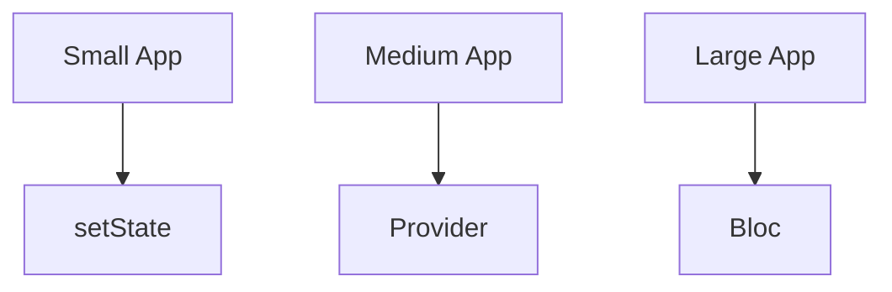

## 10.2.1 Complexity and Scale

In the realm of Flutter development, choosing the right state management solution is pivotal to the success and maintainability of your application. This section delves into how to assess the complexity and scale of your application to make informed decisions about state management. We'll explore evaluating application complexity, matching solutions to complexity, scalability considerations, and provide practical code examples and diagrams to illustrate these concepts.

### Evaluating Application Complexity

Understanding the complexity of your application is the first step in selecting an appropriate state management solution. Here are key factors to consider:

- **Number of Screens and Widgets:**
  - The more screens and widgets your application has, the more complex the state management becomes. Each screen may require its own state or share state with others, increasing the interdependencies.

- **Amount of Shared State Across the Application:**
  - Applications with a significant amount of shared state need a robust mechanism to manage state changes and ensure consistency across different parts of the app.

- **Need for State Persistence and Synchronization:**
  - If your app requires state persistence (e.g., saving user preferences or session data) or synchronization (e.g., real-time updates from a server), this adds another layer of complexity.

### Matching Solutions to Complexity

Choosing the right state management solution depends on the complexity of your application. Here’s a guide to help you match solutions to your app's complexity:

#### Simple Apps

For applications with straightforward state management needs, such as a small number of screens and minimal shared state, simple solutions like `setState` or Provider are often sufficient. These solutions are easy to implement and understand, making them ideal for small projects or prototypes.

- **Example Scenario:** A basic counter app or a simple form with local state.

```dart
class CounterApp extends StatefulWidget {
  @override
  _CounterAppState createState() => _CounterAppState();
}

class _CounterAppState extends State<CounterApp> {
  int _counter = 0;

  void _incrementCounter() {
    setState(() {
      _counter++;
    });
  }

  @override
  Widget build(BuildContext context) {
    return Scaffold(
      appBar: AppBar(title: Text('Counter')),
      body: Center(child: Text('Counter: $_counter')),
      floatingActionButton: FloatingActionButton(
        onPressed: _incrementCounter,
        child: Icon(Icons.add),
      ),
    );
  }
}
```

#### Moderate Complexity

Apps that require more structured state management, such as those with multiple screens and shared state, may benefit from solutions like Riverpod or MobX. These tools provide more control and scalability than `setState` while still being relatively easy to implement.

- **Example Scenario:** An app with user authentication and multiple screens sharing user data.

```dart
final userProvider = StateProvider<User>((ref) => User());

class UserScreen extends ConsumerWidget {
  @override
  Widget build(BuildContext context, ScopedReader watch) {
    final user = watch(userProvider).state;
    return Scaffold(
      appBar: AppBar(title: Text('User Profile')),
      body: Center(child: Text('Hello, ${user.name}')),
    );
  }
}
```

#### High Complexity

For large-scale applications with intricate business logic and multiple developers, solutions like Bloc or Redux offer better state control and scalability. These solutions are designed to handle complex state interactions and can scale with the application's growth.

- **Example Scenario:** An e-commerce app with complex user interactions and data flow.

```dart
class AuthenticationBloc extends Bloc<AuthenticationEvent, AuthenticationState> {
  AuthenticationBloc() : super(AuthenticationInitial());

  @override
  Stream<AuthenticationState> mapEventToState(AuthenticationEvent event) async* {
    if (event is LoginEvent) {
      yield AuthenticationLoading();
      try {
        final user = await authenticate(event.username, event.password);
        yield AuthenticationSuccess(user);
      } catch (_) {
        yield AuthenticationFailure();
      }
    }
  }
}
```

### Scalability Considerations

Scalability is a critical factor when choosing a state management solution. Some solutions handle growth better than others, and it's essential to plan for future expansion:

- **Growth Handling:** Solutions like Bloc and Redux are designed to handle complex and large-scale applications, making them suitable for projects expected to grow significantly.

- **Planning for Expansion:** Consider the potential growth of your application and choose a solution that can accommodate future features and increased complexity.

- **Migration Stories:** There are numerous examples of apps that outgrew their initial state management solution and had to migrate to more robust options. For instance, a startup might begin with `setState` and later transition to Bloc as their app scales.

### Code Examples

Let's illustrate how state is managed differently as complexity increases with a practical example: managing authentication state.

#### Using `setState`

```dart
class LoginScreen extends StatefulWidget {
  @override
  _LoginScreenState createState() => _LoginScreenState();
}

class _LoginScreenState extends State<LoginScreen> {
  String _username;
  String _password;
  bool _isLoading = false;

  void _login() {
    setState(() {
      _isLoading = true;
    });
    // Simulate a login API call
    Future.delayed(Duration(seconds: 2), () {
      setState(() {
        _isLoading = false;
      });
      // Navigate to home screen
    });
  }

  @override
  Widget build(BuildContext context) {
    return Scaffold(
      appBar: AppBar(title: Text('Login')),
      body: Column(
        children: [
          TextField(onChanged: (value) => _username = value),
          TextField(onChanged: (value) => _password = value),
          if (_isLoading) CircularProgressIndicator(),
          ElevatedButton(onPressed: _login, child: Text('Login')),
        ],
      ),
    );
  }
}
```

#### Using Bloc

```dart
class LoginBloc extends Bloc<LoginEvent, LoginState> {
  LoginBloc() : super(LoginInitial());

  @override
  Stream<LoginState> mapEventToState(LoginEvent event) async* {
    if (event is LoginButtonPressed) {
      yield LoginLoading();
      try {
        final user = await authenticate(event.username, event.password);
        yield LoginSuccess(user);
      } catch (_) {
        yield LoginFailure();
      }
    }
  }
}

class LoginScreen extends StatelessWidget {
  @override
  Widget build(BuildContext context) {
    return BlocProvider(
      create: (context) => LoginBloc(),
      child: Scaffold(
        appBar: AppBar(title: Text('Login')),
        body: BlocListener<LoginBloc, LoginState>(
          listener: (context, state) {
            if (state is LoginSuccess) {
              Navigator.pushNamed(context, '/home');
            }
          },
          child: BlocBuilder<LoginBloc, LoginState>(
            builder: (context, state) {
              if (state is LoginLoading) {
                return CircularProgressIndicator();
              }
              return Column(
                children: [
                  TextField(onChanged: (value) => context.read<LoginBloc>().add(UsernameChanged(value))),
                  TextField(onChanged: (value) => context.read<LoginBloc>().add(PasswordChanged(value))),
                  ElevatedButton(
                    onPressed: () => context.read<LoginBloc>().add(LoginButtonPressed()),
                    child: Text('Login'),
                  ),
                ],
              );
            },
          ),
        ),
      ),
    );
  }
}
```

### Mermaid.js Diagrams

To visualize how different state management solutions fit different scales of applications, consider the following diagram:



This diagram illustrates how different solutions are suited to different levels of application complexity.

### Key Takeaways

- **Align Solutions with Complexity:** Choose a state management solution that aligns with the current and anticipated complexity of your app.
- **Plan for Growth:** Consider scalability and future expansion when selecting a solution.
- **Learn from Others:** Study examples of apps that have transitioned between state management solutions as they scaled.
- **Experiment and Iterate:** Don't hesitate to experiment with different solutions to find the best fit for your project.

By carefully assessing the complexity and scale of your application, you can select a state management solution that not only meets your current needs but also supports your application's growth and evolution.

## Quiz Time!



### What is a key factor in assessing application complexity?

- [x] Number of screens and widgets
- [ ] The color scheme of the app
- [ ] The programming language used
- [ ] The size of the development team

> **Explanation:** The number of screens and widgets is a crucial factor in determining the complexity of an application, as it affects how state is managed and shared.

### Which state management solution is recommended for simple apps?

- [x] setState
- [ ] Bloc
- [ ] Redux
- [ ] MobX

> **Explanation:** For simple apps with straightforward state needs, `setState` is often sufficient and easy to implement.

### What is a benefit of using Bloc for high-complexity apps?

- [x] Better state control and scalability
- [ ] Simpler syntax than setState
- [ ] Requires less boilerplate code
- [ ] Automatically generates UI components

> **Explanation:** Bloc provides better state control and scalability, making it suitable for high-complexity applications.

### How does Riverpod compare to setState for moderate complexity apps?

- [x] Riverpod offers more structured state management
- [ ] Riverpod is less efficient than setState
- [ ] Riverpod requires more lines of code
- [ ] Riverpod is only for high-complexity apps

> **Explanation:** Riverpod provides more structured state management, which is beneficial for apps with moderate complexity.

### What should you consider when planning for app growth?

- [x] Scalability of the state management solution
- [ ] The app's logo design
- [ ] The initial development timeline
- [ ] The number of developers on the team

> **Explanation:** Scalability is crucial when planning for app growth, ensuring the state management solution can handle future complexity.

### What is a common reason for migrating state management solutions?

- [x] The app outgrows its initial solution
- [ ] The app's UI needs a redesign
- [ ] The development team changes
- [ ] The app's target audience shifts

> **Explanation:** As apps grow in complexity, they may outgrow their initial state management solution, necessitating a migration to a more robust option.

### Which solution is best for handling complex business logic?

- [x] Bloc
- [ ] setState
- [ ] Provider
- [ ] None of the above

> **Explanation:** Bloc is well-suited for handling complex business logic due to its structured approach to state management.

### What is an example of a high-complexity app?

- [x] An e-commerce app with complex user interactions
- [ ] A simple calculator app
- [ ] A static website
- [ ] A single-page brochure app

> **Explanation:** An e-commerce app with complex user interactions and data flow is an example of a high-complexity app.

### How does Provider compare to Bloc for medium complexity apps?

- [x] Provider is simpler and less structured than Bloc
- [ ] Provider is more complex than Bloc
- [ ] Provider automatically handles all state changes
- [ ] Provider is only for simple apps

> **Explanation:** Provider is simpler and less structured than Bloc, making it suitable for medium complexity apps.

### True or False: setState is always the best choice for managing state in Flutter apps.

- [ ] True
- [x] False

> **Explanation:** While `setState` is useful for simple apps, it may not be the best choice for more complex applications that require structured state management.


