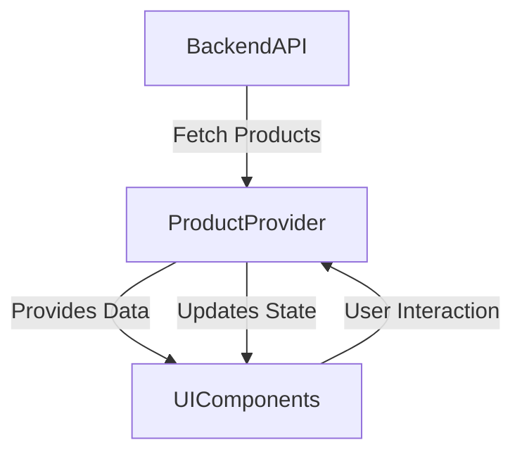

## 11.1.1 Managing Product State

In the realm of e-commerce applications, managing product state effectively is crucial to delivering a seamless user experience. Products are the core of any e-commerce platform, and their state can be complex, involving dynamic pricing, inventory levels, and various attributes. This section will guide you through the process of managing product state in a Flutter e-commerce application, using robust state management techniques to ensure scalability and maintainability.

### Introduction

Managing product state in an e-commerce app is a multifaceted challenge. Products can have numerous attributes such as price, stock levels, descriptions, and images. Additionally, these attributes can change frequently due to sales, inventory updates, or new product launches. Effective state management ensures that the app remains responsive and provides accurate information to users, enhancing their shopping experience.

### Product Model Definition

To begin, we need a well-defined `Product` model that encapsulates all necessary product attributes. This model serves as the blueprint for product data throughout the application.

```dart
import 'package:freezed_annotation/freezed_annotation.dart';

part 'product.freezed.dart';
part 'product.g.dart';

@freezed
class Product with _$Product {
  const factory Product({
    required String id,
    required String name,
    required String description,
    required double price,
    required List<String> images,
    required int stockQuantity,
  }) = _Product;

  factory Product.fromJson(Map<String, dynamic> json) => _$ProductFromJson(json);
}
```

**Explanation:**

- **Immutable Models:** Using the `freezed` package, we define an immutable `Product` model. Immutable models prevent accidental modifications, ensuring data consistency.
- **Data Classes:** The `freezed` package also generates utility methods like `copyWith`, `toString`, and `equality` checks, making it easier to work with product data.
- **Serialization:** The `fromJson` method allows easy conversion from JSON, which is essential when fetching data from APIs.

### State Management Setup

For managing product state, we choose **Riverpod** due to its simplicity, scalability, and support for dependency injection. Riverpod allows for a clean separation of business logic from UI components, which is vital for maintaining large applications.

**Setting Up Riverpod:**

1. **Add Dependencies:**

   Add the following dependencies to your `pubspec.yaml`:

   ```yaml
   dependencies:
     flutter:
       sdk: flutter
     flutter_riverpod: ^1.0.0
     freezed_annotation: ^1.0.0

   dev_dependencies:
     build_runner: ^2.0.0
     freezed: ^1.0.0
   ```

2. **Create a Product Provider:**

   ```dart
   import 'package:flutter_riverpod/flutter_riverpod.dart';
   import 'product.dart';

   final productProvider = StateNotifierProvider<ProductNotifier, List<Product>>((ref) {
     return ProductNotifier();
   });

   class ProductNotifier extends StateNotifier<List<Product>> {
     ProductNotifier() : super([]);

     void addProduct(Product product) {
       state = [...state, product];
     }

     void updateProduct(Product updatedProduct) {
       state = [
         for (final product in state)
           if (product.id == updatedProduct.id) updatedProduct else product
       ];
     }
   }
   ```

**Why Riverpod?**

- **Scalability:** Riverpod's architecture supports large-scale applications by providing a clear separation between state and UI.
- **Performance:** It minimizes rebuilds by allowing fine-grained control over state changes.
- **Ease of Use:** Riverpod's API is intuitive, making it easy to manage complex state interactions.

### Fetching Products

Fetching product data from a backend service is a common requirement. Here, we'll demonstrate how to perform asynchronous network requests and handle loading and error states.

```dart
import 'package:flutter_riverpod/flutter_riverpod.dart';
import 'package:http/http.dart' as http;
import 'dart:convert';

final productRepositoryProvider = Provider<ProductRepository>((ref) {
  return ProductRepository();
});

class ProductRepository {
  Future<List<Product>> fetchProducts() async {
    final response = await http.get(Uri.parse('https://api.example.com/products'));

    if (response.statusCode == 200) {
      List<dynamic> data = json.decode(response.body);
      return data.map((json) => Product.fromJson(json)).toList();
    } else {
      throw Exception('Failed to load products');
    }
  }
}

final fetchProductsProvider = FutureProvider<List<Product>>((ref) async {
  final repository = ref.watch(productRepositoryProvider);
  return repository.fetchProducts();
});
```

**Key Points:**

- **Asynchronous Requests:** We use the `http` package to perform network requests asynchronously.
- **Error Handling:** The `fetchProducts` method throws an exception if the request fails, which can be caught and handled in the UI layer.
- **Loading State:** The `FutureProvider` automatically manages loading states, simplifying UI updates.

### Updating Product State

Product information can change frequently. It's essential to handle state updates efficiently, whether it's a price change, stock update, or new product addition.

```dart
void updateProductPrice(String productId, double newPrice) {
  state = [
    for (final product in state)
      if (product.id == productId)
        product.copyWith(price: newPrice)
      else
        product
  ];
}
```

**Real-Time Updates:**

For real-time updates, consider using WebSockets or Firebase. These technologies allow the app to receive updates instantly, ensuring users always see the latest information.

### Displaying Products

Displaying products involves building UI components that react to state changes. We'll use Flutter widgets like `ListView.builder` and `GridView` to create responsive layouts.

```dart
import 'package:flutter/material.dart';
import 'package:flutter_riverpod/flutter_riverpod.dart';

class ProductList extends ConsumerWidget {
  @override
  Widget build(BuildContext context, ScopedReader watch) {
    final productList = watch(fetchProductsProvider);

    return productList.when(
      data: (products) {
        return ListView.builder(
          itemCount: products.length,
          itemBuilder: (context, index) {
            final product = products[index];
            return ListTile(
              title: Text(product.name),
              subtitle: Text('\$${product.price}'),
              leading: Image.network(product.images.first),
            );
          },
        );
      },
      loading: () => CircularProgressIndicator(),
      error: (error, stack) => Text('Error: $error'),
    );
  }
}
```

**UI Components:**

- **ListView.builder:** Efficiently displays a scrollable list of products.
- **ConsumerWidget:** Automatically rebuilds when the product state changes, ensuring the UI reflects the latest data.

### Best Practices

- **Provider Patterns:** Use Riverpod's provider patterns for dependency injection, promoting a clean architecture.
- **Separation of Concerns:** Keep business logic separate from UI code to enhance maintainability.
- **Performance Optimization:** Implement pagination or infinite scrolling to handle large product lists efficiently.
- **Accessibility:** Ensure UI components are accessible, providing alternative text for images and supporting screen readers.

### Mermaid.js Diagrams

Visualizing the flow of data can clarify how state management layers interact. Below is a diagram illustrating the product state update flow:



### Conclusion

Managing product state in a Flutter e-commerce application involves defining robust models, setting up scalable state management solutions, and ensuring the UI reflects state changes accurately. By following best practices and leveraging tools like Riverpod, developers can create responsive and maintainable applications that enhance the user experience.

## Quiz Time!



### What is a key advantage of using immutable models in Flutter?

- [x] Prevents accidental modifications to data
- [ ] Increases the complexity of the code
- [ ] Reduces the performance of the application
- [ ] Makes it harder to serialize data

> **Explanation:** Immutable models ensure data consistency by preventing accidental changes, which is crucial in managing product state.

### Why is Riverpod a suitable choice for managing product state in Flutter?

- [x] It provides a clear separation between state and UI
- [ ] It is the only state management solution available
- [ ] It requires less code than other solutions
- [ ] It does not support dependency injection

> **Explanation:** Riverpod supports a clean architecture by separating business logic from UI components, making it ideal for scalable applications.

### What package is used to perform network requests in the provided example?

- [x] http
- [ ] dio
- [ ] axios
- [ ] retrofit

> **Explanation:** The `http` package is used for making asynchronous network requests to fetch product data.

### How can real-time product updates be achieved in a Flutter app?

- [x] Using WebSockets or Firebase
- [ ] By frequently polling the server
- [ ] By using local storage
- [ ] By manually refreshing the app

> **Explanation:** WebSockets and Firebase provide real-time communication, allowing the app to receive updates instantly.

### Which widget is used to display a scrollable list of products?

- [x] ListView.builder
- [ ] GridView
- [ ] Column
- [ ] Stack

> **Explanation:** `ListView.builder` efficiently displays a scrollable list of items, such as products.

### What is the role of the `ConsumerWidget` in Flutter?

- [x] It rebuilds the UI when the state changes
- [ ] It manages network requests
- [ ] It handles user input
- [ ] It provides animations

> **Explanation:** `ConsumerWidget` listens to state changes and rebuilds the UI accordingly, ensuring it reflects the latest data.

### How does the `freezed` package benefit the `Product` model?

- [x] It generates utility methods and ensures immutability
- [ ] It reduces the size of the model
- [ ] It makes the model mutable
- [ ] It increases the complexity of the code

> **Explanation:** `freezed` generates utility methods like `copyWith` and ensures the model is immutable, enhancing data integrity.

### What is a common technique for handling large product lists efficiently?

- [x] Implementing pagination or infinite scrolling
- [ ] Loading all products at once
- [ ] Using a single static page
- [ ] Disabling scrolling

> **Explanation:** Pagination or infinite scrolling helps manage large datasets by loading data incrementally, improving performance.

### What is the purpose of the `StateNotifierProvider` in Riverpod?

- [x] It manages and updates the state
- [ ] It handles UI rendering
- [ ] It performs network requests
- [ ] It provides animations

> **Explanation:** `StateNotifierProvider` is used to manage and update the application state in Riverpod.

### True or False: The `Product` model should include methods for directly modifying its fields.

- [ ] True
- [x] False

> **Explanation:** The `Product` model should be immutable, meaning it should not have methods for directly modifying its fields to ensure data consistency.


