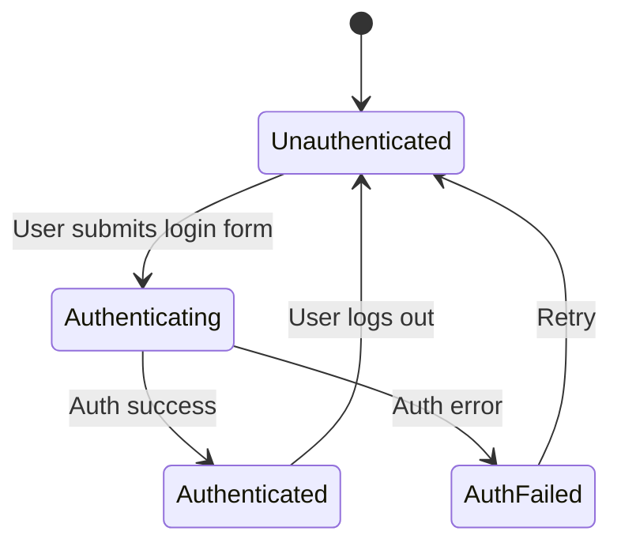

## 11.1.2 User Authentication and State Persistence

In the realm of e-commerce applications, user authentication is a cornerstone for delivering personalized experiences, managing user data securely, and ensuring seamless interactions. This section delves into implementing user authentication and persisting authentication state across app sessions in Flutter, providing a comprehensive guide with practical examples and best practices.

### Authentication Overview

Authentication in an e-commerce app is crucial for several reasons:

- **Personalized Experience:** Authenticated users can access personalized content, view order history, and manage their profiles.
- **Security:** Ensures that sensitive operations, such as payments and personal data access, are restricted to authorized users.
- **User Engagement:** Enables features like wishlists, saved carts, and personalized recommendations.

#### Different Authentication Methods

1. **Email/Password:** The most common method, requiring users to register with an email and password.
2. **OAuth:** Allows users to log in using third-party services like Google, Facebook, or Apple, reducing friction and enhancing security.
3. **Biometrics:** Utilizes device capabilities like fingerprint or facial recognition for authentication, offering a seamless and secure experience.

### Implementing Authentication Flow

Implementing a robust authentication flow involves creating intuitive login and registration interfaces, validating user inputs, and handling authentication requests securely.

#### Building Login and Registration Screens

Let's start by creating a simple login screen using Flutter's form widgets:

```dart
import 'package:flutter/material.dart';

class LoginScreen extends StatefulWidget {
  @override
  _LoginScreenState createState() => _LoginScreenState();
}

class _LoginScreenState extends State<LoginScreen> {
  final _formKey = GlobalKey<FormState>();
  String _email = '';
  String _password = '';

  void _submit() {
    if (_formKey.currentState!.validate()) {
      _formKey.currentState!.save();
      // Trigger authentication process
    }
  }

  @override
  Widget build(BuildContext context) {
    return Scaffold(
      appBar: AppBar(title: Text('Login')),
      body: Padding(
        padding: const EdgeInsets.all(16.0),
        child: Form(
          key: _formKey,
          child: Column(
            children: <Widget>[
              TextFormField(
                decoration: InputDecoration(labelText: 'Email'),
                keyboardType: TextInputType.emailAddress,
                validator: (value) {
                  if (value == null || !value.contains('@')) {
                    return 'Please enter a valid email.';
                  }
                  return null;
                },
                onSaved: (value) => _email = value!,
              ),
              TextFormField(
                decoration: InputDecoration(labelText: 'Password'),
                obscureText: true,
                validator: (value) {
                  if (value == null || value.length < 6) {
                    return 'Password must be at least 6 characters.';
                  }
                  return null;
                },
                onSaved: (value) => _password = value!,
              ),
              SizedBox(height: 20),
              ElevatedButton(
                onPressed: _submit,
                child: Text('Login'),
              ),
            ],
          ),
        ),
      ),
    );
  }
}
```

#### Handling Authentication Requests

To handle authentication requests asynchronously, you can use Dart's `Future` and `async/await` patterns. Here's a basic example of how you might authenticate a user:

```dart
Future<void> authenticate(String email, String password) async {
  try {
    // Simulate network call
    await Future.delayed(Duration(seconds: 2));
    // Assume authentication is successful
    print('User authenticated');
  } catch (error) {
    print('Authentication failed: $error');
  }
}
```

### State Management for Auth

Managing authentication state effectively is crucial for providing a seamless user experience. We'll use a state management solution to handle different authentication states.

#### Authentication States

- **Unauthenticated:** The user is not logged in.
- **Authenticating:** The app is processing the login request.
- **Authenticated:** The user is logged in successfully.
- **AuthFailed:** The login attempt failed.

Here's how you can manage these states using a simple `ChangeNotifier`:

```dart
import 'package:flutter/material.dart';

class AuthProvider with ChangeNotifier {
  bool _isAuthenticated = false;
  bool get isAuthenticated => _isAuthenticated;

  Future<void> login(String email, String password) async {
    // Set state to authenticating
    notifyListeners();
    try {
      await authenticate(email, password);
      _isAuthenticated = true;
    } catch (error) {
      _isAuthenticated = false;
    }
    notifyListeners();
  }

  void logout() {
    _isAuthenticated = false;
    notifyListeners();
  }
}
```

### State Persistence

Persisting authentication state ensures that users remain logged in across app sessions. This can be achieved using packages like `shared_preferences` or `flutter_secure_storage`.

#### Saving and Retrieving Tokens Securely

To securely store authentication tokens, use `flutter_secure_storage`:

```dart
import 'package:flutter_secure_storage/flutter_secure_storage.dart';

final storage = FlutterSecureStorage();

Future<void> saveToken(String token) async {
  await storage.write(key: 'auth_token', value: token);
}

Future<String?> getToken() async {
  return await storage.read(key: 'auth_token');
}
```

#### Security Best Practices

- **Encrypt Sensitive Data:** Always encrypt tokens and sensitive information before storing them.
- **Use Secure Storage:** Avoid using plain text storage for sensitive data.

### Session Management

Handling session expiration and token refresh is vital for maintaining security and user experience.

#### Session Expiration and Token Refresh

Implement logic to check token validity and refresh it if necessary. Redirect users to the login screen if their session expires.

```dart
void checkSession() async {
  String? token = await getToken();
  if (token == null || isTokenExpired(token)) {
    // Redirect to login
  } else {
    // Refresh token if necessary
  }
}
```

### Logging Out

Implementing logout functionality involves clearing all persisted data securely.

```dart
void logout() async {
  await storage.delete(key: 'auth_token');
  // Update state
}
```

### Authentication Flow Diagram

Below is a visual representation of the authentication flow using Mermaid.js:



### Best Practices

- **Non-Blocking UI:** Avoid blocking the UI during authentication processes. Use `StreamBuilder` or similar widgets for reactive UI updates.
- **Data Protection Compliance:** Ensure compliance with legal requirements for data protection, such as GDPR.
- **Error Handling:** Provide clear feedback to users on authentication errors and guide them on corrective actions.

### Conclusion

Implementing user authentication and state persistence in a Flutter e-commerce app involves a combination of secure coding practices, efficient state management, and a focus on user experience. By following the guidelines and examples provided, you can create a robust authentication system that enhances both security and usability.

### Further Reading and Resources

- [Flutter Secure Storage Documentation](https://pub.dev/packages/flutter_secure_storage)
- [Shared Preferences Documentation](https://pub.dev/packages/shared_preferences)
- [OAuth 2.0 Guide](https://oauth.net/2/)
- [GDPR Compliance for Developers](https://gdpr.eu/)

## Quiz Time!



### What is the primary role of authentication in an e-commerce app?

- [x] To provide a personalized user experience and secure access to sensitive operations.
- [ ] To increase app download size.
- [ ] To slow down the app's performance.
- [ ] To make the app more complex.

> **Explanation:** Authentication ensures that users have personalized experiences and secure access to sensitive operations like payments.

### Which package is recommended for securely storing authentication tokens in Flutter?

- [x] flutter_secure_storage
- [ ] shared_preferences
- [ ] path_provider
- [ ] http

> **Explanation:** `flutter_secure_storage` is used for securely storing sensitive data like authentication tokens.

### What is a common method for handling session expiration in a Flutter app?

- [x] Checking token validity and refreshing it if necessary.
- [ ] Ignoring the expiration and letting users continue.
- [ ] Storing tokens in plain text.
- [ ] Using a local database for token management.

> **Explanation:** Checking token validity and refreshing it ensures that sessions remain secure and users are not logged out unexpectedly.

### What should be done when a user logs out of an app?

- [x] Clear all persisted authentication data securely.
- [ ] Keep the user logged in.
- [ ] Store the user's password in plain text.
- [ ] Disable the logout button.

> **Explanation:** Clearing all persisted data ensures that the user's session is completely terminated and secure.

### Which state management solution was demonstrated for managing authentication states?

- [x] ChangeNotifier
- [ ] Redux
- [ ] Bloc
- [ ] MobX

> **Explanation:** The example used `ChangeNotifier` to manage authentication states.

### What is a key benefit of using OAuth for authentication?

- [x] It allows users to log in using third-party services, reducing friction and enhancing security.
- [ ] It requires users to remember more passwords.
- [ ] It makes the app slower.
- [ ] It increases the complexity of the app.

> **Explanation:** OAuth allows users to authenticate using existing accounts from third-party services, simplifying the login process.

### What is the purpose of the `StreamBuilder` widget in the context of authentication?

- [x] To provide reactive UI updates without blocking the main thread.
- [ ] To store user passwords.
- [ ] To increase app size.
- [ ] To decrease app performance.

> **Explanation:** `StreamBuilder` is used for reactive UI updates, ensuring a smooth user experience during authentication processes.

### Why is it important to encrypt sensitive data before storing it?

- [x] To protect the data from unauthorized access.
- [ ] To make the app slower.
- [ ] To increase the app's complexity.
- [ ] To comply with no regulations.

> **Explanation:** Encrypting sensitive data protects it from unauthorized access, ensuring user security.

### What is a common pitfall to avoid during authentication processes?

- [x] Blocking the UI, which can lead to a poor user experience.
- [ ] Providing too much feedback to the user.
- [ ] Using too many state management solutions.
- [ ] Storing tokens securely.

> **Explanation:** Blocking the UI can lead to a poor user experience, so it's important to keep the UI responsive during authentication.

### True or False: Shared preferences are the best option for storing sensitive authentication data.

- [ ] True
- [x] False

> **Explanation:** Shared preferences are not secure enough for storing sensitive data like authentication tokens; `flutter_secure_storage` is recommended.


