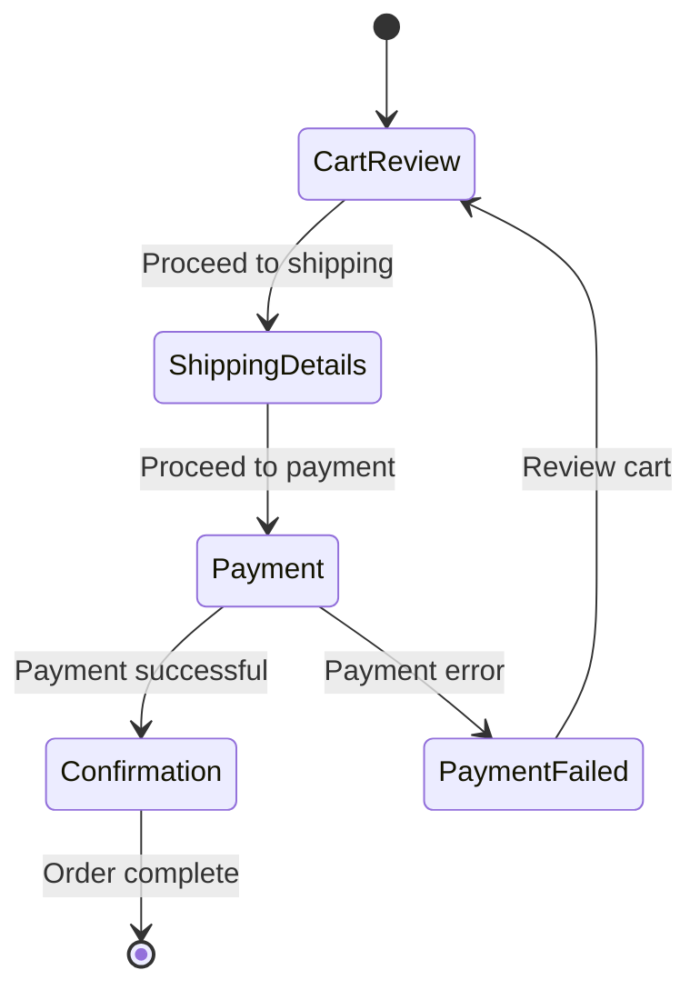

## 11.1.3 Cart and Checkout Flows

In the realm of e-commerce applications, managing cart and checkout flows effectively is crucial for providing a seamless user experience. This section delves into the intricacies of implementing these functionalities in Flutter, leveraging robust state management solutions to handle the complexities involved. We'll explore how to manage cart state globally, implement a multi-step checkout process, integrate payment gateways securely, and ensure a responsive and user-friendly interface.

### Cart State Management

#### The Need for Global State

In an e-commerce application, the shopping cart is a central feature that requires careful state management. The cart's state must be accessible across different parts of the application, such as product listings, product details, and the checkout page. This necessitates a global state management solution that ensures consistency and synchronization across the app.

**Key Considerations:**

- **Consistency:** Ensure that the cart state is consistent across all views and components.
- **Persistence:** Maintain cart state even if the user navigates away from the app or closes it.
- **Reactivity:** Update the UI in response to changes in the cart state.

#### Code Example: Managing Cart State

Let's implement a basic cart management system using the Provider package, which is well-suited for managing global state in Flutter applications.

```dart
import 'package:flutter/material.dart';
import 'package:provider/provider.dart';

// CartItem model
class CartItem {
  final String id;
  final String title;
  final double price;
  int quantity;

  CartItem({
    required this.id,
    required this.title,
    required this.price,
    this.quantity = 1,
  });
}

// CartProvider to manage cart state
class CartProvider with ChangeNotifier {
  Map<String, CartItem> _items = {};

  Map<String, CartItem> get items => _items;

  double get totalAmount {
    return _items.values.fold(0.0, (sum, item) => sum + item.price * item.quantity);
  }

  void addItem(String productId, String title, double price) {
    if (_items.containsKey(productId)) {
      _items.update(
        productId,
        (existingItem) => CartItem(
          id: existingItem.id,
          title: existingItem.title,
          price: existingItem.price,
          quantity: existingItem.quantity + 1,
        ),
      );
    } else {
      _items.putIfAbsent(
        productId,
        () => CartItem(
          id: DateTime.now().toString(),
          title: title,
          price: price,
        ),
      );
    }
    notifyListeners();
  }

  void removeItem(String productId) {
    _items.remove(productId);
    notifyListeners();
  }

  void clearCart() {
    _items = {};
    notifyListeners();
  }
}

// Usage in a Flutter widget
class CartScreen extends StatelessWidget {
  @override
  Widget build(BuildContext context) {
    final cart = Provider.of<CartProvider>(context);
    return Scaffold(
      appBar: AppBar(title: Text('Your Cart')),
      body: ListView.builder(
        itemCount: cart.items.length,
        itemBuilder: (ctx, i) => ListTile(
          title: Text(cart.items.values.toList()[i].title),
          subtitle: Text('Quantity: ${cart.items.values.toList()[i].quantity}'),
          trailing: Text('\$${cart.items.values.toList()[i].price}'),
        ),
      ),
      bottomNavigationBar: BottomAppBar(
        child: Text('Total: \$${cart.totalAmount}'),
      ),
    );
  }
}
```

**Explanation:**

- **CartItem Model:** Represents an item in the cart with properties for ID, title, price, and quantity.
- **CartProvider:** Manages the cart's state, providing methods to add, update, and remove items. It uses `ChangeNotifier` to notify listeners of state changes.
- **CartScreen Widget:** Displays the cart items and total amount, reacting to changes in the cart state.

### Checkout Process

#### Steps in the Checkout Process

The checkout process in an e-commerce application typically involves several steps, each requiring careful state management to ensure a smooth user experience. The steps include:

- **Cart Review:** Allow users to review items in their cart, adjust quantities, or remove items.
- **Shipping Details:** Collect and validate shipping information.
- **Payment:** Integrate with payment gateways to process transactions securely.
- **Confirmation:** Confirm the order and provide feedback to the user.

#### State Machine for Checkout Flow

A state machine is an effective way to manage transitions between different steps in the checkout process. Here's a Mermaid.js diagram illustrating a simple checkout state machine:



**Explanation:**

- **State Transitions:** The diagram shows transitions between states, such as moving from cart review to shipping details, then to payment, and finally to confirmation.
- **Error Handling:** If payment fails, the user is redirected back to the cart review step.

#### Implementing the Checkout Flow with Bloc

To manage the complex states involved in the checkout process, we can use the Bloc pattern. Bloc (Business Logic Component) helps separate business logic from UI, making the code more maintainable and testable.

**Code Example: Checkout Flow with Bloc**

```dart
import 'package:flutter_bloc/flutter_bloc.dart';

// Define events
abstract class CheckoutEvent {}

class ProceedToShipping extends CheckoutEvent {}

class ProceedToPayment extends CheckoutEvent {}

class ConfirmOrder extends CheckoutEvent {}

class PaymentFailed extends CheckoutEvent {}

// Define states
abstract class CheckoutState {}

class CartReviewState extends CheckoutState {}

class ShippingDetailsState extends CheckoutState {}

class PaymentState extends CheckoutState {}

class ConfirmationState extends CheckoutState {}

class PaymentFailedState extends CheckoutState {}

// Bloc implementation
class CheckoutBloc extends Bloc<CheckoutEvent, CheckoutState> {
  CheckoutBloc() : super(CartReviewState());

  @override
  Stream<CheckoutState> mapEventToState(CheckoutEvent event) async* {
    if (event is ProceedToShipping) {
      yield ShippingDetailsState();
    } else if (event is ProceedToPayment) {
      yield PaymentState();
    } else if (event is ConfirmOrder) {
      yield ConfirmationState();
    } else if (event is PaymentFailed) {
      yield PaymentFailedState();
    }
  }
}

// Usage in a Flutter widget
class CheckoutScreen extends StatelessWidget {
  @override
  Widget build(BuildContext context) {
    return BlocProvider(
      create: (context) => CheckoutBloc(),
      child: BlocBuilder<CheckoutBloc, CheckoutState>(
        builder: (context, state) {
          if (state is CartReviewState) {
            return CartReviewWidget();
          } else if (state is ShippingDetailsState) {
            return ShippingDetailsWidget();
          } else if (state is PaymentState) {
            return PaymentWidget();
          } else if (state is ConfirmationState) {
            return ConfirmationWidget();
          } else if (state is PaymentFailedState) {
            return PaymentFailedWidget();
          }
          return Container();
        },
      ),
    );
  }
}
```

**Explanation:**

- **Events and States:** Define events and states for each step in the checkout process.
- **CheckoutBloc:** Manages the state transitions based on events, using `mapEventToState`.
- **BlocBuilder:** Reacts to state changes and renders the appropriate widget for each checkout step.

### Payment Integration

#### Integrating with Payment Gateways

Integrating with payment gateways like Stripe or PayPal is a critical part of the checkout process. It involves handling sensitive data securely and ensuring compliance with PCI DSS standards.

**Key Considerations:**

- **Security:** Use HTTPS and secure tokens for transactions.
- **Compliance:** Follow PCI DSS guidelines to protect cardholder data.
- **User Experience:** Provide clear feedback during payment processing.

**Example: Stripe Integration**

```dart
import 'package:flutter_stripe/flutter_stripe.dart';

void processPayment() async {
  try {
    // Create a PaymentIntent on your server and retrieve the client secret
    final clientSecret = await createPaymentIntent();

    // Initialize the payment sheet
    await Stripe.instance.initPaymentSheet(
      paymentSheetParameters: SetupPaymentSheetParameters(
        paymentIntentClientSecret: clientSecret,
        merchantDisplayName: 'Your Store',
      ),
    );

    // Present the payment sheet
    await Stripe.instance.presentPaymentSheet();

    // Handle successful payment
    print('Payment successful!');
  } catch (e) {
    // Handle payment error
    print('Payment failed: $e');
  }
}
```

**Explanation:**

- **PaymentIntent:** Create a PaymentIntent on your server and retrieve the client secret.
- **Payment Sheet:** Use Stripe's payment sheet to handle the payment process.
- **Error Handling:** Provide feedback for successful or failed payments.

### Order Confirmation

#### Confirming Orders and Updating State

Once the payment is successful, the order needs to be confirmed, and the state should be updated accordingly. This involves updating the order history and providing feedback to the user.

**Code Example: Order Confirmation**

```dart
class OrderProvider with ChangeNotifier {
  List<Order> _orders = [];

  List<Order> get orders => _orders;

  void addOrder(List<CartItem> cartItems, double total) {
    final newOrder = Order(
      id: DateTime.now().toString(),
      amount: total,
      products: cartItems,
      dateTime: DateTime.now(),
    );
    _orders.insert(0, newOrder);
    notifyListeners();
  }
}

// Usage in a Flutter widget
void confirmOrder(BuildContext context, List<CartItem> cartItems, double total) {
  final orderProvider = Provider.of<OrderProvider>(context, listen: false);
  orderProvider.addOrder(cartItems, total);
  ScaffoldMessenger.of(context).showSnackBar(
    SnackBar(content: Text('Order confirmed!')),
  );
}
```

**Explanation:**

- **OrderProvider:** Manages the order history state, allowing new orders to be added.
- **Order Confirmation:** Adds the order to the history and provides user feedback.

### Best Practices

- **Responsive UI:** Ensure the UI remains responsive during network requests by using asynchronous operations and loading indicators.
- **Optimistic Updates:** Implement optimistic updates to provide immediate feedback to the user, improving the perceived performance.
- **Input Validation:** Thoroughly validate all user inputs to prevent errors during checkout.
- **Error Handling:** Provide clear error messages and recovery options for users.

### Conclusion

Implementing cart and checkout flows in a Flutter e-commerce application involves managing complex states and ensuring a seamless user experience. By leveraging state management solutions like Provider and Bloc, integrating secure payment gateways, and following best practices, you can build a robust and user-friendly checkout process.

### Further Exploration

- **Official Documentation:** Explore the [Flutter documentation](https://flutter.dev/docs) for more insights on state management.
- **Stripe API:** Learn more about integrating payments with the [Stripe API](https://stripe.com/docs/api).
- **Bloc Library:** Dive deeper into the [Bloc library](https://bloclibrary.dev/#/) for advanced state management techniques.

## Quiz Time!



### What is a key reason for using global state management for the shopping cart in a Flutter e-commerce app?

- [x] To ensure consistency across different views and components
- [ ] To reduce the complexity of the code
- [ ] To avoid using any state management libraries
- [ ] To make the app run faster

> **Explanation:** Global state management ensures that the cart's state is consistent and accessible across various parts of the application, providing a seamless user experience.

### Which package is used in the provided code example for managing cart state?

- [x] Provider
- [ ] Bloc
- [ ] Redux
- [ ] MobX

> **Explanation:** The Provider package is used in the code example to manage the global state of the shopping cart.

### What is the purpose of a state machine in the checkout process?

- [x] To manage transitions between different steps in the checkout process
- [ ] To simplify the UI design
- [ ] To handle payment processing
- [ ] To reduce the number of lines of code

> **Explanation:** A state machine helps manage the transitions between various steps in the checkout process, ensuring a smooth flow.

### Which state management solution is used to handle complex states in the checkout flow example?

- [x] Bloc
- [ ] Provider
- [ ] Redux
- [ ] MobX

> **Explanation:** The Bloc pattern is used to handle complex states in the checkout flow example, providing a clear separation of business logic and UI.

### What is a critical consideration when integrating payment gateways?

- [x] Security and compliance with PCI DSS standards
- [ ] Reducing the number of API calls
- [ ] Using a single payment gateway for all transactions
- [ ] Minimizing the use of third-party libraries

> **Explanation:** Security and compliance with PCI DSS standards are critical when integrating payment gateways to protect sensitive data.

### How can you ensure the UI remains responsive during network requests?

- [x] Use asynchronous operations and loading indicators
- [ ] Avoid using any network requests
- [ ] Use synchronous operations
- [ ] Minimize the number of widgets

> **Explanation:** Asynchronous operations and loading indicators help keep the UI responsive during network requests.

### What is the role of optimistic updates in the checkout process?

- [x] To provide immediate feedback to the user, improving perceived performance
- [ ] To delay updates until the server confirms them
- [ ] To reduce the number of state changes
- [ ] To simplify error handling

> **Explanation:** Optimistic updates provide immediate feedback to the user, enhancing the perceived performance of the application.

### What should be done if a payment fails during the checkout process?

- [x] Redirect the user back to the cart review step
- [ ] Automatically retry the payment
- [ ] Cancel the order
- [ ] Log out the user

> **Explanation:** If a payment fails, redirecting the user back to the cart review step allows them to make necessary adjustments before retrying.

### Why is input validation important during the checkout process?

- [x] To prevent errors and ensure data integrity
- [ ] To speed up the checkout process
- [ ] To reduce the number of user interactions
- [ ] To simplify the code

> **Explanation:** Input validation is crucial to prevent errors and ensure that the data collected during the checkout process is accurate and complete.

### True or False: The Bloc pattern separates business logic from UI, making the code more maintainable.

- [x] True
- [ ] False

> **Explanation:** True. The Bloc pattern separates business logic from UI, enhancing code maintainability and testability.


