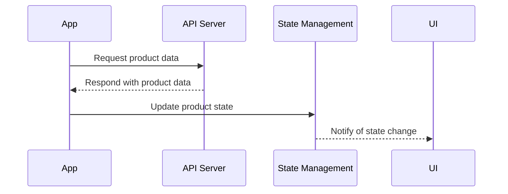

## 11.1.4 Integrating with Backend Services

In the realm of modern application development, integrating frontend applications with backend services is crucial for delivering dynamic, data-driven experiences. This section delves into the intricacies of connecting Flutter applications with backend services, focusing on maintaining synchronization between frontend state and backend data. We will explore API communication, data serialization, state updates, real-time data synchronization, and offline support, providing a comprehensive guide to building robust Flutter applications.

### API Communication

#### RESTful API Principles

RESTful APIs are a cornerstone of modern web services, providing a standardized way to interact with backend data. They use HTTP methods such as GET, POST, PUT, and DELETE to perform CRUD (Create, Read, Update, Delete) operations. Understanding these principles is essential for integrating Flutter applications with backend services.

**Key Concepts:**

- **Statelessness:** Each API call is independent, containing all necessary information.
- **Resource-Based:** APIs are structured around resources, identified by URIs.
- **HTTP Methods:** Use appropriate HTTP methods for different operations.

#### Consuming APIs in Flutter

Flutter provides several packages to facilitate API communication. The `http` package is a simple and widely-used choice, while `dio` offers more advanced features like interceptors and global configuration.

**Using the `http` Package:**

```dart
import 'package:http/http.dart' as http;
import 'dart:convert';

Future<void> fetchProducts() async {
  final response = await http.get(Uri.parse('https://api.example.com/products'));

  if (response.statusCode == 200) {
    List<dynamic> products = jsonDecode(response.body);
    // Update state with product data
  } else {
    throw Exception('Failed to load products');
  }
}
```

**Using the `dio` Package:**

```dart
import 'package:dio/dio.dart';

final dio = Dio();

Future<void> fetchProducts() async {
  try {
    final response = await dio.get('https://api.example.com/products');
    List<dynamic> products = response.data;
    // Update state with product data
  } catch (e) {
    print('Error fetching products: $e');
  }
}
```

#### Code Examples for CRUD Operations

- **GET Request:** Retrieve data from the server.
- **POST Request:** Send new data to the server.
- **PUT Request:** Update existing data on the server.
- **DELETE Request:** Remove data from the server.

```dart
// POST Request Example
Future<void> addProduct(Map<String, dynamic> product) async {
  final response = await dio.post(
    'https://api.example.com/products',
    data: product,
  );

  if (response.statusCode == 201) {
    // Product added successfully
  } else {
    throw Exception('Failed to add product');
  }
}

// PUT Request Example
Future<void> updateProduct(int id, Map<String, dynamic> updates) async {
  final response = await dio.put(
    'https://api.example.com/products/$id',
    data: updates,
  );

  if (response.statusCode == 200) {
    // Product updated successfully
  } else {
    throw Exception('Failed to update product');
  }
}

// DELETE Request Example
Future<void> deleteProduct(int id) async {
  final response = await dio.delete('https://api.example.com/products/$id');

  if (response.statusCode == 204) {
    // Product deleted successfully
  } else {
    throw Exception('Failed to delete product');
  }
}
```

### Data Models and Serialization

#### JSON Serialization and Deserialization

Flutter applications often communicate with backend services using JSON. To handle JSON data efficiently, you can use the `json_serializable` package, which generates code for converting JSON to Dart objects and vice versa.

**Setting Up `json_serializable`:**

1. Add dependencies to `pubspec.yaml`:

```yaml
dependencies:
  json_annotation: ^4.0.1

dev_dependencies:
  build_runner: ^2.0.0
  json_serializable: ^5.0.0
```

2. Create a Dart model class:

```dart
import 'package:json_annotation/json_annotation.dart';

part 'product.g.dart';

@JsonSerializable()
class Product {
  final int id;
  final String name;
  final double price;

  Product({required this.id, required this.name, required this.price});

  factory Product.fromJson(Map<String, dynamic> json) => _$ProductFromJson(json);

  Map<String, dynamic> toJson() => _$ProductToJson(this);
}
```

3. Run the code generator:

```bash
flutter pub run build_runner build
```

This generates the `product.g.dart` file with `fromJson` and `toJson` methods.

### State Updates from Backend

#### Handling API Responses

When integrating with backend services, it's crucial to handle API responses effectively. This involves updating the frontend state based on the data received and managing different response statuses.

**Example:**

```dart
void updateProductState(List<Product> products) {
  // Update the application state with the new product list
}

Future<void> fetchAndUpdateProducts() async {
  try {
    final products = await fetchProducts();
    updateProductState(products);
  } catch (e) {
    // Handle error, e.g., show a message to the user
  }
}
```

#### Error Handling

Proper error handling ensures a smooth user experience even when network issues occur. Consider using try-catch blocks and displaying user-friendly error messages.

### Real-Time Data Synchronization

#### Implementing Real-Time Features

Real-time data synchronization is essential for applications that require instant updates, such as chat apps or live dashboards. WebSockets and Firebase are popular choices for implementing real-time features.

**Using WebSockets:**

```dart
import 'package:web_socket_channel/web_socket_channel.dart';

final channel = WebSocketChannel.connect(
  Uri.parse('wss://example.com/socket'),
);

void listenForUpdates() {
  channel.stream.listen((message) {
    // Handle incoming messages and update state
  });
}
```

**Using Firebase:**

Firebase offers real-time database capabilities, making it easy to listen for data changes and update the UI accordingly.

```dart
import 'package:firebase_database/firebase_database.dart';

final databaseReference = FirebaseDatabase.instance.reference();

void listenForProductUpdates() {
  databaseReference.child('products').onValue.listen((event) {
    final products = event.snapshot.value as List<dynamic>;
    // Update state with new product data
  });
}
```

### Offline Support

#### Caching Data and Handling Offline Scenarios

To provide a seamless user experience, even when offline, implement data caching strategies. Packages like `hive` and `sqflite` are excellent choices for local storage.

**Using `hive`:**

```dart
import 'package:hive/hive.dart';

void cacheProducts(List<Product> products) async {
  final box = await Hive.openBox('products');
  box.put('productList', products);
}

Future<List<Product>> getCachedProducts() async {
  final box = await Hive.openBox('products');
  return box.get('productList', defaultValue: []);
}
```

**Using `sqflite`:**

```dart
import 'package:sqflite/sqflite.dart';

Future<void> cacheProducts(List<Product> products) async {
  final database = await openDatabase('my_db.db');
  await database.insert('products', products.map((p) => p.toJson()).toList());
}

Future<List<Product>> getCachedProducts() async {
  final database = await openDatabase('my_db.db');
  final List<Map<String, dynamic>> maps = await database.query('products');
  return List.generate(maps.length, (i) {
    return Product.fromJson(maps[i]);
  });
}
```

### Best Practices

#### Implementing Retry Logic and Exponential Backoff

Network requests can fail due to various reasons. Implementing retry logic with exponential backoff can improve reliability.

**Example:**

```dart
Future<void> fetchWithRetry() async {
  int retryCount = 0;
  const maxRetries = 3;
  const delay = Duration(seconds: 2);

  while (retryCount < maxRetries) {
    try {
      await fetchProducts();
      break;
    } catch (e) {
      retryCount++;
      if (retryCount == maxRetries) {
        throw Exception('Failed after $maxRetries attempts');
      }
      await Future.delayed(delay * retryCount);
    }
  }
}
```

#### Securing API Communication

Ensure all API communication is secure by using HTTPS and handling authentication tokens properly. Use interceptors in `dio` to manage common behaviors like adding headers.

**Using Interceptors:**

```dart
dio.interceptors.add(InterceptorsWrapper(
  onRequest: (options, handler) {
    options.headers['Authorization'] = 'Bearer YOUR_TOKEN';
    return handler.next(options);
  },
  onResponse: (response, handler) {
    // Handle response
    return handler.next(response);
  },
  onError: (DioError e, handler) {
    // Handle error
    return handler.next(e);
  },
));
```

### Mermaid.js Diagrams

To visualize the backend integration workflow, consider the following sequence diagram:



This diagram illustrates the flow of data from the app to the API server and back, highlighting the interaction between different components.

### Conclusion

Integrating Flutter applications with backend services is a multifaceted process that requires careful consideration of API communication, data serialization, state management, real-time synchronization, and offline support. By following best practices and leveraging the right tools, you can build robust applications that provide seamless user experiences.

### Further Reading and Resources

- [Flutter Official Documentation](https://flutter.dev/docs)
- [Dio Package Documentation](https://pub.dev/packages/dio)
- [Firebase for Flutter](https://firebase.flutter.dev/)
- [json_serializable Package](https://pub.dev/packages/json_serializable)
- [Hive Database](https://pub.dev/packages/hive)
- [Sqflite Database](https://pub.dev/packages/sqflite)

## Quiz Time!



### What is the primary purpose of RESTful APIs?

- [x] To provide a standardized way to interact with backend data using HTTP methods.
- [ ] To create user interfaces for mobile applications.
- [ ] To store data locally on a device.
- [ ] To manage application state on the frontend.

> **Explanation:** RESTful APIs are designed to provide a standardized way to interact with backend data using HTTP methods like GET, POST, PUT, and DELETE.

### Which package is commonly used in Flutter for making HTTP requests?

- [x] `http`
- [ ] `flutter_http`
- [ ] `flutter_network`
- [ ] `flutter_api`

> **Explanation:** The `http` package is a widely-used package in Flutter for making HTTP requests to interact with backend services.

### What is the role of `json_serializable` in Flutter?

- [x] To generate code for converting JSON data to Dart objects and vice versa.
- [ ] To manage application state.
- [ ] To handle network requests.
- [ ] To create animations.

> **Explanation:** The `json_serializable` package is used to generate code for serializing and deserializing JSON data in Flutter applications.

### How can real-time data synchronization be achieved in Flutter?

- [x] By using WebSockets or Firebase.
- [ ] By using local storage only.
- [ ] By making periodic HTTP requests.
- [ ] By using static data files.

> **Explanation:** Real-time data synchronization in Flutter can be achieved using WebSockets or Firebase, which allow for instant updates and data changes.

### Which package can be used for local storage in Flutter?

- [x] `hive`
- [x] `sqflite`
- [ ] `flutter_storage`
- [ ] `flutter_local`

> **Explanation:** Both `hive` and `sqflite` are popular packages for local storage in Flutter, providing options for caching data and handling offline scenarios.

### What is the purpose of implementing retry logic with exponential backoff?

- [x] To improve the reliability of network requests by retrying failed requests with increasing delay.
- [ ] To speed up network requests.
- [ ] To reduce the number of network requests.
- [ ] To simplify the codebase.

> **Explanation:** Retry logic with exponential backoff is used to improve the reliability of network requests by retrying failed requests with an increasing delay between attempts.

### How can API communication be secured in Flutter?

- [x] By using HTTPS and handling authentication tokens properly.
- [ ] By using HTTP and storing tokens in plain text.
- [ ] By avoiding the use of tokens.
- [ ] By using only local data.

> **Explanation:** API communication can be secured by using HTTPS for secure data transmission and properly handling authentication tokens.

### What is the function of interceptors in the `dio` package?

- [x] To manage common behaviors like adding headers to requests.
- [ ] To create animations.
- [ ] To manage application state.
- [ ] To handle JSON serialization.

> **Explanation:** Interceptors in the `dio` package are used to manage common behaviors such as adding headers to requests, handling responses, and managing errors.

### Which diagram type is used to visualize the backend integration workflow?

- [x] Sequence Diagram
- [ ] Class Diagram
- [ ] Pie Chart
- [ ] Bar Graph

> **Explanation:** A sequence diagram is used to visualize the backend integration workflow, showing the interaction between different components.

### True or False: Offline support in Flutter can be achieved using local storage solutions like `hive` and `sqflite`.

- [x] True
- [ ] False

> **Explanation:** True. Offline support in Flutter can be achieved using local storage solutions like `hive` and `sqflite`, which allow for data caching and retrieval when offline.


