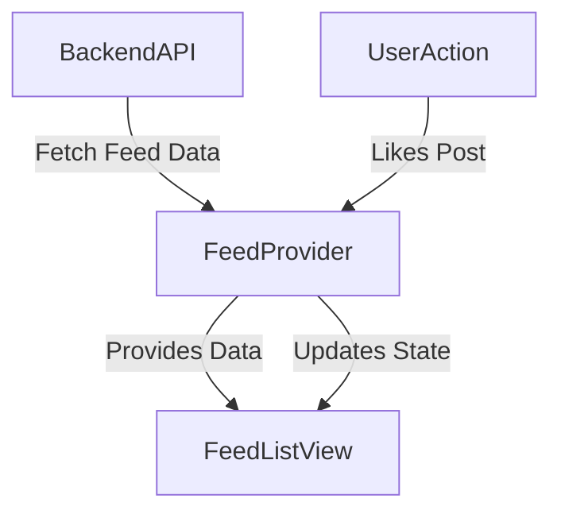

## 11.2.1 Feed State Management

In the ever-evolving landscape of social media applications, managing the state of a dynamic content feed is crucial. This section delves into the intricacies of feed state management within a social media platform, focusing on efficient data handling, performance optimization, and user interaction management.

### Feed Architecture

A social media feed is a complex structure comprising various elements such as posts, likes, comments, and shares. Each of these components interacts with the others to create a seamless user experience. Understanding the architecture of a feed is the first step in managing its state effectively.

#### Structure of a Social Media Feed

- **Posts:** The core element of any feed, posts can contain text, images, videos, and links. Each post has associated metadata, including the author, timestamp, and engagement metrics.
- **Likes and Comments:** These interactions add depth to the feed, allowing users to engage with content. Managing the state of likes and comments is essential for real-time updates.
- **Shares:** Sharing functionality extends the reach of posts, requiring additional state management to track shared content across different user feeds.

#### Importance of Performance Optimization

Given the potentially large volumes of data in a social media feed, optimizing for performance is paramount. Efficient state management ensures that the application remains responsive and scalable, even as the number of users and posts grows.

### Fetching and Displaying the Feed

Fetching and displaying feed data efficiently involves several key strategies, including pagination, state management for loading and error handling, and leveraging Flutter's widget system for optimal rendering.

#### Fetching Feed Data

Fetching data from the backend is the first step in populating the feed. This process involves making network requests to retrieve posts and their associated data.

```dart
Future<List<Post>> fetchFeedData(int page) async {
  final response = await http.get(Uri.parse('https://api.example.com/feed?page=$page'));
  if (response.statusCode == 200) {
    return parsePosts(response.body);
  } else {
    throw Exception('Failed to load feed');
  }
}
```

#### Implementing Pagination or Infinite Scrolling

To handle large datasets, implement pagination or infinite scrolling. This approach loads data in chunks, reducing the initial load time and memory usage.

```dart
class FeedPage extends StatefulWidget {
  @override
  _FeedPageState createState() => _FeedPageState();
}

class _FeedPageState extends State<FeedPage> {
  List<Post> _posts = [];
  int _currentPage = 1;
  bool _isLoading = false;
  bool _hasMoreData = true;

  @override
  void initState() {
    super.initState();
    _fetchMoreData();
  }

  Future<void> _fetchMoreData() async {
    if (_isLoading || !_hasMoreData) return;
    setState(() => _isLoading = true);

    try {
      final newPosts = await fetchFeedData(_currentPage);
      setState(() {
        _currentPage++;
        _posts.addAll(newPosts);
        _hasMoreData = newPosts.isNotEmpty;
      });
    } catch (e) {
      // Handle error
    } finally {
      setState(() => _isLoading = false);
    }
  }

  @override
  Widget build(BuildContext context) {
    return ListView.builder(
      itemCount: _posts.length + 1,
      itemBuilder: (context, index) {
        if (index == _posts.length) {
          return _isLoading ? CircularProgressIndicator() : SizedBox.shrink();
        }
        return PostWidget(post: _posts[index]);
      },
      controller: ScrollController()..addListener(() {
        if (_controller.position.atEdge && _controller.position.pixels != 0) {
          _fetchMoreData();
        }
      }),
    );
  }
}
```

#### State Management for Loading and Error Handling

Using a state management solution like Provider, Riverpod, or Bloc can help track loading status and manage errors gracefully.

```dart
class FeedProvider with ChangeNotifier {
  List<Post> _posts = [];
  bool _isLoading = false;
  String _errorMessage;

  Future<void> fetchPosts() async {
    _isLoading = true;
    notifyListeners();

    try {
      _posts = await fetchFeedData();
      _errorMessage = null;
    } catch (e) {
      _errorMessage = e.toString();
    } finally {
      _isLoading = false;
      notifyListeners();
    }
  }
}
```

### Updating Feed State

Handling updates to the feed state involves managing new posts, post updates, deletions, and user interactions such as likes and comments.

#### Handling New Posts and Updates

When a new post is created or an existing post is updated, the feed state must reflect these changes immediately.

```dart
void addNewPost(Post post) {
  _posts.insert(0, post);
  notifyListeners();
}

void updatePost(Post updatedPost) {
  final index = _posts.indexWhere((post) => post.id == updatedPost.id);
  if (index != -1) {
    _posts[index] = updatedPost;
    notifyListeners();
  }
}
```

#### Managing User Interactions

User interactions, such as liking a post, require immediate feedback in the UI. This can be achieved by updating the state and re-rendering the affected widget.

```dart
void toggleLike(Post post) {
  final index = _posts.indexOf(post);
  if (index != -1) {
    _posts[index].isLiked = !_posts[index].isLiked;
    notifyListeners();
  }
}
```

### Optimizing Performance

Performance optimization is critical in ensuring a smooth user experience, especially in data-heavy applications like social media platforms.

#### Efficient List Rendering

Use `ListView.builder` to render lists efficiently. This widget only builds items that are visible on the screen, reducing memory usage.

```dart
ListView.builder(
  itemCount: _posts.length,
  itemBuilder: (context, index) {
    return PostWidget(post: _posts[index]);
  },
)
```

#### Caching Strategies

Implement caching strategies to minimize redundant network requests and improve load times. Use packages like `cached_network_image` for image caching.

```dart
CachedNetworkImage(
  imageUrl: post.imageUrl,
  placeholder: (context, url) => CircularProgressIndicator(),
  errorWidget: (context, url, error) => Icon(Icons.error),
)
```

### Best Practices

Adhering to best practices ensures that your feed management is robust, efficient, and scalable.

- **Minimize Rebuild Scope:** Use state management solutions to control which parts of the UI need to be rebuilt, minimizing unnecessary updates.
- **Pull-to-Refresh:** Implement pull-to-refresh functionality to allow users to manually refresh the feed.
- **Efficient Image Loading:** Use `CachedNetworkImage` to load and cache images efficiently, reducing bandwidth usage and improving performance.

### Diagram: Data Flow in Feed Management

Below is a diagram illustrating the data flow from the backend to the frontend, including user interactions.



### Conclusion

Efficient feed state management is crucial for delivering a seamless user experience in social media applications. By understanding the architecture of a feed, implementing effective data fetching and updating strategies, and optimizing performance, developers can create responsive and scalable applications. Leveraging state management solutions like Provider, Riverpod, or Bloc further enhances the ability to manage complex state interactions and user engagements.

### Additional Resources

- [Flutter Documentation](https://flutter.dev/docs)
- [Provider Package](https://pub.dev/packages/provider)
- [Riverpod Package](https://pub.dev/packages/riverpod)
- [Bloc Package](https://pub.dev/packages/flutter_bloc)
- [Cached Network Image](https://pub.dev/packages/cached_network_image)

## Quiz Time!



### What is the primary purpose of implementing pagination or infinite scrolling in a social media feed?

- [x] To load data in chunks and reduce initial load time
- [ ] To display all data at once for better user experience
- [ ] To prevent users from scrolling too far
- [ ] To ensure data is always loaded from the cache

> **Explanation:** Pagination or infinite scrolling helps in loading data in chunks, which reduces the initial load time and memory usage, making the application more efficient.

### Which widget is recommended for efficient list rendering in Flutter?

- [x] ListView.builder
- [ ] ListView
- [ ] Column
- [ ] GridView

> **Explanation:** `ListView.builder` is recommended for efficient list rendering as it only builds items that are visible on the screen, reducing memory usage.

### How can you manage user interactions such as liking a post in a feed?

- [x] By updating the state and re-rendering the affected widget
- [ ] By making a network request every time
- [ ] By ignoring the interaction
- [ ] By storing the interaction locally without updating the UI

> **Explanation:** Managing user interactions like liking a post involves updating the state and re-rendering the affected widget to provide immediate feedback.

### What is the role of `CachedNetworkImage` in a social media feed?

- [x] To efficiently load and cache images
- [ ] To display images without caching
- [ ] To store images in the database
- [ ] To convert images to text

> **Explanation:** `CachedNetworkImage` is used to efficiently load and cache images, reducing bandwidth usage and improving performance.

### What is the primary benefit of using state management solutions like Provider or Riverpod?

- [x] To control which parts of the UI need to be rebuilt
- [ ] To store data permanently
- [ ] To make the app look better
- [ ] To reduce the size of the app

> **Explanation:** State management solutions like Provider or Riverpod help control which parts of the UI need to be rebuilt, minimizing unnecessary updates and improving performance.

### Which of the following is a best practice for managing a social media feed?

- [x] Implement pull-to-refresh functionality
- [ ] Load all data at once
- [ ] Use only local storage for data
- [ ] Avoid using any caching

> **Explanation:** Implementing pull-to-refresh functionality is a best practice as it allows users to manually refresh the feed, enhancing the user experience.

### What is the purpose of using `ListView.builder` instead of a regular `ListView`?

- [x] To build items only when they are visible on the screen
- [ ] To display items in a grid format
- [ ] To load all items at once
- [ ] To prevent scrolling

> **Explanation:** `ListView.builder` builds items only when they are visible on the screen, which is more efficient in terms of memory usage compared to a regular `ListView`.

### How does caching improve the performance of a social media feed?

- [x] By reducing redundant network requests
- [ ] By increasing the number of network requests
- [ ] By storing data permanently
- [ ] By slowing down data retrieval

> **Explanation:** Caching improves performance by reducing redundant network requests, which decreases load times and bandwidth usage.

### What should be done when a new post is added to the feed?

- [x] Insert the post at the top of the list and notify listeners
- [ ] Replace the entire feed with the new post
- [ ] Ignore the new post
- [ ] Add the post to the end of the list without notifying listeners

> **Explanation:** When a new post is added, it should be inserted at the top of the list, and listeners should be notified to update the UI.

### True or False: Efficient feed state management is only important for small-scale applications.

- [ ] True
- [x] False

> **Explanation:** Efficient feed state management is crucial for both small-scale and large-scale applications to ensure responsiveness and scalability.


