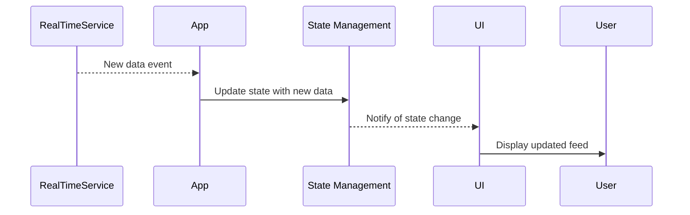

## 11.2.2 Real-Time Updates with Streams

In the ever-evolving landscape of mobile applications, real-time updates have become a cornerstone of user engagement, especially in social media platforms. This section delves into the implementation of real-time updates using Dart streams in Flutter, enhancing the interactivity of your application. We'll explore the foundational concepts of streams, demonstrate how to integrate them with state management solutions, and provide practical examples to illustrate their use in a social media context.

### Understanding Streams

Streams in Dart are a powerful feature that allows you to work with asynchronous data sequences. They are particularly useful for handling real-time data, such as live notifications or updates in a social media feed.

#### The Concept of Streams

A stream is a sequence of asynchronous events. When you listen to a stream, you receive events as they are emitted. Streams can be single-subscription or broadcast. 

- **Single-Subscription Stream:** Allows only one listener at a time. Once a listener is added, no other listener can be added until the current listener is canceled.
- **Broadcast Stream:** Allows multiple listeners. This is useful for scenarios where you want to share the same data with multiple parts of your application.

#### Key Stream Components

- **Stream:** The primary interface for receiving a sequence of data events.
- **StreamController:** A controller that allows you to create a stream and add events to it. It acts as a bridge between the data source and the stream.
- **BroadcastStream:** A type of stream that supports multiple listeners, making it ideal for real-time updates in applications.

### Implementing Real-Time Features

To implement real-time updates, you can use WebSockets or services like Firebase Realtime Database. These services provide a continuous data stream that your application can listen to and respond to.

#### Subscribing to Real-Time Updates

Below is an example of how to use a WebSocket to receive real-time updates:

```dart
import 'dart:async';
import 'dart:convert';
import 'package:web_socket_channel/web_socket_channel.dart';

class RealTimeService {
  final WebSocketChannel channel;
  final StreamController<String> _streamController = StreamController<String>.broadcast();

  RealTimeService(String url)
      : channel = WebSocketChannel.connect(Uri.parse(url)) {
    channel.stream.listen((message) {
      _streamController.add(message);
    });
  }

  Stream<String> get messages => _streamController.stream;

  void dispose() {
    channel.sink.close();
    _streamController.close();
  }
}
```

In this example, `WebSocketChannel` is used to connect to a WebSocket server. The `StreamController` is used to manage the stream of messages received from the server. The `broadcast` method allows multiple listeners to subscribe to the stream.

#### Updating the UI

To update the UI in response to new data, use the `StreamBuilder` widget. This widget rebuilds its child whenever a new event is emitted by the stream.

```dart
StreamBuilder<String>(
  stream: realTimeService.messages,
  builder: (context, snapshot) {
    if (snapshot.connectionState == ConnectionState.waiting) {
      return CircularProgressIndicator();
    } else if (snapshot.hasError) {
      return Text('Error: ${snapshot.error}');
    } else if (!snapshot.hasData) {
      return Text('No data available');
    } else {
      return Text('New message: ${snapshot.data}');
    }
  },
)
```

The `StreamBuilder` listens to the `messages` stream and updates the UI whenever a new message is received.

### State Management Integration

Integrating streams with state management solutions ensures that your application remains responsive and efficient. Here's how you can manage stream subscriptions and state updates.

#### Handling Stream Subscriptions

When using streams, it's crucial to manage subscriptions properly to prevent memory leaks. Always dispose of your streams when they are no longer needed.

```dart
class MyStatefulWidget extends StatefulWidget {
  @override
  _MyStatefulWidgetState createState() => _MyStatefulWidgetState();
}

class _MyStatefulWidgetState extends State<MyStatefulWidget> {
  final RealTimeService realTimeService = RealTimeService('wss://example.com/socket');

  @override
  void dispose() {
    realTimeService.dispose();
    super.dispose();
  }

  @override
  Widget build(BuildContext context) {
    return StreamBuilder<String>(
      stream: realTimeService.messages,
      builder: (context, snapshot) {
        // UI update logic
      },
    );
  }
}
```

#### Integrating with State Management

You can integrate streams with state management solutions like Provider or Bloc to manage the state of your application effectively.

```dart
class MessageBloc extends Bloc<MessageEvent, MessageState> {
  final RealTimeService realTimeService;

  MessageBloc(this.realTimeService) {
    realTimeService.messages.listen((message) {
      add(NewMessageEvent(message));
    });
  }

  @override
  MessageState get initialState => MessageInitial();

  @override
  Stream<MessageState> mapEventToState(MessageEvent event) async* {
    if (event is NewMessageEvent) {
      yield MessageReceived(event.message);
    }
  }

  @override
  Future<void> close() {
    realTimeService.dispose();
    return super.close();
  }
}
```

In this example, a Bloc listens to the message stream and updates the state accordingly. This approach ensures that your application remains responsive and maintains a clean separation of concerns.

### User Notifications

Real-time updates often involve notifying users of new events, such as messages or likes. Properly handling these notifications enhances the user experience.

#### Handling In-App Notifications

You can use Flutter's built-in notification system or third-party packages to display notifications.

```dart
void showNotification(BuildContext context, String message) {
  final snackBar = SnackBar(content: Text(message));
  ScaffoldMessenger.of(context).showSnackBar(snackBar);
}
```

Whenever a new message is received, you can display a notification to the user.

### Best Practices

Implementing real-time updates requires careful consideration of several best practices to ensure a smooth and efficient user experience.

- **Error Handling:** Implement robust error handling for stream errors to prevent application crashes.
- **Back-Pressure and Buffering:** Consider strategies for handling high data rates, such as buffering or back-pressure mechanisms.
- **Efficient UI Updates:** Use `StreamBuilder` to efficiently rebuild UI components in response to state changes.

### Visualizing the Data Flow with Streams

To better understand the flow of data in a real-time update scenario, consider the following sequence diagram:



This diagram illustrates how data flows from the real-time service to the application, updating the state and ultimately the user interface.

### Conclusion

Real-time updates are a critical feature for modern applications, particularly in social media platforms. By leveraging Dart streams and integrating them with state management solutions, you can create responsive and engaging user experiences. Remember to follow best practices for error handling and resource management to ensure your application remains robust and efficient.

For further exploration, consider experimenting with different stream sources and state management solutions to find the best fit for your application needs.

## Quiz Time!



### What is a key difference between a single-subscription stream and a broadcast stream?

- [x] A single-subscription stream allows only one listener at a time, while a broadcast stream allows multiple listeners.
- [ ] A broadcast stream is faster than a single-subscription stream.
- [ ] A single-subscription stream can only be used with WebSockets.
- [ ] A broadcast stream cannot handle real-time updates.

> **Explanation:** A single-subscription stream allows only one listener, whereas a broadcast stream supports multiple listeners, making it suitable for real-time updates.

### How can you prevent memory leaks when using streams in Flutter?

- [x] Dispose of the stream and its controller when they are no longer needed.
- [ ] Use only single-subscription streams.
- [ ] Avoid using streams in stateful widgets.
- [ ] Use a global variable for the stream.

> **Explanation:** Properly disposing of streams and their controllers when they are no longer needed prevents memory leaks.

### Which widget is commonly used to update the UI in response to stream data?

- [x] StreamBuilder
- [ ] FutureBuilder
- [ ] ListView
- [ ] Container

> **Explanation:** The `StreamBuilder` widget is used to rebuild the UI in response to new data from a stream.

### What is the purpose of a `StreamController` in Dart?

- [x] It acts as a bridge between the data source and the stream, allowing you to add events to the stream.
- [ ] It is used to close a stream.
- [ ] It only works with single-subscription streams.
- [ ] It is used to manage state in Flutter.

> **Explanation:** A `StreamController` allows you to create a stream and add events to it, acting as a bridge between the data source and the stream.

### What is a common use case for a broadcast stream?

- [x] Sharing the same data with multiple parts of your application.
- [ ] Handling single-user sessions.
- [ ] Managing local state in a widget.
- [ ] Performing synchronous operations.

> **Explanation:** Broadcast streams are useful for sharing the same data with multiple parts of an application.

### How can you handle errors in a Dart stream?

- [x] Use the `onError` callback in the stream listener to handle errors.
- [ ] Ignore the errors as they are not important.
- [ ] Use a try-catch block around the stream.
- [ ] Streams cannot handle errors.

> **Explanation:** The `onError` callback in the stream listener allows you to handle errors that occur in the stream.

### What is the role of the `StreamBuilder` widget in Flutter?

- [x] It listens to a stream and rebuilds its child whenever a new event is emitted.
- [ ] It manages the state of the application.
- [ ] It is used to build lists in Flutter.
- [ ] It handles navigation between screens.

> **Explanation:** The `StreamBuilder` widget listens to a stream and rebuilds its child whenever a new event is emitted, making it ideal for real-time updates.

### Which service can be used for real-time updates in a Flutter application?

- [x] Firebase Realtime Database
- [ ] SQLite
- [ ] SharedPreferences
- [ ] HTTP

> **Explanation:** Firebase Realtime Database is commonly used for real-time updates in Flutter applications.

### What is a benefit of using streams for real-time updates?

- [x] Streams provide a continuous flow of data that can be listened to and acted upon in real-time.
- [ ] Streams are easier to implement than HTTP requests.
- [ ] Streams do not require any error handling.
- [ ] Streams are only used for local data management.

> **Explanation:** Streams provide a continuous flow of data that can be listened to and acted upon in real-time, making them ideal for real-time updates.

### True or False: A `StreamController` can be used to create both single-subscription and broadcast streams.

- [x] True
- [ ] False

> **Explanation:** A `StreamController` can be configured to create either single-subscription or broadcast streams, depending on the use case.


