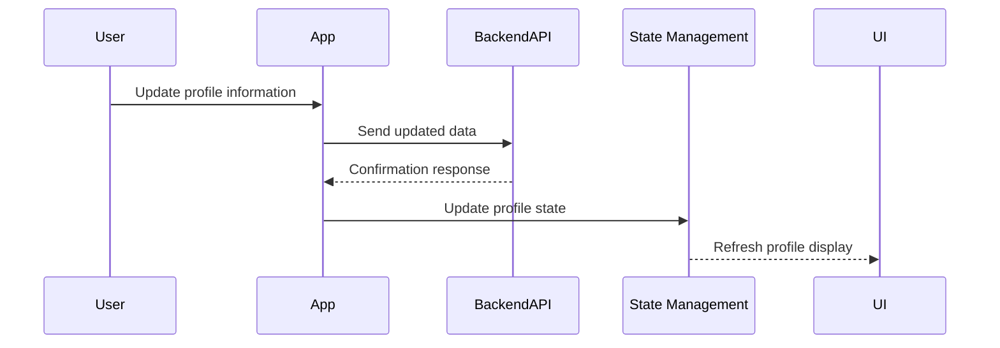

## 11.2.3 User Profiles and Settings

In the realm of social media platforms, managing user profiles and settings is crucial for providing a personalized and consistent user experience. This section will guide you through the intricacies of handling user profile data and application settings in Flutter, leveraging state management techniques to ensure seamless interaction and data persistence.

### Profile Data Management

Managing user profiles involves fetching, displaying, and updating user information. This section will cover the essential steps and provide practical code examples to help you implement these features effectively.

#### Fetching and Displaying User Profiles

Fetching user profile data typically involves making a network request to a backend service. Once the data is retrieved, it can be displayed using Flutter widgets. Here's a basic example of how to fetch and display a user's profile:

```dart
import 'package:flutter/material.dart';
import 'package:http/http.dart' as http;
import 'dart:convert';

class UserProfile extends StatefulWidget {
  @override
  _UserProfileState createState() => _UserProfileState();
}

class _UserProfileState extends State<UserProfile> {
  Map<String, dynamic> userData;

  @override
  void initState() {
    super.initState();
    fetchUserProfile();
  }

  Future<void> fetchUserProfile() async {
    final response = await http.get(Uri.parse('https://api.example.com/user/profile'));
    if (response.statusCode == 200) {
      setState(() {
        userData = json.decode(response.body);
      });
    } else {
      // Handle error
    }
  }

  @override
  Widget build(BuildContext context) {
    return userData == null
        ? CircularProgressIndicator()
        : Column(
            children: [
              Text('Name: ${userData['name']}'),
              Text('Email: ${userData['email']}'),
              // Display other profile data
            ],
          );
  }
}
```

**Key Points:**
- Use the `http` package to make network requests.
- Parse the JSON response and update the state using `setState`.
- Display the user data using Flutter widgets.

#### Editing Profile Information and Uploading Profile Pictures

Allowing users to edit their profile information and upload profile pictures enhances personalization. Here's how you can implement these features:

```dart
import 'package:flutter/material.dart';
import 'package:image_picker/image_picker.dart';
import 'dart:io';

class EditProfile extends StatefulWidget {
  @override
  _EditProfileState createState() => _EditProfileState();
}

class _EditProfileState extends State<EditProfile> {
  final _formKey = GlobalKey<FormState>();
  String _name;
  String _email;
  File _profileImage;

  Future<void> _pickImage() async {
    final pickedFile = await ImagePicker().getImage(source: ImageSource.gallery);
    setState(() {
      _profileImage = File(pickedFile.path);
    });
  }

  void _submitForm() {
    if (_formKey.currentState.validate()) {
      _formKey.currentState.save();
      // Send updated data to backend
    }
  }

  @override
  Widget build(BuildContext context) {
    return Form(
      key: _formKey,
      child: Column(
        children: [
          TextFormField(
            decoration: InputDecoration(labelText: 'Name'),
            onSaved: (value) => _name = value,
            validator: (value) => value.isEmpty ? 'Please enter your name' : null,
          ),
          TextFormField(
            decoration: InputDecoration(labelText: 'Email'),
            onSaved: (value) => _email = value,
            validator: (value) => value.isEmpty ? 'Please enter your email' : null,
          ),
          SizedBox(height: 20),
          _profileImage == null
              ? Text('No image selected.')
              : Image.file(_profileImage),
          ElevatedButton(
            onPressed: _pickImage,
            child: Text('Upload Profile Picture'),
          ),
          ElevatedButton(
            onPressed: _submitForm,
            child: Text('Save Changes'),
          ),
        ],
      ),
    );
  }
}
```

**Key Points:**
- Use `TextFormField` for input fields and `GlobalKey<FormState>` for form validation.
- Use the `image_picker` package to allow users to select images from their gallery.
- Validate form inputs and handle form submission to update profile data.

### Settings State Management

Managing application settings involves storing user preferences such as theme, notification settings, and privacy options. This section will guide you through using state management to track settings changes across the app.

#### Storing User Preferences

User preferences can be stored locally using the `shared_preferences` package, which provides a simple key-value store for persisting data.

```dart
import 'package:flutter/material.dart';
import 'package:shared_preferences/shared_preferences.dart';

class SettingsPage extends StatefulWidget {
  @override
  _SettingsPageState createState() => _SettingsPageState();
}

class _SettingsPageState extends State<SettingsPage> {
  bool _darkMode = false;

  @override
  void initState() {
    super.initState();
    _loadSettings();
  }

  Future<void> _loadSettings() async {
    final prefs = await SharedPreferences.getInstance();
    setState(() {
      _darkMode = prefs.getBool('darkMode') ?? false;
    });
  }

  Future<void> _updateDarkMode(bool value) async {
    final prefs = await SharedPreferences.getInstance();
    setState(() {
      _darkMode = value;
      prefs.setBool('darkMode', value);
    });
  }

  @override
  Widget build(BuildContext context) {
    return SwitchListTile(
      title: Text('Dark Mode'),
      value: _darkMode,
      onChanged: _updateDarkMode,
    );
  }
}
```

**Key Points:**
- Use `SharedPreferences` to persist user settings locally.
- Load settings during initialization and update them as needed.
- Reflect changes in the UI immediately.

### Persisting Settings

Persisting settings ensures that user preferences are retained across app sessions. This can be achieved using local storage solutions like `shared_preferences` or by synchronizing with backend services.

#### Local Persistence with SharedPreferences

The `shared_preferences` package is a straightforward way to store simple data types persistently.

```dart
// Example of storing a theme preference
prefs.setBool('darkMode', true);
```

#### Synchronization with Backend Services

For more complex settings or when synchronization across devices is required, consider integrating with backend services. This involves sending updates to the server and fetching the latest settings during app startup.

### Form Validation and Error Handling

Implementing robust form validation and error handling is crucial for a smooth user experience.

#### Form Validation

Use Flutter's form validation capabilities to ensure that user inputs meet the required criteria before submission.

```dart
TextFormField(
  validator: (value) {
    if (value.isEmpty) {
      return 'Please enter some text';
    }
    return null;
  },
)
```

#### Error Handling

Provide clear feedback to users when errors occur, such as network failures or invalid inputs.

```dart
void _submitForm() {
  if (_formKey.currentState.validate()) {
    // Proceed with submission
  } else {
    // Show error message
    ScaffoldMessenger.of(context).showSnackBar(
      SnackBar(content: Text('Please fix the errors in the form')),
    );
  }
}
```

### Best Practices

When managing user profiles and settings, consider the following best practices:

- **Security and Privacy:** Ensure that personal data is handled securely and comply with privacy regulations like GDPR.
- **User Control:** Provide options for users to download or delete their data.
- **Immediate Effect:** Ensure that settings changes take effect immediately where appropriate, enhancing user satisfaction.

### Mermaid.js Diagram: Profile Update Flow

To visualize the flow of updating user profiles, consider the following diagram:



This diagram illustrates the sequence of actions from user input to backend updates and state management.

### Conclusion

Managing user profiles and settings in a Flutter application involves a combination of fetching and displaying data, handling user inputs, and persisting settings. By following the outlined strategies and best practices, you can ensure a personalized and consistent user experience. Encourage experimentation with the provided code examples and explore additional resources to deepen your understanding.

## Quiz Time!



### What package is commonly used to store user preferences locally in Flutter?

- [x] shared_preferences
- [ ] http
- [ ] image_picker
- [ ] provider

> **Explanation:** The `shared_preferences` package is used for storing simple key-value pairs locally in Flutter applications.

### Which widget is used to create a form in Flutter?

- [x] Form
- [ ] Column
- [ ] Container
- [ ] ListView

> **Explanation:** The `Form` widget is used in Flutter to create a form, which can contain multiple input fields and validation logic.

### How can you fetch user profile data from a backend service?

- [x] By making an HTTP request using the `http` package
- [ ] By using the `shared_preferences` package
- [ ] By using the `image_picker` package
- [ ] By using the `provider` package

> **Explanation:** The `http` package is used to make network requests to fetch data from a backend service.

### What method is used to validate a form in Flutter?

- [x] validate()
- [ ] check()
- [ ] submit()
- [ ] confirm()

> **Explanation:** The `validate()` method is used to check the validity of a form's fields in Flutter.

### What is the purpose of the `setState` method in Flutter?

- [x] To update the UI when the state of a widget changes
- [ ] To fetch data from an API
- [ ] To store data locally
- [ ] To navigate between screens

> **Explanation:** The `setState` method is used to notify the Flutter framework that the internal state of a widget has changed, prompting a rebuild of the widget.

### Which package is used to allow users to select images from their gallery?

- [x] image_picker
- [ ] shared_preferences
- [ ] http
- [ ] provider

> **Explanation:** The `image_picker` package is used to select images from the device's gallery or camera.

### How can you provide feedback to users when a form submission fails?

- [x] By showing a `SnackBar` with an error message
- [ ] By logging the error to the console
- [ ] By ignoring the error
- [ ] By restarting the app

> **Explanation:** A `SnackBar` provides a way to show brief messages to users at the bottom of the screen, often used for feedback.

### What is a common method to synchronize user settings across devices?

- [x] Integrating with backend services
- [ ] Using local storage only
- [ ] Using the `image_picker` package
- [ ] Using the `provider` package

> **Explanation:** Synchronizing settings across devices typically involves integrating with backend services to store and retrieve user preferences.

### Why is it important to handle personal data securely in a Flutter app?

- [x] To comply with privacy regulations and protect user information
- [ ] To make the app faster
- [ ] To reduce app size
- [ ] To improve app aesthetics

> **Explanation:** Handling personal data securely is crucial to comply with privacy regulations and protect user information from unauthorized access.

### True or False: Settings changes should always require a restart of the app to take effect.

- [ ] True
- [x] False

> **Explanation:** Settings changes should take effect immediately where possible to enhance the user experience without requiring a restart.


