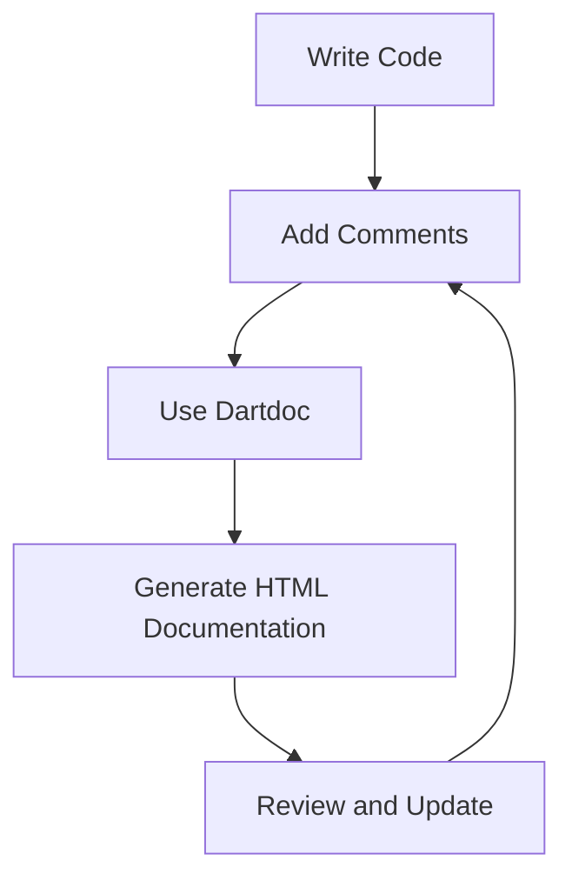

## 11.3.3 Documentation and Code Comments

In the fast-paced world of software development, where teams often work across different time zones and projects evolve rapidly, maintaining clear and comprehensive documentation is crucial. This section delves into the importance of documentation and code comments, particularly in the context of state management in Flutter applications. We will explore best practices, provide practical examples, and offer insights into using documentation generators to streamline the process.

### Importance of Documentation

Documentation serves as the backbone of any software project, providing a roadmap for developers to understand the codebase, its architecture, and the rationale behind critical decisions. In the context of state management, where complex interactions and data flows are common, documentation becomes even more vital.

- **Facilitating Onboarding:** New team members can quickly get up to speed with well-documented code, reducing the learning curve and allowing them to contribute effectively sooner.
- **Enhancing Collaboration:** Clear documentation fosters better communication among team members, ensuring everyone is aligned on the project's goals and methodologies.
- **Supporting Maintenance:** As projects evolve, documentation helps maintain consistency and prevents the codebase from becoming a tangled web of outdated logic and assumptions.

### Writing Effective Comments

While documentation provides the broader context, code comments offer insights into specific implementations. Effective comments explain not just what the code is doing, but why certain decisions were made.

#### Guidelines for Commenting Code

- **Comment the Why, Not the What:** Focus on explaining the reasoning behind complex logic or non-obvious decisions. The code itself should be self-explanatory regarding its functionality.
- **Be Concise but Informative:** Comments should be brief yet comprehensive enough to convey the necessary information without overwhelming the reader.
- **Use Consistent Style:** Adopt a consistent commenting style across the codebase to maintain readability and professionalism.

#### Examples of Good Comments

Consider the following example, which illustrates how to document a function that calculates a discounted price:

```dart
/// Calculates the total price after applying the discount.
///
/// This method takes the original price and the discount percentage
/// and returns the final price to be displayed to the user.
double calculateDiscountedPrice(double price, double discountPercent) {
  // Ensure the discount percentage is within a valid range
  if (discountPercent < 0 || discountPercent > 100) {
    throw ArgumentError('Discount percent must be between 0 and 100.');
  }
  return price * (1 - discountPercent / 100);
}
```

In this example, the comment explains the purpose of the function, the parameters it takes, and the expected behavior. It also includes an inline comment to clarify the validation logic.

### Using Documentation Generators

Flutter and Dart offer built-in tools to facilitate documentation generation, making it easier to maintain and share comprehensive project documentation.

#### Dart's Built-in Documentation Features

Dart supports documentation comments using triple slashes (`///`). These comments can be parsed by tools like `dartdoc` to generate HTML documentation.

- **Structure:** Use `///` to document classes, methods, and properties. Include descriptions, parameter details, and return values.
- **Annotations:** Use annotations like `@param` and `@return` to provide structured information about method parameters and return types.

#### Generating Documentation with `dartdoc`

`dartdoc` is a powerful tool that generates static HTML documentation from Dart code. Here's how to use it:

1. **Install `dartdoc`:** Ensure you have `dartdoc` installed as part of your Dart SDK.
2. **Run `dartdoc`:** Navigate to your project's root directory and run `dartdoc` in the terminal. This command generates documentation in the `doc` directory.
3. **View Documentation:** Open the generated HTML files in a web browser to view your project's documentation.

### Best Practices

To maximize the effectiveness of your documentation and comments, consider the following best practices:

- **Keep Comments Up-to-Date:** As code evolves, ensure comments are updated to reflect changes. Outdated comments can be misleading and counterproductive.
- **Avoid Redundant Comments:** Comments that merely restate what the code does without adding value should be avoided. Instead, focus on providing insights that are not immediately apparent from the code itself.
- **Encourage Peer Reviews:** Incorporate documentation and comment reviews into your code review process to ensure clarity and consistency.

### Practical Example: Documenting a State Management Class

Let's apply these principles to a practical example involving a state management class in a Flutter application:

```dart
/// A simple state management class for managing a counter.
///
/// This class uses ChangeNotifier to notify listeners of state changes.
/// It provides methods to increment and reset the counter.
class CounterState extends ChangeNotifier {
  int _count = 0;

  /// Gets the current counter value.
  int get count => _count;

  /// Increments the counter by one.
  ///
  /// Notifies listeners after updating the counter value.
  void increment() {
    _count++;
    notifyListeners();
  }

  /// Resets the counter to zero.
  ///
  /// This method is typically used when the user wants to start over.
  void reset() {
    _count = 0;
    notifyListeners();
  }
}
```

In this example, the class and its methods are documented using `///` comments. Each method includes a brief description of its purpose and behavior, ensuring that anyone reading the code can quickly understand its functionality.

### Diagram: Documentation Workflow

To visualize the documentation workflow, consider the following Mermaid.js diagram, which outlines the process from writing code to generating documentation:



This diagram illustrates the iterative nature of maintaining documentation, emphasizing the importance of regular updates and reviews.

### Conclusion

Effective documentation and code comments are essential components of a well-maintained codebase. By following best practices and leveraging tools like `dartdoc`, developers can create a robust documentation system that enhances collaboration, supports maintenance, and facilitates onboarding. As you continue to develop Flutter applications, prioritize documentation as a key aspect of your development process, ensuring that your code is not only functional but also understandable and maintainable.

### Further Reading and Resources

- [Dart Documentation](https://dart.dev/guides/language/effective-dart/documentation)
- [Effective Dart: Documentation](https://dart.dev/guides/language/effective-dart/documentation)
- [Flutter Documentation](https://flutter.dev/docs)
- [Dartdoc Package](https://pub.dev/packages/dartdoc)

## Quiz Time!



### What is the primary purpose of documentation in software projects?

- [x] To provide a roadmap for understanding the codebase and its architecture.
- [ ] To increase the size of the codebase.
- [ ] To replace the need for code comments.
- [ ] To make the project look more professional.

> **Explanation:** Documentation serves as a roadmap for understanding the codebase, its architecture, and the rationale behind critical decisions, facilitating onboarding and collaboration.

### When should you comment your code?

- [x] When explaining the reasoning behind complex logic or non-obvious decisions.
- [ ] When the code is self-explanatory.
- [ ] Only when writing public APIs.
- [ ] When you want to increase the file size.

> **Explanation:** Comments should focus on explaining the reasoning behind complex logic or non-obvious decisions, not restating what the code does.

### What is the recommended style for writing comments in Dart?

- [x] Using triple slashes (`///`) for documentation comments.
- [ ] Using double slashes (`//`) for all comments.
- [ ] Using block comments (`/* ... */`) for everything.
- [ ] Using no comments at all.

> **Explanation:** Dart supports documentation comments using triple slashes (`///`), which can be parsed by tools like `dartdoc` to generate documentation.

### Which tool is used to generate HTML documentation from Dart code?

- [x] dartdoc
- [ ] javadoc
- [ ] doxygen
- [ ] sphinx

> **Explanation:** `dartdoc` is a tool that generates static HTML documentation from Dart code, using comments written with `///`.

### What should you avoid when writing comments?

- [x] Redundant comments that restate what the code does.
- [ ] Comments explaining complex logic.
- [ ] Comments providing context and reasoning.
- [ ] Comments that are concise and informative.

> **Explanation:** Redundant comments that merely restate what the code does without adding value should be avoided.

### How can you ensure your comments remain useful over time?

- [x] Keep them up-to-date with code changes.
- [ ] Write them once and never update them.
- [ ] Use them to describe every single line of code.
- [ ] Avoid writing comments altogether.

> **Explanation:** Keeping comments up-to-date with code changes ensures they remain useful and accurate over time.

### What is a benefit of using documentation generators like `dartdoc`?

- [x] They automate the creation of structured documentation from code comments.
- [ ] They replace the need for any code comments.
- [ ] They increase the complexity of the codebase.
- [ ] They are only useful for large projects.

> **Explanation:** Documentation generators like `dartdoc` automate the creation of structured documentation from code comments, making it easier to maintain and share comprehensive project documentation.

### What is the role of peer reviews in maintaining documentation?

- [x] To ensure clarity and consistency in comments and documentation.
- [ ] To eliminate the need for documentation.
- [ ] To increase the number of comments.
- [ ] To make the documentation process slower.

> **Explanation:** Peer reviews help ensure clarity and consistency in comments and documentation, making them an integral part of the code review process.

### Which of the following is a best practice for writing comments?

- [x] Explaining the 'why' behind code decisions.
- [ ] Describing every single line of code.
- [ ] Using comments to increase file size.
- [ ] Writing comments in a different language.

> **Explanation:** A best practice for writing comments is to explain the 'why' behind code decisions, providing context and reasoning.

### True or False: Documentation and code comments are only necessary for large projects.

- [ ] True
- [x] False

> **Explanation:** Documentation and code comments are essential for projects of all sizes, as they facilitate understanding, collaboration, and maintenance.


