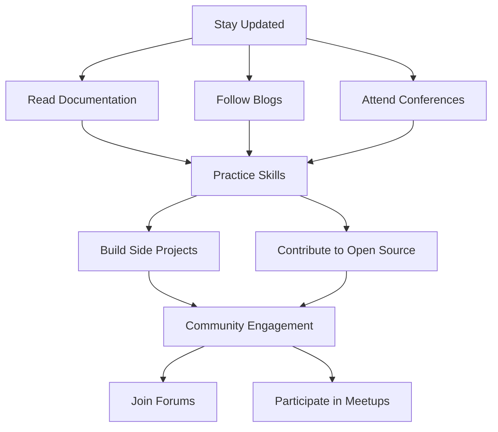

## 11.3.4 Continuous Learning and Adaptation

In the fast-paced world of software development, staying updated with the latest advancements is crucial, especially in a dynamic ecosystem like Flutter. As developers, embracing continuous learning and adaptation not only enhances our skills but also ensures that we can leverage the latest tools and techniques to build efficient and modern applications. This section aims to motivate you to engage with the evolving Flutter ecosystem, particularly focusing on state management advancements, and provides actionable steps to facilitate your learning journey.

### Staying Updated

The Flutter ecosystem is continuously evolving, with regular updates, new features, and community-driven enhancements. Keeping abreast of these changes is essential for any developer looking to maintain a competitive edge.

#### Recommended Resources

- **Official Flutter Documentation:** The [Flutter documentation](https://flutter.dev/docs) is a comprehensive resource that provides up-to-date information on Flutter's features, APIs, and best practices. Regularly reviewing the documentation can help you stay informed about the latest changes and improvements.

- **Community Blogs and Articles:** Numerous developers and experts share their insights and experiences through blogs and articles. Websites like [Medium](https://medium.com/tag/flutter) and [Dev.to](https://dev.to/t/flutter) host a plethora of articles that cover various aspects of Flutter development, including state management.

- **Conferences and Workshops:** Participating in Flutter conferences, such as Flutter Engage or Flutter Europe, offers opportunities to learn from industry leaders and network with fellow developers. These events often feature talks and workshops that delve into advanced topics and showcase the latest trends.

- **GitHub Repository and Release Notes:** Following Flutter's [GitHub repository](https://github.com/flutter/flutter) allows you to track ongoing developments and contribute to the project. Reviewing release notes provides insights into new features, bug fixes, and deprecated functionalities.

#### Practical Code Example: Staying Updated with GitHub

To stay updated with the latest changes in the Flutter repository, you can clone the repository and pull the latest changes regularly. Here's a simple script to automate this process:

```bash
#!/bin/bash

cd ~/flutter/flutter

git pull origin master

echo "Flutter repository updated successfully."
```

### Practicing New Skills

Learning is most effective when combined with practice. Building side projects or contributing to open-source projects are excellent ways to apply new knowledge and enhance your skills.

#### Building Side Projects

Creating side projects allows you to experiment with new state management techniques and Flutter features without the constraints of production code. Consider building small applications that focus on specific aspects of state management, such as:

- **Todo List App:** Implement various state management solutions like Provider, Riverpod, or Bloc to manage the state of tasks.

- **Weather App:** Use asynchronous state management techniques to fetch and display weather data from an API.

- **Chat Application:** Experiment with real-time state updates using WebSockets or Firebase.

#### Contributing to Open Source

Contributing to open-source projects not only helps you practice coding but also exposes you to diverse codebases and development practices. Platforms like GitHub host numerous Flutter projects that welcome contributions. Look for projects labeled with "good first issue" to find beginner-friendly tasks.

#### Practical Code Example: Starting a Side Project

Here's a basic setup for a Flutter project using Provider for state management:

```dart
import 'package:flutter/material.dart';
import 'package:provider/provider.dart';

void main() {
  runApp(MyApp());
}

class MyApp extends StatelessWidget {
  @override
  Widget build(BuildContext context) {
    return ChangeNotifierProvider(
      create: (context) => Counter(),
      child: MaterialApp(
        home: CounterScreen(),
      ),
    );
  }
}

class Counter extends ChangeNotifier {
  int _count = 0;

  int get count => _count;

  void increment() {
    _count++;
    notifyListeners();
  }
}

class CounterScreen extends StatelessWidget {
  @override
  Widget build(BuildContext context) {
    final counter = Provider.of<Counter>(context);

    return Scaffold(
      appBar: AppBar(title: Text('Counter')),
      body: Center(
        child: Text(
          '${counter.count}',
          style: TextStyle(fontSize: 48),
        ),
      ),
      floatingActionButton: FloatingActionButton(
        onPressed: counter.increment,
        child: Icon(Icons.add),
      ),
    );
  }
}
```

### Community Engagement

Engaging with the Flutter community can significantly enhance your learning experience. It provides opportunities to share knowledge, seek advice, and collaborate on projects.

#### Forums and Online Communities

- **StackOverflow:** A popular platform for developers to ask questions and share solutions. Engaging in discussions related to Flutter can help you solve problems and learn from others' experiences.

- **Flutter Community Slack:** Joining the [Flutter Community Slack](https://fluttercommunity.slack.com/) connects you with thousands of Flutter enthusiasts and experts. It's a great place to discuss ideas, get feedback, and stay updated on community events.

#### Local Meetups and Webinars

Participating in local Flutter meetups or online webinars allows you to network with other developers and learn from their experiences. Websites like [Meetup.com](https://www.meetup.com/) often list Flutter-related events in various locations.

### Actionable Steps for Continuous Learning

To effectively integrate continuous learning into your routine, consider the following actionable steps:

- **Set Aside Regular Time for Learning:** Dedicate specific time slots each week to learning new skills or exploring new technologies. Consistency is key to continuous improvement.

- **Join Local Meetups or Online Webinars:** Actively participate in community events to expand your network and gain new insights.

- **Follow Influential Developers and Thought Leaders:** On platforms like Twitter or LinkedIn, follow developers who regularly share valuable insights and updates about Flutter and state management.

- **Experiment with New Tools and Libraries:** Regularly explore new tools and libraries to stay ahead of the curve. Try integrating them into your projects to understand their benefits and limitations.

### Diagram: Continuous Learning Workflow

Below is a Mermaid.js diagram illustrating a continuous learning workflow for Flutter developers:



### Conclusion

Continuous learning and adaptation are essential for thriving in the ever-evolving field of Flutter development. By staying updated, practicing new skills, and engaging with the community, you can ensure that you remain at the forefront of state management advancements. Embrace these practices to enhance your expertise and contribute meaningfully to the Flutter ecosystem.

## Quiz Time!



### Which resource is recommended for staying updated with Flutter's latest features?

- [x] Official Flutter Documentation
- [ ] StackOverflow
- [ ] Local Meetups
- [ ] GitHub Issues

> **Explanation:** The official Flutter documentation is a comprehensive resource for the latest features and updates.

### What is a benefit of building side projects in Flutter?

- [x] Experiment with new state management techniques
- [ ] Increase production code complexity
- [ ] Avoid learning new skills
- [ ] Limit exposure to different codebases

> **Explanation:** Side projects allow developers to experiment with new techniques without affecting production code.

### How can contributing to open-source projects benefit a Flutter developer?

- [x] Exposure to diverse codebases
- [x] Practice coding skills
- [ ] Avoid community interaction
- [ ] Limit learning opportunities

> **Explanation:** Contributing to open-source projects helps developers practice coding and learn from diverse codebases.

### Which platform is recommended for engaging with the Flutter community?

- [x] Flutter Community Slack
- [ ] GitHub Issues
- [ ] Medium
- [ ] LinkedIn

> **Explanation:** The Flutter Community Slack is a platform for engaging with other Flutter developers.

### What is an actionable step for continuous learning?

- [x] Set aside regular time for learning
- [x] Join local meetups or online webinars
- [ ] Avoid experimenting with new tools
- [ ] Limit interaction with the community

> **Explanation:** Regular learning and community engagement are key to continuous improvement.

### Why is it important to follow influential developers on social media?

- [x] Gain valuable insights and updates
- [ ] Limit exposure to new ideas
- [ ] Avoid learning from others
- [ ] Increase isolation from the community

> **Explanation:** Following influential developers provides insights and updates on the latest trends.

### What is a recommended practice for experimenting with new tools and libraries?

- [x] Integrate them into your projects
- [ ] Avoid using them in any projects
- [ ] Limit their use to production code
- [ ] Ignore their benefits and limitations

> **Explanation:** Experimenting with new tools in projects helps understand their benefits and limitations.

### Which of the following is a benefit of attending Flutter conferences?

- [x] Networking with fellow developers
- [ ] Avoiding community interaction
- [ ] Limiting learning opportunities
- [ ] Increasing isolation

> **Explanation:** Conferences provide networking opportunities and insights from industry leaders.

### What is the purpose of setting aside regular time for learning?

- [x] Ensure consistent improvement
- [ ] Limit learning opportunities
- [ ] Avoid new skills
- [ ] Increase production code complexity

> **Explanation:** Regular learning time ensures consistent improvement and skill development.

### True or False: Continuous learning is not essential for Flutter developers.

- [ ] True
- [x] False

> **Explanation:** Continuous learning is essential for staying updated and improving skills in Flutter development.


