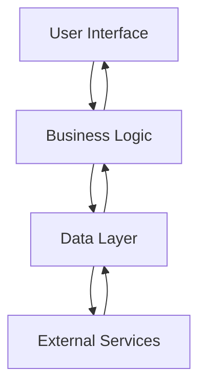

## 11.4.4 Planning for Future Enhancements

In the fast-paced world of software development, creating applications that can adapt to future changes and growth is crucial. This section focuses on strategies and best practices for planning future enhancements in Flutter applications. By anticipating growth, maintaining thorough documentation, and applying design patterns that support extensibility, developers can ensure their applications remain robust and scalable over time.

### Anticipating Growth

Anticipating growth involves designing systems that can easily accommodate new features and handle increased user demand. Here are some key considerations:

#### Build Flexible Systems

- **Modular Architecture:** Design your application using a modular architecture where different features are encapsulated in separate modules. This allows for easier updates and additions without affecting the entire system.

- **Loose Coupling and High Cohesion:** Ensure that components are loosely coupled, meaning they have minimal dependencies on each other, and highly cohesive, meaning they are focused on a single task. This makes it easier to modify or replace individual components.

- **Scalable State Management:** Choose a state management solution that can scale with your application's complexity. Solutions like Bloc, Riverpod, or Redux offer patterns that can handle complex state interactions as your app grows.

- **Cloud Integration:** Consider integrating cloud services early on to handle data storage, authentication, and other backend services. This can provide scalability and reliability as your user base grows.

```dart
// Example of a modular architecture in Flutter

// Define a feature module
class FeatureModule {
  final FeatureRepository repository;

  FeatureModule(this.repository);

  Widget buildFeature() {
    return FeatureScreen(repository: repository);
  }
}

// Usage
final featureModule = FeatureModule(FeatureRepository());
final featureWidget = featureModule.buildFeature();
```

#### Maintain Up-to-Date Documentation

Documentation is a critical aspect of software development that often gets overlooked. Keeping documentation current helps onboard new team members and ensures continuity as the project evolves.

- **Code Comments:** Use comments to explain complex logic and decisions within the code. This can be invaluable for future developers who need to understand the rationale behind certain implementations.

- **API Documentation:** If your application exposes APIs, ensure they are well-documented. Tools like Swagger can help generate interactive API documentation.

- **Architecture Diagrams:** Maintain diagrams that illustrate the overall architecture of your application, including data flow and component interactions. This provides a high-level overview that is useful for planning future enhancements.



### Refactoring

Refactoring is the process of restructuring existing code without changing its external behavior. Regular refactoring improves code quality and makes it easier to implement new features.

- **Code Smells:** Identify and eliminate code smells—symptoms of deeper problems in the codebase. Examples include duplicated code, long methods, and large classes.

- **Automated Testing:** Implement a robust suite of automated tests to ensure that refactoring does not introduce new bugs. Unit tests, widget tests, and integration tests can provide comprehensive coverage.

- **Continuous Integration:** Use continuous integration (CI) tools to automate the testing process. This ensures that all code changes are tested before being merged into the main codebase.

```dart
// Example of refactoring a method to improve readability

// Before refactoring
void processOrder(Order order) {
  // Complex logic here
}

// After refactoring
void processOrder(Order order) {
  validateOrder(order);
  calculateTotal(order);
  updateInventory(order);
}

void validateOrder(Order order) {
  // Validation logic
}

void calculateTotal(Order order) {
  // Calculation logic
}

void updateInventory(Order order) {
  // Inventory update logic
}
```

### Best Practices

Applying best practices in software design can significantly enhance the scalability and maintainability of your application.

#### Design Patterns for Extensibility

- **Factory Pattern:** Use the Factory pattern to create objects without specifying the exact class of object that will be created. This is useful for managing different implementations of a service or component.

- **Repository Pattern:** The Repository pattern abstracts the data layer, providing a clean API for data access. This makes it easier to switch data sources or implement caching.

```dart
// Example of Factory Pattern

abstract class NotificationService {
  void sendNotification(String message);
}

class EmailNotificationService implements NotificationService {
  @override
  void sendNotification(String message) {
    // Send email
  }
}

class SmsNotificationService implements NotificationService {
  @override
  void sendNotification(String message) {
    // Send SMS
  }
}

class NotificationFactory {
  static NotificationService createService(String type) {
    if (type == 'email') {
      return EmailNotificationService();
    } else if (type == 'sms') {
      return SmsNotificationService();
    }
    throw Exception('Unknown service type');
  }
}

// Usage
final notificationService = NotificationFactory.createService('email');
notificationService.sendNotification('Hello, World!');
```

#### Avoid Premature Optimization

While it's important to consider future needs, avoid the trap of premature optimization. Focus on writing clean, maintainable code first, and optimize only when necessary.

- **Profiling Tools:** Use profiling tools to identify performance bottlenecks. Flutter's DevTools provide insights into widget rebuilds, memory usage, and more.

- **Iterative Development:** Adopt an iterative development approach where you build, measure, and learn. This allows you to make informed decisions about where optimization is needed.

### Practical Examples and Real-World Scenarios

Consider a scenario where you are developing a Flutter application for an e-commerce platform. As the platform grows, you anticipate the need to add features like user reviews, wishlists, and personalized recommendations. By planning for these enhancements from the start, you can design a flexible architecture that supports these additions without significant rework.

- **User Reviews:** Implement a modular system where the review feature can be developed independently and integrated into the main application.

- **Wishlists:** Use a scalable state management solution to handle user-specific data like wishlists, ensuring it can grow with the user base.

- **Personalized Recommendations:** Integrate machine learning models as separate services that can be called from the application, allowing for easy updates and improvements.

### Encouraging Hands-On Practice

To solidify your understanding of planning for future enhancements, consider the following exercises:

- **Exercise 1:** Refactor an existing Flutter application to use a modular architecture. Identify components that can be separated into modules and implement the changes.

- **Exercise 2:** Create a documentation plan for your application. Include code comments, API documentation, and architecture diagrams.

- **Exercise 3:** Implement a new feature in your application using the Factory pattern. Consider how this pattern can simplify future enhancements.

### Conclusion

Planning for future enhancements is a critical aspect of software development that ensures your Flutter applications remain scalable and adaptable. By anticipating growth, maintaining thorough documentation, and applying best practices, you can create robust applications that stand the test of time. Remember, the key is to build flexible systems, refactor regularly, and avoid premature optimization while keeping future needs in mind.

## Quiz Time!



### What is a key benefit of using a modular architecture in Flutter applications?

- [x] It allows for easier updates and additions without affecting the entire system.
- [ ] It increases the complexity of the application.
- [ ] It reduces the need for documentation.
- [ ] It limits the scalability of the application.

> **Explanation:** A modular architecture allows for easier updates and additions by encapsulating features in separate modules, minimizing the impact on the entire system.

### Why is maintaining up-to-date documentation important in software development?

- [x] It helps onboard new team members and ensures continuity as the project evolves.
- [ ] It is only necessary for large teams.
- [ ] It reduces the need for automated testing.
- [ ] It is not important if the code is well-commented.

> **Explanation:** Up-to-date documentation is crucial for onboarding new team members and ensuring continuity as the project evolves, regardless of team size.

### What is the purpose of refactoring code?

- [x] To improve code structure and efficiency without changing its external behavior.
- [ ] To add new features to the application.
- [ ] To increase the complexity of the codebase.
- [ ] To remove all comments from the code.

> **Explanation:** Refactoring improves code structure and efficiency while maintaining its external behavior, making it easier to implement new features.

### Which design pattern is useful for creating objects without specifying the exact class of object that will be created?

- [x] Factory Pattern
- [ ] Singleton Pattern
- [ ] Observer Pattern
- [ ] Adapter Pattern

> **Explanation:** The Factory Pattern is used to create objects without specifying the exact class, allowing for flexibility in object creation.

### What should be avoided to prevent premature optimization?

- [x] Focus on writing clean, maintainable code first.
- [ ] Use profiling tools before writing any code.
- [x] Optimize only when necessary.
- [ ] Avoid using design patterns.

> **Explanation:** Premature optimization should be avoided by focusing on clean, maintainable code first and optimizing only when necessary.

### How can cloud integration benefit a growing application?

- [x] It provides scalability and reliability as the user base grows.
- [ ] It limits the application's ability to scale.
- [ ] It increases the complexity of the application.
- [ ] It is only useful for small applications.

> **Explanation:** Cloud integration provides scalability and reliability, allowing the application to handle increased user demand as it grows.

### What is a common symptom of deeper problems in the codebase that should be addressed during refactoring?

- [x] Code Smells
- [ ] Design Patterns
- [ ] Automated Tests
- [ ] Code Comments

> **Explanation:** Code smells are symptoms of deeper problems in the codebase that should be addressed during refactoring to improve code quality.

### Which tool can help generate interactive API documentation?

- [x] Swagger
- [ ] GitHub
- [ ] Jenkins
- [ ] Docker

> **Explanation:** Swagger is a tool that can help generate interactive API documentation, making it easier for developers to understand and use the APIs.

### What is the benefit of using continuous integration (CI) tools?

- [x] They automate the testing process, ensuring all code changes are tested before being merged.
- [ ] They increase the time required for testing.
- [ ] They eliminate the need for documentation.
- [ ] They are only useful for small projects.

> **Explanation:** Continuous integration (CI) tools automate the testing process, ensuring all code changes are tested before being merged into the main codebase.

### True or False: The Repository pattern abstracts the data layer, providing a clean API for data access.

- [x] True
- [ ] False

> **Explanation:** The Repository pattern abstracts the data layer, providing a clean API for data access, making it easier to switch data sources or implement caching.


