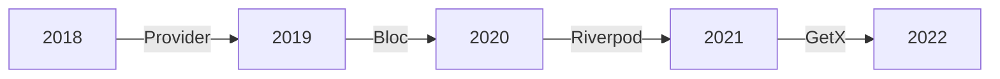

## 12.1.2 Community Trends

In the rapidly evolving world of Flutter development, the community plays a pivotal role in shaping the direction of state management solutions. As developers continuously seek more efficient, scalable, and maintainable ways to manage state in their applications, understanding community trends becomes essential. This section delves into the current dynamics within the Flutter community, highlighting shifts in preferences, emerging best practices, and the platforms where these discussions thrive.

### Overview of Community Dynamics

The Flutter community is a vibrant ecosystem of developers, contributors, and enthusiasts who actively collaborate to push the boundaries of what Flutter can achieve. This collaboration is often facilitated through open-source contributions, where developers share their innovations and improvements with the broader community. Open-source projects, such as Riverpod and Bloc, have gained traction due to their ability to address common challenges in state management, offering robust solutions that are continuously refined by community feedback.

#### The Role of Open-Source Contributions

Open-source contributions are the lifeblood of the Flutter community. They allow developers to experiment with new ideas, share their findings, and collectively solve complex problems. This collaborative environment fosters a culture of innovation, where state management solutions are not only developed but also iteratively improved based on real-world usage and community input. Projects hosted on platforms like GitHub become central hubs for discussion, bug reporting, and feature requests, enabling a dynamic exchange of ideas.

### Popular Discourse Platforms

Several platforms serve as the primary venues for discourse within the Flutter community. These platforms facilitate the exchange of knowledge, experiences, and trends in state management:

- **GitHub:** As the primary repository for open-source projects, GitHub is where much of the development and collaboration occurs. Developers can contribute to projects, report issues, and engage in discussions about state management solutions.

- **StackOverflow:** A go-to resource for developers seeking answers to specific technical questions. It provides insights into common challenges and solutions in Flutter state management.

- **Reddit:** Subreddits like r/FlutterDev offer a more informal space for developers to share experiences, discuss trends, and seek advice from peers.

- **Flutter Community Slack Channels:** These channels provide real-time communication, allowing developers to engage in discussions, share resources, and collaborate on projects.

### Current Shifts in Preferences

The Flutter community is witnessing notable shifts in preferences regarding state management solutions. These shifts are influenced by the need for simplicity, performance, and the ability to scale across different platforms.

#### Simplicity vs. Robustness

There is an ongoing debate within the community about whether to prioritize simpler state management solutions or opt for more feature-rich frameworks. Some developers prefer lightweight solutions like Provider for their simplicity and ease of use, while others gravitate towards more robust frameworks like Bloc or Riverpod, which offer greater control and scalability.

#### Impact of Flutter Updates

Flutter's frequent updates and enhancements also influence community preferences. New features or changes in the Flutter framework can make certain state management solutions more appealing or obsolete. For instance, improvements in Flutter's performance or widget system might lead developers to reconsider their choice of state management tools.

### Trends in State Management Patterns

As the Flutter community matures, there is a growing interest in exploring different programming paradigms to enhance state management.

#### Functional and Reactive Programming

There is a noticeable shift towards functional and reactive programming paradigms. These approaches offer a more declarative style of coding, which can lead to cleaner and more maintainable codebases. Libraries like Riverpod and RxDart are gaining popularity for their ability to leverage these paradigms effectively.

### Adoption of Cross-Platform Solutions

With Flutter's expansion beyond mobile to web and desktop platforms, there is an increasing demand for state management solutions that work seamlessly across all these environments.

#### Cross-Platform Compatibility

Developers are increasingly favoring state management solutions that offer cross-platform compatibility. This trend is driven by the need to maintain a consistent codebase across different platforms, reducing duplication and simplifying maintenance.

### Interactive Content

To provide a more comprehensive view of community trends, let's explore some insights from key community figures and recent surveys:

> **Quote from Felix Angelov (Creator of Bloc):** "The strength of the Flutter community lies in its diversity of thought and willingness to experiment. As we continue to explore new paradigms, it's crucial to keep user experience at the forefront."

> **Community Poll (Flutter Community Slack):** A recent poll indicated that 60% of developers are exploring Riverpod for its simplicity and flexibility, while 30% still rely on Bloc for its structured approach.

### Mermaid.js Diagrams

To visualize the growth in popularity of different state management solutions over time, consider the following hypothetical data:

This diagram illustrates the evolving preferences within the Flutter community, highlighting the rise of various state management solutions over the years.

### Best Practices

To stay ahead in the ever-evolving landscape of Flutter state management, consider the following best practices:

- **Engage in Community Discussions:** Actively participate in forums, Slack channels, and GitHub discussions to stay informed about the latest trends and solutions.

- **Follow Influential Developers:** Keep an eye on contributions and insights from key figures in the Flutter community to gain valuable perspectives.

- **Stay Updated with Flutter Announcements:** Regularly check for updates from the Flutter team to understand how new features might impact your choice of state management solutions.

### Conclusion

The Flutter community is a dynamic and collaborative environment that significantly influences state management trends. By staying engaged with the community, exploring new paradigms, and adopting cross-platform solutions, developers can ensure their applications remain efficient, scalable, and maintainable. As the landscape continues to evolve, embracing these trends and best practices will be key to successful Flutter development.

## Quiz Time!



### Which platform is a primary venue for open-source collaboration in the Flutter community?

- [x] GitHub
- [ ] StackOverflow
- [ ] Reddit
- [ ] Twitter

> **Explanation:** GitHub is the primary platform for open-source collaboration, where developers contribute to projects, report issues, and engage in discussions.

### What is a current trend in state management preferences within the Flutter community?

- [x] Shift towards simpler solutions like Riverpod
- [ ] Increased use of imperative programming
- [ ] Decline in the use of reactive programming
- [ ] Exclusive focus on mobile platforms

> **Explanation:** There is a trend towards simpler solutions like Riverpod, which offers flexibility and ease of use, while reactive programming continues to gain traction.

### Which programming paradigm is gaining popularity in Flutter state management?

- [x] Functional programming
- [ ] Procedural programming
- [ ] Object-oriented programming
- [ ] Assembly programming

> **Explanation:** Functional programming is gaining popularity due to its declarative style and ability to create cleaner, more maintainable code.

### What is a benefit of cross-platform state management solutions?

- [x] Consistent codebase across platforms
- [ ] Increased complexity
- [ ] Platform-specific code duplication
- [ ] Reduced performance

> **Explanation:** Cross-platform solutions allow for a consistent codebase across different environments, reducing duplication and simplifying maintenance.

### Which of the following is a popular discourse platform for real-time communication in the Flutter community?

- [x] Flutter Community Slack Channels
- [ ] LinkedIn
- [ ] Facebook
- [ ] Instagram

> **Explanation:** Flutter Community Slack Channels provide real-time communication, allowing developers to engage in discussions and collaborate on projects.

### What impact do Flutter updates have on state management preferences?

- [x] They can make certain solutions more appealing or obsolete
- [ ] They have no impact on state management preferences
- [ ] They only affect UI components
- [ ] They reduce the need for state management

> **Explanation:** Flutter updates can introduce new features or changes that influence the appeal or obsolescence of certain state management solutions.

### What is a key role of open-source contributions in the Flutter community?

- [x] Fostering innovation and collaboration
- [ ] Limiting access to resources
- [ ] Increasing project costs
- [ ] Reducing community engagement

> **Explanation:** Open-source contributions foster innovation and collaboration by allowing developers to share their findings and collectively solve problems.

### Which state management solution is known for its structured approach?

- [x] Bloc
- [ ] Provider
- [ ] GetX
- [ ] Redux

> **Explanation:** Bloc is known for its structured approach, providing a clear separation of concerns and a robust framework for managing state.

### What is a common theme in community discussions about state management?

- [x] Balancing simplicity and robustness
- [ ] Eliminating state management entirely
- [ ] Focusing solely on mobile development
- [ ] Avoiding open-source contributions

> **Explanation:** A common theme is balancing simplicity and robustness, as developers seek solutions that are both easy to use and scalable.

### True or False: The Flutter community is static and rarely changes its preferences.

- [ ] True
- [x] False

> **Explanation:** The Flutter community is dynamic and continuously evolves its preferences based on new trends, updates, and innovations.


