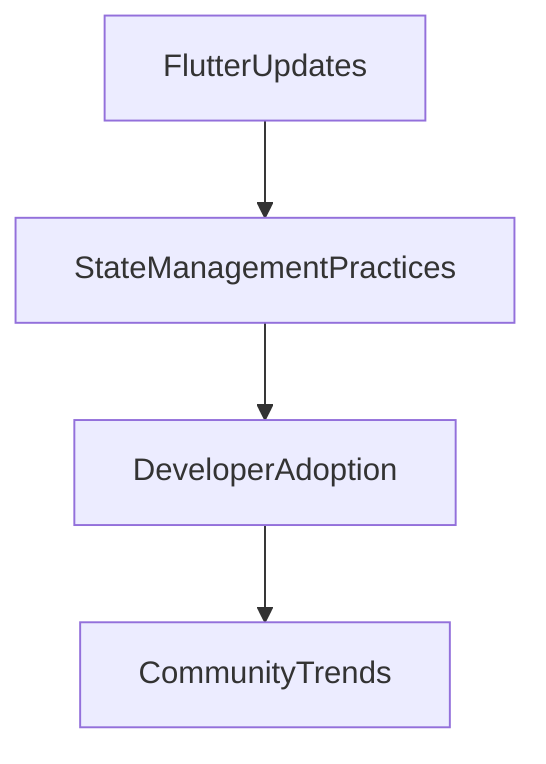

## 12.1.3 Flutter Updates Impact on State Management

As Flutter continues to evolve, its updates bring significant changes that affect how developers manage state in their applications. Understanding these updates is crucial for maintaining efficient, scalable, and modern Flutter applications. This section delves into recent and upcoming Flutter updates, focusing on their impact on state management practices.

### Recent Flutter Releases

Flutter's recent releases have introduced several enhancements that directly influence state management:

- **Performance Improvements:** Recent updates have optimized the rendering engine, reducing the time it takes to rebuild widgets. This improvement is crucial for state management, as it allows for more frequent and efficient state updates without compromising performance.

- **Tooling Enhancements:** The introduction of better debugging tools, such as improved DevTools, helps developers visualize state changes and diagnose issues more effectively. These tools are invaluable for managing complex state transitions and ensuring that state updates occur as expected.

- **API Enhancements:** New APIs provide more granular control over widget lifecycles and state transitions. For example, the addition of hooks and lifecycle methods allows developers to manage state more precisely, reducing unnecessary rebuilds and improving app responsiveness.

### Null Safety

One of the most significant changes in the Dart language, which underpins Flutter, is the introduction of null safety. This feature has profound implications for state management:

- **Null Safety Overview:** Null safety helps prevent null reference errors by making types non-nullable by default. This change requires developers to explicitly handle nullable types, reducing runtime errors and improving code robustness.

- **Migrating to Null-Safe State Management:** Transitioning to null safety involves updating your codebase to handle nullable types explicitly. This process can be facilitated by using the Dart migration tool, which helps identify and update code that needs to be adjusted for null safety.

  **Before Null Safety:**

  ```dart
  String name;
  void updateName(String newName) {
    name = newName;
  }
  ```

  **After Null Safety:**

  ```dart
  String? name;
  void updateName(String newName) {
    name = newName;
  }
  ```

  In the above example, the `name` variable is now nullable, and developers must handle cases where `name` might be `null`.

### Upcoming Features

Flutter's roadmap includes several features that could further impact state management:

- **Dart Language Improvements:** Enhancements to the Dart language, such as pattern matching and improved type inference, will provide developers with more powerful tools for managing state transitions and data flow.

- **Widget Lifecycle Changes:** Proposed changes to the widget lifecycle aim to provide more hooks and callbacks, allowing for finer control over state updates and widget rebuilds.

- **New Developer Tools:** Upcoming tools are expected to offer better insights into state changes and performance metrics, helping developers optimize their state management strategies.

### Integration with Platforms

Flutter's expanding support for web and desktop platforms necessitates scalable state management solutions:

- **Web and Desktop Support:** As Flutter applications are deployed across more platforms, state management solutions must be robust and scalable. This requirement emphasizes the need for solutions that can handle increased complexity and different platform-specific behaviors.

- **Scalable Solutions:** Developers should consider using state management libraries that offer scalability and cross-platform compatibility, such as Bloc or Riverpod, to ensure consistent behavior across all platforms.

### Impact Analysis

The cumulative effect of these updates can render some state management solutions more or less effective:

- **Effectiveness of Solutions:** Solutions that leverage new APIs and performance improvements will likely become more effective. Conversely, solutions that do not adapt to these changes may become obsolete or less efficient.

- **Adjustments for Developers:** Developers might need to refactor existing applications to take advantage of new features, such as null safety and improved lifecycle management. This process involves updating dependencies, refactoring code, and testing thoroughly to ensure compatibility.

### Code Examples

Adapting existing state management code to new Flutter features is essential for maintaining modern applications:

**Before Update:**

```dart
class Counter {
  int count = 0;

  void increment() {
    count++;
  }
}
```

**After Update with Null Safety and Improved Lifecycle:**

```dart
class Counter {
  int count = 0;

  void increment() {
    count++;
  }

  void reset() {
    count = 0;
  }
}
```

In this updated example, the `Counter` class now includes a `reset` method, demonstrating how developers can extend functionality to align with new lifecycle management capabilities.

### Mermaid.js Diagram

To visualize the relationship between Flutter updates and state management practices, consider the following diagram:



This diagram illustrates how Flutter updates influence state management practices, which in turn affect developer adoption and community trends.

### Best Practices

To fully leverage Flutter updates, developers should:

- **Keep the Flutter SDK Up-to-Date:** Regularly update the Flutter SDK to access new features and improvements.
- **Proactive Learning:** Stay informed about upcoming changes by following Flutter's release notes and community discussions.
- **Codebase Preparation:** Prepare your codebase for changes by adopting best practices, such as using null safety and modularizing state management logic.

### Conclusion

Flutter's ongoing evolution presents both challenges and opportunities for state management. By staying informed and adapting to new features, developers can ensure their applications remain efficient, scalable, and modern. Embracing these changes will not only improve the quality of your applications but also enhance your skills as a Flutter developer.

## Quiz Time!



### What is one of the key features introduced in recent Flutter updates that impacts state management?

- [x] Performance improvements
- [ ] New color schemes
- [ ] Additional fonts
- [ ] Enhanced sound libraries

> **Explanation:** Recent Flutter updates have focused on performance improvements, which directly impact how efficiently state updates can be managed.

### How does null safety in Dart affect state management?

- [x] It prevents null reference errors by making types non-nullable by default.
- [ ] It allows all variables to be null by default.
- [ ] It removes the need for type annotations.
- [ ] It introduces new syntax for loops.

> **Explanation:** Null safety makes types non-nullable by default, preventing null reference errors and requiring explicit handling of nullable types.

### What is a recommended practice when migrating to null-safe state management code?

- [x] Use the Dart migration tool to identify and update code.
- [ ] Rewrite the entire codebase from scratch.
- [ ] Ignore null safety and continue with the old code.
- [ ] Use only global variables.

> **Explanation:** The Dart migration tool helps identify and update code that needs adjustments for null safety, making the transition smoother.

### Which upcoming feature in Flutter's roadmap could affect state management?

- [x] Improved widget lifecycle hooks
- [ ] New color palettes
- [ ] Additional sound effects
- [ ] Enhanced image processing

> **Explanation:** Improved widget lifecycle hooks provide more control over state updates and widget rebuilds, affecting state management practices.

### How does Flutter's support for web and desktop platforms influence state management?

- [x] It necessitates scalable solutions that can handle increased complexity.
- [ ] It requires using only local state management.
- [ ] It eliminates the need for state management.
- [ ] It focuses solely on mobile optimization.

> **Explanation:** As Flutter expands to web and desktop platforms, scalable state management solutions are necessary to handle increased complexity and platform-specific behaviors.

### What might developers need to do to adapt their applications to new Flutter features?

- [x] Refactor existing applications and update dependencies.
- [ ] Completely rewrite their applications.
- [ ] Remove all state management code.
- [ ] Use only the setState method.

> **Explanation:** Developers may need to refactor existing applications and update dependencies to take advantage of new features and ensure compatibility.

### What is a benefit of keeping the Flutter SDK up-to-date?

- [x] Access to new features and improvements
- [ ] Reduced application size
- [ ] Increased application complexity
- [ ] Limited access to community support

> **Explanation:** Keeping the Flutter SDK up-to-date ensures access to new features and improvements, enhancing application performance and capabilities.

### What is one way to visualize the relationship between Flutter updates and state management practices?

- [x] Using Mermaid.js diagrams
- [ ] Creating a new programming language
- [ ] Writing a novel
- [ ] Designing a new operating system

> **Explanation:** Mermaid.js diagrams can effectively visualize relationships and workflows, such as the impact of Flutter updates on state management practices.

### What is a potential impact of Flutter updates on existing state management solutions?

- [x] Some solutions may become more or less effective.
- [ ] All solutions will become obsolete.
- [ ] No impact on any solutions.
- [ ] Solutions will require no changes.

> **Explanation:** Flutter updates can render some state management solutions more or less effective, depending on how well they adapt to new features and improvements.

### True or False: Developers should ignore upcoming Flutter changes to maintain stability in their applications.

- [ ] True
- [x] False

> **Explanation:** Developers should proactively learn about upcoming Flutter changes to prepare their codebases and leverage new features, ensuring their applications remain modern and efficient.


